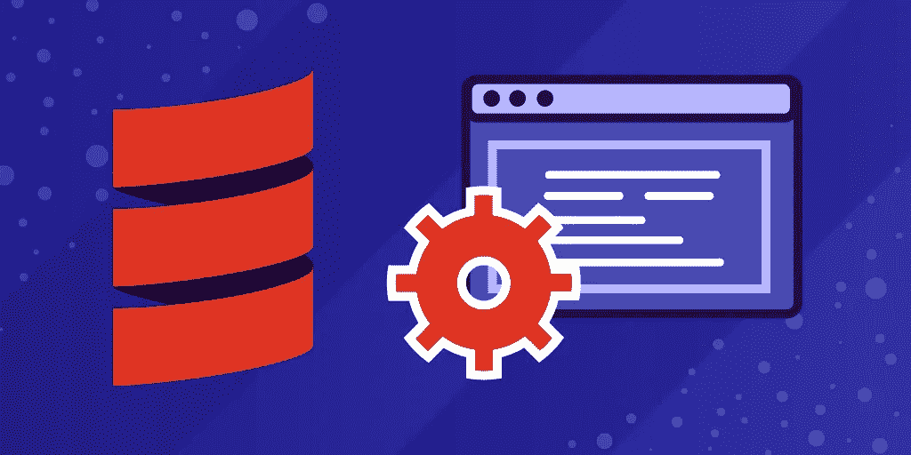

# 什么是 REST APIs？HTTP API 与 REST API

> 原文：<https://blog.devgenius.io/what-are-rest-apis-http-api-vs-rest-api-92c2fe2bb136?source=collection_archive---------0----------------------->



图片来源:作者

REST APIs 是 web 开发社区中的一个常见话题。当许多人在争论 API 功能有多有用时，其他人只是试图理解它的含义以及 REST 与 RESTful 的关系。

对于即将进入这个行业的开发人员来说，这是一个需要了解的重要话题，它将帮助您理解客户机/服务器数据架构的现代状态。

今天，我们将通过解释 REST APIss 是什么，它与其他 HTTP APIs 有何不同，以及应该在哪些应用程序中使用它来揭开 REST API 的神秘面纱。

下面是我们今天要讲的内容:

*   什么是 HTTP API？
*   什么是 REST API？
*   何时使用 REST APIs
*   接下来学什么

# 什么是 HTTP API？

web API 是一种协议，它描述了您的客户端如何访问资源以及哪些方法适用于您的架构。这些资源可以是各种媒体类型，如 JavaScript 或 HTML 元素、元数据或图像。你可以把它看作是从一种技术到另一种技术的翻译指南。HTTP API 是一种 API，它使用超文本传输协议作为两个系统之间的通信协议。HTTP APIs 将端点公开为 API 网关，供 HTTP 请求访问服务器。

例如，每次在 Google 日历中设置缩放会议时，都要使用 HTTP API。该 API 定义了 Zoom 如何直接与 Google 的服务器通信，以将 Zoom 会议嵌入到事件中，而不是将会议邀请复制并粘贴到字段中。

HTTP APIs 是一个广泛的类别，这意味着它们基于其目标用例以各种形式出现。HTTP APIs 根据创建时使用的架构设计原则进一步分类。大多数用于超媒体信息系统或 web 开发，但每一种都有特定的优缺点。

在我们探索流行的 REST API 之前，让我们来看看一些常见的替代方法。

## GraphQL API

GraphQL API 是第二种最流行的 API 形式，旨在纠正 REST API 结构的常见问题。它是开源的，旨在以树形结构保存数据。主要区别在于 GraphQL API 比 REST 更灵活，这是由于它处理数据获取请求的方式。如果数据的类型与通常请求的类型稍有不同，REST 通常会过量提取或不足提取数据。GraphQL API 允许请求调用所需的确切数据量和类型，这意味着您永远不必发送多个请求或转储无用数据。

不幸的是，GraphQL API 不支持 HTTP 缓存，因此每次发送相同的请求时都必须重新处理。

## Falcor API

Falcor 使用了 REST API 架构的大部分路径和引用，但是自动化了大部分请求结构。Falcor 允许您在需要时简单地使用数据，而不是从服务器请求。系统将确定数据是客户端的还是服务器端的，然后自动检索它。

这种动态的方法使得 Falcor 非常适合视频流应用，如网飞和其他实时更新应用。

## gRPC APIs

远程过程控制(RPC)是 REST APIs 的前身，从 20 世纪 70 年代就已经出现了。RPC 和 REST 的主要区别在于，在 RPC 架构中，几乎所有的处理都是由服务器完成的。最近，Google 已经将 RPC 更新到较新的 gRPC，以便与他们的微服务架构一起使用。gRPC 使用 Protobuf 而不是 JSON/XML，构建在 HTTP 2 而不是 HTTP 1.1 之上。

这导致实现速度比 rest 慢，但是将消息传输速度提高了 7 到 10 倍。因此，gRPC 用于需要经常与网络其他部分通信的系统。

# 什么是 REST API？

REST API 代表表述性状态转移，是一种用于创建 web 服务的架构模式。它是由 Roy Fielding 在 2000 年开发的，并导致了遵循 REST 原则的 RESTful web 服务的不断增加。现在，REST APIs 被应用程序开发人员广泛使用，因为它通过复杂的操作(如 COBRA、RPC 或简单对象访问协议(SOAP ))与其他机器通信非常简单。

REST 是一个规则集，它定义了在客户机和服务器之间共享数据的最佳实践。它本质上是在创建 HTTP 或其他 API 时使用的一种设计风格，要求您只使用 CRUD 函数，而不考虑复杂性。REST 应用程序使用 HTTP 方法，如`GET`、`POST`、`DELETE`和`PUT`。REST 强调组件的可伸缩性和接口的简单性。

虽然忽略工具的一部分似乎有悖直觉，但它最终会迫使你用简单的术语描述复杂的行为。这导致了更简单的方法和与其他 REST APIs 更容易的结合。

并非所有的 HTTP APIs 都是 REST APIs。该 API 需要满足以下架构要求才能被视为 REST API:

*   **客户机-服务器** : REST 应用程序有一个管理应用程序数据和状态的服务器。服务器与处理用户交互的客户端通信。关注点的明确分离将两个组件分开。这意味着你可以在独立的轨道上更新和改进它们。
*   **无状态**:服务器不维护客户端状态，客户端管理自己的应用程序状态。客户端对服务器的请求包含处理这些请求所需的所有信息。
*   **可缓存**:服务器必须将它们的响应标记为可缓存或不可缓存。系统和客户端可以在方便的时候缓存响应以提高性能。它们还处理不可缓存的信息，因此没有客户端使用过时的数据。
*   **统一接口**:这是 REST 最广为人知的特性或规则。Fielding 说“REST 架构风格区别于其他基于网络的风格的主要特征是它强调组件之间的统一接口。”REST 服务将数据作为资源提供，具有一致的名称空间。
*   **分层系统**:系统中的组件看不到其所在层以外的东西。这个有限的范围允许您轻松地添加负载平衡器和代理，以提高身份验证的安全性或性能。

这些约束结合起来创建了一个具有强大边界和清晰关注点分离的应用程序。当被请求时，客户端接收服务器数据。客户端处理或显示数据。客户端通知服务器任何状态变化。REST APIs 不向客户端隐藏数据，只隐藏实现。

下面是一个 RESTful API 设计完成请求/响应循环的例子:

```
//request
GET api/customers/10//response
            {
           "customer":{
              "id":"10",
              "name": "customer name",
              "age": "28"
           }
        }
```

# 何时使用 REST APIs

REST APIs 对于构建将来可扩展的通用应用程序非常有用。

REST APIs 本质上与您的客户端技术是分离的，这意味着您的应用程序可以在 iOS、浏览器或未来的设备上轻松工作。因此，您可以构建自己的应用程序，而不必担心被绑定到特定的客户端堆栈，并且可以专注于开发应用程序本身。因此，RESTful APIs 更具可伸缩性，寿命也更长。

缓存还通过减少服务器需要为按需资源处理的请求数量，使 REST APIs 更具可伸缩性。通过缓存响应并发送缓存的响应，而不是重新处理请求，RESTful 服务可以用更少的资源处理更多的请求。

## 什么时候不用休息

无状态架构对 REST 既有帮助又有限制。一方面，无状态设置允许您在系统最终过时时更换服务器，从而延长了系统寿命。

另一方面，所有请求都需要在消息有效负载中包含所有数据来完成请求。当只需要少量数据时，这种方法很有效，但是对于复杂的请求，这种方法很快就变得难以管理了。REST 在有效负载大小和无状态灵活性之间进行权衡。

同样重要的是要注意，你不必在所有事情上都严格遵循 REST 架构来获得好处。当 REST 的原则更适合时使用它们比将 RPC 风格的请求扭曲成 REST 风格要好。

最终，REST 是您工具箱中的一个有用工具，也是一个很好的通用规则，但它不应该成为您的编程教条。

# 接下来学什么

如果您刚刚入门，这篇 REST APIs 快速指南应该会让您了解这个强大系统的流行背景。

虽然这对您来说是一个很好的工具，但是保持对其他 API 类型的开放态度也很重要，这样您就可以识别何时需要非 REST 解决方案。后端开发是一个常见的例子，说明纯功能或另一种类型的 HTTP 服务比 RESTful HTTP 更有用。

*快乐学习！*