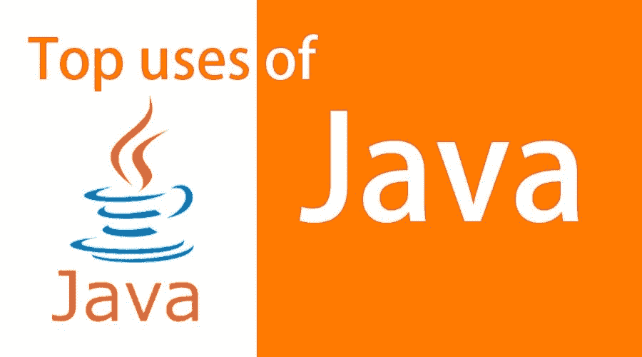
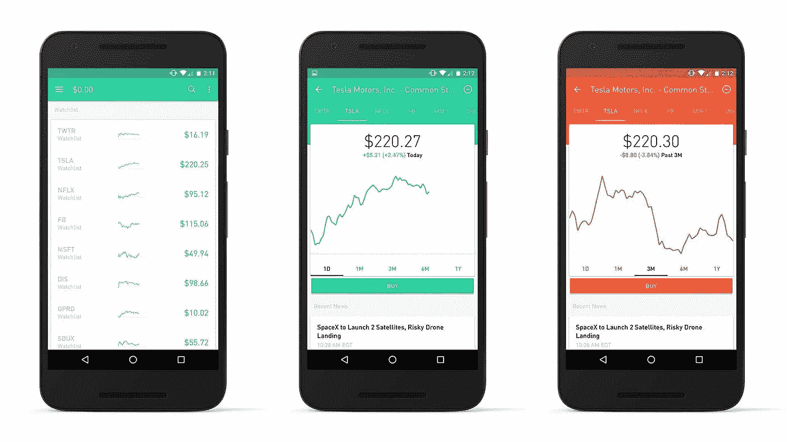

# Java 的真实用例是什么？

> 原文：<https://blog.devgenius.io/what-are-the-real-world-use-cases-of-java-c7a05ada1c40?source=collection_archive---------0----------------------->

图片来源:eduCBA

Java 编程语言是软件开发世界中最著名和使用最广泛的语言之一。该平台最初被设计成一种通用的高级语言，旨在允许程序员写一次就可以在任何地方运行(WORA)。这意味着 Java 代码理论上可以在任何系统上运行，而无需重写。

然而，非技术或经验不足的开发人员在使用该语言执行更复杂的任务时会面临挑战，例如编写专门为移动设备定制的应用程序或开发视频游戏，因此要获得专业级别的解决方案，请雇用 Java 开发人员。

你知道吗？？？

*   *在美国，超过 64，000 家公司使用 Java。*
*   *据 9805 年*[*stack share*](https://stackshare.io/java)*报道，包括 Airbnb、优步和谷歌在内的公司都在他们的技术栈中使用 Java。*
*   *全球 450 亿台活跃的 Java 虚拟机。(甲骨文)*

这种语言用于各种行业，如医疗保健、零售、电子商务、房地产等，正因为如此，Java 的日常使用案例正在增加。这里描述了一些最好的和真实的 Java 用例。在关注 Java 用例之前，首先，我将告诉你 Java 的关键特性和其他重要的东西。

# 8 个非常著名的 Java 用例

图片来源:TechYourChance

在这里，我提到了一些 Java 的最佳真实用例。嗯，如果你想用 Java 制作领先的应用程序，**雇佣一个在优秀的 [**Java 开发公司**](https://www.valuecoders.com/java-web-application-development-company) **工作的 Java 开发人员**。**

## 1.科学应用

Java 主要用于开发科学应用程序。它一直是该领域的强大语言，因为它提供了创建大规模科学计算和模拟环境的工具，同时还能够执行科学家要求的高级计算任务。

**使用 Java 构建流行的科学应用**

**- > MitoMonkey:** 这是生物学家用于线粒体 DNA 研发的应用。该应用程序是使用 Java 开发的，Java 支持图形和网络等计算密集型数据结构。因为它依赖于一个并行编程模块，所以也可以扩展到处理大量的输入。

**- > Orca:** 开发这个应用程序是为了让研究人员和科学家更容易对海洋建模，海洋是一个具有许多不同特征的大环境。程序员使用 Java 设计了这个应用程序，因此他们可以使用一个可以在任何类型的计算机系统上执行的代码库。

## 2.金融行业服务器应用

Java 最受欢迎的真实用例很少出现在金融领域。该语言用于创建服务器应用程序，因为它为数据处理提供了高性能，并且还可以与许多不同的服务器同步，这使它们更加稳定。

流行的金融服务器应用程序使用 Java 构建

**->ATM:**这是一个用于银行交易的服务器应用程序。Java 被用来创建这个应用程序，因为它提供了高性能和可伸缩性，这使得系统在处理来自世界各地的大量数据时更加可靠。

**- >泰坦:**这是一个旨在帮助金融机构管理自身风险的系统。该软件是使用 Java 开发的，它代表风险交易管理(Risk-TX)。

## 3.交易申请

图片来源:Learn 2 贸易

Java 也用于编写交易应用程序。创建这些应用程序的目的是为交易者提供一个可以从任何地方访问的平台，并为他们提供̵to 交易股票、商品等所需的所有工具。

**使用 Java 构建流行的交易应用**

**- > CQG:** 这个 app 是一个存在了 20 多年的交易平台。它为交易者提供了实时交易股票的能力，并让他们能够访问他们的所有信息，如当前价格水平、新闻提要等。该公司声称其软件是用 Java 开发的，因为 Java 是一种适合多任务处理的语言，有助于提高执行速度。

**- > Zen Trader:** 这款交易应用深受交易者欢迎。代码是用 Java 编写的，这个应用程序可以通过互联网连接从世界上任何地方的任何一台电脑上访问。

## 4.Android 应用程序

Java 也用于开发 Android 应用程序。该软件专为移动设备设计，帮助开发与谷歌智能手机、平板电脑等操作系统兼容的应用程序。

**使用 Java 构建流行的 Android 应用**

**- >谷歌地图应用:**谷歌地图应用最初推出时是基于 Java 构建的。为了构建这个应用程序，使用了 Java，因为它可以在所有类型的设备上使用。此外，Java 允许创建应用程序，而无需为不同的操作系统重写任何代码。

**- > Zoho:** Zoho 是一套商业生产力工具，包括 Gmail、Google Docs、在线存储空间(Zoho Docs)等各种应用。它是使用 Java 编程语言构建的，因为它允许开发与不同操作系统兼容的应用程序，如 Android 或 iOS。

## 5.嵌入式系统

图片来源:闪耀学习

Java 用于编写嵌入式系统，嵌入式系统是一种执行特定功能的设备，其输入和输出范围非常有限。在该平台上构建的嵌入式系统包括冰箱、微波炉、洗碗机等家用电器。

**基于 Java 的流行嵌入式系统**

**->**Nest 恒温器:Nest 恒温器是调节建筑物内温度的装置。这种设备是使用 Java 开发的，可以通过应用程序或网络浏览器远程控制，这也允许房主随时监控他们的能源消耗。

**- >航海家:**这是一款运行在嵌入式系统上的 app。它旨在监控和控制各种设备，如咖啡机或烤箱。专家们使用 Java 来完成这项任务，因为除了它的其他特性(例如网络、并发性)之外，它还对 GUI 应用程序提供了强大的支持。

## 6.网络应用

Java 是一种流行的语言，以构建优秀的 web 应用程序而闻名。此外，这项技术提供了一系列非常适合创建动态网站和 web 应用程序的特性，比如 Java 服务器页面(JSP)或 Servlets。 **Java 应用程序开发**是创建领先和非凡应用程序的最佳选择。

**使用 Java 构建的流行网络应用**

**- >网飞:**这家公司以其视频流媒体服务而闻名，观众可以在他们的电脑、平板电脑或移动设备上观看电影和电视节目。网飞网站是用 Java 构建的，因为它是一种可以跨不同操作系统运行的编程语言，比如 Linux、MacOS、Windows OS 这意味着程序员不必为每个不同的平台重新设计应用程序。

LinkedIn: 这个社交媒体网站是全球最受欢迎的应用之一。该网站是使用 Java 开发的，因为它的代码是动态的，这意味着它可以快速更新，而不必从头重写一切。如果你想建立一个像 LinkedIn 一样的应用程序，那么就利用 Java 开发服务来获得创新的 Java 软件解决方案。

## 7.桌面 GUI 应用程序

Java 用于设计在特定桌面 GUI 上运行的应用程序。这些应用程序可以执行许多任务，并且在设计时就考虑了某些功能，如设计应用程序或玩游戏。

**使用 Java 构建流行的桌面 GUI 应用**

**- > HexGL:** 这是一个免费的强大的应用程序，可以用来创建高质量的图形。Java 程序员使用 Java 设计了它，因此他们可以在所有平台上共享他们的代码，而不必在每个系统上重写代码的任何部分。

**- >小行星:**这是一款用 Java 创作的游戏。该应用程序的代码可以在所有平台上使用，并且已经被翻译成多种语言，这意味着来自不同国家的人可以访问这个游戏应用程序。

## 8.软件工具

Java 也广泛用于开发软件工具。这些程序帮助企业向他们提供一系列功能，如测试应用程序或调试代码。一些例子包括 JUnit、FitNesse、NetBeans IDE 等。

**流行的软件工具使用 Java 构建**

这是一个简单的程序，它为程序员提供了建立验收标准的能力，而无需编写任何代码。它是用 Java 编写的，所以可以在许多不同的系统上使用。

**- > Netbeans IDE:** 这个工具是一个软件开发环境，可以用于各种语言的编码。它是用 Java 编写的，帮助程序员快速执行代码，而不会出现任何问题，比如内存不足错误或超时。

# 包扎

java 编程语言是一种通用的、健壮的、功能强大的工具，可以以多种不同的方式使用。在这篇博文中，我只是触及了 Java 的一些著名用例的表面，但是还有更多的可能性等待着我们去探索！现在轮到你了——如果你还没有在这 8 个主要类别中使用 Java，你也可以关注其他的Java 应用程序开发思想。要获得与之相关的建议，只需 [**雇佣全栈 java 开发者**](https://www.valuecoders.com/hire-developers/hire-java-developers)；他们不仅会帮助你提出应用创意，还会帮助你从头开始开发一款领先的应用。