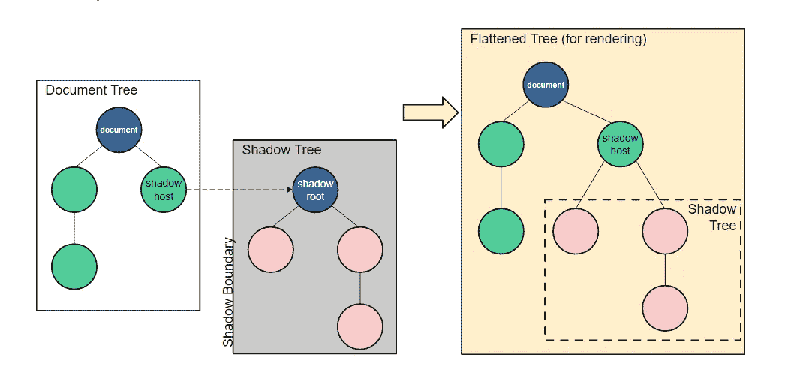

# 什么是 Web 组件

> 原文：<https://blog.devgenius.io/what-are-web-components-cbfdf08c35a9?source=collection_archive---------0----------------------->


最近有很多关于 Web 组件的讨论。但这些是什么，我们会努力弄清楚。

根据 MDN [的说法，Web 组件](https://developer.mozilla.org/en-US/docs/Web/Web_Components)是一组帮助我们创建定制的可重用组件的技术。这些组件可以很容易地封装，不会与应用程序的其他部分发生任何冲突。

最棒的是，它们不依赖于任何框架，是浏览器自带的。

让我们从一个 web 组件的基本示例开始。

这里我们有一个 HTML 文件，我们可以看到一个定制标签`basic-component`正在被定义*(第 17 行)*。

它在下面的`basic-component.js`中被定义

这里，扩展了`HTMLElement`的类`Basic`创建了一个定制元素。

`*super()*` *(第 3 行)*只是调用 HTMLElement 类的构造函数。

`this`关键字表示我们正在更新其`innerHTML`属性的定制元素。

`this.getAttribute("name")`获取从 HTML 中传递的属性名。

但是仅仅定义它是不行的，我们还必须将它连接到一个 HTML 标签，当被调用时需要呈现它，这就是在*第 10 行，*将类`Basic`连接到`basic-component`标签并定义它。


这是浏览器为上述代码呈现的内容。

为什么“我应该是紫色的”是红色的你会问，我们一会儿会谈到这一点。

现在，我们将浏览一下 Web 组件所包含的规范:

## **定制元素**

这些允许我们定义可重用的定制元素。在上面的例子中，我们可以看到`Basic` 是一个自定义元素。

我们捆绑了`Basic`提供的所有功能，并将其映射到一个标签`basic-component`

## **暗影 DOM**

帮助封装 web 组件，避免样式泄漏。

有没有想过，尽管 HTML 视频标签有很多控件，比如播放/暂停，声音控件等等，为什么我们从来没有看到它们。

我们看到的只是


这是因为视频标签的所有内容都在影子 DOM 中。



阴影 DOM —来自 [MDN](https://developer.mozilla.org/en-US/docs/Web/Web_Components/Using_shadow_DOM) 的图像

Shadow DOM 是一组 Javascript APIs，帮助将 DOM 树附加和封装到元素中。这有助于保持元素特性的抽象，可以独立地设计样式和编写脚本，而不用担心冲突。

影子 DOM 允许将隐藏的 DOM 树附加到常规 DOM 树中的元素上。

影子主机将自己附加到 DOM 节点，该节点指向影子树，影子根是这个影子树的根。

但是怎么才能看到视频标签的阴影 DOM 呢？

很简单，进入开发工具->设置->检查选项*显示用户代理阴影 DOM* 并重新加载页面，你现在应该可以看到它了


现在您可以看到视频标签由什么组成。

回到为什么“我应该是紫色的”是红色的

这是因为样式已经从具有相同类`color`但不同实现的 web 组件中泄漏出来。

这可以通过阴影 DOM 来解决，如下所示。

在这里，我们创建一个 HTML 模板，并将其附加到一个影子根。

`this.attachShadow({mode:"open"})`附加一个阴影 DOM 树。

*第 17 行*将模板附加到阴影根。

影子 DOM 实现的前[和](https://codesandbox.io/s/need-for-shadow-dom-c8897?file=/need-for-shadow-dom.js)后[代码见这些链接。](https://codesandbox.io/s/component-with-shadow-56ijj?file=/component-with-shadow.js)

## ES 模块

ES 模块规范以基于标准、模块化和高性能的方式定义了 JS 文档的包含和重用。

在上面的例子中，我们看到我们能够通过简单地导入如下的`js`文件来消费 HTML 中的`basic-component`

```
<script src="./basic-component.js" type="module"></script>
```

这就是 ES 模块所提供的。

## **HTML 模板**

这些模板只有在被请求时才会被呈现。这些帮助我们编写可以多次使用的标记模板。`<template>`和`<slot>`是这些 API 的一部分。

在我们的例子中，我们使用了一个 HTML 模板，我们创建了它并将其附加到一个影子根。

现在，所有这些 API 都是低级的，处理它们变得非常乏味。

此外，随着组件变得越来越复杂，它们也变得难以维护和构建。

StencilJS 通过创建一个工具链来构建可重用的组件，为我们解决了这些问题

我们将在下一篇文章中看到如何使用 StencilJS。

[](https://medium.com/@kkakroo/working-with-stenciljs-a4d75f7b1131) [## 使用模板 JS

### StencilJS 如何简化 Web 组件的使用

medium.com](https://medium.com/@kkakroo/working-with-stenciljs-a4d75f7b1131) 

希望你喜欢这篇文章。如果您有任何建议或问题，可以通过 [*LinkedIn*](https://www.linkedin.com/in/kkakroo/) *与我联系或在下面评论。*