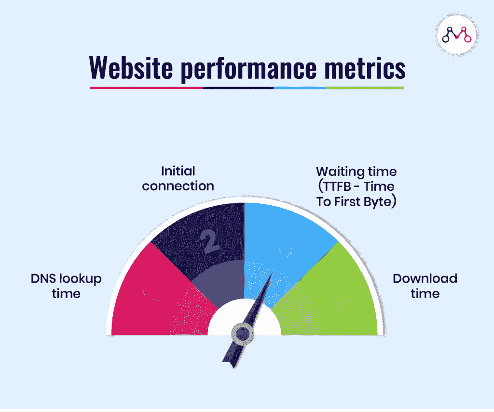

# 什么是 Web 开发服务？

> 原文：<https://blog.devgenius.io/what-are-web-development-services-7ae413b995be?source=collection_archive---------34----------------------->

据美国劳工统计局(U.S. Bureau of Labour Statistics)的数据，预计 2018 年至 2028 年期间，多家网站开发人员将增长 13%，远快于其他工作岗位的增速。事实上，网络工程师的增加归因于更多地使用移动设备浏览网站。此外，网站是在网上宣传你的产品并帮助接近潜在客户的重要工具。这些互惠互利导致了对网络开发服务的更大需求。

不可避免的是，“网站开发”这个术语足够简单，所有年龄段的人都能理解。然而，您知道它涉及哪些活动以及目前提供哪些基于网络的解决方案吗？回答这些问题会让你对 web 开发及其服务有更深入的了解。

# 1.什么是 web 开发？

网站开发绝对是关于建立网站。基本上，它包括从注册域名、托管服务器和电子邮件托管到存储和路由的所有活动。然后，开发人员将构建安全层来保护客户和您公司的机密或私人信息免遭网络盗窃。此外，在你的想法被仔细讨论后，一个工程团队将起草网站建设的计划和策略，并最终执行。这是创建网页的必要步骤。

然而，一些公司现在将他们的 **web 开发服务**扩展到 UI/ UX 设计、测试和维护，而任何设计任务字面上都属于 web 设计，而不是 web 开发。尽管这两个术语之间有些混淆，但是当您外包您的软件产品时，许多提到的任务通常包含在 web 服务包中。

此外，任何有吸引力的网站现在都需要用搜索引擎进行优化，提供良好的内容和直观的 UI/UX 设计，或者无缝运行。与此同时，你的想法有时太复杂，无法变成真正的产品。因此，为了促进利益相关者和网络工程师之间的交流，许多公司现在提供商业咨询服务。例如，Boldare 经常帮助验证客户的商业想法，设定目标或识别与软件创建相关的可能挑战；或者 Designveloper 会对你的商业假设进行商业解决方案的深度咨询或技术分析。如果你还在为数字化想法而挣扎，任何专家的建议都是更可取的。

根据您的具体需求，将提供不同类型的基于 web 的解决方案，这些解决方案基于不同的技术，如静态 web 开发或 PHP web 开发。

# 2.软件公司经常提供哪些 web 开发服务？

第一个问题中列出的所有活动都是创建网站的必要步骤。你可以选择咨询服务，然后自建你的网络产品，或者让外包的工程师做一些特定的工作。那么，如果你想把整个网站建设任务交给外包公司呢？当你需要知道他们通常提供哪些流行的基于网络的解决方案时:

# 全栈开发

一个工程团队可以不雇佣一些后端和前端开发人员，而是招募能够很好地处理客户端和服务器端的全栈 web 开发人员，或者分别招募后端和前端开发人员。这样的程序员需要掌握最新的前端语言(比如 React。JS 或 Angular)和后端技术(例如 Ruby on Rails 或。网)。

# 电子商务发展

亚马逊从新冠肺炎危机中获利，第一季度净销售额增长了 26%。的确，网购的需求总是在增加，即使不是在隔离时间。所以电子商务 web 开发也单独提供。例如，Vofox 提供不同的相关服务，如 Magento development(用 PHP 编写的开源电子商务平台)或 responsive shopping web。这些网站允许客户通过不同的支付方式(如 Paypal 或电子钱包)轻松在线订购产品或服务，并帮助销售人员管理库存和销售或快速接收买家的反馈。

# 定制的 web 应用程序开发

web 和 web 应用程序之间的区别非常模糊。后者可以理解为在任何具有更高用户交互的网络服务器上工作的应用，通常是谷歌应用、脸书或网飞。一些顶级公司，如 MobiDev(总部位于美国亚特兰大)，使用流行的技术，如 PHP、Ruby、Python & Go 或 JavaScript 进行网站后端和前端开发。

# CMS 网站开发

CMS 的意思是内容管理系统，典型的有 WordPress、Joomla 和 Drupal。在外包开发团队的支持下，你可以很容易地拥有一个建立在这样的现有平台上的网站，具有良好的视觉设计，搜索引擎友好或额外的插件。它还允许多个用户通过创建、编辑或发布内容来管理数据。

# 静态 web 服务

静态 web 服务实际上不太常见，因为它是唯一一个具有固定内容的 HTML web，您很难更新它。但是，仍然有几个静态的 **web 开发服务**你可以选择作为 Nibble 软件或者 Crest Infotech。

此外，一些公司还提供基于流行技术的服务，例如:

# Python 开发

由于它的多用途性，Python 的受欢迎程度超过了 Java。它有简单的语法、丰富的生态系统和大量的 web 框架，如 Django、Flask、Pyramid、TurboGears 和 Bottle。

# PHP 开发

PHP 是一种免费的开源软件，也是一种适合 web 开发的脚本语言，但经常与 MySQL 等数据库软件一起使用。它有多种框架(例如 Laravel 或 Zend)、库和包。然而，PHP 也因其不一致性和看似糟糕的设计而声名狼藉，这很容易导致糟糕的代码。

# Java 软件开发服务

Java 广泛应用于许多后端开发项目、游戏和桌面应用。在 Java 框架中，Spring 是最受欢迎的开源框架，主要用于构建 web 和移动企业应用。

# Ruby on Rails 开发

Ruby on Rails 是一个 web 应用框架，它使用 Ruby 编程语言来构建 web 应用、电子商务解决方案或动态 web。采用该框架的典型网站包括 Github、Shopify、Twitch 和 Zendesk。

顺便说一下，[design developer](http://designveloper.com/)提供网页开发、网页设计、商务咨询等各种开发服务。请[给我们留言](https://www.designveloper.com/estimation/)，简要介绍您的想法，我们会尽快与您联系。

# 3.web 开发服务的最佳实践

建立一个网站听起来并不像你想象的那么简单。面对客户不同的需求，软件公司不得不选择合适的 web 开发团队，他们精通某些技术，并采取适当的行动来确保一切按正确的方式进行。所以，如果你想让你的网络项目成功，请记住这些建议。

# 简单是最好的

没有人想使用一个过于复杂的网站，使其难以注册账户或导航。不管使用什么技术来构建它，网站开发者应该优先考虑它的可用性和直观的用户界面/UX 设计，以吸引和留住用户。

# 更加注重安全

如果你的网站没有完善的安全层，任何重要的数据都很容易被黑客窃取。更严重的是，这个问题会极大地影响用户的财务甚至生活，尤其是当恶意入侵者可以跟踪他们的银行账户和家庭地址时。此外，它还会给网络开发公司带来声誉损失。

# 遵循标准

这里的标准更多的是涉及网页设计。它们是增加网站可用性和清晰度的说明。例如，根据 Andy Crestodina 对营销网站的研究，应该确认以下一些规则:

*   左上角的标志
*   页眉中的主导航地图
*   首页上的价值主张。*注:价值主张指的是一家公司将向其客户提供的价值的简短介绍。*
*   页脚中的版权、隐私、法律、网站地图和联系链接

根据不同的行业，网站可以遵循不同的标准，但总是吸引用户并促进他们的互动。

# 确保代码的清晰性

建立任何网站后，测试和维护总是需要的，以确保您的网站将无缝运行。因此，排列清晰的代码行可以减轻测试和修改的工作量。

# 提高性能和下载速度

一些高流量的大型网站可能会因为无法处理海量数据而崩溃。这可能会激怒用户，使他们失去继续访问这些网站的动力。因此，建立一个可靠、快速的网站可以解决这个问题，改善用户体验。

# 允许网站在不同平台上工作

用户可以在手机、平板电脑或桌面上访问你的网站。因此，在这些设备上很好地显示网页是至关重要的。

今天，随着 soar 在线活动的开展，不同的**网络开发服务**被提供来满足客户的期望。不管你的业务是什么，获得这个领域的基本知识可以促进你将来的网站创建。

您可能喜欢的其他文章:

*   [哪里可以找到软件开发公司？](https://www.designveloper.com/blog/where-can-i-find-a-software-development-company/)
*   [2020 年最佳软件外包公司 20 强](https://www.designveloper.com/blog/20-best-software-outsourcing-companies-2020/)