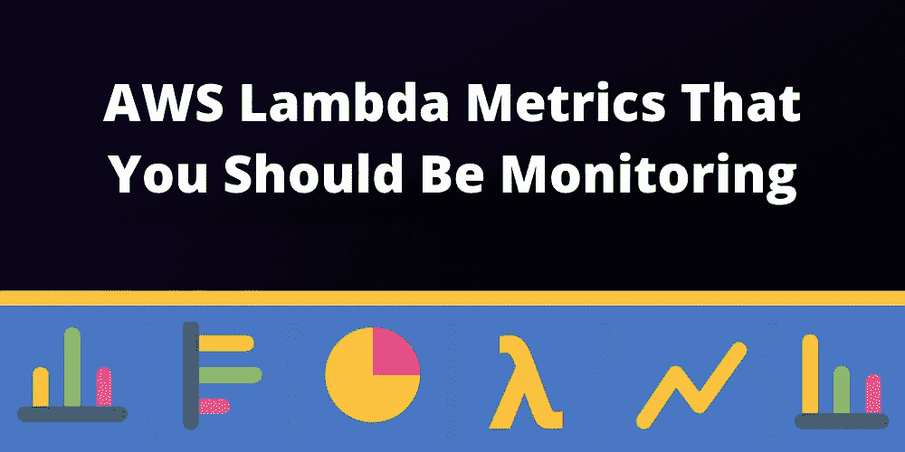
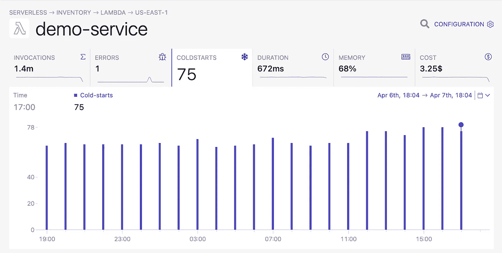

# 哪些 AWS Lambda 指标是您绝对应该监控的？

> 原文：<https://blog.devgenius.io/what-aws-lambda-metrics-should-you-definitely-be-monitoring-ff2eb6619ea0?source=collection_archive---------16----------------------->

*你应该监控哪些关键的 AWS Lambda 指标？*

你的应用程序不需要“庞大”到有足够的功能和抽象**让你迷失其中**。作为一名 DevOps 工程师，您无法涵盖所有因素。向**展示相关**事实并提出正确的问题至关重要！因此，当发生火灾时，您可以立即排除故障。

每个组织都是独一无二的，每个工作负载都有自己的效用。也就是说，**我们仍然可以有一个通用的方法**，首先列出一些您可能希望从您的 AWS 应用程序中获得的品质:

*   表演
*   响应性
*   成本效益

# AWS Lambda 定价

Lambda 定价非常简单，收费因素包括:

*   请求数量
*   计算时间
*   调配的内存量

**计算时间和内存供应相结合**。我们将在下面更详细地提到这一点。先说请求数量。每月前一百万次请求是免费的。之后，**当月剩余时间内，您将被收取每百万次请求 0.20 美元的费用**。那是愚蠢的廉价。

除了请求的数量之外，**您还需要为分配给函数的内存以及函数完成工作所花费的计算时间**付费。您可以在部署函数时指定内存分配。每次调用的计算时间会有所不同，但受到您配置的最大超时的限制。

假设您的函数运行了两秒钟(2000 毫秒),并被分配了 512 MB 内存，那么您将被收取 2 * 512 MB = 1gb-秒的使用费用。**这被称为 GB 秒计费**，根据内存分配和函数运行的时间来支付计算时间。如果您的函数分配了 1 GB 的内存，并且运行了一秒钟(1000 毫秒)，您需要支付 1gb-秒的费用。

前 400，000 GB 秒每月免费。达到免费额度后，**当月剩下的时间里，你要为每 GB 秒支付 0.0000166667 美元**(不值得挠头，用我们的[成本计算器](https://dashbird.io/lambda-cost-calculator/)代替)。除此之外，你可能会对 AWS S3 桶、VPC、DynamoDB 等资源收取额外费用。

亚马逊的[按使用量付费](https://aws.amazon.com/lambda/pricing/)的商业模式并不依赖于你的需求，而是依赖于你业务的成功。如果您的应用程序被访问得越频繁，您的组织受益就越多，AWS 账单也会略高。这反过来有利于亚马逊。

# Lambda 默认跟踪哪些指标？

**Lambda 服务为您的功能提供了七个现成的指标**。调用、持续时间、错误计数、节流、异步交付失败、迭代器年龄和并发执行。

设置它们在需要时提醒您是一个我们可以轻松解决的挑战。让我们看看这些指标在实践中意味着什么。

**调用**指标告诉您在特定时间段内函数被调用的频率。

**持续时间**指标告诉您函数在特定时间段的运行时间。它将它们分为最慢、最快和平均持续时间。

**错误计数**是关于你的函数在特定时间段内崩溃的频率。它还包括以百分比表示的成功率，因为成功率为 99%的 100 个错误与成功率为 1%的 100 个错误有所不同。

**throttled** 指标显示了有多少函数调用无法处理，因为您的函数已经扩展到 Lambda 的并发限制。默认值是 1，000 个并发执行，但如果需要，可以增加。

**异步交付失败**发生在你的函数试图写入一个目的地或者死信队列但是失败的时候。

当您的函数从流中读取时,**迭代器年龄**度量是很有帮助的(例如，Kinesis 或 Kafka)。这种流经常被使用，所以上游服务不会被 Lambda 快速扩展的能力淹没。如果你使用的 Lambda 函数太慢，可能是因为数据在流中停留的时间越来越长，因此迭代器的老化程度会上升。

**并发执行**指标检查在特定时间段内为您的函数加载了多少个并行容器。如果您接近 1，000 的区域限制，您应该尝试提高函数的性能，或者与 AWS 讨论增加您帐户的限制。

# 输入λ冷启动

每个 Lambda 函数都在 Docker 容器中运行。当它第一次被调用时，Lambda 服务**首先旋转一个新的容器**，然后执行其中的函数。这**增加了延迟**，可能会让你的应用程序在用户看来很慢。在这个初始延迟之后，函数在一段时间内保持加载状态。在此期间，新的调用不会遭受类似的延迟，并且感觉对客户端的响应更快。

把它想象成访问高速缓存中的文件；当文件长时间不使用时，它们会从缓存中清除。当您再次请求这些文件时，需要更长时间才能打开它们。

这个过程被称为[冷启动](https://dashbird.io/blog/can-we-solve-serverless-cold-starts/)，可以用各种方式解决。

> [Dashbird](https://dashbird.io/) 引入了冷启动监控来显示哪些调用是冷启动。

据推测，该功能保持温暖的时间在 5 到 30 分钟之间，但亚马逊没有证实任何事情。如果该功能依赖于 [ENI](https://docs.aws.amazon.com/AWSEC2/latest/UserGuide/using-eni.html) 与其他服务对话，那么这又增加了一层延迟。

还有一个额外的复杂性，那就是并发性问题。如果您同时接收到突发流量，AWS 会通过旋转更多容器来处理所有新请求，从而扩展功能。**这会导致完全不同的冷启动序列**，这与闲置资源过长无关。

# 优化合适的资源

好了，我们已经列出了相当多的问题，现在让我们来解决其中的一些。我们希望结合以下策略可以帮助您在响应性应用程序和[较低的费用](https://dashbird.io/blog/how-to-reduce-costs-on-aws-lambda/)之间取得理想的平衡。毕竟，如果你的系统变得迟钝，即使它很便宜，也没有人会使用它。

# 1.增加内存分配

**增加内存分配伴随着 CPU 分配的隐性增加**。这很可能会加快函数的执行速度。减少实际执行时间以适应冷启动导致的延迟可以直接改善用户体验。此外，这是最容易在较高延迟中测试的假设，是 DevOps 团队的第一道防线。

> 如果你给 Lambda 函数分配更多的内存，AWS 会分配更多的 CPU 能力。

# 2.保持功能温暖

解决延迟问题的另一个方法是为 Lambda 函数购买[供应的并发性](https://dashbird.io/blog/aws-lambda-provisioned-concurrency/)。Provisioned concurrency 要求 Lambda 服务为您的函数保留指定数量的容器，以便它们能够更快地响应事件，即使它们很长时间没有被调用。当现实世界的工作负载到来时，数百个微小的 Lambda 实例已经为这场大战做好了准备。

> Dashbird 可以帮助你看到隐藏在用户行为中的模式。用它来计时你的热身电话。发出大量请求通常比增加内存成本更低。

# 3.优化您的代码

最残酷的选择可能是要求你的开发者优化他们的代码。这并不一定涉及对实际逻辑或功能的改变，但人们通常可以削减依赖性，使功能变得更轻量级。

将尽可能多的工作放在你的功能之外也是一个**好主意**。例如，设置 API 客户端或从环境变量中计算固定值。这样，这项工作只会降低冷启动的速度，而不会降低后续函数调用的速度。

> 如果可能的话，你应该坚持使用像 [Node.js 和 Python](https://read.acloud.guru/comparing-aws-lambda-performance-of-node-js-python-java-c-and-go-29c1163c2581) 这样的语言，因为它们的冷启动时间比 C#或 Java 要短得多。

你也可以**尝试定制运行时间**。如果你有计算量很大的任务，使用 Rust 运行时并在 Rust 中实现你的函数可以帮你节省很多钱。特别是因为 Lambda 函数是按毫秒计费的，所以调用频率高的函数可以从这种重构中获得巨大的收益。

# 包扎

要使上述任何一个推论看似合理，你需要知道你行为不端和低成本功能的具体病理。接下来是问正确的问题，对解决方案做出有根据的猜测，然后[优化 AWS Lambdas](https://dashbird.io/blog/optimizing-aws-lambda-for-production/) 。

[Dashbird](https://dashbird.io/) 帮助你走完每一步，从跟踪冷启动等细微之处到了解新的解决方案是否有所不同。当然，还有更多参数需要考虑，比如并发性和同步性。他们需要更深的潜水。在我的下一篇文章中会有更多的介绍！

请继续关注，[注册](https://dashbird.io/)来监控我们在本文中讨论的所有内容。

*延伸阅读:*

[削减 AWS Lambda 成本的快速方法](https://dashbird.io/blog/saving-money-aws-lambda/)

[Dashbird 的无服务器事件库:Lambda 错误消息和调试](https://dashbird.io/event-library/aws-lambda/)

[用 Dashbird 导航 CloudWatch 日志](https://dashbird.io/blog/navigate-cloudwatch-logs-with-dashbird/)

[利用可观察性来衡量 AWS Lambda](https://www.youtube.com/watch?v=7-rvI90Xfgo) 【网上研讨会】