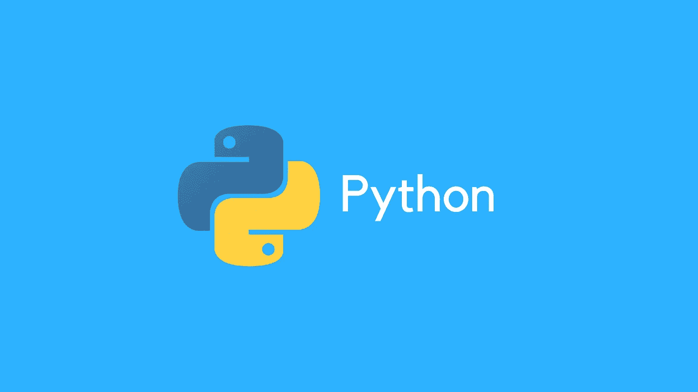
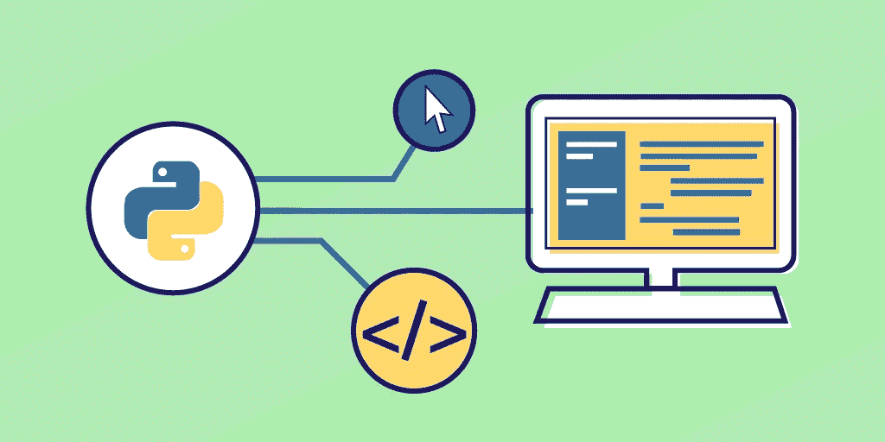
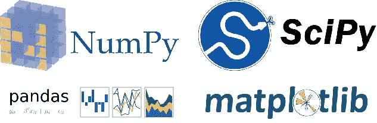
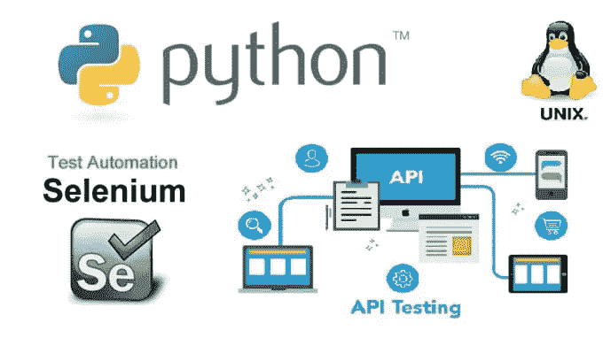
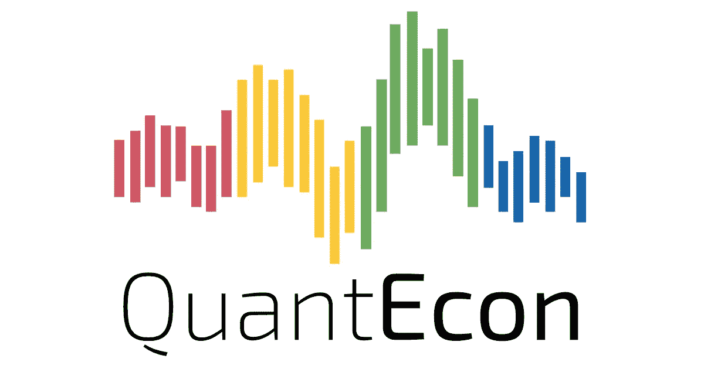
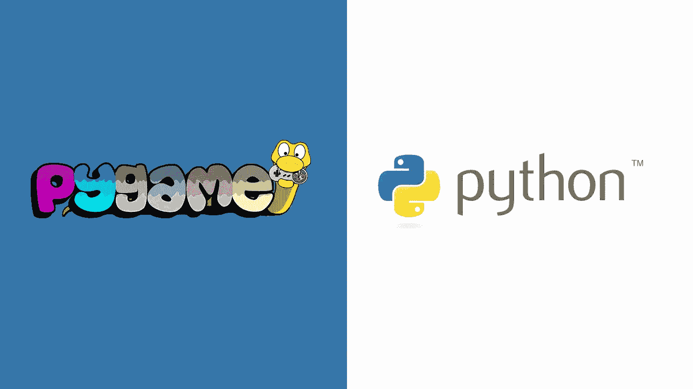

# 用 Python 可以做什么？

> 原文：<https://blog.devgenius.io/what-can-be-done-with-python-27554662dc30?source=collection_archive---------9----------------------->

简单易学，几乎可以用在所有领域。下面是学习我所知道的 python 的所有应用的细节。

**1-学习编程**

Python 在世界各地都被广泛用于编程教学。它通过反复试验来教会你。因为它是面向对象编程(OOP)语言，所以它提供了学习不同编程语言的背景。即使您可能没有使用 python 进行编程，它也是学习编程的一个很好的工具。

**2-网络开发**

web 开发人员不常使用，但是 flask、MongoDB 和 Django 允许你从头开始创建一个网站。有时候，web 开发人员使用 python 进行纯粹的后端开发。尽管 JavaScript 在 web 开发人员中很流行；有些人使用 python 从头开始创建网站。

**3-数学计算**

如果我告诉你所有的数学计算都可以用 python 来完成，你会相信吗？大概不会。但是，它们比其他任何事情都容易做到。数学家使用 python 进行各种精确的数学计算，并在计算时尽可能节省时间。

**4-数据分析**

统计分析，数据科学，探索性数据分析还是只分析数据？所有这些都可以通过 python 的特定库来完成，用于导入、清理、评估和呈现数据。特别是通过使用 NumPy、pandas、pickle、matplotlib、SciPy 和 seaborn 统计学家、数据分析师和数据科学家进行各种各样的统计估计，从数据可视化到最复杂的统计表格都可以用 python 轻松完成。

**5-应用程序构建**

超过四分之一的商业应用是用 python 开发的。随着越来越多的应用程序被开发出来，这个数字预计还会增加。此外，python 在开发时并不区分操作系统。由于在每个平台进行 app 搭建的用户优势；大多数程序员更喜欢用 python 来构建和部署他们的应用程序。

**6-自动化**

在我们这个时代，一切都是自动化的，包括日常事务。为什么我们不能尽我们所能实现自动化呢？也许你可以节省大量的时间，包括提高生产力，这将派上用场？不管怎样，今天使用的大多数自动化设备都是用 python 构建的，由于它的特性，它很可能会成为主流。

**7-经济学**

你听过 PyEcon 吗？面向经济学的 python 库。特别是对于数量经济学和计量经济学。数学家和统计学家也是如此；python 的出现让教授们的建模、测试和预测变得更加容易。也许，我们会在世界各地的经济学课程上有一个好的改变。

**8-创建游戏**

你听过 pyame 吗？一个用于创建你自己的游戏的 python 库。对于疯狂构建自己游戏的游戏玩家来说，这是一个很好的库。它适用于大多数平台。所以，你不用为各种平台从头开始创建你的游戏。你只需要使用 python 来创建你自己的游戏。

总而言之，我已经根据我的经验描述了使用 python 可以做什么。如果 python 可以做更多的事情，请在评论区分享你的想法。