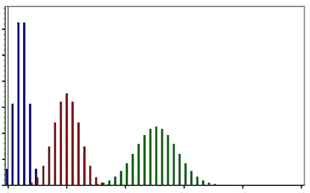
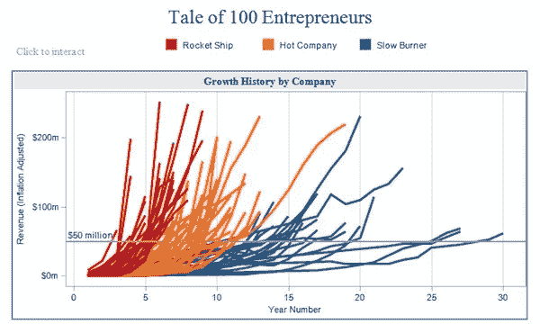

# 用 R 可以做什么

> 原文：<https://blog.devgenius.io/what-can-be-done-with-r-39811cad4c2d?source=collection_archive---------10----------------------->

与独立的编程语言相比，它有不同的用途。以下是 R 的使用字段的详细信息。

## 1-数学计算

***如果我告诉你在 R*** 做数学计算很容易，你会相信吗？但是，R 是这样做的最直截了当的编程语言。不像 Python，不需要导入库。你只需要写函数和它们的某些参数。当分析完成后，你只需要解释结果。

## 2-统计计算

***如果我告诉你在 R*** 中做统计计算很简单，你会相信吗？但是，R 是做到这一点的最直接的编程语言。比如数学计算；没有其他编程语言比 R 更易于管理来进行统计计算。您只需下载所有需要分析的包。然后，使用函数及其参数。一旦你得到了结果，你只需要为决策解释结果。

## 3-数据可视化

在使用 excel 和一些编程语言如 SPSS 时，数据可视化是一件困难的事情。但是 R 用它的 ggplot 和 matplot 函数来解决这个问题。虽然您不必了解 matplot 函数(因为 ggplot 完成了所有的可视化工作)，但是与它的对应函数相比，了解 ggplot 函数将会使您的工作变得容易得多。

## 4-财务分析

也许有些奇怪，但是如果涉及到某些参数，可以通过从不同数据集导入的向量和矩阵来创建财务分析。尽管如此，通过查看您选择的参数来找到所需的信息要简单得多。当分析完成后，每一条信息都依赖于你的技能、经验和知识来解释你的结果。

## 5-经济学

经济学家和统计学家、数学家一样热爱 R。因为数据可视化、导入数据、测试数据和建模都很容易。它对数量经济学、计量经济学、统计学和数学有很大的作用。在编程之前，他们必须对繁琐的程序和编程语言进行分析，直到 python 和 r 的引入。一旦分析完成，您需要解释结果。

*按照你的说法，R 可以做什么？在下面的评论区分享你的想法。*