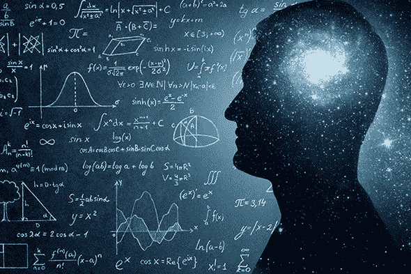
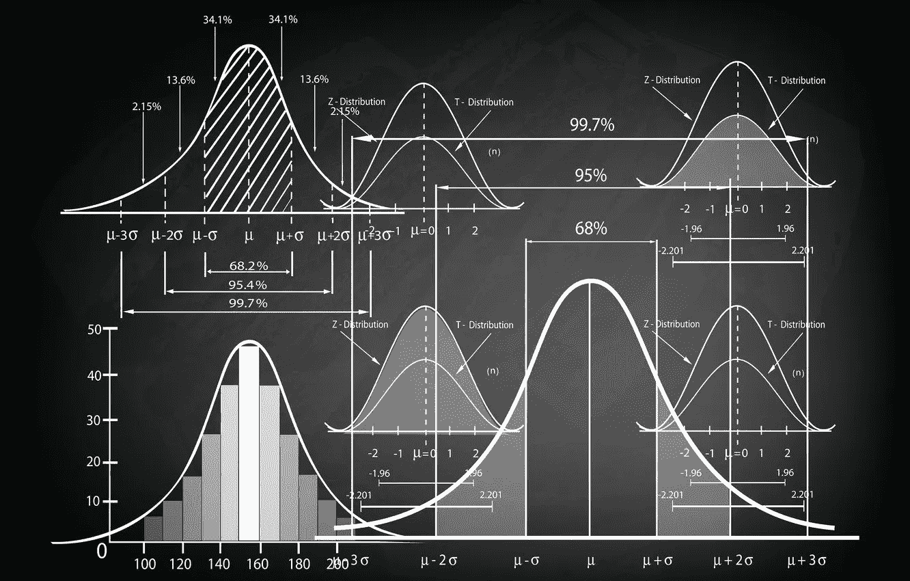
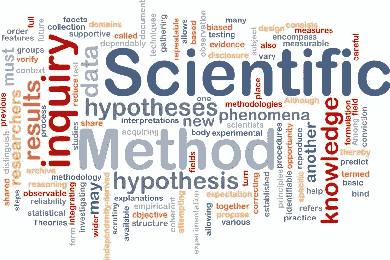

# 作为一名大学生你能做什么

> 原文：<https://blog.devgenius.io/what-can-you-do-as-a-university-student-6bed2f1dd412?source=collection_archive---------13----------------------->

许多事情要做，更多的资源可用。

由于我有来自多个实体的免费 Coursera 账户，我设法扩展了我在区块链的知识。但是，这并没有阻止我学习科学方法、数学、计算机科学和统计学。区块链也有大量的商业和金融活动。现在，让我们进入对大学生的推荐。

## 数学

数学在历史上一直至关重要，而且变得越来越重要。尤其是当我们看复杂系统依赖数学的时候。如果能学微积分，线性代数，微分方程，多元微积分。甚至微积分和线性代数也足够了。更重要的是，以太坊和更多的区块链依靠博弈论来保护系统免受任何类型的攻击者的攻击。因此，学习某些数学科目将有助于理解现代技术。

## 统计数字

你无法相信统计数据是如何塑造历史的。它用现代科技塑造了我们的社会。尤其是涉及海量数据的大数据和人工智能。甚至区块链的工作也与概率论密切相关。所以，整体学习统计学可以帮助你理解所有的现代技术。

## 计算机科学

自 20 世纪 50 年代由两位数学家艾伦·图灵和约翰·冯·诺依曼创立以来，计算机科学已经取得了长足的进步，计算机科学本身已经影响了许多学科。为了在这个新世纪取得成功，必须了解计算机科学的基本概念。因此，学习计算机科学也可以让你掌握现代技术，不管你的学术背景如何。尽管一些学科已经远离计算机科学和工程，但大多数学科现在变得越来越依赖于计算机科学的原理。

## 科学方法

自从它被西方科学家创立以来，它推动了整个科学的进步。它成为研究方法中不可或缺的一部分。更重要的是，它有助于你理解研究的有效性，而不考虑时间。此外，它还允许你在学术和商业领域进行有效的研究。像数学、统计学和计算机科学一样，在隔离期间学习科学方法对你也有帮助。

**总而言之，数学、统计学、计算机科学和科学方法是将它们与编程结合起来获得的有用技能。**

作为一名大学生，你在做什么？在下面的评论区分享你的活动。