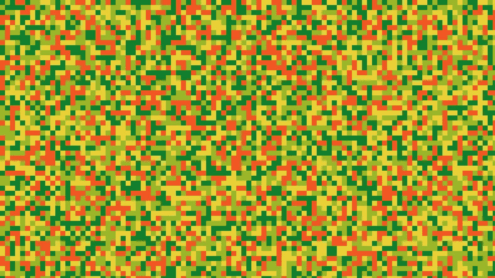
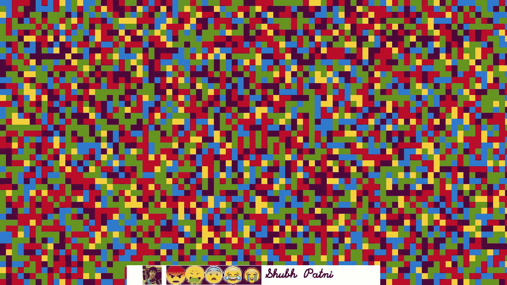
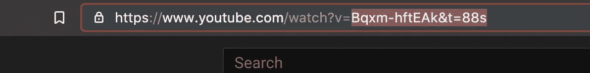
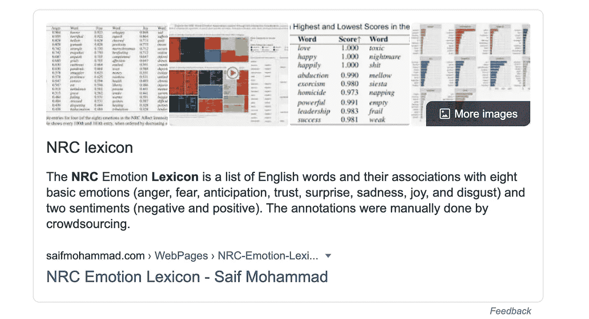
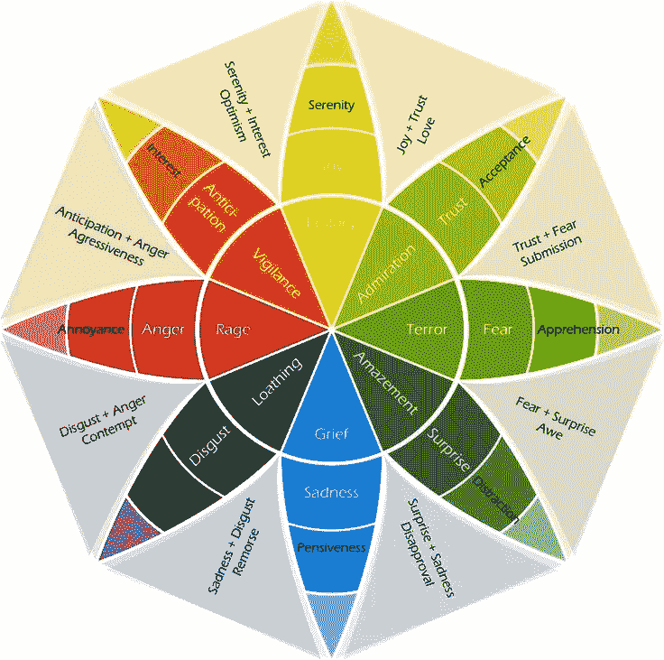
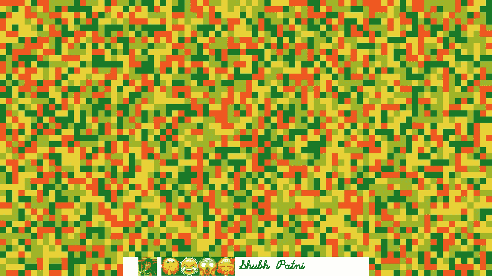
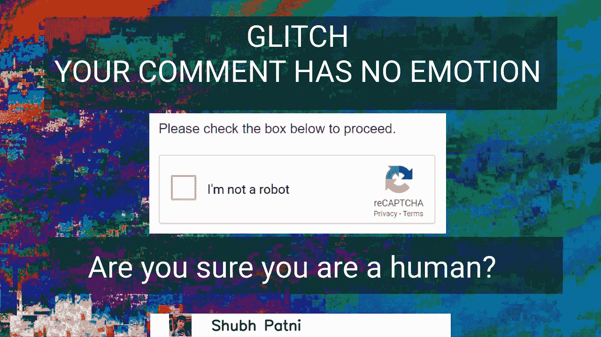
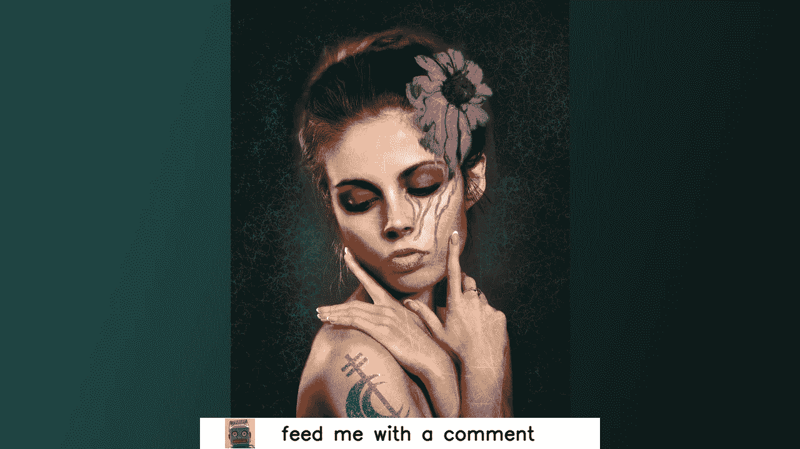

# 情绪是什么样子的？让我们问一台计算机。

> 原文：<https://blog.devgenius.io/what-do-emotions-look-like-lets-ask-the-computer-57242fef8b00?source=collection_archive---------38----------------------->

## 看待情感的另一种方式

这个图像象征着愤怒、信任和惊讶。

# 使用 YouTube 视频评论中的情感创建像素化图像

# 故事

几天前，我在 YouTube 上看了一段汤姆·斯科特的视频，视频中他使用 YouTube API 实时更新视频标题，以匹配他在该视频中获得的浏览量。现在，这对我来说似乎很简单，所以我想，让我们更进一步。

在这篇文章中，我将向你展示如何从 YouTube 视频的评论中提取情感，并将其转换成像素化的图像，在缩略图上显示他们的姓名、个人资料图片和情感表情符号。这听起来令人困惑吗？

这就是它看起来的样子-

那些表情符号代表了评论上的形象和感受。

现在，我跟你说实话。这是用图像表现情感的最天真的方式。我会把下面的链接写下来，告诉你如何用 GAN 更好地做到这一点。但这是一个有趣的项目，它教会了我很多关于 YouTube API 和 OpenCV 的知识，以及更多。此外，我有一个 YouTube 频道，所以我想看看人们的反应会很有趣。

# 工作流程

第一步:使用 YouTube API 从 YouTube 获取评论。

第二步:对于每一条评论，把它分解开来，把每个词归类为不同的情绪。

第三步:为每种情绪选择一种颜色，并使用某种规则来创建一个图像。

步骤 4:使用收集的评论数据(姓名，评论者的个人资料图片)并在图片上显示。

第五步:每 10 分钟更新一次视频缩略图。

# 让我们从第一步开始

在我的 [GitHub 库](https://github.com/patni11/UTOC)中有更多的功能，比如获取任何频道的 YouTube 视频 id 集合或者获取任何 YouTube 的频道 id。

 [## 帕特尼 11/UTOC

### 在 GitHub 上创建帐户，为 patni11/UTOC 的发展做出贡献。

github.com](https://github.com/patni11/UTOC) 

为了收集评论，我们需要任何视频的 videoId。我们可以通过选择 YouTube 视频的这一部分来获得它。v=' ->

这是视频 ID

如果您想要多个视频的 videoId，例如您频道中的所有视频，您可以使用我的 [repo](https://github.com/patni11/UTOC/blob/master/gathering_comments.py) 中的 get_youtube_videos_ID(id):函数。

现在我们有了 videoID，我们可以继续了。

初始收集 _comments.py 文件

这段代码把 video_id 作为一个文件，你可以修改它来处理任何字符串。我们稍后将修改这段代码，以处理收集到的评论，现在，它只是使用 JSON 数据收集评论、评论者的姓名以及他/她的个人资料图像。你可以从[这里](https://developers.google.com/youtube/v3/docs/comments/list)找到更多关于这个 JSON 数据结构的信息。

# 步骤 2:分析评论

既然我们已经有了足够的关于评论的数据，是时候分析它了。

代码的详细解释。

我对上面的代码进行了详细的注释。这是概述—

词库定义(截图)

我们调用 main()函数并将其传递给单个注释。我们将评论转换成熊猫数据帧，并将其传递给 extract_emotions()函数进行分析。我们将使用 NRC 词典进行分析。要下载词典文件，点击[这里](https://saifmohammad.com/WebPages/lexicons.html)。(我从格雷格·拉弗蒂的[这篇文章](https://towardsdatascience.com/basic-nlp-on-the-texts-of-harry-potter-sentiment-analysis-1b474b13651d)中得到了一些帮助。他对哈利波特的文本做过情感分析，一定要去看看)。在 extract_emotions()函数中，我们又创建了 2 个数据帧(emo_df，total_df)，emo_df 用于存储所有的情感，另一个用于存储每个评论中检测到的情感数量。我们将所有信息连接起来，并将其返回给我们的主函数。我们将这些数据传递给 clean_data()函数来获得我们想要创建的图像。clean_data 函数返回 emotions_values，即检测到多少带有特定情绪的单词，情绪，即评论是正面还是负面，检测到的带有和不带有情绪的情绪总数，以及评论的字数。

## 很少链接

现在，这个文件可以分析存储在文件中或单独传递的任何文本。它也可以用于其他项目。然而，更好的方法是使用 LSTM 网络。这需要大量的培训和计算能力，我没有，但你可以使用以下链接来实现它。

lamiae hana 利用 LSTM 进行情感分析

 [## RNN 和 LSTM 的情感分析分步指南

### 在这里，您将构建一个模型，该模型可以读入一些文本，并对该文本的情感做出预测…

medium.com](https://medium.com/@lamiae.hana/a-step-by-step-guide-on-sentiment-analysis-with-rnn-and-lstm-3a293817e314)  [## 使用生成对抗网络的文本到图像合成

### 从自然语言生成图像是最近条件生成模型的主要应用之一…

arxiv.org](https://arxiv.org/abs/1805.00676) 

问题是这些方法要求你定义一个图像。这朵花有八片花瓣，是红色的。但是对于 YouTube 评论，我们得不到任何这样的数据，因此你必须训练你自己的模型。

# 步骤 3 和步骤 4:创建图像

基于检测到的情绪生成 2 幅不同的图像

上面的代码有详细的注释。这是概述—

我们调用 main 函数，并将之前收集的所有数据传递给它。它获取所有数据，并根据普卢奇克的[情感之轮](https://positivepsychology.com/emotion-wheel/)创建一个图像。

普卢奇克的情感之轮(图片来自 positivepsychology.com)

我刚刚用 Mac 上的数字测色工具应用程序从这张图片中提取了 RGB 颜色值。generate_img 函数遍历图像上的每个像素，并从 get_rgb 函数中获取每个像素的 RGB 值。get_rgb 函数首先使用加权随机值选择特定的情感，然后为其创建 rgb 值。红色通道根据情绪中消极的数量增加，蓝色通道根据积极的数量增加(查看代码有更好的理解)。由于 OpenCV 需要 BGR 而不是 RGB，所以我们使用 convert_to_bgr 函数，这非常简单。最后，在遍历所有像素后，我们得到一个像素化的图像。现在，我们使用 OpenCV 放入个人资料图片、检测到的表情符号和评论者用户名。

用所有情绪表情符号和评论者姓名生成的图像。

**剧情转折**:现在这个(generate_img)函数只有在我们检测到任何情绪时才会被调用。*当没有情绪被检测到时会发生什么？*

嗯，我想做一些有趣的事情。所以如果评论上没有检测到情绪，YouTube 视频的缩略图就会变成这个-->

当图像上没有检测到情绪时的缩略图。

# 步骤 5:更新视频的缩略图

现在，您还记得我告诉过您我们需要更新 gathering_comments.py 代码吗？让我们现在做那件事。

更新了 gathering_comments_final.py 文件

这里我们将首先检查是否有任何看不见的注释，如果是，那么我们将进入我们的 generate_image 函数，否则，它将显示此图像-->

如果没有可用的注释

为什么是这个图像？因为这是我用亲和照片和技能分享课程创作的第一张照片😅。你可以在这里放任何东西。

现在，您必须启用 api key 和 OAuth 2.0 来接收评论和编辑缩略图。你可以在找到如何设置

# 注意

如果你想永远更新你的视频缩略图，把这段代码放在服务器上就可以了。此外，如果您有任何丢失的文件或问题，请在这里查看我的 GitHub repo

 [## 帕特尼 11/UTOC

### 在 GitHub 上创建帐户，为 patni11/UTOC 的发展做出贡献。

github.com](https://github.com/patni11/UTOC) 

# 参考资料:-

我非常喜欢格雷格·拉弗蒂关于《哈利·波特》书籍情感分析的帖子

 [## 《哈利·波特》文本的基本自然语言处理:情感分析

### 附带 Matplotlib 高级特性的附加教程！

towardsdatascience.com](https://towardsdatascience.com/basic-nlp-on-the-texts-of-harry-potter-sentiment-analysis-1b474b13651d) 

还有，这个 YouTube 视频

https://www.youtube.com/watch?v=cUx9qUkYJgk