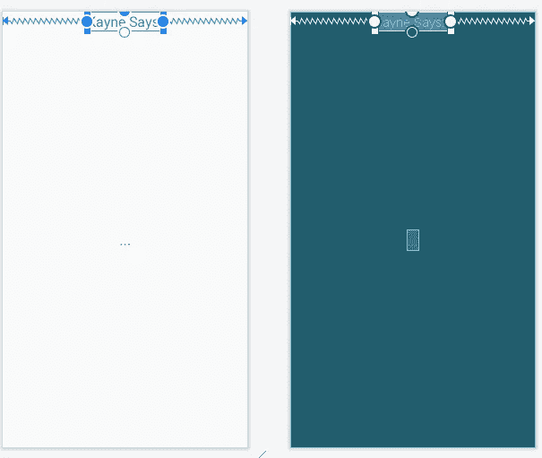

# Kanye West 和软件开发有什么共同点…

> 原文：<https://blog.devgenius.io/what-do-kayne-west-and-software-development-have-in-common-a51df95314dd?source=collection_archive---------10----------------------->

听他们说什么 REST API？

没错！有一个名为“Kanye . REST”([https://kanye.rest/](https://kanye.rest/))的 REST API 提供了来自 Kanye West 的随机引用。在这个故事中，您将学习如何与 API 交互，以及如何将其集成到您的 Android 应用程序中！

(左图)在 [Unsplash](https://unsplash.com/) 上由 [Chase Fade](https://unsplash.com/@chasefade) 拍摄的照片 [Unsplash](https://unsplash.com/) 上由 [Shahadat Rahman](https://unsplash.com/@hishahadat) 拍摄的照片

# 什么是 REST API？

REST API 是一个代表性的状态转移应用程序编程接口…你还在读这个故事吗？太棒了…我很感激这是一个冗长的缩写！

REST 是一种软件架构，它定义了系统通过 web 进行通信的规则。

API 是多个软件系统进行通信的一种方式。例如，如果你想将脸书功能集成到你的应用程序中(例如，允许你的应用程序的用户使用他们的脸书帐户登录)，你可以与脸书 API 进行交互，以向/从你的应用程序发送/接收数据。

# 使用 Kanye REST API

我使用的 Kanye REST API 是 [https://api.kayne.rest](https://api.kayne.rest)

更多信息请访问:[https://kanye.rest/](https://kanye.rest/)

# 设置项目(作为 Android 应用程序)

该项目将使用 ***Android 平台*** 。您也可以通过其他技术与这个 API 进行通信。

> 我将我的项目命名为“KayneRestAPI”，将语言设置为“Java”，将最小的 SDK 设置为“API 23”。

我们还需要在 AndroidManifest.xml 文件中允许 *INTERNET* 权限。如果你不包括这一点，你的应用运行时就会崩溃。

在 AndroidManifest.xml 中包含以下代码以实现这一点(在"*清单*标记/尖括号内，但在"*应用程序*开始标记/尖括号之前):

将此内容包含在 AndroidManifest.xml 文件中，以允许应用程序中的互联网权限

# 实现应用程序的用户界面/前端

**转到位于 res → layout 的“activity_main.xml”。**如果您在 Android Studio 的左侧找不到此选项，请选择“Android ”,如果您在 Android Studio 的左上角选择了“项目”或其他选项。

将以下代码添加到“activity_main.xml”中以设置 UI:

**我会解释这段代码，不会让这个故事成为拷贝&粘贴练习……**

“<androidx.constraintlayout>使用了**约束布局**(更多信息在此:[https://developer . Android . com/reference/Android x/constraint layout/widget/constraint layout](https://developer.android.com/reference/androidx/constraintlayout/widget/ConstraintLayout))。</androidx.constraintlayout>

这种布局实现了相同的，甚至超过了相对布局，所以是一个很好的选择…特别是在这个应用程序非常简化的用户界面。

约束布局向基于其他视图的不同视图添加约束，例如，包括相对于其父视图(即，整个屏幕/视图)具有 ID: " **kayneSaysTextView** "的第一 TextView 的约束。这通过 3 个箭头/约束的方向显示如下:

**“kayneSaysTextView”**只显示文本“Kayne 说:”。此视图的内容是静态的，因此在应用程序运行时不会发生任何变化。

**最后一个 text view**:“kayneQuoteTextView”显示动态(每次重启 app 都会改变)显示从 API 中取出的 JSON 数据。

**只是为了阐明 API 如何工作**，每次进行 API 调用时，API 提供的数据或 Kayne 报价都会返回一个随机值/报价。

# 实现应用程序的逻辑/后端

导航至“main activity”Java 文件，该文件位于 Java→com →{您的姓名}→{项目姓名}文件夹

**在 MainActivity 类中包含以下代码:**

**代码解释**

导入将确保 TextView 等代码没有错误。

**“implements”**被包含进来，因为我们想要实现 **FetchDataTask** 类中定义的**接口**，以便定义当获取 API 数据任务完成时要运行的行为/代码。不要担心，我们马上就会创建这个类。

“URL”变量只是保存我们想要向其发送 GET 请求的 URL/API 端点。“kayneQuote”变量存储从 API 返回的 kayne 报价值。这两个 text view 表示在 UI 部分中定义的 text view。这些变量然后在 **findViewById** 行的“onCreate()”方法中链接到应用程序的后端。

在第 21 行，创建了一个 **FetchDataTask** 类的实例，将 MainActivity 作为对 **FetchDataTask** 中的 **onTaskFinishedListener** 变量的引用传入。然后，第 22 行通过调用 **execute(URL)** 启动异步请求，其中“URL”是变量，因此将 API 端点 URL 传递给方法。

> 这个类的代码解释差不多完成了…:)

“on task finished”**实现**在**接口**(位于 **FetchDataTask** 类中)中定义的方法。该方法检查“kayneQuote”参数的值是否为空。否则，该参数被赋给本地“kayneQuote”变量(因此是 this.kayneQuote)。然后更新 TextView，显示 API 提供的报价。

现在，这就是我们创建 **FetchDataTask** 类的地方。创建一个名为… yep **FetchDataTask** 的新类。您可以通过右键单击左侧的{ project _ name}→“新建”→“Java 类”来完成此操作。

一旦创建了类，样板代码(代表新创建的类的基本代码)就会显示出来。

下面是我为 **FetchDataTask** 编写的代码:

比 **MainActivity** 多一点代码…但是不要担心，我会再次解释它！

我认为通过行号引用上面的代码更容易..好了，我们开始吧:

第 1–10 行:异步相关函数(流、HTTP 和 URL 库)所需的导入。

第 18 行:**从 **AsyncTask** 继承**的类声明，其中包含< *Params、Progress、Result >* ，它们被包含/用作方法中的参数: **doInBackground、onProgressUpdate** 、 **onPostExecute** 。**注:onProgressUpdate* *方法* ***在本项目中并没有实际实现，不过我提到它只是为了理解 AsyncTask 参数****

第 19–21 行:用于存储返回的 JSON 数据的变量，对 onTaskFinishedListener 和“kayneQuote”的引用，用于存储从 API 请求返回的结果。

第 23–26 行:定义该类的构造函数，其中 ontaskpfinished listener 作为一个参数包含，以便可以将 main activity ontaskpfinished listener 分配给 FetchDataTask 类实例。

第 29–31 行:来自 AsyncTask 类的一个被覆盖的类，包括在 API 请求之前准备数据。父类的方法也包含在这个被重写的方法中。

第 33–39 行:另一个被覆盖的方法是异步请求期间实际运行的代码。这使用与 UI 线程不同的线程来发送请求。调用 getJsonData 方法调用来实现请求的发送。parseJsonToKayneQuote 方法将返回的 JSON 数据解析为所需的格式，以便存储在 KayneQuote 变量中。JSON 数据从 doInBackground 方法返回(存储在变量 JSON data 中)。

第 41–48 行:onPostExecute 是 AsyncTask 类中第三个被覆盖的方法。这将在异步调用完成后运行代码，以便相应地处理数据。在这个方法中有一个空检查，但是在 parseJsonToKayneQuote 方法中已经进行了检查，所以可能不一定需要。然后调用 onTaskFinished 方法来表示任务…井已完成:)。

第 50–82 行:[这是类中最大的方法]

*   第 53–57 行创建必要的变量，然后用来建立一个连接，以便进行 API 调用。requestMethod 设置为 GET 请求(我们只想从 API 读取数据，而不想向 API 发送任何内容)。然后调用连接尝试来连接到 API。
*   第 59–64 行从服务器发回的响应代码随后被存储、检查，如果请求成功(200 响应是可以的),则创建一个 InputStream 对象，以便使用已建立的连接开始读取数据流。
*   第 67–76 行涉及使用 BufferedReader 和 StringBuffer 从已建立的连接中读取 InputStream 数据。使用 StringBuffer 是因为它是线程安全和可变的(与 StringBuilder 相比)。读取数据，直到使用 BufferedReader 的行为空。只要当前的“reader”(buffered reader)行有一些数据要追加到其中，就将使用 StringBuffer 对象存储的数据添加到中。然后将“缓冲区”变量数据赋给 jsonData 变量。第 76 行之后的代码只是为了捕捉在试图建立连接时抛出的异常(在需要时提供调试和异常消息)。
*   第 84–100 行首先检查返回的 jsonData 是否包含数据。如果是这样，使用导入的 org.json…代码库，创建一个 jsonObject 来表示 json 结构中的原始 JSON 数据(它只是一个长字符串值)。“quote”字符串变量访问名为 quote 的 JSON 键值对属性。如果该属性存在并且包含数据，那么存储在“quote”变量中的数据被赋给“kayneQuote”变量。
*   第 103–107 行包含了我在 **MainActivity** 类中提到的**接口**的声明。这定义了当使用这个接口时应该实现什么方法。

**代码解释到此结束！！**

一旦您有了 Android 虚拟设备或实际的 Android 设备设置，您应该会看到来自 API 的 Kayne 引文之一:

我 ***听到他们说*** 故事结束了，现在你是一个 ***更强*** 的开发者..好吧，我就不说凯恩的歌了！

如果你有任何问题，请随意评论这个故事，我会尽我所能帮助你。

# 和往常一样，如果你觉得这很有用，很有趣，或者两者兼而有之，请关注我的 Medium，了解更多这些故事！

谢谢，祝您愉快！ ***如果你喜欢这个内容，请随时加入我的邮件列表:【https://www.subscribepage.com/x9b5l0】***

(…刚刚发表了这篇文章，意识到我把 Kanye 拼错了…😐。好吧😄)

# 跟着我看 https://www.tiktok.com/@theinspiringprogrammer?抖音 lang=en⏰

照片由[在](https://unsplash.com/@drew_beamer) [Unsplash](https://unsplash.com/) 上绘制的光束器