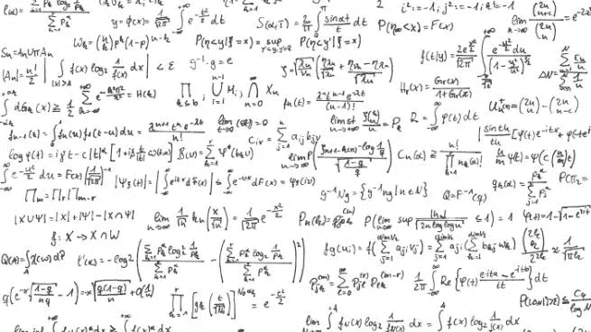

# 数据科学家需要什么

> 原文：<https://blog.devgenius.io/what-does-a-data-scientist-need-b5aee8f03442?source=collection_archive---------6----------------------->

***一个要求很高的角色需要很多技能。变得更加苛刻。***

自从数据科学流行以来，它就作为统计学的一个分支而存在。但是，通过将优化与编程相结合，它仍然成为了统计学的一个分支。在这里，我们将讨论数据科学家需要什么来满足需求。

## 首先，数学

数学与技术发展的相关性是众所周知的。当涉及到数据科学时，它变得更加重要。

**微积分**

概率以来的每一个统计题目都需要微积分的知识才能理解。更重要的是，这些证明和解释依赖于微积分才有意义。因为他们是用微积分的定理证明的。此外，微积分被用在所有的高等数学课程中。

**线性代数**

线性代数是数学的另一个分支，在这个分支中，读取数据是很有用的。这对于阅读图表和对你的分析进行近似是很有用的。更重要的是，这是掌握几乎所有数学，尤其是统计学的先决条件，以满足你的要求。

**微分方程**

这是通向高等数学的大门，有助于理解大多数数学模型。以及数据科学中使用的优化算法的途径。与微积分和线性代数相比，微分方程更难学，需要一些实践和经验来掌握微分方程。

**多变量微积分**

高等数学第一轮和进入这个题目吓到很多人。但是，这是涉及优化工作的数据科学的主要途径之一。这导致数据科学家学习多变量微积分来理解他们的数据。

## 第二轮，统计

因为数据科学涉及到海量的数据，所以对于一个数据科学家来说，统计学是最具决定性的课题。尤其是概率、假设检验、回归分析和时间序列分析。所有这些主题都在数据科学家的生活中占据了特定的部分，以便围绕海量数据做出决策和优化工作场所。回归和时间序列分析最终确定了大部分结果。

## 最后，编程

对于数据科学家来说，Python 是最受欢迎和需求最大的编程语言。但是 R，Tableau 和 PowerBI，以及更多像 Kafka 和 Docker 这样的平台正被用来处理大量数据集，并将其容器化以达到最高效果。当考虑到工作负载百分比时，清理数据并使其为策略做好准备主要涉及统计数据和少量编程以完成所需的工作。

*我们已经讨论了数据科学家的工作需求。根据您的观点，数据科学家需要具备哪些条件才能取得成功？在下面的评论区分享你的想法和经历。*