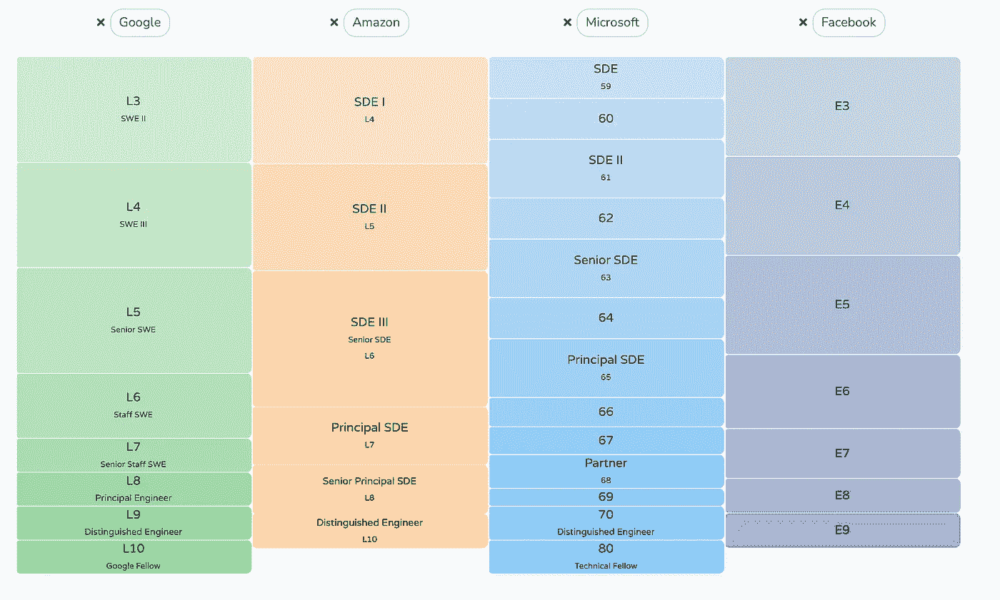

# 首席软件工程师是做什么的？

> 原文：<https://blog.devgenius.io/what-does-a-principal-engineer-do-2e6af918ff28?source=collection_archive---------0----------------------->

在我的上一个故事“ [**初级与高级与职员级工程师**](/junior-vs-senior-vs-staff-engineer-eaecea01440c) **”，**中，我揭示了初级到职员级工程师的责任。但是他们并不是一个 SWE 职业阶梯的完整图景，顶尖的一级仍然缺失，也就是“首席工程师”。在脸书、亚马逊(Amazon)或谷歌(Google)等公司，这相当于 7+级，其总薪酬约为每年 80 万美元。

在这篇博客中，我将分享我对“首席工程师是什么样子”的观察。

From Levels.fyi

# 定义

总的来说，首席工程师应该能够**发现、推动和交付一个具有多团队、组织级影响的计划**。

进一步说，一个成功的首席工程师可以不断展示以下能力:

*   **识别对业务至关重要并对组织和公司产生影响的机会。**
*   **确定关键成功指标，只关注关键路径上的组件。**
*   **从产品中提取常见问题，主动修复通用基础设施。**
*   **不断影响组织的工程文化**。
*   **帮助招聘高级工程师和经理**
*   **评估行业内的新产品或新技术**

# **原型**

根据我的观察，公司通常将首席工程师与原型配对，以更好地支持和指导首席工程师的成长。

1.  通才:产品/服务领域的公认领导者。不断传递和着陆相当大的影响。
2.  专家:被认为是某一特定领域的专家。不断改进他/她的领域。
3.  编码机器:为复杂的问题建立解决方案，比大多数工程师做得更快。
4.  **产品经理(PM)混合型**:解决一个需要 XFN 沟通、产品策略和技术解决方案的复杂业务问题。

# 总之

为了实现“组织级别”的影响，首席工程师需要非常仔细地选择工作内容，并尽可能地利用杠杆作用。例如，为了帮助他们取得成功并使他们的影响力最大化，首席工程师通常直接向“总监级”工程领导报告。