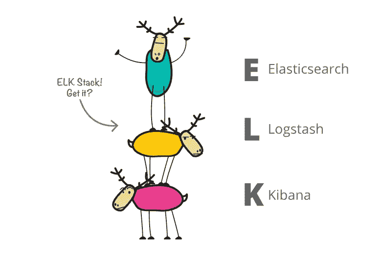

# 麋鹿代表什么，麋鹿栈是什么？

> 原文：<https://blog.devgenius.io/what-does-elk-stand-for-and-what-is-the-elk-stack-2b7549d3e2ef?source=collection_archive---------9----------------------->

elastic.co 供图。

如果你从事软件工作，特别是如果你正在处理搜索和分析引擎，那么你可能听说过术语 ELK。

然而，人们谈论的可能不是同名动物——麋鹿:

这头麋鹿很雄伟，但这不是我们要说的。 [Y S](https://unsplash.com/@santonii) 在 [Unsplash](https://unsplash.com/photos/aJuv14zf-ZY) 上拍照。

不，相反，他们指的是一个缩写，或 E.L.K。

这个缩写是 ELK Stack 的缩写，它描述了一组三个软件一起使用，在技术上通常称为 Stack。

那三个软件项目分别是 **E** lasticsearch、 **L** ogstash、 **K** ibana。

Elasticsearch 可以说是最知名的一个。有时简称为“es”，Elasticsearch 是一个分布式搜索和分析引擎，它完全建立在 Apache Lucene 之上。

它的特点是多语言支持、非常高的性能和无模式的 JSON 文档。

Logstash 是一个数据处理管道，它从一个或多个来源接收数据，对其进行转换，然后将其发送到所需的位置。它包括对大量过滤器和插件的支持，以适应大量不同的数据源和类型，尽可能成为灵活的解决方案。

Kibana 是一个用户界面，或者 UI，它可以让你将来自 Elasticsearch 和应用程序日志的数据可视化。它包括对易于使用的交互式图表的支持，使用户能够更清楚地了解幕后发生的事情。一个用例是在 Elasticsearch 中跟踪查询负载。

Elasticsearch、Logstash 和 Kibana 这三个工具都是开源的，由 Elasticsearch 的创造者开发。

随着时间的推移，使用 ELK 堆栈的人的用例也在增加。由此产生的副产品是对 ELK Stack 的新介绍:Beats。

Beats 本质上是一个收集日志和指标的轻量级小型日志传送器的集合。

因此，如今，ELK 堆栈通常被称为弹性堆栈，以更好地包含进入其中的项目。尽管如此，麋鹿仍然被普遍提及，所以能够知道它们在日常用语中非常相似，但在实践中不一定相同是件好事。

如果你觉得这篇文章很有帮助或者只是喜欢阅读它，可以考虑[注册成为一名媒体会员](https://tremaineeto.medium.com/membership)。每月 5 美元，你可以无限制地阅读媒体上关于软件、技术等主题的报道。如果你[用我的链接](https://tremaineeto.medium.com/membership)注册，我会得到一小笔佣金。

 [## 通过我的推荐链接加入 Medium—Tremaine Eto

### 作为一个媒体会员，你的会员费的一部分会给你阅读的作家，你可以完全接触到每一个故事…

tremaineeto.medium.com](https://tremaineeto.medium.com/membership)