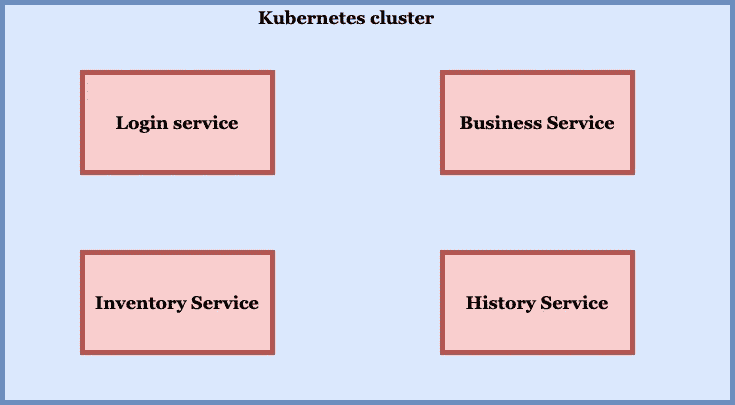
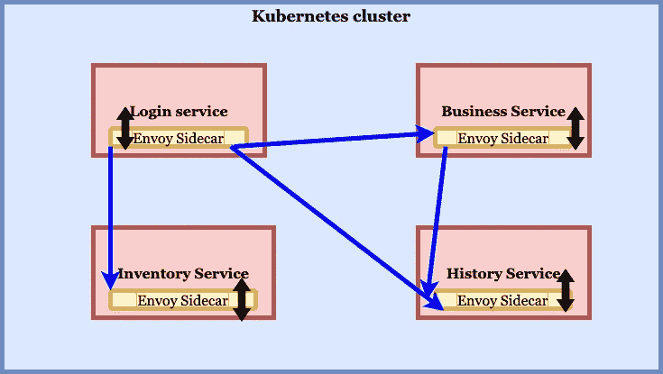

# Istio 服务发现是做什么的？

> 原文：<https://blog.devgenius.io/what-does-istio-service-discovery-do-fe236236313?source=collection_archive---------4----------------------->

## 了解 Istio 服务网格的服务发现功能

斯科特·韦伯在 [Unsplash](https://unsplash.com/s/photos/mesh?utm_source=unsplash&utm_medium=referral&utm_content=creditCopyText) 上拍摄的照片

微服务架构在行业中广泛用于开发大规模应用。Kubernetes 平台用于部署这些应用程序的工作负载。Service mesh 用于为开发人员处理流量整形、可观察性、安全性和服务发现等交叉特性，以便他们能够专注于核心业务逻辑。

# **为什么需要服务发现？**

服务发现特性对于开发人员在他们的应用程序中连接到不同的微服务非常有用。在下图中，我们可以看到在 Kubernetes 集群中部署了四个独立的微服务。出于授权目的，核心业务逻辑服务需要识别并连接到集群中的登录服务。类似地，业务逻辑服务需要连接到应用程序中其他用例场景的库存服务和历史服务。众所周知，IP 地址是动态分配给 k8s 集群中的所有服务的，因此，在建立连接之前，服务会用它们的主机名来标识。

没有服务网格的 Kubernetes 中的应用服务

在没有服务网格的情况下，服务的识别需要通过应用程序代码来处理，并且在跨名称空间识别服务时以及在跨数据中心和各种环境连接到服务和集群时，服务的识别变得难以维护。因此，在这种情况下，服务网格有助于跨集群服务发现。

# Istio 中的服务发现是如何完成的？

为了解决微服务架构中服务发现的上述挑战，并适当地引导服务网格内的流量，Istio 需要知道端点指向哪里，以及这些端点属于哪些服务。如果在 Kubernetes 集群上安装了 Istio 守护进程，那么它会自动检测特定集群中的服务及其端点，并在其内部注册表中为每个服务创建一个条目。

## **什么是服务条目？**

> 在 Istio 维护的内部服务注册表中，包含服务属性(如端点、DNS 名称、端口、协议等)的记录被描述为 ***服务条目*** 。在为每个服务添加了服务条目之后，特使代理可以向相应的服务发送流量。

使用服务网格 Istio 的 Kubernetes 中的应用服务

使用 Istio 的内部服务注册表，特使代理读取服务条目记录并将流量导向相关服务。如果在任何应用程序中，有多个工作负载实例，那么特使代理将以循环方式将传入流量分配给每个实例，直到所有实例都收到请求。

## 结论—

在跨名称空间和集群的多个服务之间进行管理和通信时，Istio 服务网格的服务发现特性没有那么麻烦。它将服务发现逻辑从 application pod 分离到充当代理的 sidecar pod。sidecar 代理可以轻松地与生态系统中的每个服务一起注入，而不必每次在运行应用程序之前为任何新服务更改核心应用程序逻辑。