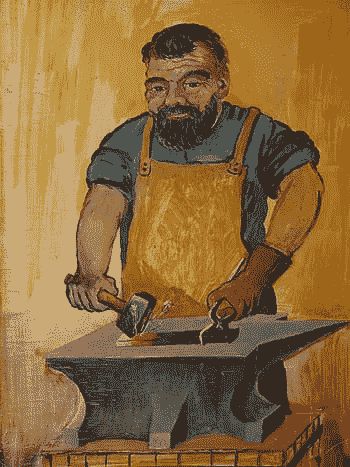

# 产品构建是什么感觉？

> 原文：<https://blog.devgenius.io/what-does-product-building-feels-like-2bcc96fb352c?source=collection_archive---------33----------------------->

产品制造是一门艺术，它是一个复杂的过程，但却很容易实现。

铁匠弯钢。

当你在制造一个产品时，就像制造一把剑，提出所有的想法，把它们分解成小的细节，混合在一起，构建出你的 MVP 形象。然后将混合物倒入构建好的图像中，一遍又一遍地进行提炼。

开发一个产品应该充满激情和爱，因为伟大的产品来自伟大的人，你会惊讶地发现，与拥有一个执行团队相比，拥有一个相信产品并对产品有发言权的团队会有多么大的不同。区别在于指挥链和有限的任务。一个伟大的产品是建立在一个更广阔的视角之上的，这个视角涉及许多在不同阶段做出贡献的人，如果这些贡献者在产品中有发言权，那么它肯定会收敛到接近完美的结果，假设每个人都与愿景保持一致。

拥有一个指挥型团队，你只是给出指示，这意味着只有有限数量的人参与塑造产品之路。这在早期阶段有时是好的，但以后肯定是不好的，你看，你得到的第一个用户反馈是你的贡献者的反馈，因此，你可以通过预测变化和对反馈做出反应来赢得很多时间。

我会说，产品建造者是一个伪造者，一个工匠和一个充满激情的人，他必须足够强大，以弯曲任何合作障碍，并确保他在自己的创作中加入独特的签名。

作为一个大的事物的一部分的感觉对我们人类来说很重要，但是拥有的感觉一直是主要的驱动本能。制造产品是为了一个更大的目标而拥有某物的和平方式，这个目标是帮助其他人实现他们无法达到的目标。

我认为，我们应该拥抱“用爱制造”的范式，并确保我们真正做到这一点。为了实现这一点，我想我们应该考虑内部政策、贡献者的舒适度、生产力提升者、工作/个人生活之间的平衡、流程和方法。我想，一个健康的产品制造者过着舒适的生活，会是高效的和有创造力的。

投资于你的团队，谁知道也许十亿美元的想法正在等待…