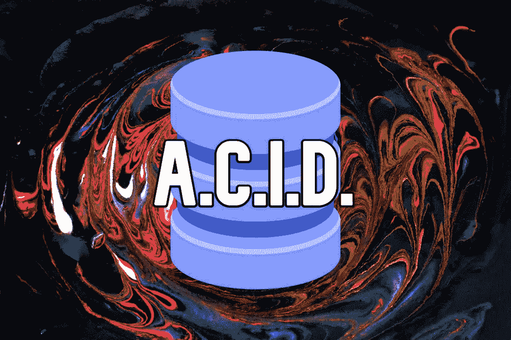

# 对于软件工程中的数据库，ACID 首字母缩略词意味着什么？

> 原文：<https://blog.devgenius.io/what-does-the-acid-acronym-mean-for-databases-within-software-engineering-fe3c83736144?source=collection_archive---------1----------------------->

丹尼尔·利维斯·佩鲁西在 [Unsplash](https://unsplash.com/photos/YQrUzrsRNes) 上的原始照片

当在计算机科学的背景下讨论数据库时，您可能不仅讨论了 SQL vs NoSQL，而且还遇到了术语 **ACID** 。

但是酸到底是什么？在这篇文章中，我们将回顾一下酸的含义。

首先，酸是首字母缩写。代表 **A** 灵活性、 **C** 协调性、 **I** 隔离性、 **D** 耐久性。

为了确保整体数据的有效性，这些都是数据库可能需要的属性。一个符合 ACID 标准的数据库在出现电源故障、停机或事务失败时不会引起太多关注。

现在我们对 ACID 的意思有了一个大致的概念，我们将仔细阅读 ACID 中的每个字母，并记下一些要点。

# 原子数

当我们谈到数据库系统的原子性时，我喜欢把它想成是有或没有。这里的 **a** 是加粗的，提醒我们它与 **a** tomicity 相关联。

我的意思是，数据库事务可以被分类为单元。换句话说，这些单元本质上是一组语句或操作。要么全部成功，数据库相应更新*或*至少一个失败，整个组也将自动失败。

从某种意义上说，这实质上是一种保证，即在发生一些不好的事件(比如电源故障、错误或崩溃)时，不会对数据库进行部分更新。要么所有交易都通过，要么都不通过。

原子性的一个特性是，另一个客户机将无法知道原子事务正在进行。在它完成后，有一种方法可以知道它是成功还是失败。

# 一致性

一致性基本上是“所有数据都符合数据库的规则和约束吗？”

如果根据这样的规则和约束，数据库的数据是有效的，则数据库是一致的。

换句话说，具有一致性属性的数据库基本上拥有所有正确的数据。

# 隔离

对于数据库，为了提高速度和效率，有时您可能希望多个事务可以同时发生——换句话说，并发发生。

对于具有隔离特性的数据库来说，这些并发的事务必须独立运行，并保证没有干扰。

换句话说，他们不应该互相捣乱。一个事务的数据更改不应该影响另一个并发运行的事务；他们应该对数据进行操作，就像另一个数据根本没有运行一样。

在满足这种隔离思想的数据库中，这样做的最终结果是，所有并发运行的事务的结果将完全相同，就像它们按顺序运行一样。

# 持久性

持久性基本上意味着，一旦事务成功发生，它就以这种方式保留在数据库中。例如，在停电这样的坏事件中，它不会突然恢复。

换句话说，一旦事务被完全执行，对数据库的任何更新或更改都将被完全写入磁盘，并且无论系统发生什么情况都将保持不变。因此，这种变化永远不会消失，而且会一直保持下去。它将永久存在，除非实际上被不同的操作所改变。

在本文中，我们能够从数据库系统的角度定义 **ACID** 的含义，然后解释首字母缩略词中每个字母的含义。

在以后的文章中，我将回顾什么时候您想要一个符合 ACID 的数据库，而不是一个不一定符合 ACID 的数据库，只是进行更深入的讨论；他们出来的时候我会把他们链接到这里。

 [## 通过我的推荐链接加入媒体

### 作为一个媒体会员，你的会员费的一部分会给你阅读的作家，你可以完全接触到每一个故事…

tremaineeto.medium.com](https://tremaineeto.medium.com/membership)