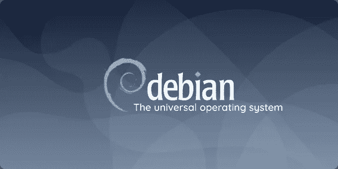

# Docker 图像中的“buster”后缀是什么意思？

> 原文：<https://blog.devgenius.io/what-does-the-buster-suffix-mean-in-a-docker-image-c5d99d6e5a05?source=collection_archive---------0----------------------->

这是剧透。(主题:Alex Makas，GPL-2.0+)

如果您正在使用 Docker，并且看到了这篇文章，那么您可能会遇到一个在图片名称后带有后缀`buster`的 Docker 图片。

例如，我找到了图像名`[golang:1.16.6-buster](https://github.com/docker-library/golang/blob/54aa949c354b1e14cb636539f401b0e58ca76927/1.16/buster/Dockerfile)`和`[python:3.9.6-buster](https://github.com/docker-library/python/blob/fe2130938363f307081496dc5930c29c3ef9ddba/3.9/buster/Dockerfile)`。

# 什么是`buster`？

是亚瑟·里德的兔子闺蜜兼同学[巴斯特·巴克斯特](https://arthur.fandom.com/wiki/Buster_Baxter)？

行业会决定向巴斯特·巴克斯特致敬吗？(图片:[亚瑟粉丝圈](https://arthur.fandom.com/wiki/Buster_Baxter))

或者可能是来自*流言终结者*的碰撞测试假人，也叫巴斯特，他测试有关对人体影响的流言？

什么情况更糟:这张图的画质还是巴斯特？(图片:[@流言终结者](https://twitter.com/mythbusters/status/513357402553716736?lang=ca))

结果发现这两个都不是。

然而，`buster`实际上是 Debian 10 的开发代号。Debian 也叫 Debian GNU/Linux，是一个 Linux 开源操作系统。

最终，这意味着你关心的是以`-buster`为后缀的图像，那么这意味着你正在使用 Debian 10 的底层操作系统。其他后缀，比如`-alpine`和`-windowsservercore`，并不适合你，除非你确定你需要在那些环境中运行的映像。

# 在哪里可以找到关于 Debian 10 的更多信息？

你可以在这里找到发布信息[，你也可以在这里](https://www.debian.org/releases/buster/)找到大量信息[。](https://wiki.debian.org/DebianBuster)

 [## 通过我的推荐链接加入媒体

### 作为一个媒体会员，你的会员费的一部分会给你阅读的作家，你可以完全接触到每一个故事…

tremaineeto.medium.com](https://tremaineeto.medium.com/membership)