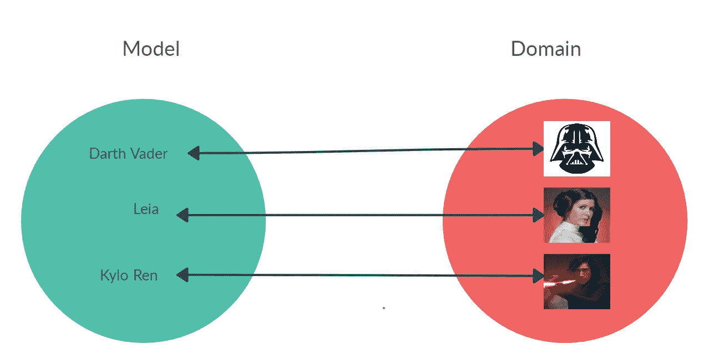
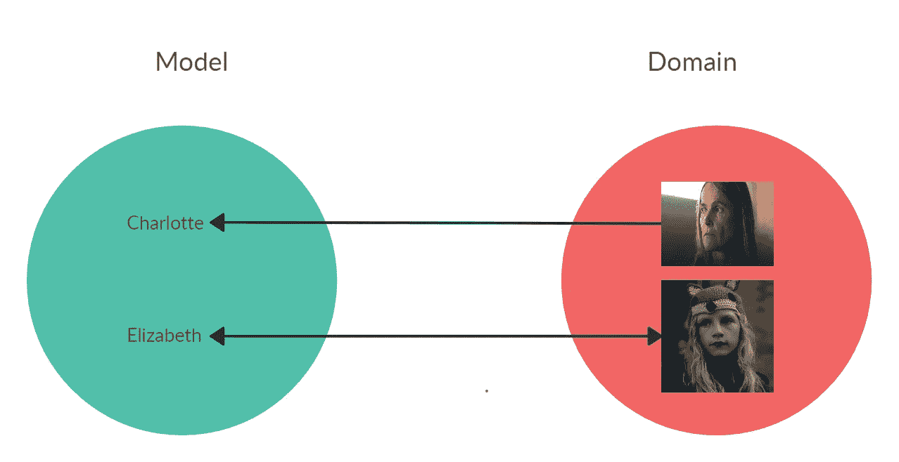
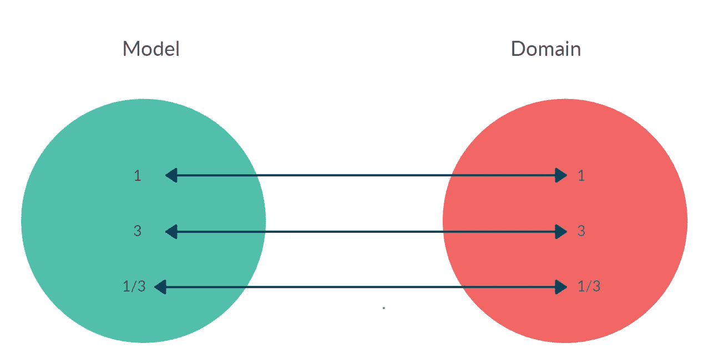
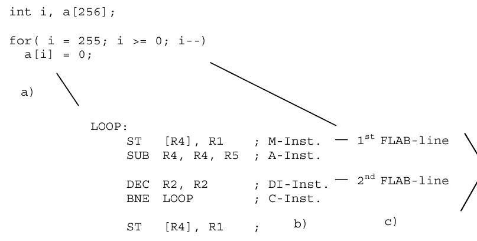
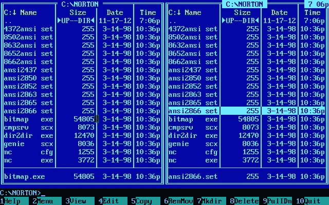
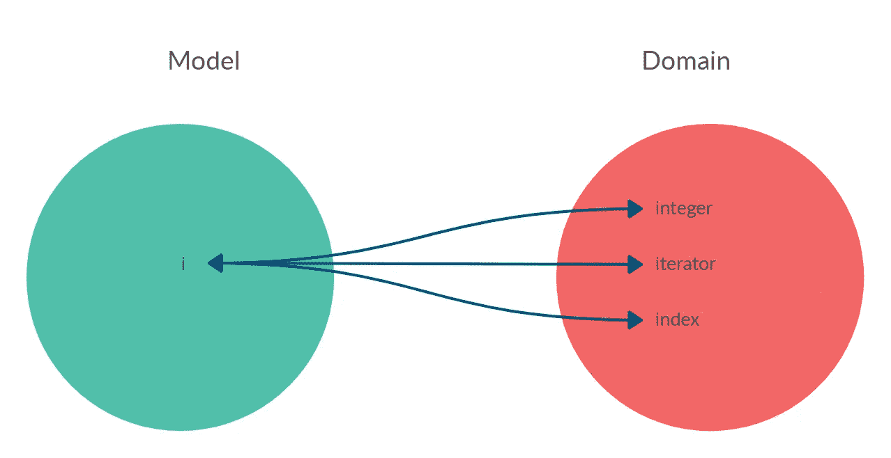

# 名字到底是什么？—第一部分:探索

> 原文：<https://blog.devgenius.io/what-exactly-is-a-name-part-i-the-quest-b812a4b1e0bf?source=collection_archive---------4----------------------->

## 我们都同意:好名声永远是最重要的。让我们找到他们。

我们都用名字来编程，不管语言是高级还是低级，是命令式的、函数式的还是面向对象的。到处都是名字。但是我们继续滥用它们。在第一部分中，我们将看到如何找到它们。

> *计算机科学中只有两件难事:缓存失效和事物命名。*
> 
> *菲尔·卡尔顿*

## 名字有什么意义？

> 名字有什么意义？我们称之为玫瑰的东西/无论叫它什么名字，闻起来都一样香。
> 
> 威廉·莎士比亚的《罗密欧与朱丽叶》。

照片由 [Evie 峡湾](https://unsplash.com/@eviefjord?utm_source=unsplash&utm_medium=referral&utm_content=creditCopyText)在 [Unsplash](https://unsplash.com/s/photos/rose?utm_source=unsplash&utm_medium=referral&utm_content=creditCopyText) 拍摄

# 问题是

代码被读取的次数比被写入的次数多得多。第一次阅读由选择名字的开发者完成。后来，如果代码幸存下来，许多其他的编码者会根据提名者留下的脚印做出自己的解释。

名字很快失去意义

名字很重要。它们表示将对象与其在[映射器](https://codeburst.io/what-is-software-9a78c1172cf9)中对应的真实实体相链接的角色。

 [## 软件有什么问题？

### 软件正在吞噬世界。我们这些工作、生活和热爱软件的人通常不会停下来思考它的…

codeburst.io](https://codeburst.io/what-is-software-9a78c1172cf9) 

通过这种双射关系，我们将知道他在现实世界中代表着谁。

 [## 唯一的软件设计原则

### 如果我们在一个单一的规则上建立我们的整个范式，我们可以保持它的简单并做出优秀的模型。

codeburst.io](https://codeburst.io/the-one-and-only-software-design-principle-5328420712af) 

名字是为人类而生的。编译器不关心我们赋予一个*对象、类、变量、接口、特征等的名字。*

[尔汗阿斯塔姆](https://unsplash.com/@vaultzero?utm_source=unsplash&utm_medium=referral&utm_content=creditCopyText)在 [Unsplash](https://unsplash.com/s/photos/robot?utm_source=unsplash&utm_medium=referral&utm_content=creditCopyText) 上拍照

## 名字到处都是

我们的设计遵循一条规则:

> 永远遵守我们的映射双射。

这在名字的特殊情况下是正确的。当在现实世界中寻找一个责任时，我们会得到函数名。然后我们将它分配给可计算模型中的对象。

## 语境为王

星球大战模型

所有的名字都是上下文相关的。(剧透预警！)

*   达斯·维德是莱娅的父亲。
*   莱娅是凯洛·伦的**母亲**。
*   凯洛·伦是达斯·维达的**的孙子**

黑暗模型

同一个人可以是母女，因为她们是角色。(更多剧透)。

*   对于[夏洛特](https://dark-netflix.fandom.com/wiki/Charlotte_Doppler)，[伊丽莎白](https://dark-netflix.fandom.com/wiki/Elisabeth_Doppler)是她的**母亲**(一个角色)。
*   对伊丽莎白来说，夏洛特是她的母亲。
*   对于夏洛特来说，夏洛特就是她的**奶奶**(一个角色)。

行业中有一种趋势是以对象的类型(或类别)命名。这是一个糟糕的决定，产生了**隐藏的假设**，因此**耦合**。

这些不可见的决定违反了替换原则，并通过将名称与我们期望的类型相结合来防止多态性。

 [## 耦合:唯一的软件设计问题

### 对我们软件的所有故障进行根本原因分析，会发现一个有多种伪装的单一罪魁祸首。

codeburst.io](https://codeburst.io/coupling-the-one-and-only-software-design-problem-869e293a9f04) 

我们都是人的事实并不意味着一定有一个变量 *$human* 指代我们。

> 规则 1:角色是上下文相关的和临时的。
> 
> 推论 1:我们不应该给类型或类分配相关的名字。

为了给物体命名，我们必须考虑它们在被命名的上下文中所扮演的角色(**本质**)，并超越物理实体的**类型**(**偶然**)。

双射上的数

*   1 代表自然数 1。
*   3 代表自然数 3。
*   代表分数。

作为分子或分母的是角色。也是一个比例。永远不要使用与实际类型相匹配的名字，如分数或整数(**偶然**)。这个概念也叫: [*意向揭示命名*](http://bensmith.io/20-tips-for-better-naming) 。

## 空间是极限

目前软件开发中的许多问题都与根深蒂固的习惯有关，这些习惯在今天已经不存在了。其中许多与**过早优化**有关。如今，有些开发人员将变量命名为节省空间，就好像我们还在 60 年代一样。今天，由变量名分配的位置不会以任何方式影响系统的效率。

 [## 代码气味 20-过早优化

### 提前规划需要一个水晶球，这是任何开发者都没有的。

mcsee.medium.com](https://mcsee.medium.com/code-smell-20-premature-optimization-60409b7f90ec) 

计算机科学诞生于科学之母(数学)。在数学中，分配单字母变量 *(i，j，x，y)是一种很好的做法。*

**参考**的概念源于**变量**。

许多人想知道为什么数学家可以处理如此短的变量，而计算机科学家却不能。

对于数学家来说，一旦输入到公式中，变量就失去了所有的语义，变得无法区分。

是时候解放我们自己，离开母体之家，进化了。

照片由 [Pablo Heimplatz](https://unsplash.com/@pabloheimplatz?utm_source=unsplash&utm_medium=referral&utm_content=creditCopyText) 在[unsprash](https://unsplash.com/s/photos/freedom?utm_source=unsplash&utm_medium=referral&utm_content=creditCopyText)上拍摄

> 规则 2:选择声明性的名字，足够长但最小
> 
> 推论 2:变量的名称必须由足够数量的单词组成，以唯一地区分概念和角色。

如果删除任何单词后，唯一性丢失，那么该集合是最小的。

## 缩短产生耦合

我的程序员经历始于 Ms-Dos 时代。文件名采用 8.3 格式:

8 个字母代表名字，3 个代表分机。

在短空格时代对文件名进行编码是一门艺术。有一些试探法，比如:去掉元音，替换字母等。

诺顿指挥官 5

该程序的内存极其稀少，变量映射分配以及源代码占用了宝贵的内存空间。

情况不再是这样了。然而，我们将坏习惯传播给后代，他们的行为就像被喷过药水的猴子一样，仅仅通过惯性维持着一个可怕的习惯。

如果我们缩写名称，我们会生成一个带有该快捷方式(不是双射)的链接，以及名称与其缩写之间的另一个链接。

> i = 1

变量 I:它代表一个指数吗？迭代器？还是一个整数？

带有缩写的双注射分隔符

该参考资料起什么作用？它是在什么年代被编程的？

缩写会创建不必要的间接并破坏双射。同一个缩写可能指两个不同的对象。

关于谁代表谁的决定是相互关联的，并产生连锁反应。

> 规则 3:名字一般会很长。

## 当有疑问时，一个无意义的名字会给它

如果我们对模型的研究还不够成熟，不能在双射中找到合适的名字，我们就必须给它取一个非常讨厌的名字。

一个平庸的名字将永远存在，直到一个负责任的开发人员鼓起勇气对它进行重构。

一个糟糕的名字迫切需要被认为是技术债务并进行反思。

> 规则四:面对不完整的知识，放烂名字。

## 错误的名称要求重构

在保留坏名字的同时修改一个系统是极其困难的。

 [## 如何分离遗留系统

### 改进遗留代码的练习

medium.com](https://medium.com/dev-genius/how-to-decouple-a-legacy-system-b4ea10db2642) 

例如，这是一段在工作面试中用来发现错误的代码。

解决这个问题的第一步是理解变量代表什么。在一个好的命名之后，发现错误就容易多了。

一个烂名字就在那里，让人讨厌，引人注意，让我们反思一个必要的改变。

一个不好的名字给我们一种有成熟概念的错觉。

没有什么比刻在石头上的糟糕抽象更糟糕的了。

> 规则 5:只有当我们对域有足够的了解时，才修改坏名字。

## 一个好名字是我们最后要学的东西

维特根斯坦学派教导我们，人类从几个例子中学会概括。

创造抽象概念的脑力令人难以置信。

程序员倾向于走得更远，试图从单个例子中进行归纳。用生物学打个比方，就像遇到第一只狮子后定义哺乳动物一样。

如今，ide 甚至更进一步，要求我们在没有构建**任何**实例的情况下进行归纳，强迫我们在还不知道**任何**实例或定义其职责的情况下命名一个类。

概括需要观察时间、飞行时间和概念的成熟。

亚里士多德式的分类是在对多个案例进行详细观察后做出的，所以…

> 我们程序员在做什么？为什么我们坚持在过程的早期进行概括？

偶然的和历史的原因与第一批代码编辑者有关，他们强迫我们首先定义名称以便构建模型。

今天，我们有强大的安全重构工具。

一个*反模式*将保持我们第一次阐述一个概念时定义的名称。

> 规则 6:在分配职责之前，永远不要给一个类命名。

## 没有评论

写注释是一个*代码气味*指示一个方法、名称、变量等。它不太具有宣示性。

如果我们能够写出令人难以置信的描述性名称，我们将避免不得不维护“澄清”的评论，这些评论没有增加价值，并且与偶然的决定相关联，很难维护。

> 规则 7:避免评论。

 [## 代码气味 05 —评论滥用者

### 代码有很多注释。注释与实现联系在一起，很难维护。

mcsee.medium.com](https://mcsee.medium.com/code-smell-05-comment-abusers-feec3aeb926) 

## 领域专家积累知识

作为最后一条规则，与这些严格的规则相反，我们必须明白一个好的名字是问题领域成熟知识的产物。

> 规则 8:完美的名字会随着时间的推移而出现。

# 杯子是半满的

技术的进步帮助我们纠正了上述所有的恶习。

今天，在几乎所有现代语言中，我们都有强大的 [linters](https://en.wikipedia.org/wiki/Lint_(software)) ，它帮助我们执行和强化这些设计规则。

我们只需要解决已经造成的损害，并制定更好的解决方案。

在接下来的文章中，我们将关注一系列当前的不良做法，用论据解释我们应该改变哪些根深蒂固的习惯。

 [## 名字到底是什么？第二部分:康复

### 我们都同意:好名声永远是最重要的。让我们找到他们。

medium.com](https://medium.com/dev-genius/what-exactly-is-a-name-part-ii-rehab-fc5058b3ff1) 

# 规则摘要(目前为止)

*   名称必须是声明性的，而不是实现性的。
*   名称必须与上下文相关。
*   不要混淆类型和角色。
*   在分配姓名之前分配责任。
*   有疑问的时候，写上不好的名字。
*   避免[评论](https://codeburst.io/why-developers-should-care-of-naming-2aa1ffd511cf)。

# 结论

起一个好名字是一门艺术，需要对我们正在建模的问题领域有深刻的理解。我们不能低估这项任务。

让我们记住这句名言:

> 在编程时，总是假设最终会遵守我们代码的人是一个知道我们住在哪里的暴力精神病患者。约翰·伍兹。

这一系列文章的部分目标是为软件设计的辩论和讨论提供空间。

 [## 目标设计清单

### 这是已经发表的软件设计文章的索引。

medium.com](https://medium.com/@mcsee/object-design-checklist-47c63d351352) 

我们期待着对这篇文章的评论和建议。

在推特上联系我 [@mcsee1](https://twitter.com/mcsee1) :)

这篇文章还有西班牙语版本[点击这里](https://medium.com/@mcsee/qu%C3%A9-es-exactamente-un-nombre-parte-i-la-b%C3%BAsqueda-e335a3c881cc)。