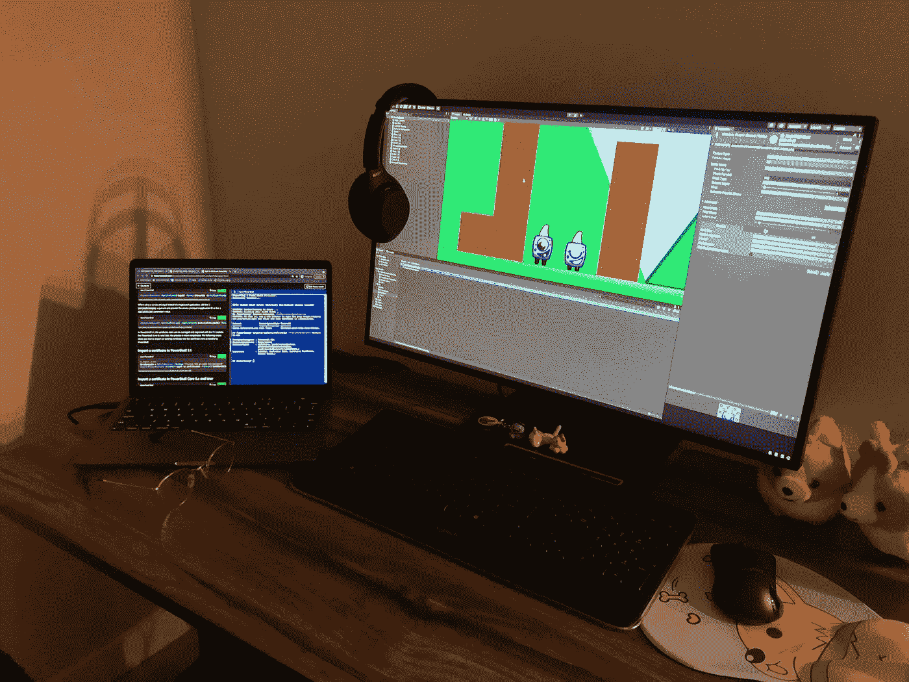
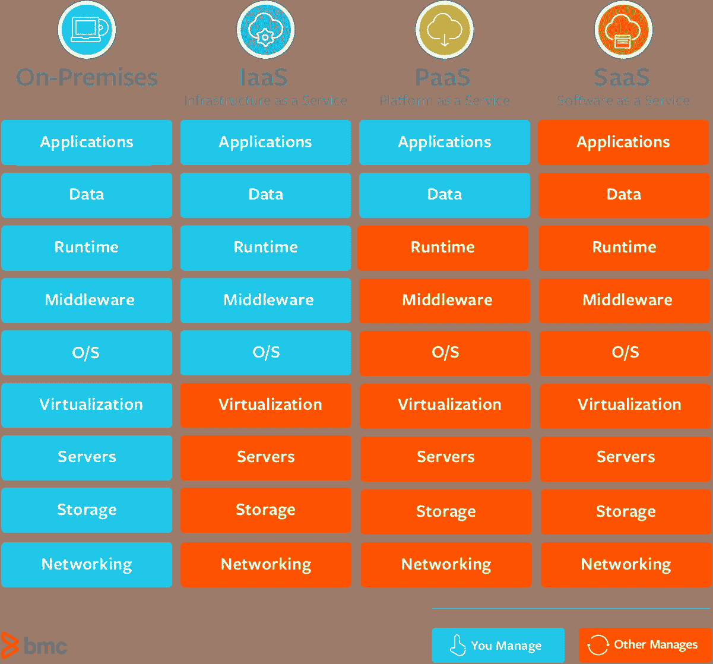

# 云中的游戏开发到底是什么🎮？

> 原文：<https://blog.devgenius.io/what-exactly-is-game-development-in-the-cloud-89ae05adb5e7?source=collection_archive---------0----------------------->

我自己的桌子，打开了 Unity Editor:)

这是一个复杂而简单的服务系统，托管在大型服务器(云)上，强大到足以运行这样的软件，可以在任何可以想象的边缘帮助游戏开发。

这听起来像是非常重要的事情。

也就是说，我觉得游戏开发是一个被低估的领域，值得更多的投资。**公司应该有一个游戏开发者可以使用的更强大的云工具。当考虑到云在许多其他领域的突出价值时，这种观点变得尤为明显。虽然不太相关，但我也对游戏制作和创新充满热情，就这样。**

这篇文章是为那些好奇“游戏开发中的云支持”需要什么，以及为什么它很重要的人而设计的。下面是我打算使用的一个简单指南:

1.  ***介绍游戏开发如何工作***
2.  ***云如何帮助***
3.  ***为什么我们需要更多的投资***

# 游戏开发简介

为了*构建*、*发布*和*维护*一个游戏，团队通常使用不同的软件服务捆绑包来帮助他们；通常由不同的公司提供。因为如此多的游戏是通过不同的平台和设备交付的，所以开发通常可以针对不同的“版本”进行微调(想想移动和 PC)。由于这一点，今天市场上的大多数游戏不需要从头“重建”来适应不同的平台。

在游戏开发的世界里，我们拥有每个项目的核心:游戏引擎。大型桌面或网络应用形式的游戏引擎是*构建*发生的地方。这是游戏设计者和开发者花费大量时间的地方。这是魔法发生的地方:编写测试代码，结合游戏资产和艺术文件，添加效果，控制，以及这之间的一切。

然而，由于游戏引擎被设计为专注于构建的核心任务*，接下来必须解决的痛点是*发布*和*维护*。一旦一个团队完成了他们游戏的第一个版本，并准备发布到一个特定的平台/设备，他们必须确保他们拥有必要的工具来这样做。*

最后，为了在发布后维护一个游戏，团队通常需要确保几个关键区域是绿色的。这些可能包括注册、更新、错误修复、部署问题和整体用户体验。

与许多其他应用程序框架和流程类似，公司和内部团队通常会提供支持发布和维护任务的第三方软件，这些软件通常托管在云上。

# 云如何提供帮助

这是云服务真正发光的地方:提供游戏开发者所需的工具，这样他们就可以把大部分时间集中在开发好游戏上。

有 3 种交付方式:

*   软件即服务(SaaS)
*   基础设施即服务(IaaS)
*   平台即服务(PaaS)

**SaaS** 解决方案由大量软件组成，可以满足许多需求，通常是按需或订阅的。在游戏开发领域，这些可以包括游戏引擎本身( [Unity](https://unity.com/) 、 [Unreal](https://www.unrealengine.com/en-US/) 、 [Lumberyard](https://aws.amazon.com/lumberyard/) )、代码管理( [GitHub](https://github.com) )和图形设计( [Photoshop](https://www.photoshop.com/en) 、 [GIMP](https://www.gimp.org/) )。

**IaaS** 解决方案包括基础设施工具和完整的服务器负载，为团队提供了很大程度的治理。这依次帮助存储、托管、运行和部署游戏软件。它们的价值通常不是为了营销目的的修饰或本质上的显眼，但却是至关重要的。这些包括后端托管、计算、LiveOps 支持、分析和缓存部署。例子包括 [Azure Playfab](https://azure.microsoft.com/en-ca/services/playfab/) 、用于游戏的 [AWS EC2](https://aws.amazon.com/ec2/?did=ft_card&trk=ft_card&ec2-whats-new.sort-by=item.additionalFields.postDateTime&ec2-whats-new.sort-order=desc) 、亚马逊[Game lift](https://aws.amazon.com/gamelift/)和其他 [AWS 游戏技术](https://aws.amazon.com/gametech/)服务、[谷歌计算引擎](https://cloud.google.com/compute)以及 [IBM Cloud](https://www.ibm.com/cloud/gaming) 的各种服务。

PaaS 解决方案则不同，通常向客户提供平台，让他们构建和/或运行自己的应用。通常，PaaS 对其整体软件的控制较少，而 IaaS 通常需要一个基础层来提供更全面的授权。为了游戏开发者，他们可以使用像[谷歌应用引擎](https://cloud.google.com/appengine)这样的服务来构建简单的网页游戏，或者 [Heroku](https://www.heroku.com/) 来部署/运行游戏应用。

这是一个通用的功能图:

图片来源:BMC

所有这些解决方案都可以作为支撑铸件或桌面桩的必需品，这取决于它们被选择来帮助完成的任务。

# 为什么需要更多投资

这种论点很容易支持，但当与工作效率、社交媒体和数据分析等其他互联网需求并列时，很难完全证明其合理性。

作为一个展览，游戏引擎市场作为一个整体，预计到 2026 年价值为 42 亿美元。虽然乍一看似乎很可观，但与其他类似市场相比，它显然令人印象深刻。例如，预计到 2027 年，全球云服务市场的估值将达到 9275.1 亿美元。当一个人把它放在一个大的计划中来理解时，降低游戏开发支持的优先级是有意义的。另一个消息来源预测，从 2020 年到 2024 年，游戏开发市场将增长 5353 万美元，坦率地说，这与 peanuts⁴.相似

尽管我已经介绍了所有的内容，但是我仍然会继续保证游戏开发者应该得到的云支持。我真诚地相信，这种旨在帮助团队发布和维护游戏的工具有一个合适的(并且强大的)市场。就个人而言，对于规模较小的独立和中端市场游戏开发团队，我希望看到云公司进行更多投资，这些公司没有在游戏开发领域获得公平的份额。

以下是我认为应该增加投资的原因:

*   随着游戏开发收获更多的创新(在相机定位、3D 物理、修补等领域。)，创新软件/硬件的交付和维护将需要更多支持。
*   虽然游戏开发是一个小市场，但我觉得市场数据对实际社区来说是不真实的。这包括独立开发人员和团队，他们对空间的财务价值没有贡献，但却从其他角度做出了贡献。
*   我相信，游戏开发市场有空间以指数级增长，超过目前的预测，只要有正确的创新工具来帮助激励和加强一般游戏开发。
*   云市场的现状。像 AWS、Azure 和 GCP 这样的大玩家拥有基础设施、资源和计算能力来运行开发和其他服务，以帮助游戏开发者。这反过来为开发团队带来了更强的竞争优势，应用了更快的计算、部署、分析、货币化等。

如果你从中发现了价值，请分享我的文章或评论！

# **参考文献**

[1]:瓦特，s .，&拉扎，M. (2019 年 6 月 15 日)。 *SaaS vs PaaS vs IaaS:有什么区别&如何选择*。BMC 博客。[https://www . BMC . com/blogs/SaaS-vs-PAAs-vs-iaas-what-the-difference-and-how-to-choose/。](https://www.bmc.com/blogs/saas-vs-paas-vs-iaas-whats-the-difference-and-how-to-choose/.)

[2]:连贯的市场洞察力。(2021 年 5 月)。*游戏引擎市场规模、趋势、份额、见解和预测— 2026 年*。连贯的市场洞察力。从[https://www.coherentmarketinsights.com 取回。](https://www.coherentmarketinsights.com/ongoing-insight/game-engines-market-2382#:~:text=The%20global%20game%20engines%20market,10.6%25%20between%202017%20and%202026.&text=Growing%20gaming%20industry%20is%20expected,the%20global%20game%20engines%20market.)

[3]: Korad，s .，Sinnarkar，m .，& Kumar，V. (2020 年 4 月)。*云服务市场规模、份额&增长:预测— 2027 年*。联合市场研究公司。[https://www.alliedmarketresearch.com/.](https://www.alliedmarketresearch.com/.)

[4]: AppStudio。(2021 年 3 月 19 日)。*2021 年全球游戏开发软件市场——洞察、趋势&分析*。AppStudio。[https://www . app studio . ca/blog/game-development-software-market-insights-trends-analysis/。](https://www.appstudio.ca/blog/game-development-software-market-insights-trends-analysis/.)