# Cypress:哪些外部集成可以用于您的自动化？

> 原文：<https://blog.devgenius.io/what-external-integrations-can-be-used-on-your-cypress-automation-a3d4fbda5393?source=collection_archive---------8----------------------->


集成是库、系统和应用程序之间的连接，它们作为一个整体一起工作以共享信息和数据。集成建立在 API(应用程序编程接口)之上，允许应用程序之间的信息流动，将您的软件连接在一起，这样一切都可以作为一个整体使用。

对于 Cypress.io，您可以拥有大量的库、系统和应用程序来帮助您实现自动化测试的最终目标。

cypress**与所有持续集成(CI)提供商和系统**兼容。在这个页面上，您可以找到大量的指南，介绍如何将 Cypress 用于一些最流行的 CI 提供者，以及许多其他提供者的各种快速入门示例。

让我们从你在尝试像 Bitbucket、Github、Gitlab、吉拉和 Slack 这样的集成时通常会寻找什么开始。

# 比特桶集成

```
Bitbucket integration is currently in beta.
```

[Cypress 仪表板](https://on.cypress.io/dashboard)可以通过[状态检查](https://docs.cypress.io/guides/dashboard/bitbucket-integration#Status-checks)和[拉请求注释](https://docs.cypress.io/guides/dashboard/bitbucket-integration#Pull-Request-comments)将您的 Cypress 测试与您的 Bitbucket 工作流集成在一起。首先，需要建立一个项目[来将](https://docs.cypress.io/guides/dashboard/projects)记录到 Cypress 仪表板以使用 Bitbucket 集成。

位存储桶集成依赖于您的 CI 环境可靠地提供提交 SHA 数据(通常通过环境变量)。这对于大多数用户来说不是问题，但是如果您面临 CI 设置的位存储桶集成问题，请确保遵循这些指南[正确发送 git 信息](https://docs.cypress.io/guides/continuous-integration/introduction#Git-information)。如果在此之后您仍然遇到问题，请[联系我们](mailto:hello@cypress.io)。

## 安装位存储桶集成

Bitbucket OAuth2 应用程序将允许 Cypress Dashboard 作为注册该应用程序的用户进行身份验证。这意味着 Cypress 可以看到你可以访问的每一个 Bitbucket 回购。如果您希望对 Cypress 将看到的存储库进行更严格的控制，可以考虑在 Bitbucket 中创建一个访问权限更有限的服务帐户。

1.  访问 Cypress 仪表板中的集成。
2.  单击安装位存储桶集成。
3.  (仅限测试版)您需要为您的用户帐户启用 Bitbucket 的[开发模式](https://support.atlassian.com/bitbucket-cloud/docs/enable-bitbucket-cloud-development-mode/)才能继续。
4.  继续完成弹出窗口中的 Bitbucket OAuth 安装流程。
5.  安装后，将您的项目连接到 Bitbucket repo。
6.  (可选)为每个项目配置行为。

## 配置位桶集成

## 状态检查

默认情况下，cypress 将发布包含 Cypress 运行结果的 cypress/run 提交状态。这将阻止您的团队合并任何没有通过 Cypress 测试的 PRs。

此外，cypress 可以发布 cypress/flake 提交状态，指示 Cypress 运行是否包含任何 flake 测试。这将阻止您的团队将任何 PRs 与不可靠的测试合并。

您可以在项目的项目设置页面中管理此行为。

## 提取请求注释

默认情况下，当跑步结束时，Cypress 会发布一个总结跑步的 PR 评论。它将包括测试计数、运行信息以及失败或不可靠测试的摘要。

您可以在项目的项目设置页面上管理此行为。

## 卸载位存储桶集成

您可以通过访问贵组织的集成→位存储桶页面来删除此集成。这将停止赛普拉斯的所有状态检查和公关评论。

# GitHub 集成

[Cypress 仪表板](https://on.cypress.io/dashboard)可以通过提交[状态检查](https://docs.cypress.io/guides/dashboard/github-integration#Status-checks)和[拉请求注释](https://docs.cypress.io/guides/dashboard/github-integration#Pull-request-comments)将 Cypress 测试与 GitHub 工作流集成在一起。首先，需要建立一个项目[来将](https://docs.cypress.io/guides/dashboard/projects)记录到 Cypress 仪表板以使用 GitHub 集成。

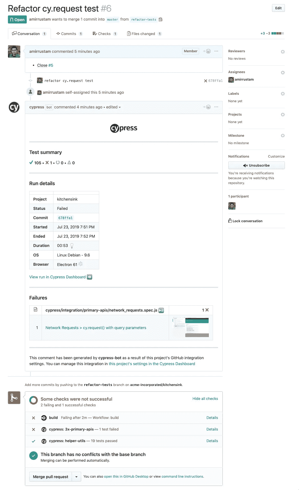

目前不支持 GitHub Enterprise 的 On-premise 平台。

GitHub 集成依赖于您的 CI 环境可靠地提供提交的 SHA 数据(通常通过环境变量)。这对于大多数用户来说不是问题，但是如果您在 CI 设置中遇到 GitHub 集成问题，请确保遵循这些指南[正确发送 git 信息。如果在此之后您仍然遇到问题，请](https://docs.cypress.io/guides/continuous-integration/introduction#Git-information)[联系我们](mailto:hello@cypress.io)。

## 安装 Cypress GitHub 应用程序

在为您的 Cypress 项目启用 GitHub 集成之前，您必须首先安装 Cypress GitHub 应用程序。您可以通过 [Cypress Dashboard](https://on.cypress.io/dashboard) 中您组织的设置页面或项目的设置页面开始 GitHub 应用程序的安装过程。

## 通过组织集成设置安装

1.  进入仪表板[组织页面](https://dashboard.cypress.io/organizations)或打开组织切换器。
2.  选择您希望与 GitHub 帐户或 GitHub 组织整合的组织。

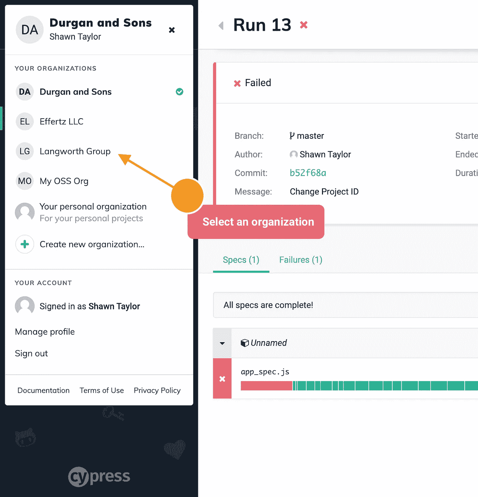

3.通过侧面导航访问选定组织的“集成”页面。

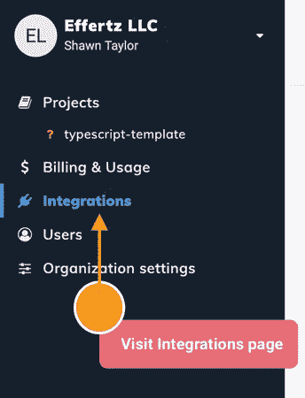

4.点击安装 GitHub 集成按钮。

## 通过项目设置安装

1.  在组织切换器中选择您的组织。


2.选择您希望与 GitHub 存储库集成的项目。

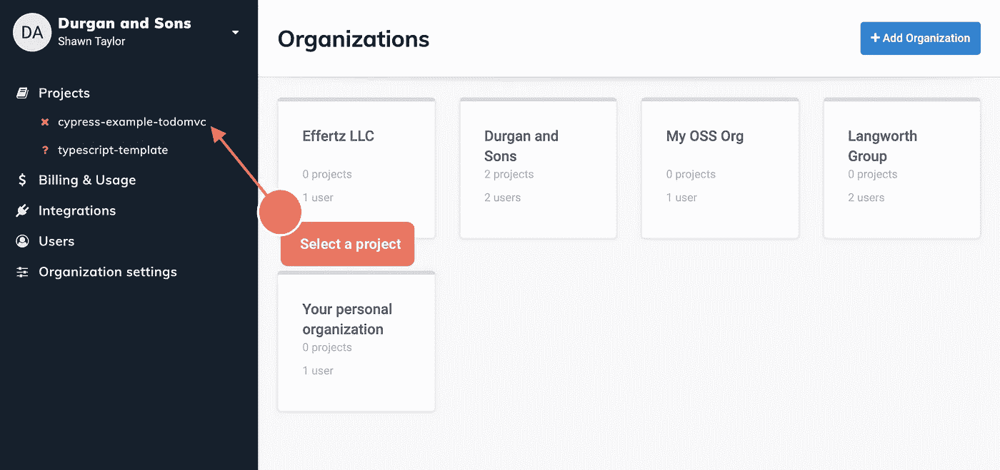

3.转到项目的设置页面。

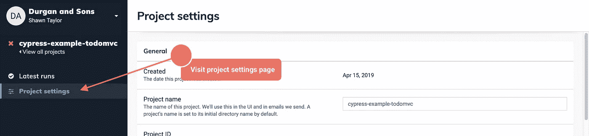

4.向下滚动到 GitHub 集成部分。

5.点击安装 Cypress GitHub 应用程序按钮。

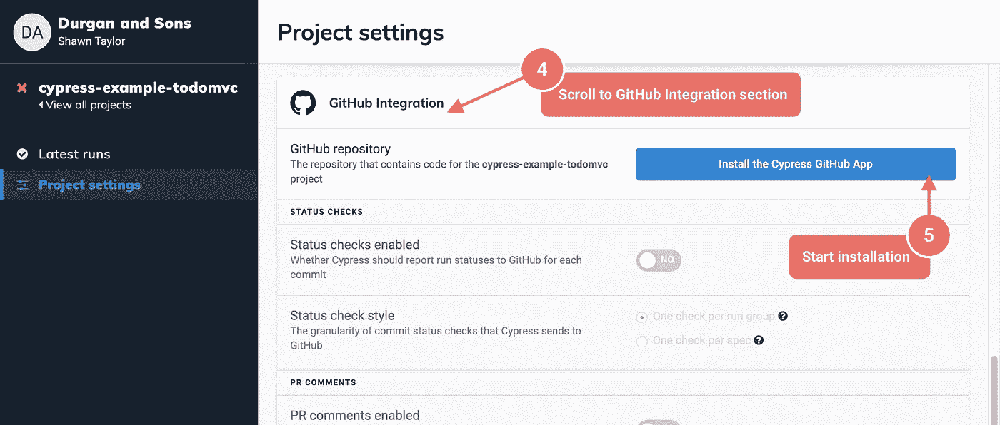

## Cypress GitHub 应用程序安装流程

一旦你通过 Cypress 组织的设置或[项目的设置](https://docs.cypress.io/guides/dashboard/github-integration#Install-via-project-settings)开始 GitHub 应用程序的安装过程[，你将被引导到 GitHub.com 完成安装:](https://docs.cypress.io/guides/dashboard/github-integration#Install-via-organization-integration-settings)

1.  选择所需的 GitHub 组织或帐户，以与您的 Cypress Dashboard 组织集成。

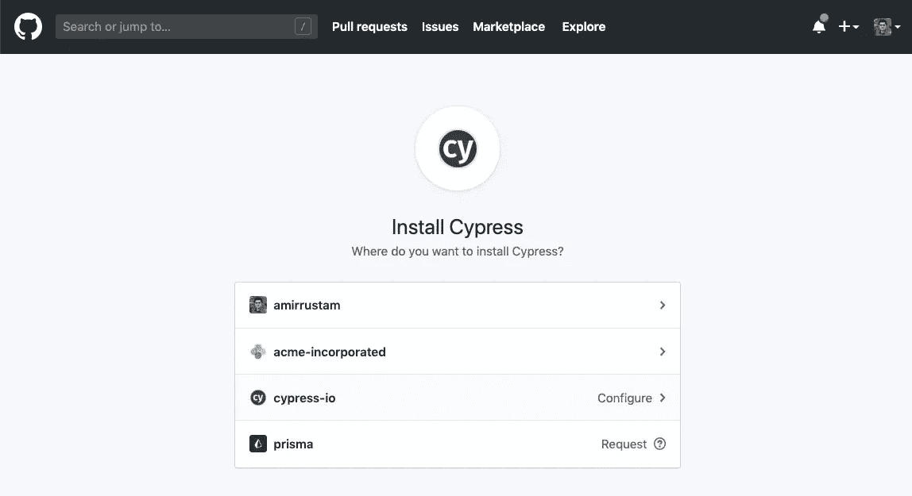

2.选择将所有存储库或仅选择 GitHub 存储库与您的 Cypress GitHub 应用程序安装相关联。

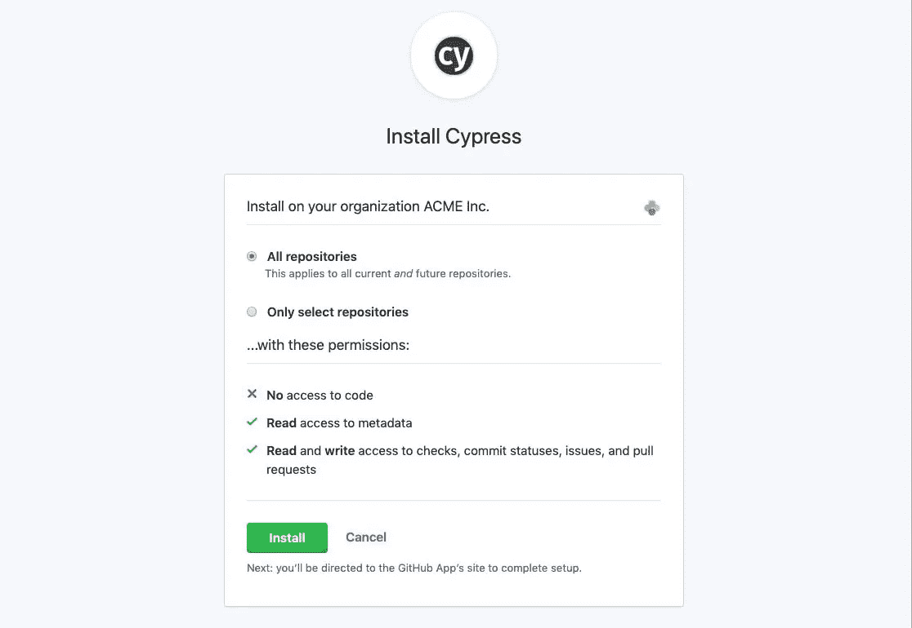

如果您选择“所有存储库”,所有当前和将来的*存储库都将包含在此安装中。*

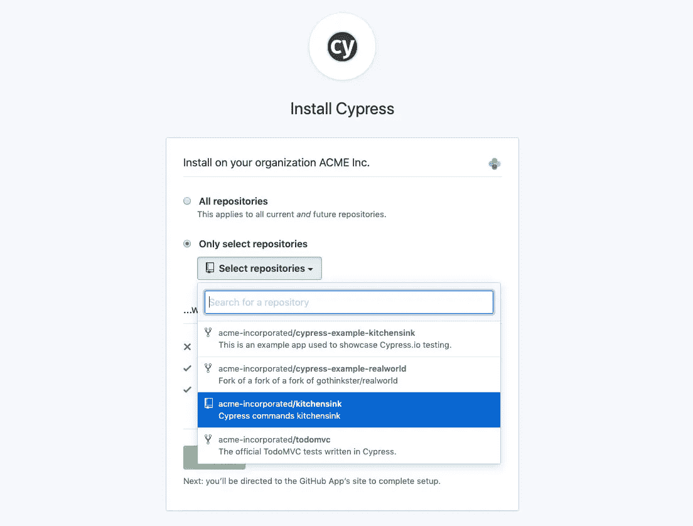

3.单击“安装”按钮完成安装。

## 为项目启用 GitHub 集成

为您的组织完成 Cypress GitHub 应用程序安装后，您现在可以为任何 Cypress 项目启用 GitHub 集成。

1.  转到项目的设置页面。


2.向下滚动到 GitHub 集成部分。

3.通过在组织的集成页面中点击所需项目的配置链接，您可以快速获得项目的 GitHub 集成设置:

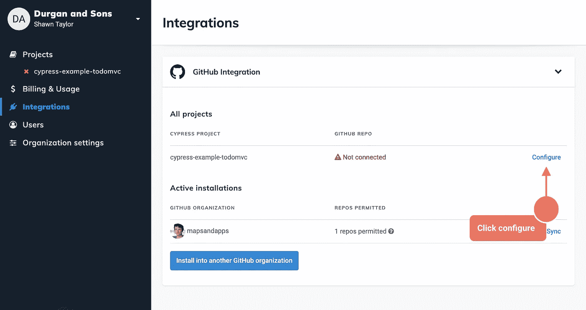

4.选择与项目关联的 GitHub 存储库。

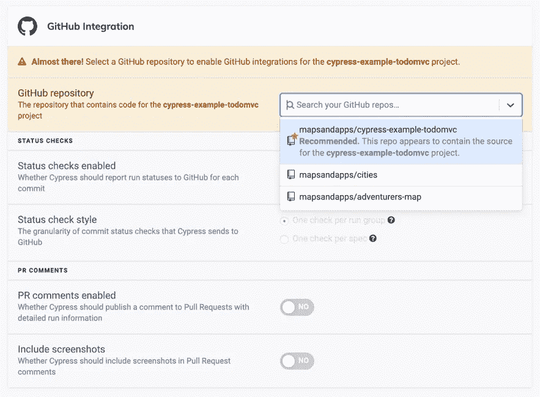

一旦 GitHub 存储库与 Cypress 项目相关联，GitHub 集成将立即启用:

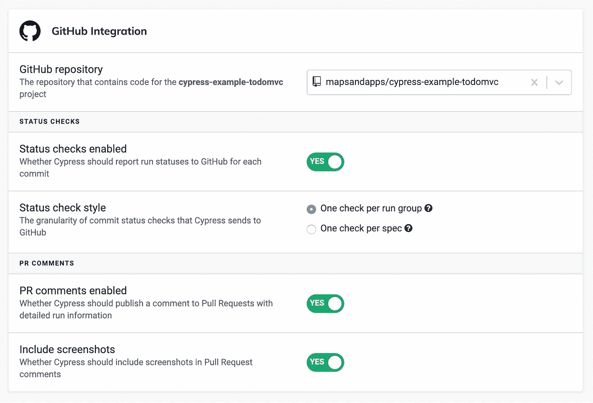

您还可以在贵组织的集成页面中查看所有支持 GitHub 集成的 Cypress 项目:

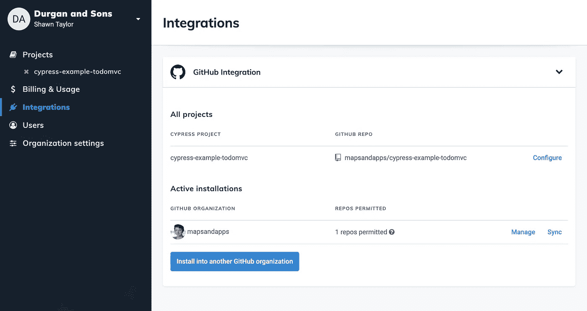

## 状态检查

如果在项目的 GitHub 集成设置中启用了状态检查，Cypress 仪表板将向 GitHub 报告 Cypress 测试状态以进行相关提交。[状态检查](https://help.github.com/en/articles/about-status-checks)有助于防止在所有 Cypress 测试通过之前，将提交或拉取请求合并到代码库的其余部分。

Cypress GitHub 应用程序以两种不同的方式报告提交状态检查:

*   每个[运行组](https://docs.cypress.io/guides/guides/parallelization#Grouping-test-runs)检查一次。

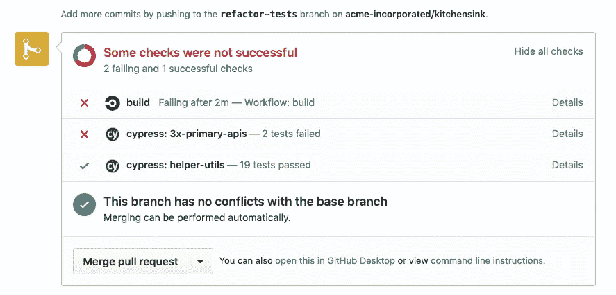

*   或者对每个规范文件进行一次检查。

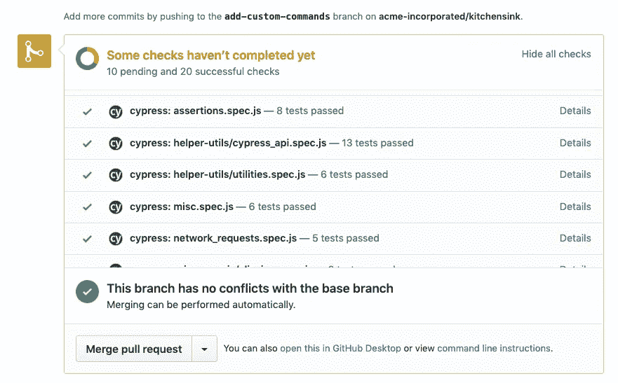

每个状态检查将报告测试失败或通过的次数，相关的详细信息链接将引导您进入 Cypress 仪表板中的测试运行页面，通过错误消息、堆栈跟踪、屏幕截图和视频记录帮助您更深入地了解问题:

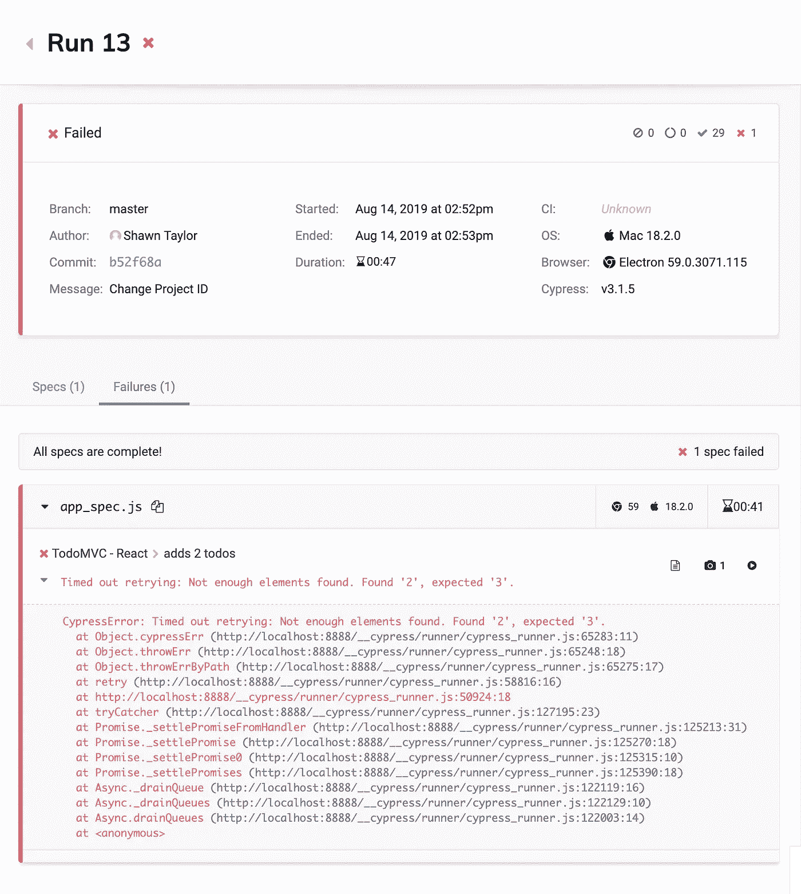

## 禁用状态检查

GitHub 状态检查是可选的，可以在项目的 GitHub 集成设置中禁用:

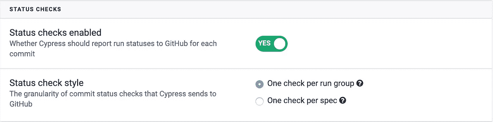

## 提取请求注释

Cypress GitHub 应用程序可以通过注释在 pull 请求中提供详细的测试信息，包括:

*   运行统计数据，如测试通过、失败、跳过和超限。
*   运行上下文详细信息:
*   相关的 Cypress 项目
*   最终运行状态(通过、失败等)
*   提交 SHA 链接到 GitHub 提交
*   运行开始和结束的时间以及持续时间。
*   操作系统版本和浏览器版本。
*   运行失败:
*   显示前 10 个失败，并带有更多失败的链接。
*   每个失败的测试链接回 Cypress 仪表板中相关的失败。
*   截图缩略图也提供了每一个失败，以方便地提供背景。

下面是 Cypress pull-request 注释的一个例子:

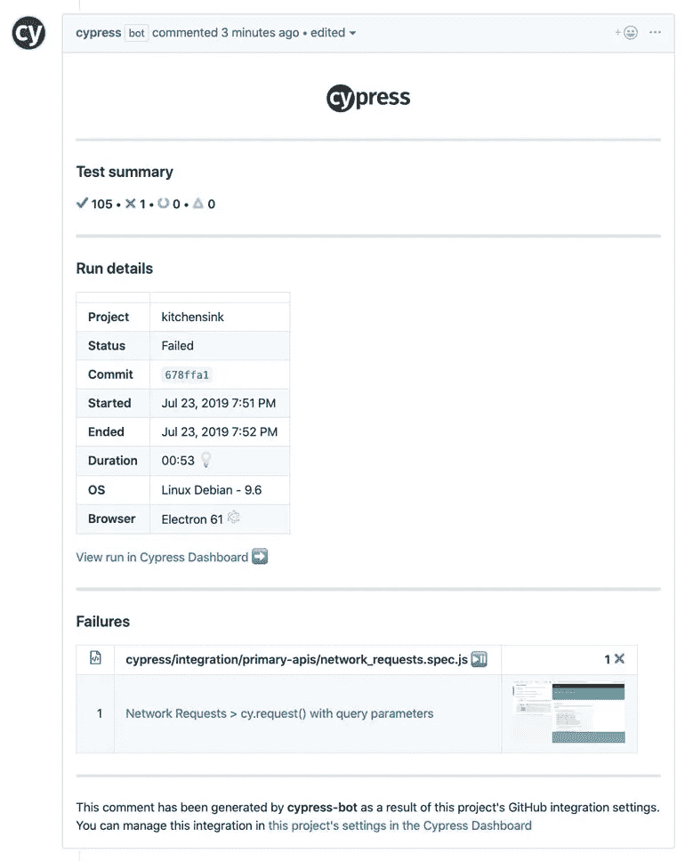

## 禁用公关评论

PR 评论和失败截图缩略图是可选的，如果在项目的 GitHub 集成设置中不需要，可以禁用:

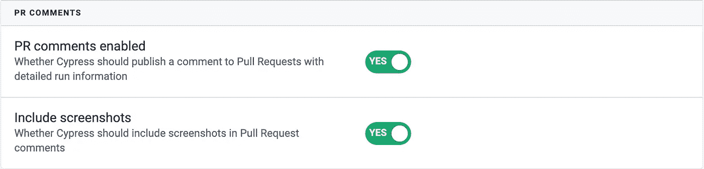

## 卸载 Cypress GitHub 应用程序

您可以通过执行以下步骤从 GitHub 卸载 Cypress GitHub 应用程序:

1.  从 GitHub 进入您组织的设置。
2.  点击已安装的 GitHub 应用。
3.  单击 Cypress 应用程序旁边的配置。
4.  单击“卸载 Cypress”部分下面的卸载。

# 松散集成

Slack 号称每天有 1200 万用户平均花 90 分钟在应用上，已经成为一个重要的交流工具——尤其是在那些依赖它进行日常协作的开发者中。今天，我们很高兴地宣布 Cypress Slack 集成:一个高质量的 Slack 应用程序，它可以在一个地方为您的 Cypress 测试提供实时结果。

无数客户已经请求使用 Cypress Slack 应用程序来改进远程协作和更广泛地了解他们的测试套件。借助 Cypress Slack 集成，团队可以轻松地:

*   通过向需要可见性的团队即时展示 Cypress 结果，改善跨团队协作
*   在推出新产品或新功能之前，确认关键测试通过
*   减少捕捉失败测试所需的时间

从我们的测试版用户那里了解一下:

> “Cypress Slack 集成使得我们的开发和 QA 团队的测试运行审查**几乎是即时的**

-邓肯·安德森，Checkfront 公司质量保证经理。

> “[Cypress]链接允许我们直接跳转到测试结果，而不必交叉检查构建号和分支名称。**在一条松弛的消息**中，对我们来说一切都很好

-Scott Abbey，高级质量保证工程师@[Homes.com](http://homes.com/)

# 准备好安装集成了吗？方法如下:

1.  [登录仪表板](https://dashboard.cypress.io/login)
2.  访问您的**组织设置**页面，点击**安装松弛集成**。您将看到一个弹出窗口，允许您选择与安装相关联的松弛工作空间和通道。

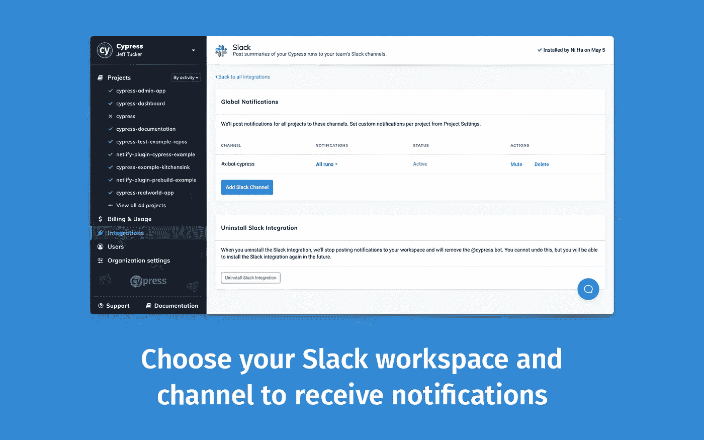

3.一旦你选择了一个频道，安装就完成了！Cypress 仪表板会将您组织中所有项目的运行结果发送到指定的可宽延时间通道。

# 吉拉一体化

高级仪表板功能

拥有[团队仪表板计划](https://cypress.io/pricing)的用户可以使用吉拉集成。

[Cypress 仪表板](https://on.cypress.io/dashboard)可以与您的吉拉工作流程集成，以实现:

*   直接从 Cypress 仪表板为给定的测试用例创建一个或多个吉拉问题。
*   查看为跨测试运行的给定测试用例创建或关联的吉拉问题的历史日志。

## 安装吉拉集成

1.  访问 Cypress 仪表盘中的集成→吉拉，点击“安装吉拉”

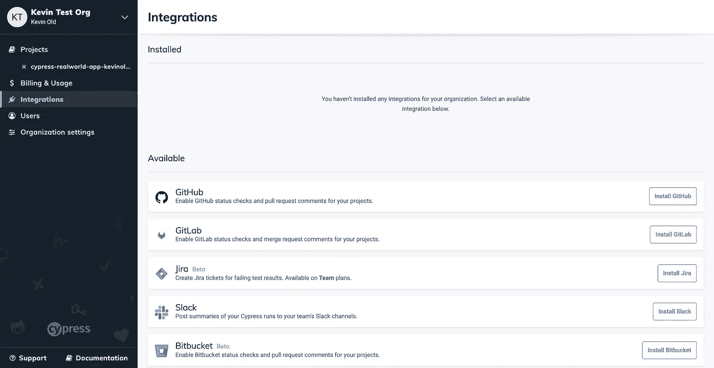

2.点击[Atlassian market place Cypress for 吉拉页面](https://marketplace.atlassian.com/apps/1224341/cypress-for-jira?hosting=cloud&tab=overview)上的“立即获取”按钮

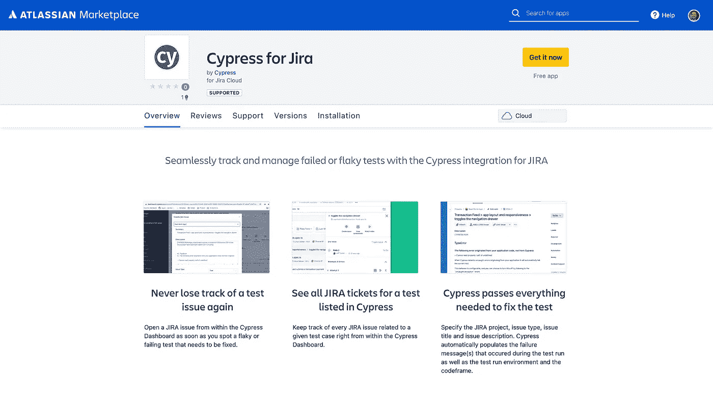

3.登录吉拉，选择一个站点来安装你的应用，然后点击“安装应用”。

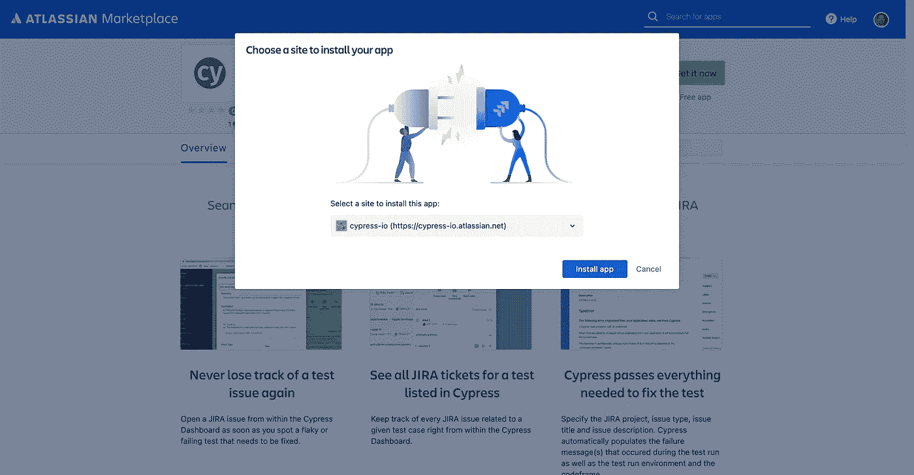

4.在“添加到吉拉”屏幕上，单击“立即获取”确认安装

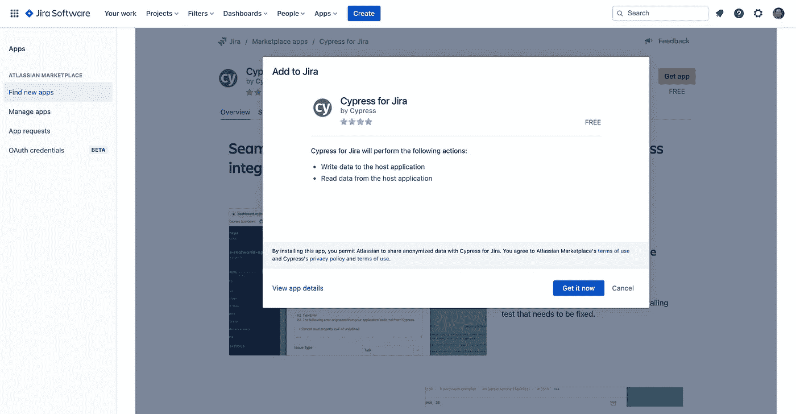

5.安装完成后，点击通知中的`Get Started`链接。

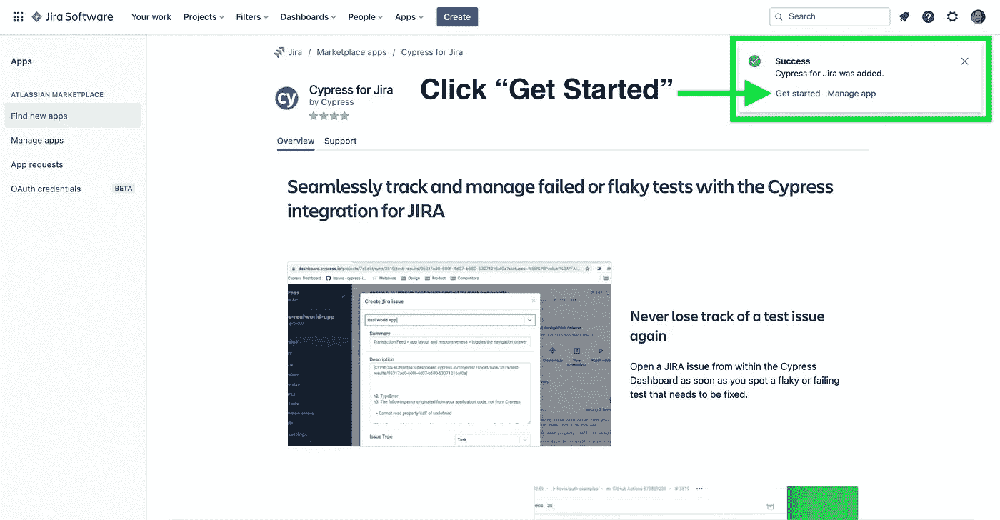

6.在下一页中，点击`Click to Finish Installation`按钮重定向到 [Cypress 仪表板](https://www.cypress.io/dashboard/)并选择 Cypress 组织进行整合。

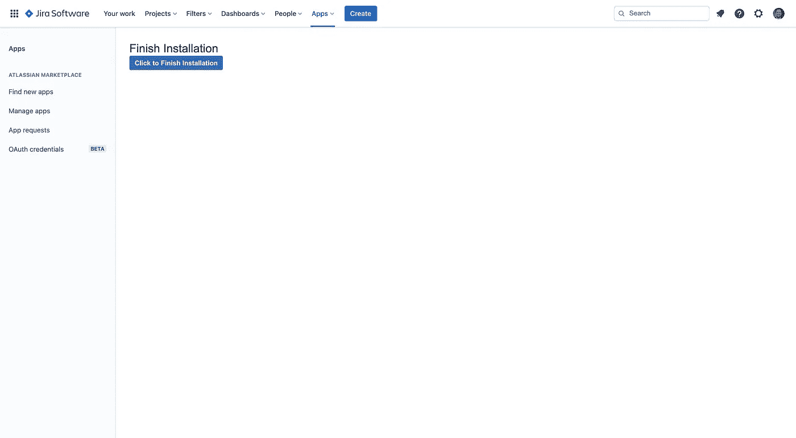

7.一旦重定向到 [Cypress 仪表板](https://www.cypress.io/dashboard/)，选择要与[Atlassian market place Cypress for 吉拉](https://marketplace.atlassian.com/apps/1224341/cypress-for-jira?hosting=cloud&tab=overview)整合的组织。

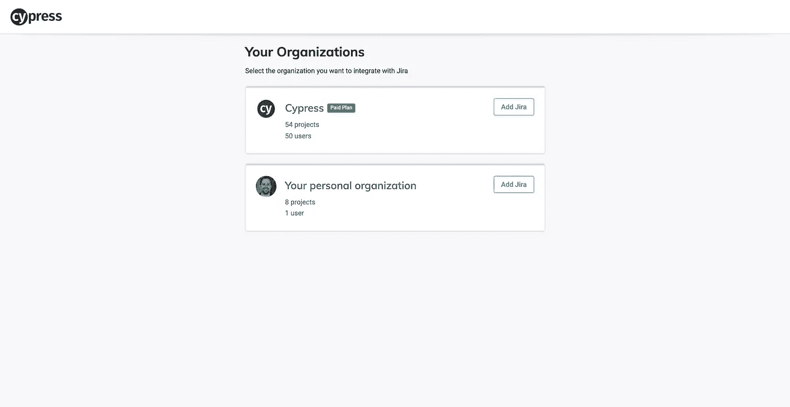

8.吉拉整合完成。吉拉整合页面上提供了允许的项目列表。

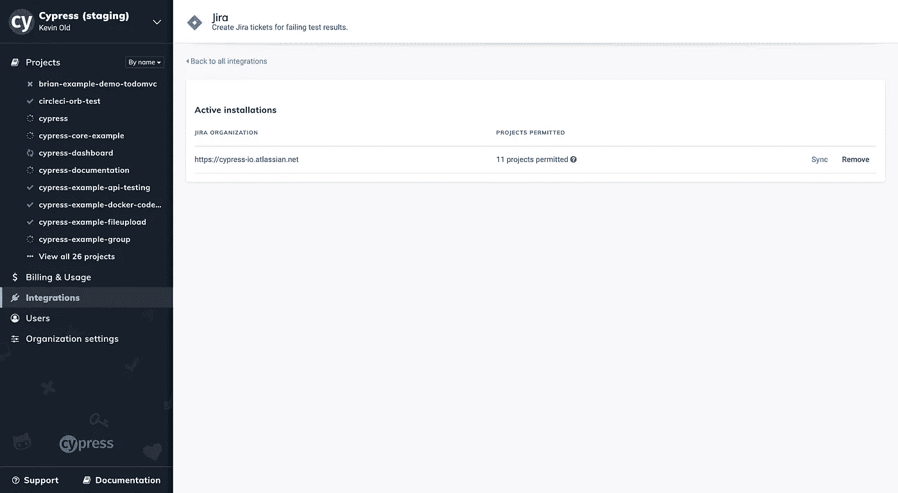

## 为测试用例创建吉拉问题

何时为测试创建问题？

通过和失败的测试都可能产生吉拉问题。最常见的用例是为失败的测试创建吉拉问题，以更好地跟踪和优先修复由吉拉工作流管理的项目中的管道故障。

让我们为失败的测试创建一个吉拉问题:

1.  在测试运行的“测试结果”视图中单击一个失败的测试，打开它的结果面板。
2.  单击结果面板中的“创建问题”按钮，这将显示为测试创建吉拉问题的表单。

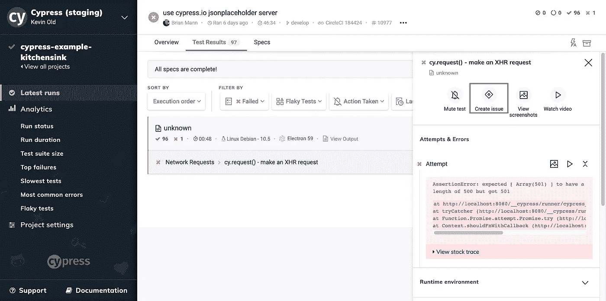

3.通过选择吉拉项目、问题类型、受让人和附加字段，完成并提交“吉拉问题创建”表单。

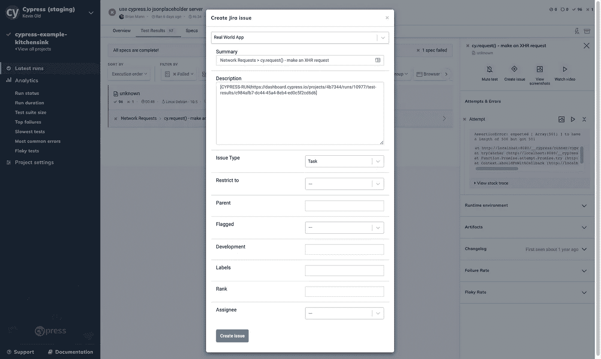

4.创建问题后，测试的结果面板中会出现一个日志和问题参考。

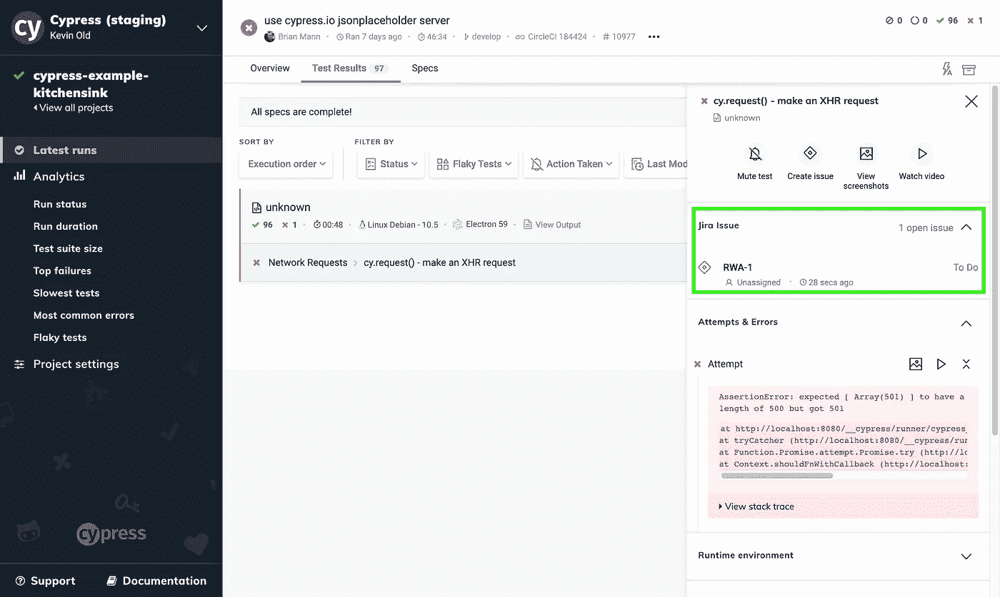

注意。

吉拉内的创建问题将包括一个链接，返回到相关测试的 Cypress 仪表板。

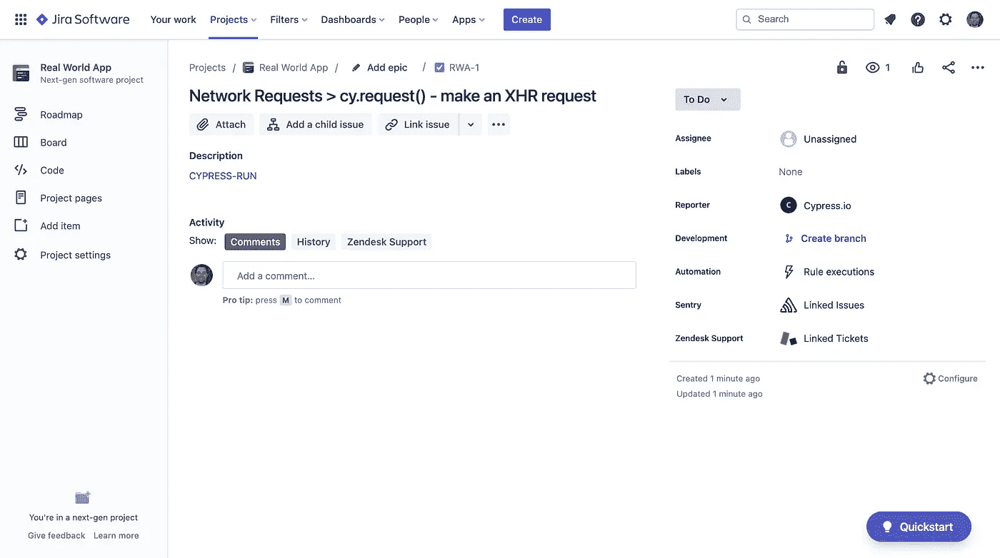

## 卸载吉拉集成

您可以通过访问贵组织的“集成→吉拉”页面来删除此集成。这将禁用从测试失败中创建吉拉问题的能力。

# GitLab 集成

[Cypress 仪表板](https://on.cypress.io/dashboard)可以通过[提交状态](https://docs.cypress.io/guides/dashboard/gitlab-integration#Commit-statuses)和[合并请求注释](https://docs.cypress.io/guides/dashboard/gitlab-integration#Merge-Request-comments)将您的 Cypress 测试与您的 GitLab 工作流集成。首先，需要建立一个项目[来将](https://docs.cypress.io/guides/dashboard/projects)记录到 Cypress 仪表板以使用 GitLab 集成。

GitLab 集成依赖于您的 CI 环境可靠地提供提交 SHA 数据(通常通过环境变量)。这对于大多数用户来说不是问题，但是如果您的 CI 设置面临 GitLab 集成问题，请确保遵循这些指南正确发送 git 信息。如果您在此之后仍有问题，请[联系我们](mailto:hello@cypress.io)。

## 安装 GitLab 集成

GitLab OAuth2 应用程序将允许 Cypress Dashboard 作为注册该应用程序的用户进行身份验证。这意味着 Cypress 可以看到你可以访问的每一个 GitLab repo。如果您希望对 Cypress 将看到的存储库进行更严格的控制，可以考虑在 GitLab 中创建一个访问权限更有限的服务帐户。

1.  访问 Cypress 仪表板中的集成→ GitLab。
2.  按照说明在 GitLab 中创建新的 OAuth2 应用程序。详见 [GitLab 文档](https://docs.gitlab.com/ee/integration/oauth_provider.html#adding-an-application-through-the-profile)。
3.  将应用程序 ID 和密码复制回 Cypress 仪表板。
4.  将您的项目连接到 GitLab repo。
5.  (可选)为每个项目配置行为。

## 配置 GitLab 集成

**提交状态**

默认情况下，cypress 将发布包含 Cypress 运行结果的 cypress/run 提交状态。这将防止你的团队合并任何没有通过 Cypress 测试的 MRs。

此外，cypress 可以发布 cypress/flake 提交状态，指示 Cypress 运行是否包含任何 flake 测试。这将防止您的团队将任何 MRs 与古怪的测试合并。

您可以在项目的项目设置页面上管理此行为。

**合并请求注释**

默认情况下，当运行完成时，Cypress 会发布一个总结运行的 MR 注释。它将包括测试计数、运行信息以及失败或不可靠测试的摘要。

您可以在项目的项目设置页面上管理此行为。

**卸载 GitLab 集成**

您可以通过访问贵组织的集成→ GitLab 页面来删除此集成。这将停止来自 Cypress 的所有提交检查和 MR 注释。

> 质量比数量更重要，一个全垒打比两个全垒打好得多。—史蒂夫·乔布斯

[](https://husseinbaashen.medium.com/subscribe) [## 每当侯赛因·巴申发表文章时，就收到一封电子邮件。

### 每当侯赛因·巴申发表文章时，就收到一封电子邮件。通过注册，您将创建一个中型帐户，如果您还没有…

husseinbaashen.medium.com](https://husseinbaashen.medium.com/subscribe)