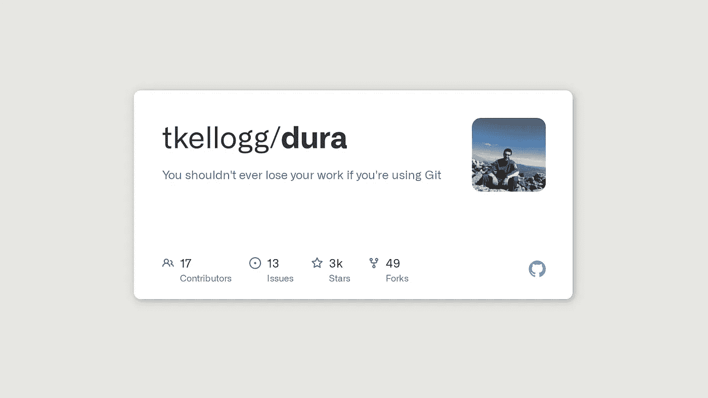
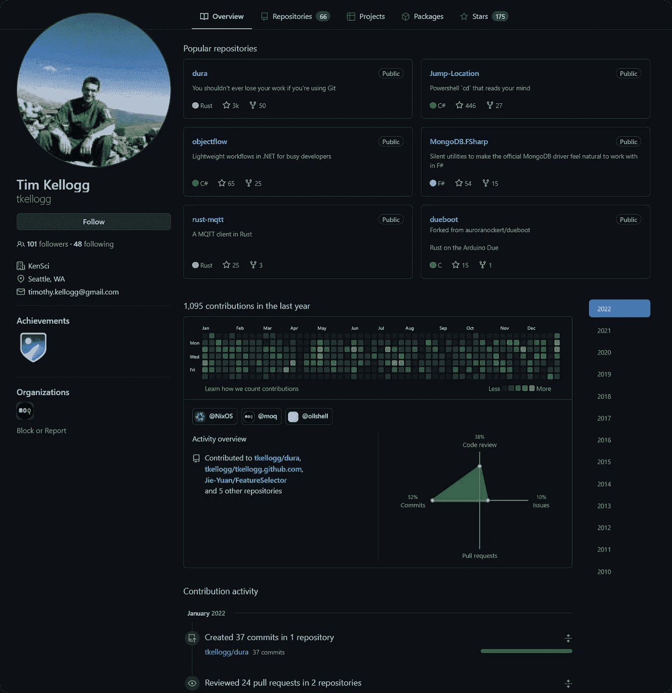
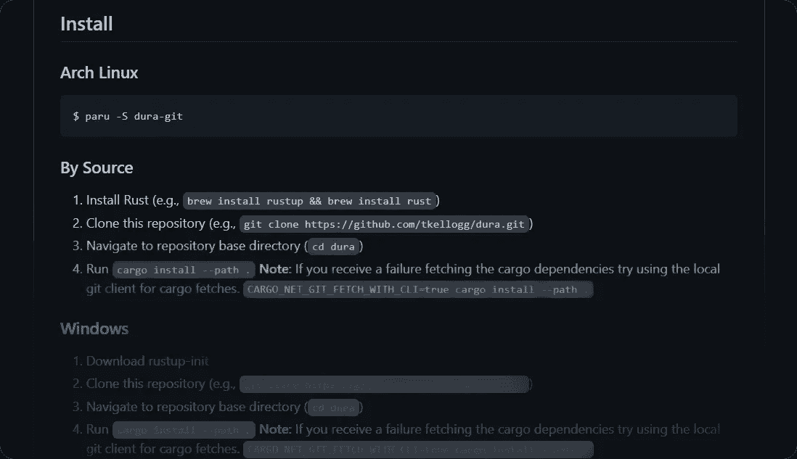

# 开发者:你的 Git 会在 2022 年改变，有了 Dura

> 原文：<https://blog.devgenius.io/what-git-professionals-will-use-in-2022-dura-73dfe4f17500?source=collection_archive---------2----------------------->

永远不要丢失*任何*代码变更，即使是未提交的…



让我向您介绍一个我相信会成为任何积极使用 Git 的开发人员中非常流行的工具。

昨晚我看到了这个，立刻就想和大家分享。

在本文发表前 8 天推出，这个工具已经在 GitHub 上获得了 3000 颗星。

它叫杜拉。

# 杜拉的创造者



蒂姆·凯洛格在 GitHub 上非常活跃

[蒂姆·凯洛格](https://timkellogg.me)是开源项目非常活跃的[贡献者。他之前在 AWS 工作，现在与一个“医生和科学家团队”一起运营](https://github.com/tkellogg) [KenSci](https://www.kensci.com/) ，为医疗保健行业利用人工智能应用。

我可以包括的[太多了](https://timkellogg.me/blog)，用一段话概括任何人的公众身份和作品总是不可能的，我想把我们的重点放在 Dura 上。也就是说，我当然会鼓励大家去看看他的推特(Twitter)来了解他的最新作品。

# 那么，什么是杜拉？

很高兴你问了！

Dura 允许您在任何时候将您的 Git 存储库恢复到之前的某个时刻，*即使您还没有提交。*

再读一遍。让它*沉*在…


[吉菲](https://media.giphy.com/media/eg3f90cy2Mc6yVRWyR/giphy-downsized-large.gif)

## 等等，代码编辑器不是这样做的吗？

嗯，代码编辑器经常自动保存单个文件，而 Dura 允许你一次恢复整个库。

在过去的一个小时内更改了存储库中的许多文件，未提交，您需要返回吗？你可以使用你的编辑器一个接一个地还原…或者 Dura 可以为你做这项艰苦的工作！

## 这解决了其他什么情况？

Dura 帮助您恢复未提交的代码更改:

*   撤销历史变得太长，甚至被限制，你不能回到以前未提交的状态。
*   计算机崩溃，编辑器丢失了以前的更改。
*   CTRL+Z 历史记录丢失，因为你不小心点击了屏幕顶部错误的 X 而关闭了文件…
*   编辑的自动保存漏掉了一个关键帧…

我喜欢杜拉的说法:

> 有了 Dura，“你可以回复到‘4 小时前’，而不是‘按下 Ctrl-Z 大约 40 次或者其他什么’。**终于，理智一些了。**——自述简介，杜拉，GitHub

# Dura 是如何工作的？


下图:Dura 使用 Git——来自[维基百科](https://commons.wikimedia.org/wiki/File:Git_icon.svg)的标志

在这一切之下，Dura 充分发挥了 Git 的潜力。它是一个后台进程，在保存文件时提交您所做的每个更改。它这样做*而不*影响您现有的头文件、分支文件或暂存文件。

Dura 监控 repo 文件夹中的每个文件更改，然后创建一个与更新相关的 Dura 管理的带时间戳的 Git 分支。Dura 有效地检查变化，大约每 5 秒钟一次。

# 如何使用 Dura

像所有好的技术一样，它使用起来非常简单。

## 启动 Dura

安装了 Dura 后(参见文章末尾)，您可以使用以下命令启动 Dura:

```
$ dura serve &
```

这将在后台运行 Dura。

## 选择要监视的存储库

Dura 不会默认监视你所有的 git 库，只有天知道你可能有多少！

相反，您可以使用以下命令告诉它您当前正在处理哪个存储库:

```
$ cd /home/repo # Go to the repo's top directory...
$ dura watch
```

## 哦，太棒了！我们回去吧

Dura 下面用的是 Git。因此，要恢复以前“未提交”的代码更改，可能是从 40 分钟前，您只需选择合适的 Dura 时间戳。

我在上面的引号中提到了未提交，因为 Dura *实际上是代表你提交到 Dura git 分支*中。这就是让你回到过去的魔法！

以下是恢复到先前时间戳的 3 个步骤:

1.  获取包含未提交变更的 Dura git 分支名称:
    `echo "dura-$(git rev-parse HEAD)"`
2.  运行`git log [dura-branch-name]`查看 Dura 跟踪的更改，找到您喜欢的时间戳。复制 Dura 提交的哈希。
3.  请 git 改用 Dura 提交！

```
$ THE_HASH=YOUR_TARGET_DURA_COMMIT_HASH$ git reset HEAD --hard
# Or, if you don't trust dura yet, `git stash`# get the changes into your working directory
$ git checkout $THE_HASH# These commands reset HEAD back to master, with changes uncommitted
$ git checkout -b temp-branch
$ git reset master
$ git checkout master
$ git branch -D temp-branch
```

现在，作为一名开发人员，我确实发现最后一步相当冗长，Dura 的新社区正在共同努力寻找一个合适的、更快的解决方案。然而，我仍然认为，杜拉回答的风险问题值得多做几个步骤。

作为一项预防措施，万一你的回购有不寻常的步骤，你应该先研究上面的每一个命令，这样你就知道它们在做什么。

# 安装 Dura

1.  我建议阅读我在“**你应该安装 Dura 吗？”**先进一步下文。在撰写本文时，Dura 正处于原型阶段。
2.  然后，当您准备好了，请遵循 Dura 主页上适合您的操作系统的 README 安装步骤。
3.  维护开源项目是一项艰苦的工作，如果你欣赏 Dura 的指导，请在这个项目上投一颗 GitHub 星吧！

[访问 Dura 主页:如何安装 Dura](https://github.com/tkellogg/dura) 🤛



[在硬脑膜上安装说明](https://github.com/tkellogg/dura#install)

# 你应该安装 Dura 吗？

我每天都建议我的客户在数字技术方面做出合适的决定。我不知道你的情况，所以我不能对你的选择负责，但是，我建议你考虑以下几点。

在撰写本文时，Dura 仅在 8 天前发布，即 2022 年 1 月 1 日。在仅仅 8 天的时间里，它已经走了很长很长的路，随着你已经看到的社区的增长，我相信它会很快变得更加稳定。

我建议在您的**非关键** Git 仓库中试用 Dura，随着时间的推移，也许几个月，Dura 将变得足够稳定，可用于生产。当我和我的团队更新这篇文章时，我一定会更新的！

这仅仅是一个开发者的观点，我当然会推荐今天查看这个[令人难以置信的开源项目](https://github.com/tkellogg/dura)，并尽你所能给予作者支持！

如果你把 Dura 用于生产或者有进一步的评论，请把它们写在下面——我很有兴趣看看你的想法！

阅读下一篇[图表 CSS 如何提高性能、设计控制和网页上图表的可访问性](https://medium.com/@mrspencehimself/charts-css-replacing-traditional-js-charting-libraries-in-2021-f7417540c5d0)。