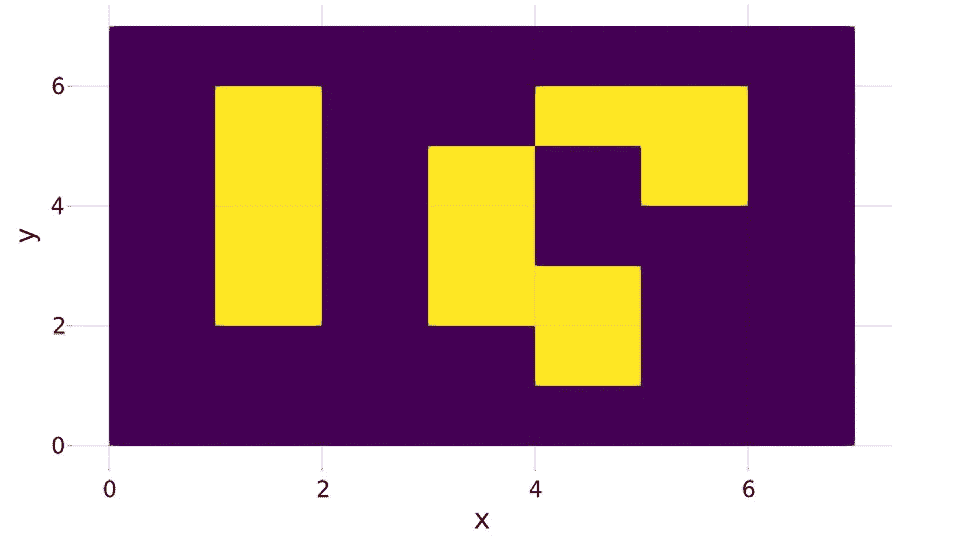

# 当这只编码恐龙遇到朱莉娅·朗时发生了什么

> 原文：<https://blog.devgenius.io/what-happened-when-this-coding-dinosaur-met-julia-lang-2bf721c40f7e?source=collection_archive---------12----------------------->

成为下一个 AppStore 百万富翁有多酷？非常酷！但是雨燕和铁锈对我来说只是好听的词。他们没有告诉我任何关于编码的事情。Python 之所以可怕，是因为它确实使用了某种毒液来工作:)

我开始用 BASIC 编程，爱上了 TurboPascal，并用 C++做了最后一个编码项目。20 年前。从那以后，我最接近编程的事情就是修复在 VBA 录制的 Excel 宏。没希望了。我永远不会成为苹果商店的百万富翁。对吗？

> 好的。我接受这一点，并把它留给孩子们来写下一部 Android 和 iOS 大片。但是我仍然渴望写一些代码。我能做些什么呢？


福斯托·加西亚在 [Unsplash](https://unsplash.com?utm_source=medium&utm_medium=referral) 上拍摄的照片

# 你好，朱莉娅！

当宇宙合谋将你带到生活中的一个新地方时，它也向你发出了暗示和信息。所以，毫不奇怪，在过去的两个星期里，两件明显没有发布的事情让我跪了下来。

**首先，**YouTube 推荐机带我看了一段视频，讲述了 [Julia Lang](https://julialang.org/) 如何成为数据科学家和 Python 程序员的下一件大事。Julia 基本上是速度和编码美感的完美结合。

其次，我正在读一本关于生物、信息流和量子物理如何相互联系的物理学/生物学书籍。在这本书里，有一个关于康威生命游戏的参考——自动机算法。这本书名叫[《机器中的恶魔》](https://amzn.to/371l1mf)作者保罗·戴维斯。

嘿，我可能老了，但我仍然可以把两件不相关的事情放在一起！所以我决定把《生活的游戏》写在朱莉娅·朗身上。

> *能有多难？对吗？*

> [*来自维基百科*](https://en.wikipedia.org/wiki/Conway%27s_Game_of_Life) *:生命游戏的宇宙是一个无限的、正方形*细胞*的二维正交网格，每一个细胞都处于两种可能的状态之一，*活*或*死*(或*有人居住*和*无人居住*)。每个细胞都与其八个*邻居 *[…]* 相互作用
> 
> 任何有两个或三个活邻居的活细胞都能存活。
> 
> 任何有三个活邻居的死细胞都会变成活细胞。
> 
> 所有其他活细胞都会在下一代死亡。同样，所有其他死亡细胞保持死亡。

很容易建立一个充满随机 0 和 1 的矩阵，运行几次，将值从 1 改变为 0 或从 0 改变为 1。

所以我们去找茱莉亚。真的很简单。你只需按照，你就可以成功了。我为我的 Anaconda 笔记本和 Atom 文本编辑器安装了它，因为在 Atom 中，我无法真正理解我需要在窗口的哪个部分写东西。我告诉过你；我是恐龙。对于 Anaconda，我使用了这个从[数据到](https://datatofish.com/add-julia-to-jupyter/)的逐步指南。

# 我在尝试编写生活游戏代码时学到的东西

## 1.Julia 中的错误消息既神秘又有用。

在过去，调试快把我逼疯了，因为一旦代码被编译器接受，一旦代码产生了不良结果，你很少知道会遇到什么问题。我需要摆弄“断点”或“一步一步”地完成程序。朱莉娅不一样。它将在大多数情况下运行代码，并在出现任何错误时停止运行。相信我，我的代码产生的停靠站比校车还多。

我喜欢的错误是 Julia 告诉你哪一行有错误。或者至少是事情停止的地方。

令人沮丧的是，你会从电脑上收到大量神秘、怪异的评论。这几乎就像试图用山谬·里维解读《黑客帝国》中的代码行。

例如，在下面的框中，我只知道我对 meshscatter 方法做了不好的事情。可能与使用的数据类型有关？还是靶场？我不知道，但我觉得电脑在试图用一种外星语言解释东西。

```
e = MethodError(AbstractPlotting.convert_arguments, (AbstractPlotting.PointBased(), 0..1, 0..1, [0  0 0 0 0 0 0 0 0 0 0 0 0 0 0 0 0 0 00 0 0 0 0 0 0 0 0 0 0 0 0 0 0 0 0 0 0 0 0 0 0 0 0 0 0 0 0 0 0 0 0 0 0 0 0 0 0 0; 0 0 0 0 0 0 0 0 0 0 0 0 0 0 0 0 0 0 0 0 0 0 0 0 0 0 0 0 0 0 0 00 0 0 0 0 0 0 0 0 0 0 0 0 0 0 0 0 0 0 0 0 0 0 0 0 0 0 0 0 0 0 0 0 0 0 0 0 0 0 0 0 0 0 0 0 0 0 0 0 0 0 0 0 0 0 0 0 0 0 0 0 0 0 0 0 0 0 0]), 0x0000000000006a68)
    No overload for MeshScatter{...} and also no overload for trait AbstractPlotting.PointBased() found! Arguments:(IntervalSets.Interval{:closed,:closed,Int64}, IntervalSets.Interval{:closed,:closed,Int64}, Array{Int64,2})

    Stacktrace:
    [1] error(::String) at ./error.jl:33
    [2] convert_arguments(::Type{MeshScatter{...}}, ::IntervalSets.Interval{:closed,:closed,Int64}, ::Vararg{Any,N} where N; kw::Base.Iterators.Pairs{Union{},Union{},Tuple{},NamedTuple{(),Tuple{}}}) at/Users/myUserNameisHere/.julia/packages/AbstractPlotting/jOgYQ/src/conversions.jl:54
    [3] convert_arguments(::Type{MeshScatter{...}}, ::IntervalSets.Interval{:closed,:closed,Int64}, ::IntervalSets.Interval{:closed,:closed,Int64}, ::Array{Int64,2}) at/Users/myUserNameisHere/.julia/packages/AbstractPlotting/jOgYQ/src/conversions.jl:48
    [4] plot!(::Scene, ::Type{MeshScatter{...}}, ::Attributes, ::IntervalSets.Interval{:closed,:closed,Int64}, ::Vararg{Any,N} where N; kw_attributes::Base.Iterators.Pairs{Union{},Union{},Tuple{},NamedTuple{(),Tuple{}}}) at/Users/myUserNameisHere/.julia/packages/AbstractPlotting/jOgYQ/src/interfaces.jl:553
    [5] plot!(::Scene, ::Type{MeshScatter{...}}, ::Attributes, ::IntervalSets.Interval{:closed,:closed,Int64}, ::IntervalSets.Interval{:closed,:closed,Int64}, ::Array{Int64,2}) at/Users/myUserNameisHere/.julia/packages/AbstractPlotting/jOgYQ/src/interfaces.jl:540
    [6] meshscatter(::IntervalSets.Interval{:closed,:closed,Int64}, ::Vararg{Any,N} where N; attributes::Base.Iterators.Pairs{Symbol,Any,NTuple{5,Symbol},NamedTuple{(:limits, :marker, :markersize, :light, :color),Tuple{GeometryBasics.HyperRectangle{3,Float32},GeometryBasics.HyperRectangle{3,Float32},Array{Vec{3,Float32},1},Array{Vec{3,Float32},1},Array{Float64,1}}}}) at /Users/myUserNameisHere/.julia/packages/AbstractPlotting/jOgYQ/src/recipes.jl:15
    [7] top-level scope at In[15]:53
```

## 2.朱莉娅就像一件宜家家具。DIY 组装。

当我终于有了正确运行和计算事物的基本代码时，我想看看我的人生游戏的棋盘。但是朱莉娅不知道如何画画。我上网安装了 [Makie](http://makie.juliaplots.org/dev/) ，一款连接到茱莉亚并教她如何画画的软件。

对我的恐龙大脑来说，这基本上是帕斯卡的“单位”概念。唯一大的区别是编码者需要在 Julia 中“使用”它之前安装它。事实上，您还需要选择下载哪个拼图块，这使得事情变得更加困难。Makie 比剧情好看吗？我用哪一个？我看到一个旧帖子，两个“单位”计划合并。他们合并了吗？在我安装 Makie 之前，所有这些基本和幼稚的问题都出现在我的脑海中。但是 Makie 也做了很好的工作，即使当我试图运行来自官方范例库的代码时，它也能抛出神秘的错误信息。

## 3.朱莉娅起初很慢

当我第一次启动代码的第一次成功迭代时，我计算了 10 个数组，每个数组有 100 个元素。具体来说:我有一个 10x10 的板，上面有 automatas 和 rand 10 代。我点击“运行”,等待大约 5 秒钟，等待事情发生。

> 我的 Pascal 代码跑得更快了！这就是他们所说的速度吗？

然而，第二次运行和所有接下来的运行都非常快。即使在我将主板增加到 100x100 或者将代数增加到 100 之后，Julia 还是很快。

## 4.2D 数组的索引很奇怪

最让我困惑的是 Julia 接受我为我的棋盘引用 2D 数组中的单个元素的方式。

在我的恐龙时代，访问 2D 矩阵的一个元素就像

> *NameofMatrix [row，column]{或类似}*

但是 Julia 只接受了一种新的索引形式(至少对我来说是新的),其中矩阵左上角的第一个元素是元素 1，右下角的元素是第[rows x columns]个元素。

我们来看一个 3x3 的矩阵:

```
MatrixName = 
[10 11 12
 13 14 15
 16 17 18]
```

为了告诉 Julia 将 MatrixName 的中间元素从 14 改为 41，您需要编写

```
​
 MatrixName[5]=41
```

在过去，它可能是这样的

```
MatrixName[2,2]=41 {or [1,1] for posh languages which start at 0’}
```

Julia 的文档承认“CartesianIndexing ”,但是我不知道我需要做什么来使它工作。

## 5.学习朱莉娅并不容易，因为…

…文档很短，论坛上到处都是交换代码和修复彼此错误的人。

文档通常是这样的:

> 函数 X 做这件事。这里有一个例子。这些都是论据。

Julia 的社区中充满了从 Python 和 Matlab 跳槽过来的数据科学家，这一事实也影响了学习曲线。他们都有使用“现代”编码语言的经验，而 dinos 没有。

# 那么，让我们看看代码



《朱莉娅》中的一代人生游戏

如果你想看更多关于代码的步骤，请点击这里:[用朱丽亚编码生命的游戏](https://medium.com/@brandlyyours/coding-the-game-of-life-in-julia-ed0dfcb4791f)

最终的工作代码是这样的

```
using Makie
using AbstractPlottingprintln(“How many generations would you like to see?”)
g=parse(Int,readline())
#readline() reads the keyboard and parse(Int,variable/value) transforms it into an integer
println(“How many columns /rows would you like to see?”)
size=parse(Int,readline())Life =round.(rand(size,size))Life=[zeros(size)’;Life;zeros(size)’]Life=[zeros(size+2) Life zeros(size+2)]scena=heatmap!(Life,colormap=:binary)
st = Stepper(scena, “generation”)
step!(st)function generation(Lifein)
 #initialize
 NewLifein=zeros(size+2,size+2)
 #Loops to apply conway’s rules
 for colJump in size+4:size+2:(size+2)*(size+2)-(size+2)-size
 for rowWalk in 0:size-1
 i=colJump+rowWalk
 sum=0
 sum=Lifein[i-8]+Lifein[i+8]+Lifein[i+7]+Lifein[i-7]+Lifein[i+6]+Lifein[i-6]+Lifein[i-1]+Lifein[i+1]
 if Lifein[i]==1.0&&1<sum<4 
 NewLifein[i]=1.0
 elseif Lifein[i]==0&&sum==3.0 
 NewLifein[i]=1.0
 end

 end
 end
 return NewLifein 
endfor counter in 1:g
 Life=generation(Life) #this generates new generation
 scena.clear #this clears the board
 scena=heatmap!(Life,colormap=:binary) # this generates new picture
 scena.strokewidth=20
 step!(st) # this saves new picture with increment name
end
```