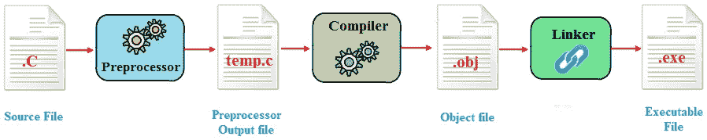
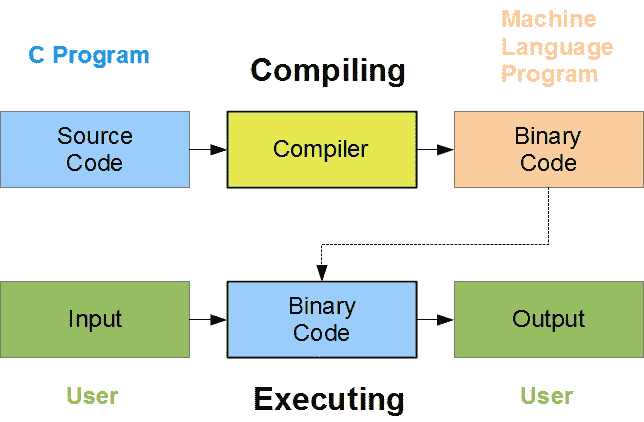
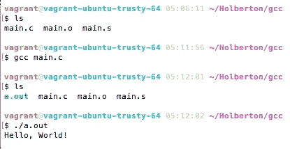

# 当你输入“gcc main.c”时会发生什么？

> 原文：<https://blog.devgenius.io/what-happens-when-you-type-gcc-main-c-4e9ec816829a?source=collection_archive---------10----------------------->

在这篇博客中，我将解释一个 C 文件变成可执行文件的整个过程。首先，你必须从定义基本概念开始，比如什么是编译器，一个. c 文件必须经历什么过程。

## 什么是编译器？

编译器是一种计算机程序，它将以一种编程语言编写的程序翻译成另一种编程语言，生成机器能够解释的等价程序。通常，第二语言是机器语言，但它也可以是中间代码(字节码)，或简单的文本。这个翻译过程被称为编译。

## 它是如何工作的

翻译过程在内部由执行不同逻辑操作的几个阶段组成。将这些阶段视为翻译器中的独立部分是有用的，并且它们实际上可以被编写为单独编码的操作，尽管在实践中它们经常被集成在一起。

编译器经历的过程

一个 C 文件要成为可执行文件，需要经过四个阶段:

1.预处理

2.汇编

3.装配

4.连接

## 1.预处理

这是源代码通过的第一个阶段。在此阶段，将完成以下任务:

注释被删除

宏名被替换为代码

头文件包含在源代码中

预处理步骤创建一个包含。一.分机。如果您运行 gcc -E main.c 命令，您可以看到预处理过的源代码，它被发送到标准输出。

## 2.收集

完成预处理阶段后，编译器的下一步是将 print.i 作为输入，对其进行编译，并生成中间编译输出或汇编代码。

编译阶段创建一个“main.s”文件。

## 3.装配

在这一阶段，print.s 文件被作为输入，并生成一个中间文件 print.o。这个文件也称为目标文件，包含机器指令。在这个阶段，只有已有的代码被转换成机器语言，像 printf()这样的函数调用没有被解析。

因为这个阶段的输出是一个机器级的文件，正如你在下图中看到的，它是完全不可读的。

## 4.连接

这是将函数调用和它们的定义链接起来的最后阶段。它创建一个输出文件，这是一个编译后的可执行文件。有了 out 文件，您就可以运行程序了。

这些都在编译过程中。下一个 blob 见。不要停止学习！