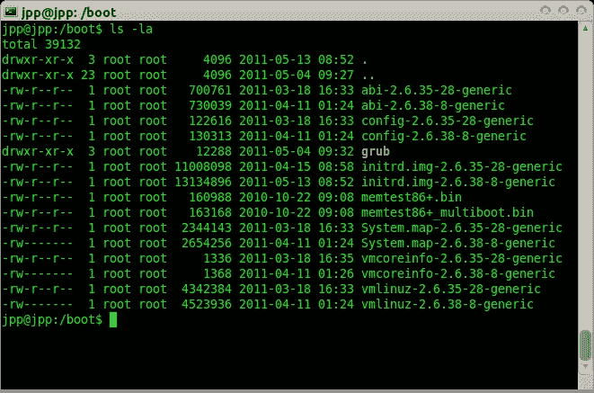

# 当您在 shell 中键入 ls -l 时会发生什么

> 原文：<https://blog.devgenius.io/what-happens-when-you-type-ls-l-in-the-shell-114ec16268d8?source=collection_archive---------10----------------------->

下面将解释系统执行命令所经历的过程，在这种情况下是基于 Unix 的过程。

首先，您必须从定义一些关键概念开始:

## 外壳:

shell 是一个通过命令行界面接受命令的应用程序。shell 允许您从内核请求操作。

## 核心

内核对于操作系统来说是一个非常重要的程序，它控制着所有其他程序，并允许软件和硬件之间的通信。

## “ls”命令有什么作用？

如果不深入研究“ls”命令是如何工作的，它能做什么？“ls”命令简单地列出了目录的内容。例如:如果在终端中键入“ls ”,它将列出所有文件:

在启动之后和运行程序之前，您可能会认为您的计算机包含了一个等待完成某件事情的进程世界。每个人都在等待事件的发生。一个事件可以是当你按下一个键或移动鼠标。或者，如果您的机器连接到网络，事件可以是通过该网络进入的数据包。

内核就是这些过程中的一个。它很特殊，因为它控制用户的其他进程何时可以运行，并且通常是唯一可以直接访问机器硬件的进程。事实上，当用户进程想要获得键盘输入、写入屏幕、读取或写入磁盘，或者做除了将位处理到内存之外的任何事情时，它们必须向内核发出请求。这些请求被称为系统调用。

正常情况下，所有的 I/o 都要通过内核，这样你就可以对操作进行编程，防止进程之间互相干扰。一些特殊的用户进程被允许穿过内核，通常是通过直接访问 I/O 端口。

**那么，我们在 shell 中键入“ls -l”到底会发生什么？** 我们可以定义流程在执行时经过的步骤序列:

1.  shell 使用“getline()”函数读取命令。Shell 主要是用 C 编程语言编写的。函数“getline()”是一个标准的 C 函数，正如您可能猜到的那样，它从给出它的地方获取行，在我们的例子中是从 shell 命令行获取。
2.  Bash 作为命令解释器检查自己的语言中是否有这样的特殊单词:shell 关键字或 shell 内置(ls 不在 shell 关键字中，那么它检查别名并用它的值替换别名)。
3.  它在 PATH env 变量指定的路径中查找 ls 可执行文件。通常是`/bin/ls.`
4.  它派生(fork())一个新进程并执行它的代码(exec())。进程 env 从父进程继承到新进程“ls”。
5.  新进程成为会话的领导者，并开始在前台工作(hit 移到后台)。
6.  打印输出并退出，发送 wait()信号，bash 父进程完全终止它。
7.  “ls”命令执行后，shell 执行关闭命令，释放内存，并重新提示用户输入。

回到本文标题的上下文，其中提到了“ls -l”，在进程找到命令后，它将继续寻找标记“-l”，对于 unix 系统，该标记用于以 ***长格式列出目录的内容。***

这就是这篇博客的全部内容，感谢您的阅读，希望对您有所帮助。如有任何问题，请通过推特 [@jcamilovillah](http://twitter.com/jcamilovillah) 和 [@oscardeleon95](http://twitter.com/oscardeleon95) 联系我们。
永不停止学习！