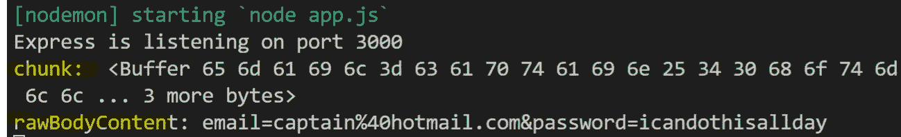
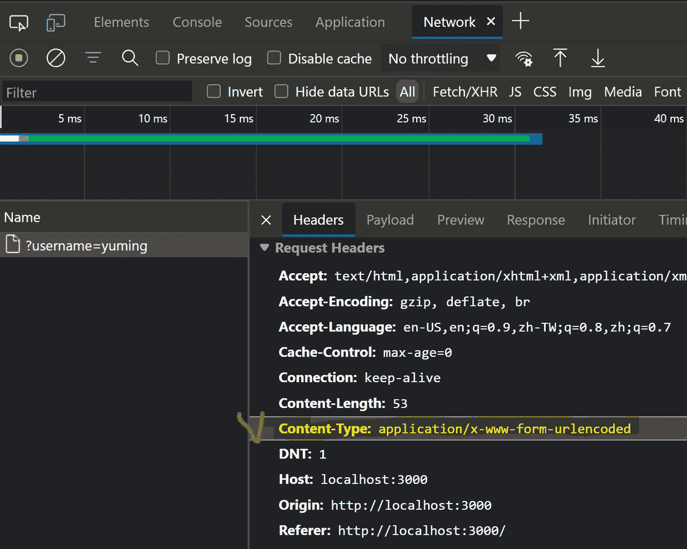
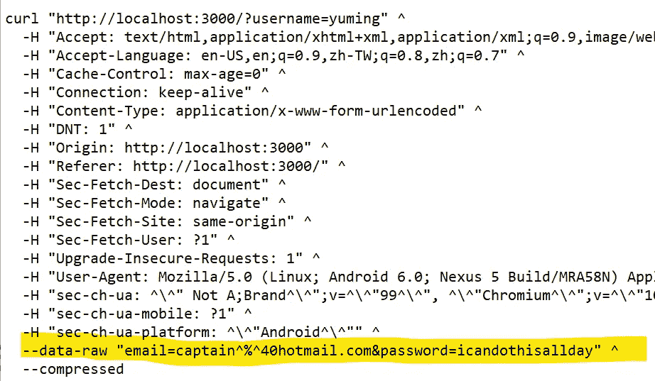

# NodeJS & Express 中中间件出现之前的 HTTP 请求体是什么样子的

> 原文：<https://blog.devgenius.io/what-http-request-body-looks-like-before-middleware-in-nodejs-express-117ab9c63701?source=collection_archive---------6----------------------->

## 查看我在[我的技术文章](https://yumingchang1991.medium.com/technical-article-structure-on-medium-954850e1ef4d)中的所有其他帖子

照片由 [Shane Rounce](https://unsplash.com/@shanerounce?utm_source=medium&utm_medium=referral) 在 [Unsplash](https://unsplash.com?utm_source=medium&utm_medium=referral) 上拍摄

# 背景

如果你没有注意到，我在台湾参加一个编码训练营，目标是作为一名 JavaScript 开发人员赚钱。

我的一个同学这周在我们的不和谐频道上发了一个问题。我不知道为什么，但我是如此着迷。

> 她问，如何检查请求体的原始数据格式？它看起来像什么？

嗯，这很有趣。

在 Node.js 和 Express framework 的帮助下，很多繁琐的任务可能在我们不知不觉中就被自动化了。我想这可能是找出答案的好时机，所以接受挑战！

# 行动

我对自己说，我不可能是人类历史上第一个问这个问题的人。答案一定在某个地方。

## 步骤 1 —开放研究

我从开放搜索开始，寻找一些可能有助于缩小范围的关键词。我非常幸运地找到了这篇关于如何在 NodeJS 和 Express 中工作的文章。它提到了流和包的概念。关于流有[官方 Node JS 文档](https://nodejs.dev/learn/nodejs-streams)。

在继续之前，一定要让自己熟悉流和包的概念。

## 步骤 2 —验证信息

现在我知道 HTTP 请求是基于从客户端到服务器的流和包的概念。

下一个问题是，**如何检索刚刚到达我们服务器的原始数据**，但是还没有被处理？

我的第一个想法是在服务器的第一个位置添加一个定制的中间件。我的意思是这个定制的中间件应该是第一个接收请求的。(如果您不熟悉中间件，请查看我的文章 [*一分钟解释快速中间件*](https://yumingchang1991.medium.com/express-middleware-explained-in-one-minute-671af8d5a3b9)

事实证明，我们可以将事件监听器添加到节点 JS 中的请求对象，以将数据包组织成完整的数据。我们只需要监听`req.on('data', handler(dataChunk))`来获取到达服务器的单个数据包。然后，监听`req.on('end', handler)`，这样我们就可以知道所有的数据包何时全部到达。

接收数据块的自定义中间件

## 步骤 3 —使用 POST 请求进行测试

太好了，我们已经准备好中间件了。我们只需要为我们的服务器创建一个 POST 请求，这样我们就可以在被`bodyParser`处理之前查看请求体的原始数据格式

发送 POST 请求的方法是使用一个接收数据的表单。这样，用户输入将通过请求体传输。我制作了一个表单，用邮件和密码发送 POST 请求，以测试我们的定制中间件。

# 结果

我们的定制中间件记录数据块和 rawBodyContent 的结果

*   Buffer 是存储二进制数据的节点 JS 中的一种数据类型。看到二进制很可怕，但这是一个好迹象，表明我们正在接近底层
*   当所有数据块到达服务器时，这些数据将从分离的二进制数据包转换成完整的数据，如上面的`rawBodyContent`所示

因此，原始正文格式的编码与查询字符串相同。难怪我们需要使用`bodyParser()`或`express.urlencoded()`作为中间件来生成可以在 Node JS 中轻松访问的内容。

# 挑战不止于此

好吧，好吧，我承认。我们发现了数据格式是什么，但似乎我们关注的是森林中的一棵树。那么我们的森林是什么？这里的大局是什么？

## 我们再深入一点，好吗？

我在挑战结束时发现了这一点。原来的问题可以简单地通过了解 HTTP 请求头中的内容来回答。在我们的例子中，让我们关注内容类型。

指定了内容类型的请求标头意味着此请求带有正文。主体中的数据是按照指定的内容类型的格式构造的。

在互联网通信的世界里，我们需要使用请求体来携带数据的时候往往是我们需要提交表单的时候。此类请求的内容类型是`application/x-www-form-urlencoded`

你看到答案了吗？说明正文中的数据是`urlencoded`。答对了。

这是我提交表单时开发工具中的网络选项卡。注意内容类型

# 奖励—从开发人员工具复制完整请求

当我们导航到开发工具->网络选项卡时，我们可以右键单击一个文件并将完整的请求复制到文本中。

下面是一个复制为 cURL (cmd)的例子。你会在底部找到携带编码信息的`data-raw`。

cURL (cmd)中的完整请求

# 参考

*   **文章**:[*body parser 如何工作？*](https://medium.com/@adamzerner/how-bodyparser-works-247897a93b90) 作者亚当·泽纳，2015 年 7 月 2 日
*   **条** : [条*条*条](https://nodejs.dev/learn/nodejs-streams)条通过节点 JS
*   **条** : [*复制请求数据*](https://blittle.github.io/chrome-dev-tools/network/request-data.html) 由 Bret 小