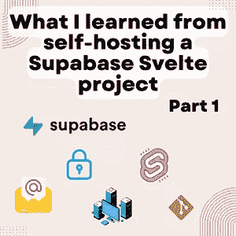
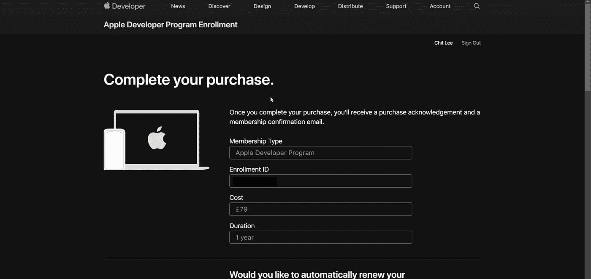
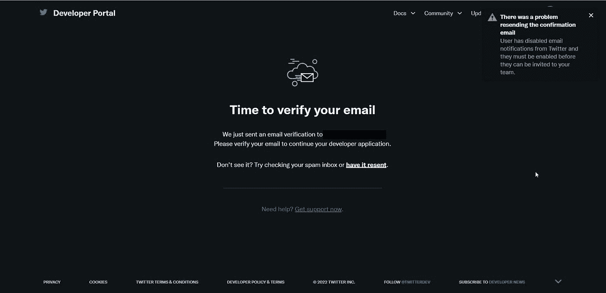

# 我从自主主持 Supabase 苗条项目中学到了什么:第 1 部分

> 原文：<https://blog.devgenius.io/what-i-learned-from-self-hosting-a-supabase-svelte-project-part-1-b253591456c9?source=collection_archive---------7----------------------->

在这篇博文中，我将谈谈我从做一个 Supabase 苗条项目中学到的东西。制作这个项目的计划在[这篇博文](https://blog.cpbprojects.me/my-plan-for-building-a-prayer-tracker-website)中有解释。我将回顾一下我在尝试该项目的不同构建模块时所克服的障碍，即自托管 supabase、设置 Svelte、启用第三方认证和电子邮件发送。



# 自托管超级数据库

Supabase 的好处是支持自主机，我不用担心限额和账单。我继续搜索[官方教程](https://supabase.com/docs/guides/hosting/overview)。我期待一个非常完整的教程，涵盖每一步，但我得到的是一个非常高层次的概述如何做到这一点，谈论架构，配置，数据库等。然后还有另外一个关于[用 Docker](https://supabase.com/docs/guides/hosting/docker) 自托管的教程。值得称赞的是，有一个非常简洁的脚本可以让 docker 运行起来，但这只是一个实践教程。本文的其余部分是对要做的重要事情的另一个高级概述。这对于有经验的开发人员来说很好，但是作为一个新的开发人员，我更希望有更好的指导。

那时候我还不知道什么是 docker-compose，我是怎么把 docker 从本地环境部署到生产环境(我的 VPS)的，怎么设置秘笈，就一直在搜索更多有帮助的教程。

幸运的是，我偶然发现了这个 [Youtube 教程](https://www.youtube.com/watch?v=0bqxrm4PnMA)，向 [Kelvin Pompey](https://www.youtube.com/@silkodyssey) 大声喊出来。他在 Digital Ocean 上演示了使用 Ubuntu 服务器自托管 Supabase 的整个过程，我能够一步一步地跟随，并重现 Supabase 后端的工作情况。我没有使用数字海洋，我使用了来自 [Oxide 主机](https://billing.oxide.host/aff.php?aff=166)的 VPS，因为我已经从托管一个 Discord bot 开始使用它们几年了，服务是可靠的。

我学会了如何设置 supabase，[如何安装 docker-compose](https://www.digitalocean.com/community/tutorials/how-to-install-and-use-docker-compose-on-ubuntu-20-04) 以及 docker-compose 启动`docker-compose.yml`文件中的进程，并在部署 Supabase 之前更新`.env`文件中的秘密。

# 设置纤细的前端

既然我已经设置了后端，我想要一些前端代码来测试后端是否工作。我最初想做一个 React 应用程序，因为它非常受欢迎。但是我发现了一个官方维护的待办事项应用程序,因为它非常类似于一个祈祷追踪器，所以我决定使用它作为框架代码，并在此基础上进行构建。

代码在 [Supabase repo](https://github.com/supabase/supabase) 内，Supabase repo 很庞大，所以我不想克隆整个东西，只克隆我需要的部分。

# 仅克隆回购的一部分

这是我从《T21》杂志上了解到的。我们需要最新版本的 git，一开始我失败了，因为我用的是旧版本的 Git，不支持稀疏校验。

我将使用 Supabase repo 作为一个例子，`--depth 1`标志阻止 git 克隆文件夹中的任何文件。并且`--filter=blob:none`会过滤掉所有 blobs(文件内容),直到 git 需要为止，而`--sparse`只是告诉 Git 您计划稍后进行 git checkout。

然后我们`cd`进入目录，并稀疏检出，用`set`作为我们要检出内容的路径。

```
git clone --depth 1 --filter=blob:none --sparse https://github.com/supabase/supabase cd supabase git sparse-checkout set examples/todo-list/sveltejs-todo-list
```

然后，我只需要运行`npm install`来安装依赖项，运行`npm run dev`来运行 Svelte 项目。我还安装了`nvm`来管理 Node js 的版本。

我还需要更新`.env`文件来粘贴 Supabase 主机地址，以及 Supabase 中使用的`anon_key`。附注:我第一次使用 Supabase 时使用的是默认凭证，当我更改凭证时，数据库不再识别我，在我更新`.env`凭证后，我不得不做`docker-compose down --volumes`来重置一切。

# 启用第三方身份验证

[Supabase 支持第三方认证](https://supabase.com/docs/guides/auth)，它通过识别电子邮件地址来实现这一点。假设你在谷歌和脸书上使用了同一个电子邮件地址`example@example.com`，用任何一个登录都会让你登录到同一个账户。

这些第三方使用认证标准开放认证(OAuth)。OAuth 是一种协议，允许应用程序访问用户信息，而不需要他们的密码。这使得用户可以安全地与第三方应用程序共享他们的信息，从而最大限度地降低安全漏洞的风险。

基本上，该应用程序不会使用密码来识别用户，而是问谷歌:“你信任这个人吗？”。如果谷歌信任他们，应用程序也会信任他们。

为此，我们必须在 OAuth 提供者上创建一个帐户。我可以为谷歌和脸书做这件事。对于苹果来说，OAuth 要求我创建一个苹果应用程序，而这个应用程序被锁在付费墙后面。我需要每年支付 79 英镑来访问它，所以我不会使用它。



# Twitter OAuth 的问题

当我试着在 Twitter 上这么做时，最有趣/最烦人的问题发生了。在注册页面上，有一个按钮询问我是否要接收他们的营销邮件，我说不。然后他们说他们已经向我的电子邮件帐户发送了一封确认邮件，我没有收到，所以我单击了重新发送。猜猜他们说了什么:“重新发送确认邮件时出现问题，用户已经禁用了来自 Twitter 的电子邮件通知…”。我检查了我的 Twitter 设置，电子邮件通知已经打开。



然后，我在另一个 Twitter 帐户上注册了 Twitter 开发者帐户，这次勾选了营销电子邮件字段，这次我能够获得确认屏幕并完成它。所以我认为这就是问题所在。最有趣的是，我无法解决这个问题，我无法在 Twitter 开发者页面上找到重新启用营销电子邮件的设置。

# 电子邮件发送

对于电子邮件发送，最初我认为我可以从我的 VPS 发送电子邮件。所以我搜索了*如何通过 VPS* 发送电子邮件。每个结果都使用 Gmail 或另一个管理电子邮件服务，显然，我们不能简单地使用 VPS 发送电子邮件，我需要一个叫 SMTP 服务器的东西。

所以我继续搜索如何在 VPS 上托管 SMTP 服务器。我发现[有一篇文章](https://www.socketlabs.com/blog/setup-smtp-server/)说托管一个邮件服务器就像建造一架喷气式飞机，这篇文章不值得信任，因为它来自一家电子邮件发送公司，而且他们有金钱上的动机来说这句话。我想找一些开源的解决方案，我可以一步安装完成，但是没有。因此，我认为这篇文章是正确的，我放弃了制作自己的 SMTP 服务器。

我必须找到一个电子邮件发送服务。我看了不同的，SendInBlue 有最大的免费邮件发送限额，每天 300 封，这意味着每月 9000 封。当然，这是假设每天有 300 人注册，这是极不可能的，这个数字通常是波动的。尽管如此，这是最大的配额，所以我和他们一起去了。

# 结论

在这篇博文中，我谈到了创建 Supabase Svelte 项目的过程。包括我在自托管 Supabase、设置 Svelte、启用第三方认证和发送电子邮件时面临的挑战。我还想谈谈路由、SSL、域名和 web 浏览器内部的存储信息，但我意识到这篇文章已经很长了。我已经决定在这篇博文的第二部分写下它们。敬请关注。

*最初发布于*[*https://blog . cpbprojects . me*](https://blog.cpbprojects.me/what-i-learned-from-self-hosting-a-supabase-svelte-project-part-1)*。*