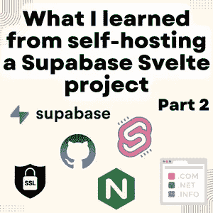

# 我从自主主持 Supabase 苗条项目中学到了什么:第 2 部分

> 原文：<https://blog.devgenius.io/what-i-learned-from-self-hosting-a-supabase-svelte-project-part-2-6fe68c15e2d?source=collection_archive---------9----------------------->

在[第 1 部分](https://blog.cpbprojects.me/what-i-learned-from-self-hosting-a-supabase-svelte-project-part-1)中，我们讨论了自托管 supabase、设置 Svelte、启用第三方认证和电子邮件发送。在这篇博文中，我将谈谈我对路由、SSL、域名、本地存储以及使用 GitHub 页面托管 svelte 的了解。

# 使用 Nginx 路由

目前，有很多程序运行在我的 VPS 的各个端口上。Supabase studio 运行在 3000 上，Svelte 运行在 5173 上，PostgreSQL 运行在 5432 端口上，Kong 运行在 8000 和 8443 上分别用于 HTTP 和。我如何将想要连接到我的前端(苗条)的用户带到端口 5173，并保护我的 Supabase studio？

答案是路由，我们可以设置一个路由器或反向代理，接收从 HTTP 和 HTTPS 连接的用户，即端口 80 和端口 443，并将他们路由到端口 5173，我的苗条前端。为此，我将使用 Nginx，因为这是最流行的一种。在下文中，我将总结一下我是如何让它工作的，如果你想要更详细的解释或代码示例，我推荐你看看来自 Linode 的这篇文章，我发现它很有帮助。

在 Nginx 中，我们创建一个`server`来监听单个端口，然后我们告诉它如何基于`location`进行重定向。位置是域名后的 URL 路径，`example.com`的位置是`/`,`example.com/terms/`是`^terms/(.*)$`。然后在这个位置，我们可以要求它重定向到某个端口，比如`proxy_pass http://localhost:5173`，这将把从这个位置的这个端口连接的用户重定向到这个地址。

对于 Nginx 来说，一件重要的事情是我们必须配置哪些规则是活动的。有一个目录叫`sites-available`，还有一个叫`sites-enabled`。我们要做的是在`sites-available`中配置设置，然后创建一个指向`sites-enabled`目录的符号链接。然后我们必须重启 Nginx 服务来应用更改。要做的一件重要的事情是取消你不使用的网站的链接，我曾经忘记取消默认规则的链接，并且想知道默认规则是如何应用这么久的。

# 获取 SSL

之后，我们可以重定向 HTTP 流量，但如果我们想要 HTTPS 流量，我们需要一个 SSL 证书。它们提供可信度并加密流量。有 3 种方法可以获得证书:

1.  从可信的证书颁发机构(CA)购买，费用从每年 5 英镑到谁知道多少不等
2.  让一个像 [Cloudflare](https://www.cloudflare.com/ssl/) 这样的代理为你做这件事，用户将使用证书连接到 Cloudflare，然后 Cloudflare 将流量重定向到你的站点，用户看到来自 Cloudflare 的证书。这是免费的个人或爱好项目。
3.  使用像 [Certbot](https://certbot.eff.org/) 这样的服务来生成你自己的证书，它会为你生成证书，你不需要支付一分钱。但是缺点是你必须自己配置。

我选择了 Certbot，因为它是免费的。[网站](https://certbot.eff.org/)包含非常详细的安装说明。拿到之后，我需要配置 Nginx 使用证书，将 HTTPS 流量重定向到我的前端，要求 HTTP 流量升级到 HTTPS 流量。

# 域名

然后，我需要一个域名为我的网站，你可以认为域名基本上是一个网站的链接。我查看了提供免费 1 年 Github 学生包的三家提供商，即 *Namecheap* 和*。技术*。我分析了他们提供的服务，以及 1 年免费试用后域名的价格。Namecheap 有免费试用后最便宜的域名，所以我决定用它。

现在，我必须将其配置为将流量从域名重定向到我的 VPS 的 IP 地址。有不同类型的记录，你最可能使用的是 A 记录或 CNAME 记录。 *A 记录*允许您将域名或子域与 IP 地址相关联， *CNAME* 记录允许您将域名或子域指向主机名。

我将我想要的子域指向我的 VPS 的 IP 地址，然后将该域的 www 版本指向没有 www 部分的域。

# 存储数据

对于网站的加密功能，我希望人们能够在本地生成一个加密密钥，并将其存储在本地。所以他们上传到服务器的数据会被加密。这使得即使网站遭到黑客攻击，黑客也无法读取加密内容。

用户不想每次访问网站时都输入密钥，我需要一种在本地存储加密密钥的方法。我本来想用 cookies 来完成这个任务，但是后来我发现，对于每个请求，cookies 都会被发送回 web 服务器，这一点也不安全。于是我搜索了一下，现在的浏览器都有本地存储，那里的信息不会发送到 web 服务器，所以我决定用。

它非常容易使用，向本地存储器写东西，你做`localStorage.setItem("name", "Chris");`，读东西，你做`let myName = localStorage.getItem("name");`。

# 苗条可以静态托管

我不知道我怎么不知道这一点，我一直认为 Svelte 必须在 VPS 上托管，可能是因为我以前开发过 Django 应用程序，它们需要一个专用的主机。我发现这一点是因为我和一个朋友谈论我如何购买 VPS 来托管网站，他问我为什么不使用 Github 页面。我说网站需要托管，但他说不需要。我调查了一下，发现他是对的！苗条不一定要动态托管。当我们运行`npm run dev`时，它运行开发者版本，这是动态托管的，因为它对变化做出反应。但是如果我们做了`npm run build`，页面就建立了，并且有了`dist`目录。然后我们可以通过任何静态站点主机进行部署，包括 Github 页面。

GitHub 页面可用于免费帐户的公共存储库和专业帐户的私有存储库，这是我从 GitHub 学生包中获得的。此外，GitHub 是一个大网站，所以我相信加载前端非常快，因为他们会有很好的内容交付。安全性也不是一个大问题，因为只有前端托管在那里，重要的数据保存在后端。因此，我将使用 GitHub 页面来托管我的网站。

# 在 GitHub 页面上托管

要在 GitHub 页面上托管，如果我们想使用用户 Github 页面(`username.github.io`)，而不是`username.github.io/reponame`，我们需要在存储库中拥有名为`username.github.io`的网站。然后我们可以控制部署什么，我们可以建立一个 GitHub 工作流，这是 GitHub 自动为你做一些事情，或者只是从一个分支部署。

为了自动化这个过程，有一个名为 [gh-pages](https://www.npmjs.com/package/gh-pages) 的 npm 包。它使您能够将构建的新版本部署到一个新的分支，该版本位于用于苗条项目的`dist`文件夹中。然后，如果您配置您的 GitHub 页面来部署这个分支，它将会被自动部署。

有一些重要的事情要设置。我们必须在`package.json`中配置 GitHub 页面网站的主页，以及设置一个名为`deploy`的新运行配置，它运行`gh-pages -d dist`。如果我们使用自定义域名，我们还需要在`public/`目录下创建一个`CNAME`文件，内容是自定义域名。然后当我们运行`npm run build`然后`npm run deploy`时，我们的 GitHub 页面将被部署。

# 结论

在这篇博文中，我讨论了自己主持 Supabase 苗条项目的经历。我介绍了用 Nginx 设置路由、用 Certbot 获得 SSL 证书、用 name price 保护域名以及在 GitHub 页面上托管项目。总的来说，我发现自己主持我的项目是一次宝贵的学习经历，它让我对虚拟主机和相关工具有了更深入的了解。

*原发布于*[*https://blog . CPB projects . me*](https://blog.cpbprojects.me/what-i-learned-from-self-hosting-a-supabase-svelte-project-part-2)*。*