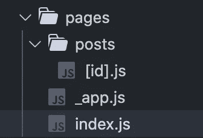
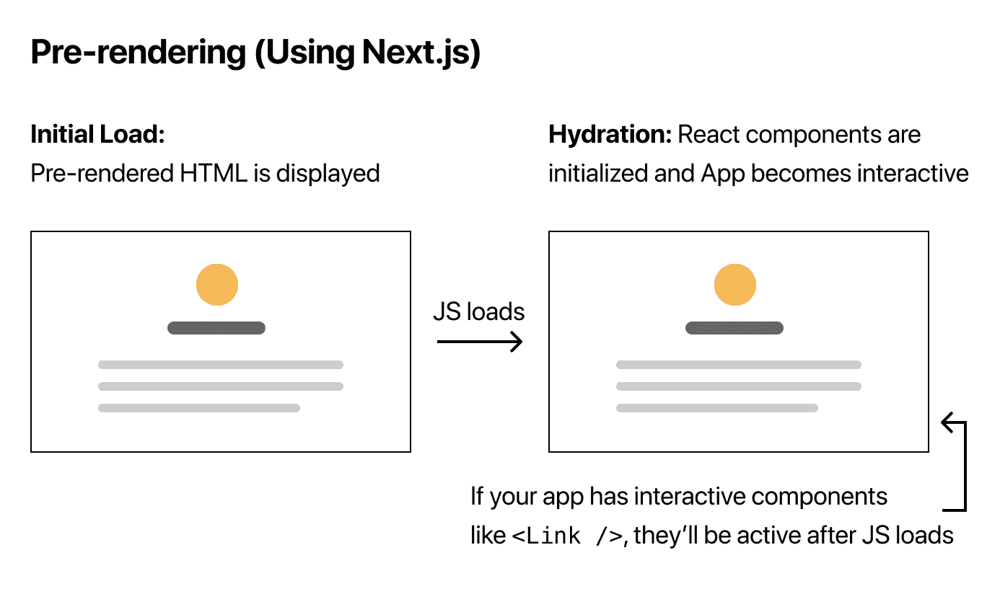
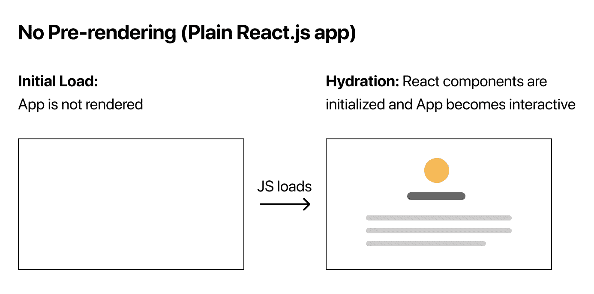

# 我从 Create a Next.js 应用程序教程中学到了什么

> 原文：<https://blog.devgenius.io/what-i-learned-from-the-create-a-next-js-app-tutorial-1f506b56173d?source=collection_archive---------4----------------------->

## Next.js 路由、样式、预渲染和部署简介

卢卡斯·莱特纳在 [Unsplash](https://unsplash.com?utm_source=medium&utm_medium=referral) 上拍摄的照片

自从学习 React 以来，我一直在我所有的个人项目中使用 create-react-app。我喜欢建立一个样板应用程序并马上开始编码是如此简单。最近，我有一种冲动，想把我的 React 技能提升到一个新的水平，这是我偶然发现 Next.js 的时候。

根据[维基百科](https://en.wikipedia.org/wiki/Next.js)， *Next.js 是一个开源的 React 前端开发 web 框架，支持诸如服务器端渲染和为基于 React 的 web 应用程序生成静态网站等功能。*

在他们的网站上，他们有一个入门教程，通过建立一个博客来教我们如何使用 Next.js 的基础知识。你可以在下面看到我的最终产品，在这里查看源代码。

 [## Next.js 示例网站

### 了解如何使用 Next.js 构建个人网站

nextjs-blog . Chad muro . vercel . app](https://nextjs-blog.chadmuro.vercel.app/) 

在这篇文章中，我想分享我从这个教程中得到的一些东西，并给你一个 Next.js 的高层次概述。

# 为什么要用 Next.js？

我决定学习 Next.js 的主要原因是因为预渲染。在研究了服务器端渲染和客户端渲染之后，我发现了总是使用 create-react-app 的一些缺点。不要误会我的意思，我认为 create-react-app 非常棒，我肯定会在一些应用程序中使用它。然而，如果你正在构建一个应用程序，并且需要良好的 SEO 和性能，Next.js 是一个不错的选择。

根据他们的网站，其他好处包括:

*   *基于页面的直观路由系统(支持动态路由)*
*   *预渲染，静态生成(SSG)和服务器端渲染(SSR)均支持每页渲染*
*   *自动代码分割加快页面加载速度*
*   *优化预取的客户端路由*
*   *内置 CSS 和 Sass 支持，支持任何 CSS-in-JS 库*
*   *支持快速刷新的开发环境*
*   *使用无服务器功能构建 API 端点的 API 路由*
*   *完全伸展*

# 按指定路线发送

如果您以前使用过 react-router，那么您应该熟悉客户端导航。对于 Next.js，这是内置的，设置路线很容易。如果您使用 create-next-app，您的应用程序中将会有一个 pages 目录。在 pages 目录中创建的任何文件都将自动成为 URL 路径。

您还可以使用嵌套文件夹结构来嵌套路由，并使用括号语法来动态路由。

例如:

*   `pages/index.js`与`/`路线相关联
*   `pages/posts/first-post.js`与`/posts/first-post`路线有关

# 式样

在设计 Next.js 应用程序时，有许多选项可供选择。

Next.js 内置了对 CSS 和 Sass 的支持。您可以使用 CSS 模块，这是一个 CSS 文件，其中所有的类名都有作用域。任何全局样式都可以添加到连接到 _app.js 文件的 global.css 文件中。应用程序组件是一个特殊的顶级组件，在应用程序的所有页面中都是通用的。

如果你想使用 Sass，你需要做的就是安装‘Sass’并将`.css`文件改为`.scss`或`.sass`文件。

Next.js 还内置了对 styled-jsx 的支持，或者您也可以使用其他 CSS-in-JS 库。还支持 Tailwind，如果你也想使用的话，这是一个流行的 CSS 框架。

# 预渲染

预渲染是 Next.js 中最重要的概念之一，也是我决定学习它的原因。默认情况下，Next.js 会预先呈现每个页面。这意味着它将预先为每个页面生成 HTML，而不是由客户端 JavaScript 来完成。这导致更好的性能和搜索引擎优化。与之相比，create-react-app 在 JavaScript 加载之前不会显示任何应用程序。

下面是预渲染和无预渲染的对比示例。

[https://nextjs.org/learn/basics/data-fetching/pre-rendering](https://nextjs.org/learn/basics/data-fetching/pre-rendering)

[https://nextjs.org/learn/basics/data-fetching/pre-rendering](https://nextjs.org/learn/basics/data-fetching/pre-rendering)

Next.js 中有两种形式的预渲染。

*   静态生成—在构建时预呈现页面
*   服务器端呈现—在每次请求时预先呈现页面

Next.js 的好处是您可以为每个页面选择使用哪种预渲染方法。尽可能推荐静态生成，因为它会让你的应用运行得更快。

使用静态生成时，如果需要获取外部数据，可以使用`getStaticProps`来完成。这是一个异步函数，将在构建时运行。它告诉你的应用程序，在预渲染页面之前，你需要先获取函数内部的数据。下面是一个例子。

如果您的应用程序中有动态路线，并且每条路线都依赖于外部数据，您可以使用`getStaticPaths`功能。getStaticPaths 是另一个异步函数，它将返回动态路由的可能值列表。

谈到预渲染，有很多内容需要介绍，我可能会在以后的文章中介绍。目前，我希望您至少对 getStaticProps 和 getStaticPaths 有一个基本的了解。

**getStaticProps** —用于从外部 API 端点获取数据。Next.js 将在构建时使用返回的属性预先呈现页面。

**getStaticPaths** —如果页面有动态路由并使用 getStaticProps 时使用。它将定义一个在构建时必须呈现给 HTML 的路径列表。

# Vercel 上的部署

过去，我使用 GitHub Pages、Heroku、Netlify 和 Firebase 来部署我的应用程序。在很大程度上，这些站点的部署并不太困难。

教程向我们展示了如何将应用程序部署到 Vercel，因为 Next.js 是由他们创建的。我不得不说，这个过程真的很顺利，我肯定会使用 Vercel 来部署我的 Next.js 应用程序，可能还有其他应用程序。

首先，你需要在 Vercel 注册一个账户。然后您需要为 Github 安装 Vercel，并允许它访问您的存储库。完成后，只需选择您想要连接和部署的存储库！对主分支的任何更新也将自动更新，Vercel 将创建一个生产部署。

# 最后的想法

与 create-react-app 相比，使用 Next.js 有很多好处。我很高兴能够继续深入研究，并且很快会有更多关于 Next.js 的文章。

感谢阅读！想了解更多关于 Next.js 的知识？这里有一些继续学习的有用资源。

[Next.js 文档](https://nextjs.org/docs/getting-started)

[创建 Next.js App 教程](https://nextjs.org/learn/basics/create-nextjs-app)

[codedamn —在一个视频中学习 next . js—next . js 的基础知识](https://www.youtube.com/watch?v=tt3PUvhOVzo)