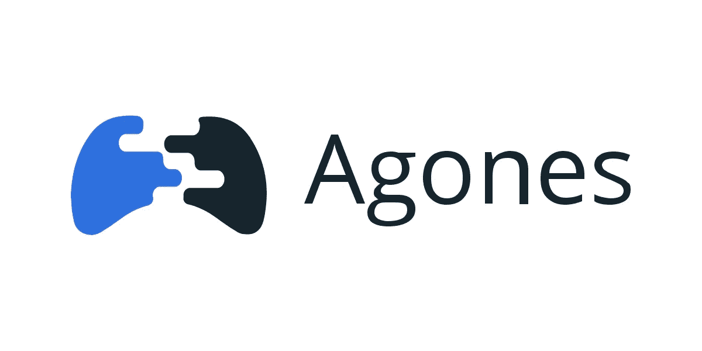
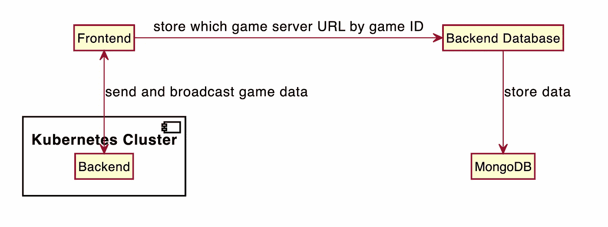

# 尝试在 Kubernetes 进行多人游戏

> 原文：<https://blog.devgenius.io/what-i-learned-from-trying-agones-577f93193419?source=collection_archive---------10----------------------->

## KUBERNETES + AGONES

## 即使项目没有完成，也总有东西要学。



Agones 标志。

我最近的项目是尝试学习 Agones，这是谷歌开发的多人游戏舵图。尽管我没有及时完成这个项目，但我从中吸取了一些教训。

# 背景

Agones 是安装在 Kuberenetes 集群中的一个框架，用于创建和管理多人游戏。理论上，Agones 允许我们在配对过程完成后(意味着房间已满，游戏准备开始)产生一个新的游戏服务器。

我为什么对 Agones 感兴趣？因为在过去的几个月里，我一直在思考游戏服务器是如何工作的，以及它的可扩展性。因此，当我发现 Agones 时，我很有兴趣看看它是如何工作的。

这个想法是 Agones 可以为每个游戏分配一个新的游戏服务器。它不像一个游戏服务器装满了许多房间(不像 Socket.io)。相反，一个游戏服务器专用于一个房间。至少概念上是这样。

# 学习过程

## 开发游戏

为了尝试 Agones，我开发了一款井字游戏。我将代码存储在三个存储库中:

*   前端代码，包含游戏的用户界面。
*   游戏服务器代码，包含游戏过程中的后台逻辑。
*   后端数据库代码，包含一个连接 MongoDB 的简单服务器。

现在，你可能想知道，为什么我需要 3 个服务。原因是在测试过程中，我发现由于 Webpack 的原因，前端无法使用 Mongoose 库，所以我需要创建一个专用于访问 MongoDB 的服务。



计划的井字游戏的架构图。

这是前端代码。前端用 Next.js 编程，使用西奥多鲁斯·克拉伦斯的 [awesome 模板。开发花了相当长的时间，因为我不习惯反应钩子，但最后，我让它工作。](https://github.com/theodorusclarence/ts-nextjs-tailwind-starter)

[](https://github.com/iamdejan/agones-tic-tac-toe-fe) [## GitHub-iamdejan/agones-TIC-tac-toe-Fe

### 在 GitHub 上创建一个帐户，为 iamdejan/agones-tic-tac-toe-fe 的开发做出贡献。

github.com](https://github.com/iamdejan/agones-tic-tac-toe-fe) 

这是游戏服务器代码。游戏服务器用 Node.js 和 Typescript 编程。前端和游戏服务器的连接使用 Socket.io，我之所以使用 Socket.io 是因为它更简单，相比 Websocket(甚至直接处理 TCP)。

[](https://github.com/iamdejan/agones-tic-tac-toe-be) [## GitHub-iamdejan/agones-TIC-tac-toe-be

### 此时您不能执行该操作。您已使用另一个标签页或窗口登录。您已在另一个选项卡中注销，或者…

github.com](https://github.com/iamdejan/agones-tic-tac-toe-be) 

这是后端数据库代码。它是用 Express.js 和 Typescript 构建的。如前所述，该服务仅充当数据库的代理。创建游戏和/或通过游戏 ID 检索游戏服务器 URL 的端点很少。

[](https://github.com/iamdejan/agones-tic-tac-toe-be-db) [## GitHub-iamdejan/Agones-Tic-Tac-Toe-BE-db:Agones Tic-Tac-Toe-BE 从 FE 到 DB 的代理

### 此时您不能执行该操作。您已使用另一个标签页或窗口登录。您已在另一个选项卡中注销，或者…

github.com](https://github.com/iamdejan/agones-tic-tac-toe-be-db) 

因为我很少编码井字游戏(特别是前端部分花了很长时间)，这三个库大概花了我一个月的时间。

## 供应基础设施

现在，在开发完基础设施之后，我需要提供 Kubernetes 集群，并安装 Agones。我使用谷歌 Kubernetes 引擎只是因为我还有免费的信用。

你可以在这里看到代码(抱歉没有`README`文件):

[](https://github.com/iamdejan/agones-tic-tac-toe-be-infra.git) [## GitHub-iamdejan/Agones-Tic-Tac-Toe-be-Infra:Agones Tic-Tac-Toe Infra

### 此时您不能执行该操作。您已使用另一个标签页或窗口登录。您已在另一个选项卡中注销，或者…

github.com](https://github.com/iamdejan/agones-tic-tac-toe-be-infra.git) 

请注意，我创建了自己的模块来从 Terraform 调配 GKE，您可以在这里看到:

[](https://github.com/iamdejan/terraform-k8s-module) [## GitHub-iam dejan/terra form-k8s-module:terra form 模块，用于在 GCP 提供一个 Kubernetes 集群。

### 这是一个简单的 Terraform 模块，用于在谷歌云平台(GCP)中提供 Kubernetes 集群。参考本模块…

github.com](https://github.com/iamdejan/terraform-k8s-module) 

然而，在供应步骤中，我面临两个困难:

1.  如果我在供应期间添加了`ip_allocation_policy`，Terraform 将显示错误。原来，当我们第一次创建集群时，GKE 坚持自己创建和分配二级子网(用于 Kubernetes pods 和服务的子网)。
2.  在配置 Kubernetes 集群之后，如果我没有添加`ip_allocation_policy`，那么 Terraform 将“重置”(删除然后重新创建)Kubernetes 集群。我们不希望每次应用 Terraform 配置时都出现这种情况。解决方案是在配置集群后添加`ip_allocation_policy`。是，不理想，但是我没有研究如何解决这个问题，尤其是在 Jakarta ( `asia-southeast2`)提供 Kubernetes 集群时。

解决方法写在`terraform-k8s-module` repo 的`README`文件里。

## 尝试 Agones

现在，进入主要部分，这是尝试 Agones。

我的第一次尝试是使用我推送到 Google 容器注册表的图像。我通过修改[到](https://agones.dev/site/docs/getting-started/create-gameserver/)的教程来创建游戏服务器。这是 YAML 的档案:

```
apiVersion: "agones.dev/v1"
kind: GameServer
metadata:
  generateName: "tic-tac-toe-"
spec:
  health:
    disabled: true
  ports:
  - name: default
    portPolicy: Dynamic
    containerPort: 4000
    protocol: TCP
  template:
    spec:
      containers:
      - name: agones-tic-tac-toe
        image: [the image version of the game server]
        resources:
          requests:
            memory: 128Mi
            cpu: 40m
          limits:
            memory: 128Mi
            cpu: 40m
```

然后，按照教程，我运行`kubectl create -f game-server.yaml`。游戏服务器被创建，然后状态变为`Scheduled`。但是，我不能访问它。发生了什么事？


一分钟后，游戏服务器的状态停留在预定状态。

原来我需要设置服务器的状态为`Ready`，否则服务器无法接收流量。*我好傻*，脑子里对自己说，没有完全看完教程，错过了接受连接所需的状态。


来自 [Agones 教程](https://agones.dev/site/docs/getting-started/create-gameserver/)的截图，说明游戏服务器需要放入`Ready state in order to receive connection.`

看完教程，我可以通过向`[http://localhost:${AGONES_SDK_HTTP_PORT](http://localhost:${AGONES_SDK_HTTP_PORT)}/ready`发送 POST 请求，将游戏服务器的状态设置为`Ready`。你可以在这里看到变化。


然后，正如教程中所写的，我试着使用`nc -u {IP} {PORT}`命令从我的本地笔记本电脑上测试连接。但是，它卡住了。什么都没发生。我试着用`nc -vz`命令调试连接，但这是我在本地找到的。


状态更改为就绪后，无法连接到游戏服务器。

结果是我需要在 Kubernetes 节点中打开 7000–8000 端口。这很有趣，因为我通常依靠`Service`或`Ingress`来访问 Kubernetes pods。我从不直接打开 Kubernetes 节点的端口。

为了打开端口的节点，您可以添加一个防火墙规则(如果您使用的是`default`网络，则在防火墙页面中；如果您在 VPC 提供 Kubernetes 集群，则在 VPC 页面中)来打开 TCP(这是我所需要的，因为我使用的是 Socket.io)、UDP(如果您正在学习 Agones 教程，这可能是您所需要的)的 7000–8000 端口。为了定位 Kubernetes 节点，您需要使用`gke-node`网络标签。理想情况下，我希望使用 Terraform，但是由于这对我来说是一个未知领域，所以我选择直接在控制台中添加规则。


我在自定义 VPC 中为 Agones 连接添加了防火墙规则。

然后，我又试了一次。但是，还是超时了。看来我在给 Kubernetes 节点添加防火墙规则后需要删除游戏服务器了。于是我删除并重新创建了游戏服务器，连接成功了！


新的游戏服务器准备好了。


我的本地计算机已成功连接到 Agones 的游戏服务器。

现在，是玩游戏的时候了。我在本地电脑上运行游戏，我用谷歌 Chrome 和 Brave 浏览器玩。理想情况下，我还需要将前端放在 Kubernetes 集群中，但是时间不允许(参见下面的`The Unfinished Part`部分)。

下面是我尝试玩游戏时的截图:


井字游戏的主页。


点击“创建游戏”按钮后，游戏创建者在等候室。然后需要由第二个玩家输入游戏 ID。


第二个玩家输入由第一个玩家(游戏的创建者)给出的游戏 ID。


第二个玩家点击“加入游戏”按钮后游戏开始，我们可以玩游戏了。


一个玩家赢了之后的页面，不是 X 就是 o。

# 未完成的部分

对于这个项目，我需要改进几个方面:

1.  目前，IP 地址和端口是硬编码在前端，因为我从云壳手动创建游戏服务器。理想情况下，我不仅将前端放在 Kubernetes 集群中，还需要在代码中创建游戏服务器，而不是硬编码 IP 地址和端口。我认为这可以在以后改进，一旦我转移到另一个云提供商并获得另一个免费积分:)
2.  可以改进的一个逻辑是，当玩家创建游戏室时，我提供游戏服务器。我认为更优化的版本是在房间满了之后才提供 T2。
3.  我想尝试但时间不允许(我的 GCP 免费试用期快到了)的一件事是，我想使用 Agones 的`GameServerAllocator`，这样我就不需要创建游戏服务器，而是使用已经分配给我的服务器。这和第一点有关。

# 结论

尽管这是一个未完成的项目，我还是学到了一些东西:

1.  在尝试实现自定义游戏之前，先了解所需的工具。我花了几个星期开发井字游戏，才意识到 Agones 并不像我想象的那么简单，因为我需要设置很多东西，从 Kubernetes 集群、游戏服务器(包括它的状态)和防火墙规则。
2.  正确阅读教程。仅仅因为你认为你知道它是如何工作的，这并不保证你真的知道。慢慢适当的看教程。
3.  与第一点相关，试试 Agones 给出的例子。如果这个例子不起作用，你知道要么你误解了指南，要么只是指南不够好。如果遵循这些例子不起作用，至少你在开发定制游戏之前节省了一些时间。这也和第二点有关。
4.  对于创业公司，如果资源允许(资金、人员等。)，我觉得还是用[谷歌云游戏服务器](https://cloud.google.com/game-servers)比较好，因为他们已经帮你管理服务器分配了。谷歌云游戏服务器内部使用 Agones。然而，如果你在其他云提供商那里已经有了 Kubernetes，我可以看到直接使用 Agones 的吸引力。

也就是说，最重要的结论是**不要害怕尝试**。你很少第一次就把所有事情都做对。