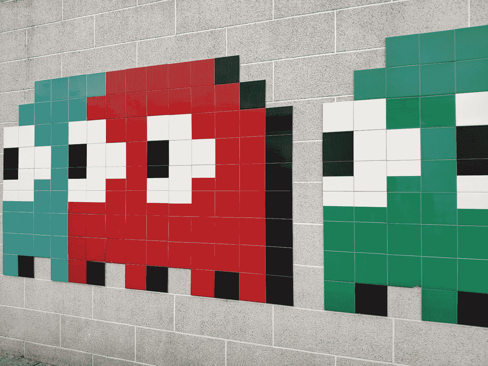

# 我在 Unity 制作游戏中学到的

> 原文：<https://blog.devgenius.io/what-i-learned-making-games-in-unity-3936075af5b8?source=collection_archive---------9----------------------->

## 或者说，为什么要学习 C#

照片由[基里尔·沙尔科夫斯基](https://unsplash.com/@sharkovski?utm_source=medium&utm_medium=referral)在 [Unsplash](https://unsplash.com?utm_source=medium&utm_medium=referral) 上拍摄

在 Unity 中制作游戏和编写 C#脚本很像是做其他类型的编码，在上面添加一些视觉上有趣的东西。这的确很难，但也很有趣。Unity3D 编辑器本身有许多内置的工具来简化原型制作，如程序员艺术风格的图形，带有光滑哑光纹理的简单块和现成的物理材料，以使物体被吸引到地板上或四处弹跳。但是如果你想让这些小块移动或者做一些有趣的事情，你就需要 C#脚本。

C#在语法上类似于 C++，但有一个类似 Java 的垃圾收集器。C#的创建者还创建了 TypeScript，它是 JavaScript 的强类型扩展，增加了高级的面向对象特性，如类和对象。C#也是由微软维护的，它是完全开源的，完全跨平台兼容。另外，由于 Unity 是建立在微软的基础上的。NET 框架，通过为 Unity 编写脚本，您将会学到可以在许多其他环境中使用的工具。

但是让我们回到正题。学习团结对我有什么好处？对于初学者来说，因为它在很大程度上是有趣的，所以对于那些对脚本有点紧张的人来说，这是一个非常好的编程入门。放在世界上的一切都是一个对象，并在层次结构中直观地表现出来。出于功能或组织目的，您可以创建具有父子关系的对象。这可以通过拖放或通过代码更改对象的父对象来完成。

街机风格的滚球游戏的编辑器窗口和完全扩展的层次结构

当改变游戏对象的父对象时，你必须记住的唯一事情是对象的位置(或变换组件)是相对于父对象的。所以如果你不想让你的程序员美工滚出屏幕，你就需要将父体的位置设置为世界上的 0，0，0(也称为重置 GameObject 的 transform 组件)。唯一不会出现这种情况的情况是，如果您确实希望两个对象总是只相对于彼此移动，例如，如果您模拟地球绕着太阳转，月亮绕着地球转，在这种情况下，月亮将是地球的子对象，而地球绕着太阳转，如下图所示:

月亮是地球的孩子，所以它总是相对于地球运动

然而，如果你出手太重，你可能会在这方面遇到很多麻烦。以第一张图中的滚球游戏中的等级为例:我们希望相机跟随球在竞技场周围移动，所以像孩子一样拥有它是有意义的，对吗？不对！如果我们把摄像机设定为一个正在滚动的球的孩子，猜猜摄像机会做什么:最终围绕着球滚动，很少向我们展示我们想要看到的东西！不太好。那我们需要做什么？加个剧本！这个名为 SmoothFollow 的脚本是 Unity Standard Assets 包的一部分，它已经非常过时了，需要在一个地方截取一段代码进行更新，如果任何人需要，我可以在将来浏览它。然而，这个脚本很好地满足了我们的需求。

有问题的代码片段

在上面的截图中，我们有 LateUpdate 方法，每帧调用一次(React 生命周期方法，有人知道吗？).我们在这里使用 LateUpdate 是因为我们的球控制器的更新功能使球移动，我们希望球移动后我们的摄像机也随之改变。eulerAngles.y 正在获取对象旋转分量的 y 分量(在 wantedRotationAngle 中，它正在查看目标，而在 currentRotationAngle 中，它正在查看相机的变换)。然后，我们使用所需的高度和旋转来抑制/更新摄像机的当前高度和旋转，然后我们将摄像机移动到距离球所需的 x-z 距离。这看起来很难理解，但是这里的 Unity 引擎或多或少做了所有更复杂的矩阵转换，否则从头开始做这样的事情是必要的。

现在你知道了！我可能没有说服你自己去学习 C#，但是我自己通过在 Unity 中玩和做小游戏学到了很多。