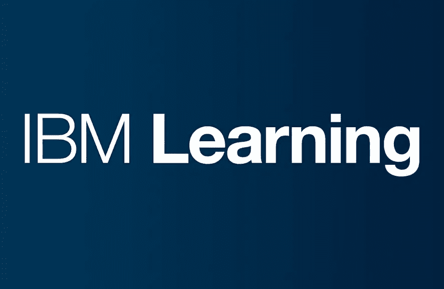

# 在 IBM 工作，我最喜欢什么

> 原文：<https://blog.devgenius.io/what-i-like-the-most-working-at-ibm-e31d1fd7ff6d?source=collection_archive---------6----------------------->

在 [Unsplash](https://unsplash.com/s/photos/ibm?utm_source=unsplash&utm_medium=referral&utm_content=creditCopyText) 上由 [Mikita Yo](https://unsplash.com/@mikitayo?utm_source=unsplash&utm_medium=referral&utm_content=creditCopyText) 拍摄的照片

我加入 IBM 已经快 2 年了，准确的说是 2019 年 1 月 1 日，我记得的日子。从第一个想面试我的人力资源的电话到我最终加入的那一天，我不得不等了将近 3 个月。老实说，在 IBM 工作甚至不是我的梦想，因为当我想到 IBM 时，它有一种研究和科学家所做的一切的感觉。虽然做研究是我在攻读硕士学位时所学和所做的事情，但这不是我想以此为职业的东西。但是现在我已经在 IBM 工作了 2 年，我很幸运也很荣幸 IBM 选择了我，我也选择了为 IBM 工作。IBM 不仅仅是做研究，呆在实验室里，像科学家一样工作。

看着我自己，观察我的人生旅程，我会认为自己是一个刽子手。能够接受客户需求并以有助于他们实现目标的方式执行的人。以我为例，作为一名软件工程师/数据工程师，我喜欢用我的软件开发技能来做这件事。在这个快速发展的数字时代，每个人都需要掌握新的技能才能前进。随着最新的 Covid19 疫情投入使用，我们看到了过去发生的变化。很多行业为了生存不得不转型。新的工作角色开始发挥作用，为了取得成功，IBM 等技术领导者需要相应地进行转型。

来源:[链接](https://www.ibm.com/training/images/journey_watson_wat_machine_learning_600x280.jpg)

当我开始在 IBM 工作时，我发现有很多东西需要学习。学习是永无止境的，IBM 确保其员工学习和获得新的技能，无论是理论技能还是实践技能。

1.  IBM 鼓励员工每年完成 40 小时的学习。这也是员工年度绩效的要求。
2.  IBM 有不同技能和专长的徽章。
3.  每个季度，我们都会为所有员工制定预算，让他们在各自的工作岗位上学习新技能并获得新的高级认证。
4.  IBM 员工可以访问学习平台，从中学习和获得新技能。其中我最喜欢的是 cognitive class.ai(数据科学和机器学习相关技能)和 percipio.com(从开发到设计到管理课程)，最新的一个是 IBM 员工 Udemy 上的 IBM 学习平台，现在免费提供所有付费的 Udemy 课程。
5.  除此之外，IBM 还为其员工提供了自己的内部学习培训方案，其中一些方案是所有员工都必须参加的，与他们的工作角色无关。

在我在 IBM 的最后两年里，我从 IBM 学习平台中学到了很多，比如上面提到的那个。我去年在 2019 年完成了 106 小时的培训，到目前为止，我已经在 2020 年从多个平台完成了 84 小时的培训。所有这些平台都与名为 IBM Your Learning 的集中式学习门户同步。该门户网站管理您所有的训练历史和年度进度。这些培训包括课程、测验、实践实验室、视频教程和研讨会，由 IBM 全球的技术领导者组织和演示。

> 学习是生存的关键。

除了完成的小时数，IBM 还通过向员工颁发技能徽章来鼓励他们。在两年的时间里，我已经获得了 16 枚徽章。当我刚加入 IBM 时，我探索了 cognitiveclass.ai 平台，并获得了与 python、数据科学和大数据相关的徽章。当我开始我的项目时，我在银行业担任设计思维顾问，我获得了设计思维和银行基础的徽章。同样，当我加入电信行业的另一个项目时，我获得了电信快速启动徽章和 App Connect 开发人员徽章。

 [## 艾哈迈德·汗关于喝彩的简介

### Credly 的 Acclaim 是一个全球开放的徽章平台，它弥合了技能和机会之间的差距。我们与……

www.youracclaim.com](https://www.youracclaim.com/users/ahmed-khan.1be79477/badges) 

重点是，IBM 学习平台帮助并鼓励其员工探索新的技能和行业领域知识，并通过授予徽章来认可员工的辛勤工作。有了这些徽章，他们也可以在 IBM 之外被认可为熟练的专业领导者，并进一步得到 IBM 自身的认可。

在 IBM 工作并不意味着我只是学习和学习，但这些学习也反映在我工作的任何项目中我工作角色的一部分。如上所述，我认为自己是一个执行者，在学习的同时，IBM 帮助我在我的项目中实施这些技能，在我的项目中有专家领导和导师，我可以从他们的经验中学习，通过观察他们的工作，我可以实施我从 IBM 学习平台中学到的东西。

## 结论:

我认为在这些困难时期，学习新技术和获得新技能是生存的关键。我认为，所有其他组织也应该投资于员工的职业和个人发展，提供访问这种在线学习平台的机会，或者在可能的情况下创建自己的平台。

快乐学习！！！！！！