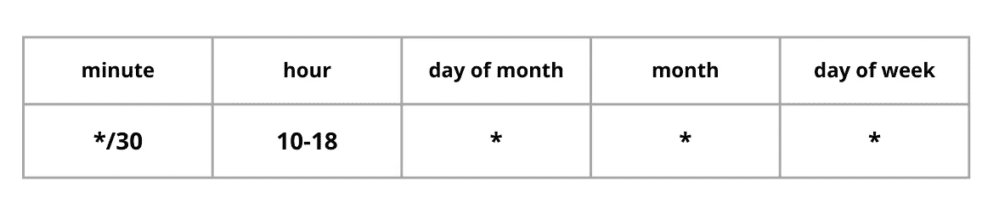

# 什么是 Cron 以及如何通过几个简单的步骤建立您的第一个 Cron

> 原文：<https://blog.devgenius.io/what-is-a-cron-and-how-to-create-your-first-one-9560d229bf5a?source=collection_archive---------9----------------------->

我使用 crons 已经有一段时间了，但是我总是想花些时间阅读一下它们或者从头开始创建一个。这篇文章正是如此，记录了我创建第一个 cron 的过程以及我在这个过程中学到的东西。
*我正在使用 Linux Ubuntu 22，所以如果你使用另一个系统，你在这篇文章中看到的一些东西/命令/日志可能会有所不同。*


照片由[阿格巴洛斯](https://unsplash.com/@agebarros?utm_source=unsplash&utm_medium=referral&utm_content=creditCopyText)在 [Unsplash](https://unsplash.com/s/photos/time?utm_source=unsplash&utm_medium=referral&utm_content=creditCopyText) 上拍摄

# 什么是 **cron** ？🧐

名字 **cron** 来源于希腊语 hronos(希腊语χρόνος)，意思是时间。你可能也知道这个词叫克罗诺斯或克罗诺斯，他是希腊神话中的时间之神和泰坦之王。

cron 是一个守护进程，这意味着它是一个进程——一个程序的实例——在一个类似 Unix 的操作系统的后台持续运行。它通常与系统一起启动，并在系统关闭时停止。

守护进程名称的后缀是字母 **d** ，表示我们指的是一个守护进程。这就是为什么你可能会看到 cron 被称为 **crond** ，而不仅仅是 **cron** 。

# 典型的克朗日

如果一个 cron 连续运行，那么它在运行时做什么？

📆一个 cron 典型的一天可能是这样的:

**每天的每一分钟**

1.  检查一下你现在有什么事情要做，**这**分钟。
2.  如果你有事情要做，那就去做。
3.  回去睡一分钟。
4.  醒醒，回到第一步。

现在我们有所进展，所以这是一个检查每一分钟是否有事情要做的过程，在那个特定的分钟。但是它住在哪里呢？我们能看看吗？

让我们打开终端，输入

```
sudo systemctl status cron.service
```

ℹ️ `systemctl`命令是一个实用程序- *一个助手命令* -它帮助我们控制系统守护进程`systemd`。(`ctl`后缀代表控制)

ℹ️ `systemd` -是一个系统守护进程，用于管理其他守护进程。

执行此命令会显示以下信息

```
● cron.service - Regular background program processing daemon
     Loaded: loaded (/lib/systemd/system/cron.service; enabled; vendor preset: >
     Active: active (running) since Mon 2022-10-24 19:16:33 EEST; 3 days ago
       Docs: man:cron(8)
   Main PID: 981 (cron)
      Tasks: 1 (limit: 38136)
     Memory: 1.1M
        CPU: 1.491s
     CGroup: /system.slice/cron.service
             └─981 /usr/sbin/cron -f -P
```

向您系统内部的这个小进程问好！这是一个克朗！这让我想起了阿尔·帕西诺的一句名言😎)

这条信息包含了很多信息，我不太熟悉其中的术语。现在重要的是，这是关于我们的`cron.service`，它是处于`active`状态的`Regular background program processing daemon currently`，并且从`Mon 2022-10-24 19:16:35 EE`开始运行。

太棒了。我们现在知道了克朗长什么样，以及它是如何度过一天的。

# 雇佣一个 cron 来做我们的工作

一个 cron 可以被设定为做任何你可以想象的事情， *ooh strong word right* ？😯*举例，请*？*很公平* …🤓

您可以使用 cron 来:

*   给你的客户发邮件
*   对系统中的特定文件进行备份
*   提醒自己一项必须完成的特定任务
*   当你的机器资源使用最少的时候，指派一个 cron 来做繁重的工作。

但是等等…这说不通。为什么我需要每分钟给我的客户发一封电子邮件？

嗯，我说了一个 cron 毕竟每分钟都检查**不是吗？**

**真的，那是正确的，它会(大概！)没有意义，但我也没说我们**每**分钟都要做点什么**。我刚才说 cron 会每分钟检查它**是否有**事情要做。我们可以安排它做某事，无论何时，每分钟，每小时，每个月底，每年一次，等等。****

# **为我们的 cron 作业设置时间**

**在添加 cron 作业时，用来声明我们希望任务何时执行的格式是:`<when> <what>`。**

**当的时候:当我们希望某事发生的时候。**

**什么:我们希望我们的 cron 在那个时间点做什么。**

**在我们发现在哪里编写 cron 作业之前，让我们更详细地了解一下 cron 作业的格式。**

**为了让我们的 cron 了解什么时候应该发生什么，我们需要添加以下信息:**

****

**什么？这是什么？😩很好，我们会解决的。我们需要找到一种方法来非常详细地、毫无疑问地描述一项工作(cron 的任务)何时应该被执行。为此，我们应该填写上表中描述的信息。通过组合这些列，我们可以定义我们的 cron 作业将运行的任何时间点。**

**让我们通过下面的例子了解更多。🧐**

**如果我们想让一个 cron 每分钟做一件事，我们应该这样写:**

## **每一分钟**

****

**使用`*`等同于说，一个月中每天每小时的每一分钟...**

## **每天 10 点**

****

**看到我们把小时列设为`10`分钟设为`0`了吗？这意味着我们的任务将只在第 10 个小时的第一分钟运行。如果我们希望我们的任务在第 10 个小时的每一分钟都运行，我们应该将分钟列设置为`*`。**

## **每周六 10 点**

****

**星期六是一周的第六天，因此我们通过在一周的第**天**列添加一个`6`来定义它。**

## **每月第一天的 15:30**

****

## **每月前 7 天的 00:00**

****

**我们也可以使用持续时间，在这种情况下，`1-7`用于从 1 号到 7 号的所有日子。**

## **工作时间每 30 分钟**

****

**如果你想玩玩，看看更复杂的 cron 时间设置，有一个很棒的网站叫做 [crontab.guru](https://crontab.guru/) 。我建议你检查并保存它，它肯定会派上用场。**

# **探索 crontab 文件**

**现在我们对为 cron 作业设置时间的方式更加熟悉了，让我们看看 **where** 部分。**

**我们的系统中有一个名为 **crontab** 的文件。crontab 这个词来自于单词 **cron** + **table** 的组合。这是一个文件，我们将在其中添加我们希望我们的 cron 做什么以及我们希望什么时候发生的指令。**

**您可以在`/var/spool/cron/crontabs`文件夹中找到 crontab 文件。在`crontabs`文件夹中，您会发现每个系统用户都有一个 crontab 文件，在我的例子中，我的 crontab 文件名是`george`。**不要通过**直接编辑这个文件 **，如果你想编辑你分配的文件，请在你的终端中键入****

```
crontab -e
```

**ℹ️ **-e** 代表编辑。**

**如果这是你第一次打开`crontab`，你可能会被要求选择你喜欢的编辑器，我更喜欢 vim，你可以选择任何你喜欢的。**

```
Select an editor.  To change later, run 'select-editor'.
  1\. /bin/nano        <---- easiest
  2\. /usr/bin/vim.basic
  3\. /usr/bin/vim.tiny
  4\. /bin/ed
```

**在我的例子中，通过按下`2`并点击`Enter`，我的 crontab 打开了。**

```
# Edit this file to introduce tasks to be run by cron.
# 
# Each task to run has to be defined through a single line
# indicating with different fields when the task will be run
# and what command to run for the task
# 
# To define the time you can provide concrete values for
# minute (m), hour (h), day of month (dom), month (mon),
# and day of week (dow) or use '*' in these fields (for 'any').
# 
# Notice that tasks will be started based on the cron's system
# daemon's notion of time and timezones.
# 
# Output of the crontab jobs (including errors) is sent through
# email to the user the crontab file belongs to (unless redirected).
# 
# For example, you can run a backup of all your user accounts
# at 5 a.m every week with:
# 0 5 * * 1 tar -zcf /var/backups/home.tgz /home/
# 
# For more information see the manual pages of crontab(5) and cron(8)
# 
# m h  dom mon dow   command
~                                                                               
~
```

**在这个文件的最后一行，(`# m h dom mon dow command`)让我们编写第一个实际的 cron！🥳🥳🥳**

# **编写我们的第一个 cron**

**我们的第一个克隆人将每分钟都在运行，这样我们就可以尽快开始我们的胜利之舞🤭**

```
# m h  dom mon dow   command

# my first cron instructions                                                                               
* * * * * echo "This is my FIRST CRON!!! :)" > /dev/pts/1
```

**让我们分解一下这个命令**

```
# my first cron instructions
```

**以`#`开始一行表示这是一个注释。例如，如果您有多个 crons，并且很难理解每个 crons 做什么，那么添加注释会有所帮助。
注意不要在 cron 命令中添加注释，因为它们会被认为是命令的一部分。
这个文件中的空格和空行被忽略，所以你可以随意设置格式。**

```
* * * * *  echo "This is my FIRST CRON!!! :)" > /dev/pts/1
```

**`* * * * *`这些是我们在上一节中描述的列的 5 个值。不要忘记在每个`*`之间添加空格。**

**`echo "This is my FIRST CRON!!! :)"`显示消息*“这是我的第一个 CRON！！！:)".***

**ℹ️ `echo`是一个 Linux 命令，用于在终端上打印字符串/文本。**

**`>`是一个符号，用于获取命令的输出并将其重定向到其他地方。所以在这种情况下,`echo`命令的结果——echo`command`将在 cron 的终端中输出——将被重定向到下一个参数👇**

**`/dev/pts/1` #%$#@？😟哦，对不起，我想我在搜索的时候不小心写下了我的真实想法🤓。我试图创建一个 cron，它只是在终端中打印/显示一条消息。问题是 cron 有自己的控制台，所以我需要明确地要求我们的 cron 在我使用的终端中显示一条消息。
为了找到我正在使用的终端，我输入了我的终端，`tty`，得到了以下响应**

```
~ tty
/dev/pts/1
```

**所以我在 cron 命令中添加了这个终端的描述。**

**总结一下，我们说我们要求第一个 cron 向当前打开的终端显示消息`This is my FIRST CRON!!! :)`。**

**通过保存并关闭`crontab`文件，您应该会看到一条消息`crontab: installing new crontab`，通知您添加到 crontab 文件的所有更改都已保存。**

**在下一分钟开始时，您应该在终端中看到您的第一个 cron 正在运行。**

**等着吧…等待 waaaaaaaait waiiit(*唤起《勇敢的心》的记忆！*)现在！你看到了吗？？？？？🥳🥳🥳🥳**

```
This is my FIRST CRON!!! :)
```

**这条消息将永远每分钟出现一次，所以您可能需要编辑您的 crontab 并删除这个 cron，毕竟，这只是为了学习！🤭**

**(*只需键入* `*crontab -e*` *并删除您添加的 cron 作业。*)**

# **Cron 日志**

**如果您没有修改系统设置，那么默认情况下，所有系统日志都保存在`/var/logs/systemlog`文件中。在您的终端中键入以下命令将获得您系统中所有与 CRON 相关的日志**

```
grep CRON /var/log/syslog
```

**ℹ️ `grep`命令搜索文件中的模式**

**在我的例子中，它的结果看起来像**

```
Oct 24 20:18:01 george CRON[224509]: (george) CMD (echo "This is my FIRST CRON!!! :)" > /dev/pts/5)
Oct 24 20:19:01 george CRON[224892]: (george) CMD (echo "This is my FIRST CRON!!! :)" > /dev/pts/5)
Oct 24 20:20:01 george CRON[225143]: (george) CMD (echo "This is my FIRST CRON!!! :)" > /dev/pts/5)
Oct 24 20:21:01 george CRON[225356]: (george) CMD (echo "This is my FIRST CRON!!! :)" > /dev/pts/5)
```

**我想，这是一种可以用来检查 crons 发生了什么以及它们何时运行的方法。**

# **结束了**

**当我写帖子的时候，我从来不是为了教东西，因为我认为自己是学生而不是老师。我这样做只是因为我喜欢分享我的笔记，或者是和我未来的自己，我想是一种日记，或者是和任何其他感兴趣的人。**

**👏感谢阅读！如果你觉得这个故事有趣或有帮助，请鼓掌让我知道。别忘了关注更多类似的精彩内容。**

**🛎有问题或评论吗？让我们在[的 Twitter](https://twitter.com/FreakingCode) 或[的 LinkedIn](https://www.linkedin.com/in/georgelinardis/) 上保持联系，继续对话吧！**

**下次见。🤓**