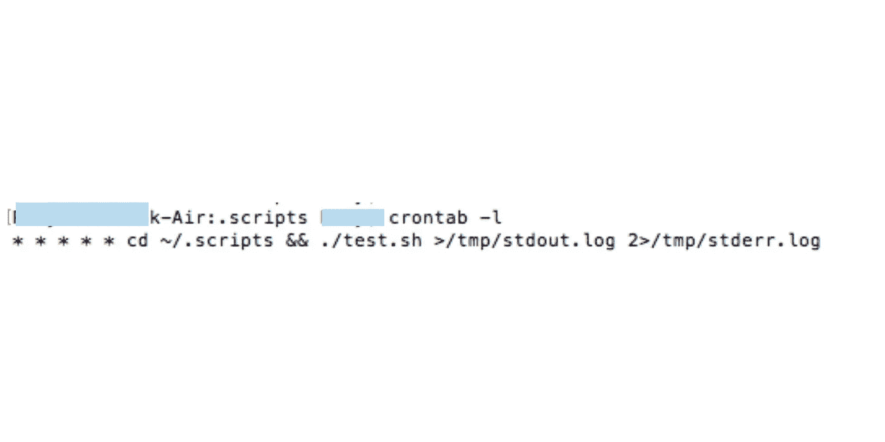
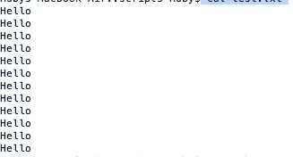
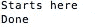

# 什么是 Cron 工作？

> 原文：<https://blog.devgenius.io/what-is-a-cron-job-f5a6d969a1b1?source=collection_archive---------11----------------------->

## 安排 Cron 作业的初学者指南


在 [Unsplash](https://unsplash.com/s/photos/schedule?utm_source=unsplash&utm_medium=referral&utm_content=creditCopyText) 上由[埃斯特·扬森斯](https://unsplash.com/@esteejanssens?utm_source=unsplash&utm_medium=referral&utm_content=creditCopyText)拍摄的照片

计划作业是基于 web 的应用程序的重要组成部分。来处理失败的任务，运行清理活动，或者其他事情。在大多数企业级应用程序中，调度作业都是一种高效的用例。

在我参与的一些企业项目中，软件工具被用来安排日常工作。我还使用 SpringBoot 和 SpringBoot 调度程序开发了基于服务器的应用程序，每三个小时运行一次日常任务。

最近偶然发现了 Cron jobs 这个概念。出于好奇，我读了一些关于它的文章，并想安排一个示例工作来测试它。原来我是唯一一个不知道这个日程表的人。

这篇文章是为像我这样没有尝试过安排 Cron 作业的人准备的。

## 什么是 Cron 和 Cron Job？

类 Unix 操作系统提供了一个名为 Cron 的命令行实用程序。我们可以使用这个工具在机器上调度任务。Cron 实用程序中调度的任务或作业称为 Cron 作业。

Cron 是一个 ***守护进程*** 。

> 守护程序是一种在后台静默运行的程序。控制这个程序的不是用户，而是事件和条件。这些动作的例子是特定时间、特定日期、特定目录中的变化等。

## 如何安排 Cron 作业

1.  创建一个目录(我在我的用户文件夹下创建了这个目录，但是理想情况下，你可以在根目录下创建这个目录)

```
mkdir ~/.scripts
```

2.创建一个文件来编写 shell 脚本

```
touch test.sh
```

接下来，提供对它的修改权限

```
chmod u+x ./test.sh
```

3.将此内容添加到 test.sh 文件中(编辑命令— ***vi test.sh*** )

```
#!/bin/bashecho "Starts here"echo Hello >> test.txtecho "Done"
```

上述脚本将在 stdout.log 文件中打印“Starts here”和“Done ”,而“Hello”将被打印到 test.txt 文件中。

4.要运行上面的脚本，我们需要在 crontab 中调度它。

> computerhope.com 的定义
> 
> crontab 命令用于查看或编辑 cron 要运行的命令表。系统中的每个用户都可以拥有一个个人 crontab。

要打开编辑器在 crontab 中创建条目，请使用以下命令，

```
crontab -e
```

5.将以下条目添加到文件中

```
* * * * * cd ~/.scripts && ./test.sh >/tmp/stdout.log 2>/tmp/stderr.log
```

这里，五个星号依次表示以下数据，
1 —分钟(0–59)
2—小时(0–23)
3—一个月中的某一天(1–31)
4—一个月中的某一天(1–12)
5—一周中的某一天(0–6；周日至周六)

> 不提供任何值表示作业将每分钟运行一次。60 秒是我们可以在调度程序上设置的最小可能值。

要验证作业是否已调度，请使用命令— ***crontab -l***



计划的 cron 作业列表

6.验证 test.txt 文件中的输出

```
cat test.txt
```

几分钟后，test.txt 文件应该会有类似的输出



cron 作业结果

7.验证 stdout.log 文件(该文件位于根文件夹中)

```
cat stdout.log
```



stdout.log 的内容

8.测试完成后，不要忘记删除 cron 作业。使用命令

```
crontab -e
```

并删除内容。

删除。脚本目录以及使用

```
rm -r .scripts
```

## 结论

我们刚刚学习了在 Mac / Linux 机器上调度 cron 作业。这些作业在计划的计算机上运行；在分布式系统中，这不是一个理想的解决方案。

每个提供商都有自己的调度服务来运行基于云的应用程序中的调度作业。