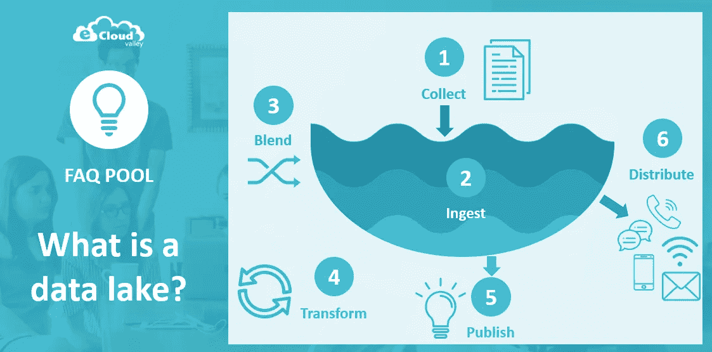
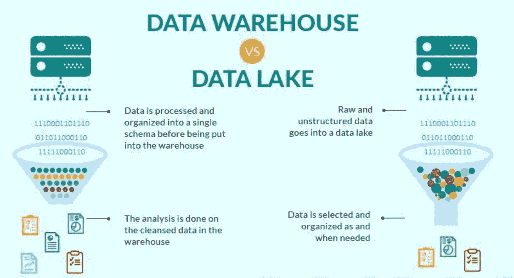

# 什么是数据湖？

> 原文：<https://blog.devgenius.io/what-is-a-data-lake-cf2a8fcdde77?source=collection_archive---------10----------------------->

[**数据湖**](https://www.gudusoft.com/what-is-a-data-lake/) 是一个集中式存储区域，用于存储、处理和保护大量结构化、半结构化和非结构化数据。它可以以其原始格式存储数据，并处理任何转换格式，而不管大小限制。

## 数据湖概述

数据湖提供了一个可扩展的安全平台，使企业能够:

1.  从任何系统中以任何速度提取任何数据，无论数据来自内部、云还是边缘计算系统；
2.  以完全保真的方式存储任何类型或数量的数据；
3.  实时或批量数据处理；
4.  使用 SQL、Python、R 或任何其他语言、第三方数据或分析应用程序来分析数据。

## **数据湖 vs**[**数据仓库**](https://www.gudusoft.com/what-is-a-data-warehouse/) **:**

数据湖也是由它不是什么来定义的。不仅仅是存储，和数据仓库也不一样。

虽然数据湖和数据仓库都能够存储一定数量的数据，但它们针对不同的用途进行了优化。这两者是互补的而不是竞争的，所以公司可能需要一起使用这两种技术。相比之下，数据仓库通常适用于存储商业实践中常见的重复性报告和分析，如每月销售报告、每个地区的销售跟踪数据或网站流量。

## **你需要数据湖吗？**

在确定您的公司是否需要数据湖时，您应该考虑您正在处理的数据的类型、您想要用这些数据做什么、您的数据获取过程的复杂性、您的 [**数据管理**](https://www.gudusoft.com/what-is-metadata-management/) 和治理策略，以及您组织中的人员使用的工具和技能水平。

如今，公司开始看到数据湖的价值不仅仅是存储完全保真的数据。它还可以帮助用户更深入地了解他们的业务，因为数据湖提供了比以往更丰富的上下文，这有助于加快分析实验。

数据湖主要是为处理大量大数据而开发的，公司通常可以通过批量传输和/或流式传输将原始数据移动到数据湖中，而无需转换数据。企业主要依靠数据湖来达到以下目的:

1.  降低总拥有成本；
2.  简化数据管理；
3.  准备好融入人工智能和机器学习；
4.  加快分析速度；
5.  增强安全性和治理。

## **数据湖有哪些使用场景？**

随着数据湖为分析和人工智能奠定基础，各行各业的企业都在使用它们来增加收入、节省资金和降低风险。

1.  媒体和娱乐:在线播放音乐、广播和播客的公司可以通过改进他们的推荐系统来增加收入，让用户消费更多的服务，从而让公司销售更多的广告。
2.  电信:跨国电信公司可以通过构建流失倾向模型来减少客户流失，从而节省资金。
3.  金融服务:投资公司可以依靠数据湖来驱动机器学习，这样一旦获得实时市场数据，他们就可以管理投资组合风险。

## **数据湖的值**

能够在更短的时间内利用更多来源的更多数据，并使用户能够以不同的方式协作和分析数据，从而做出更好、更快的决策。数据湖增加价值的例子包括:

1.  改善客户互动:Data Lake 可以将来自 CRM 平台的客户数据与社交媒体分析相结合，利用一个包括购买历史和杂项的营销平台，使公司能够了解他们最有利可图的客户群、客户流失的原因以及提高忠诚度的促销或奖励。
2.  改善 R&D 创新选项:数据湖可以帮助您的 R&D 团队测试他们的假设，完善他们，并评估结果-例如在产品设计中选择正确的材料以提高性能，为更有效的药物进行基因组研究，或了解客户对不同属性的支付意愿。
3.  提高运营效率:物联网(IoT)引入了更多收集制造等流程数据的方法，包括来自联网设备的实时数据。借助数据湖，可以轻松存储和分析机器生成的物联网数据，以找到降低运营成本和提高质量的方法。

## 数据湖挑战

数据湖架构的主要挑战是存储原始数据而不监管内容。对于使数据可用的数据湖，它需要有一个定义好的机制来编目和保护数据。没有这些要素，数据就无法被发现或信任，从而导致“数据沼泽”**满足更广泛受众的需求需要数据湖的管理、语义一致性和访问控制。**

## ****在云中部署数据湖****

**数据湖是部署在云中的理想工作负载，因为云提供了性能、可伸缩性、可靠性、可用性、各种分析引擎和大规模经济。ESG 研究发现，39%的受访者认为云部署主要用于分析，41%用于数据仓库，43%用于 Spark。客户引用云作为数据湖的优势的主要原因是更好的安全性、更快的部署、更好的可用性、更频繁的特性/特性更新、更大的灵活性、更广的地理覆盖范围以及与实际利用相关的成本。**