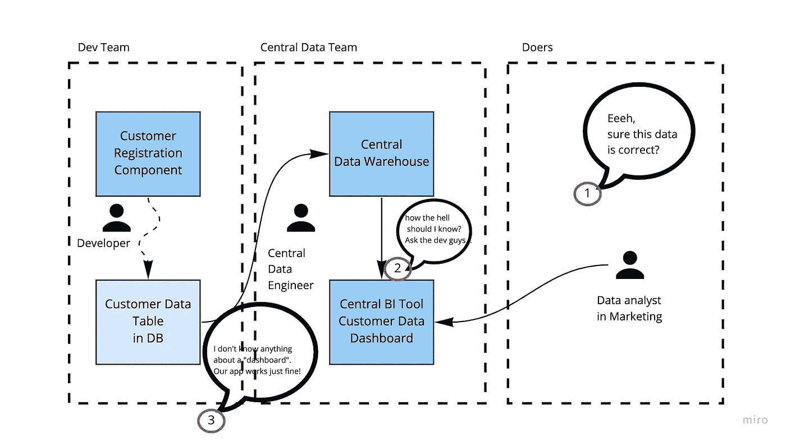
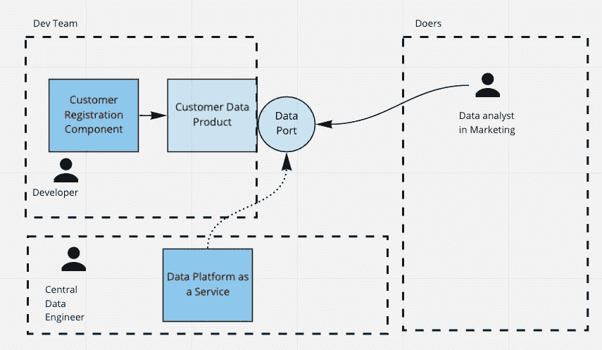
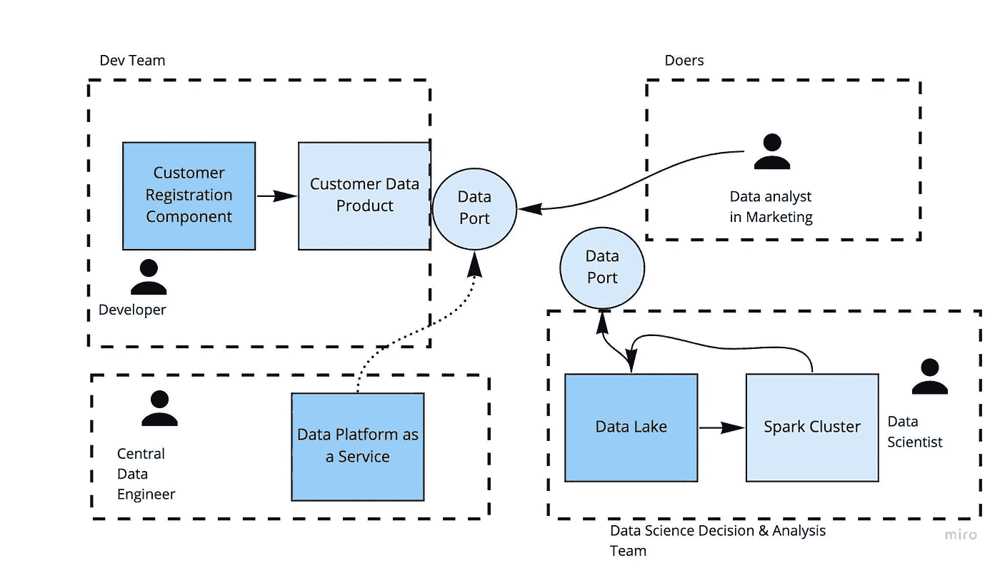

# 什么是数据网格，它有什么用途？

> 原文：<https://blog.devgenius.io/what-is-a-data-mesh-and-what-is-it-used-for-a59f5c8f1fa2?source=collection_archive---------3----------------------->

## 文章节选

## *摘自* [*行动中的数据网*](https://www.manning.com/books/data-mesh-in-action?utm_source=medium&utm_medium=referral&utm_campaign=book_siwiak_data_12_29_21) *作者:亚采克·马奇扎克、斯文·巴尔诺扬和玛丽安·西维亚克*

*本节选涵盖了*

*●什么是“数据网格”？我们对数据网的定义*

*●数据网格范式的关键概念是什么？*

*●数据网格的优势是什么？*

将 **fccsiwiak** 输入[manning.com](https://www.manning.com/books/data-mesh-in-action?utm_source=medium&utm_medium=referral&utm_campaign=book_siwiak_data_12_29_21)收银台的折扣代码框，即可享受 25%的折扣。

数据网格是一个去中心化的范例。它分散了数据的所有权、数据向信息的转化以及数据的服务。它旨在通过消除数据价值流中的瓶颈来提高数据的价值提取。

数据网格范式正在扰乱数据空间。大大小小的公司竞相在互联网上展示“他们的数据网状之旅”。对于任何希望从数据中获取更多价值的公司来说，这已经成为一种新的尝试。我认为数据网格范式是一个社会技术架构，重点是社会。主要的焦点是人、过程和组织，而不是技术。数据网格可以(但不是必须)使用大多数当前数据系统运行的相同技术来实现。

但是，作为一个正在进行辩论的主题，并且只是慢慢出现的最佳实践和标准，我们发现需要一本深入的书，既涵盖使数据网格工作的关键原则，又涵盖使其适应任何公司所需的示例和变化。

首先，我们将了解数据网格的核心思想，以及与之相关的优势和挑战。

## **数据网格 101**

数据网格范式是关于分散责任的。

例如，一家公司的“客户注册组件”的开发团队也创建了一个数据集，用于“注册客户”的分析目的。他们通过将数据转换为 CSV 文件等形式，并以消费者喜欢的方式(如在中央文件共享系统上)提供数据，确保数据格式易于理解。

但这个看似简单的定义有很多含义，因为在大多数公司，数据被当作“副产品”处理。通常只有在作为副产品输出到某种形式的存储中之后，它才会转化为价值，然后由集中的数据团队引入到中央技术中，然后分散的参与者再次拾取数据。可以是市场部的分析师，可以是营销活动中使用的推荐系统中的分析师，也可以是前台中显示的分析师。

图 1 描述了数据架构的一种常见形式，包括组织的和技术的。希望它也显示出它的缺陷。

图 1 分散的数据发布和集中转换给用户带来了问题，因为数据及其质量的所有权和责任不明确。

我们可以在这里看到两个层次的集中化:

*   存储形式的集中技术和通常的数据工程、数据科学机器。
*   数据团队的组织集中化。

由于开发团队认为数据是“副产品”，所有权被隐含地分配给了数据团队。但是这样的中心团队通常无法跟上多个数据源领域中的业务领域知识。负责客户注册的开发人员只需要知道该组件和相关业务内部的语言和更新。但是中央数据团队必须对每个域有相同的理解，再乘以域的数量。这种超负荷使得中央团队不太可能像负责的开发团队那样理解一个领域。因此，数据团队无法判断数据是否正确，它实际上意味着什么，或者具体的指标可能意味着什么。

数据网格范式的转变要求数据责任的分散化，也就是说，将数据视为实际的产品。如果开发团队通过一些标准化的数据端口直接向分析人员提供数据产品，那么图 1 中描述的情况可以变成一个数据网格。它可以是简单的普通 CSV 文件，存放在适当的云存储位置，便于分析师访问。请看图 2，看看这种变化。

图 2 分散式数据转换通过提供对描述良好的数据的简单访问，让数据消费者感到满意。

一个*平台团队*可以帮助提供一个简单的技术即服务，由开发团队用来快速部署这样的数据产品，包括数据端口。

数据生产者专注于开发*数据产品***，与*数据消费者*一起开始形成联系，组成网络。我们称这样的网络为网状网络，其中的单个节点是数据产品和消费者。**

**即使在我们的小示例中，我们也观察到了显著的操作模式变化。它包括所有权责任的转移(从中央数据团队到开发团队)和使新设置工作的技术挑战。**

**引入运营模式的变化将会对你的业务的许多领域产生连锁反应。为了防止它变得混乱，我们需要指导原则。**

**在此之前，您必须理解我们对“数据网格”及其非技术方面的定义。**

## **数据网格的定义**

**Zhamak Dehghani 做出了令人难以置信的努力，从 2019 年开始策划数据网格的想法。她为我们提供了所有的关键元素，并介绍了一种结构化的方法来实现之前讨论的范式转换。**

**自从 Zhamak 首次引入“数据网格”方法以来，已经出现了许多受“数据网格”启发的、业务衍生的和理论上的例子。正如本文所介绍的，这些内容中的许多可能并不完全符合数据网格框架的初始描述。许多企业似乎不太确定什么符合数据网格的定义，什么不符合。**

**因此，我们首先选择实用的解决方案。因此，我们在下面创造的数据网格定义旨在广泛、实用，并强调*去中心化*的努力，以最大化来自数据的*值*:**

****定义*数据网格:*** 数据网格是一种去中心化的范式。它分散了数据所有权、数据到信息的转换以及数据服务。**

**它旨在通过消除数据价值流中的瓶颈来提高数据的价值提取。**

**数据网格范式由四个原则指导，有助于大规模提高数据操作的效率:域所有权、域数据作为产品、联合计算治理和自助式数据平台。数据网格实现在利用这些原理的范围和程度上可能有所不同。**

**实现数据网格的目标是从公司的数据资产中提取更多的价值。这也是我们保持这个定义的轻量级和包容性的原因，与每个原则遵循的水平有关。下面一个数据网格的非技术性用例有望解释我们的意思。**

## ****为什么要数据网格？****

**我们看到了数据世界需要以数据网格的形式去中心化的三个主要原因:**

*   **随着数据源和数据消费者的激增，处于中间的中央团队造成了组织瓶颈。**
*   **由于存在多种数据发送和消费技术，中央整体式数据存储造成了技术瓶颈，许多信息因此而丢失。**
*   **数据质量和数据所有权都是隐式分配的，这在两种情况下都会导致混乱和缺乏控制。**

**在过去的三十年中，大多数数据架构被设计为集成多个数据源，即中央数据团队合并来自各种源系统的数据，并向用户提供协调的集合，用户反过来试图使用它来推动业务价值。**

**然而，十多年来，大数据遗留问题一直困扰着各种规模的公司。数据环境面临着解决方案的可扩展性、数据的完整性、可访问性等问题。这可能对你们有些人来说很熟悉。有些事情似乎就是行不通。与创建和维护它们的成本相比，许多报告和仪表板似乎毫无用处。一堆数据科学项目似乎停留在“原型”阶段，那些运行数据密集型应用程序的项目可能正面临一堆与数据相关的问题。至少与运行一个软件组件所付出的努力相比，看起来是这样的。只是还不合适。**

**可伸缩性问题的原因之一是数据源和数据消费者的激增。当一个中心团队在整个过程中管理和拥有数据时，一个明显的瓶颈就出现了:从摄取到转换和协调，再到向所有潜在用户提供数据。沿着数据管道分割团队也没有多大帮助。当处理数据摄取的工程师改变任何东西时，他们需要通知负责转换的小组。否则，上游系统可能会失败，或者会错误地处理数据。工程师之间需要紧密合作，这导致了所有数据相关系统的紧密耦合。**

**另一个问题来自数据平台的整体性，比如仓库和湖泊。因此，它们通常缺乏多样性，无法反映来源于数据源和特定领域结构的数据中编码的现实。此外，数据结构的强制扁平化降低了从收集的数据中生成有价值的见解的能力，因为关键的特定领域知识在这些集中式平台中丢失了。我们可以在我们参与的一个项目中观察到这一点。这家汽车零件制造公司正在购买与不同零件故障相关的数据。即使提供商具有关于部件来源的信息，即部件安装的模型，买方也没有允许其存储该信息的数据模型。结果，各个组成部分被分开分析，阻碍了 R&D 更好地理解全局的努力。**

**另外两个交织在一起的因素加剧了上述问题。一是数据所有权结构不清晰；另一个是对数据质量的责任。数据在不同的专业团队之间传递时会失去与其业务意义的联系，这意味着集中式数据处理系统和应用程序的开发人员不能也不会完全理解其内容。相比之下，数据质量不能脱离其意义来评估。**

**类似的问题已经在软件工程的其他领域被认识到，并导致了出现(和成功！)的领域驱动开发和微服务。将类似的思想(例如，关注数据所有权和共享工具)应用于数据工程导致了数据网格思想的发展。**

## ****替代品****

**对于 Data Mesh 的数据责任分散化，有两种主要的替代模型。**

**第一种选择是人员和技术的集中化。这是任何启动的默认设置。这是一个非常好的默认选项，就像 monolith 是任何软件组件的默认选项一样。一开始，权力下放的成本超过了它的好处。在一个数据团队中紧密合作所带来的好处是，只使用一种技术，使事情变得容易得多。**

****洞察力*集中化是一个明智的默认选项:*集中化数据工作作为一个默认选项，在组织和技术方面都是有意义的。分散化确实会带来成本，而集中化可以减轻这些成本。不过，这确实意味着，从集中和分散数据中获得的价值大致相等。****

**第二个选择是按照技术而不是按照数据网格建议的业务领域来划分工作。这通常会导致一个核心数据工程团队主要负责接收数据和调配数据存储基础架构，以及多个其他团队、分析团队、数据科学团队、分析师等等。这些获取原始数据，并把它变成有意义的东西。您可以首先集中您的数据系统，然后使用此选项分层以增加流量。**

**这两个选项都没有错。它们可能是合理的默认选项，但这两个选项都无法与价值创造保持一致，价值创造与业务领域紧密相关。两者都不能解决一个业务领域的突然变化。与微服务一样，微服务的优势在于能够通过纵向扩展从一个特定服务中快速提取价值，而数据网格能够在一个领域内纵向扩展价值提取。所有其他选项都需要纵向扩展所有内容，以便在一个领域内纵向扩展价值提取。**

**因此，无论如何，这两种选择都会在某个时间点碰壁，在这种情况下，添加下一个数据源或添加下一个数据科学项目将变得越来越复杂和昂贵。这就是您想要切换到数据网格的地方。**

## ****数据仓库&数据网格中的数据湖****

**对数据网格有一种误解。它有时被视为中央数据湖或中央数据仓库的唯一替代方案。**

**但这并没有考虑到数据网格是什么，也就是说，它是两个东西的组合:技术和组织。数据网格是由一个集中的数据单元来管理中央数据存储中的数据的替代方案。**

**这仍然是让中央数据存储和分散的单元工作并拥有数据的选择。事实上，在数据生产者方面不需要完全灵活性的公司中，这是一种常见的实现。**

**这也是在商业智能或数据科学团队中保留数据湖和数据仓库的一种常见方法。然后，数据湖和数据仓库成为数据网格中的一个节点。**

****

**图 3 数据网格仍然可以使用数据湖，例如，构建数据产品的数据科学团队可以使用数据湖作为数据网格中的节点。**

**数据网格大量使用各种格式的数据湖和数据仓库，数据网格一般不会试图专注于任何特定的技术。让我们来看看数据网格的好处。**

## ****数据网格的好处****

**让我们从两个不同的角度来分析数据网格实现的潜力:从业务决策者和技术人员的角度。**

## **商业视角**

**从商业角度来看，数据本身没有什么价值。更糟糕的是，这意味着产生的成本！听起来像异端？为了理解这句话，如果需要的话，把它传达给你的商业伙伴，你需要理解人们感知现实的不同层面。这种现象的一个很好的近似是所谓的 [DIKW 金字塔](https://en.wikipedia.org/wiki/DIKW_pyramid)，源自 T.S .艾略特 1934 年的戏剧《岩石》。它将数据、信息、知识和智慧表示为一个层次结构，其中每个下一个元素都可以从上一个元素派生出来。**

**这个上下文中的数据只是一组值(存储这些值需要花钱)。为了从中获得价值，需要构建允许做出明智决策的环境。数据网格提高了整个金字塔的稳健性。**

**正如我们提到的，拥有原始数据对决策者来说没有任何用处。有人会说，他们可以把它下载到笔记本电脑上，自己进行分析。是真的！然而，它有两个基本假设:**

1.  **要下载数据，它需要是可访问的。**
2.  **为了确保任何执行的分析的价值，数据需要尽可能完整。**

**为了解决第一个假设:我们已经提到过，并将反复提到，数据网格非常注重使数据可访问。不仅可访问，而且可查找，可互操作，可重用！这是数据网格四大原则之一——数据即产品——的核心内容，即确保数据随时可用。**

**数据的完整性是数据网格大放异彩的另一个问题。与大多数数据仓库或数据湖体系结构不同，数据产品及其数据模型不是由 IT 专家独立于业务问题开发的。相反，这是一个共同的努力，确保域外呈现的数据足以从中得出有意义的结论。**

**数据网格还有助于为层次结构中更高的元素增值。将数据转化为信息、知识和智慧的团队(业务环境喜欢称之为“洞察力”)可以即时访问多个可互操作的数据源。**

**当然，理论上，在数据湖中也有可能实现。但是，根据我们的经验，由一个团队来管理环境的技术方面以及数据访问和传输权限是不可行的。如果所需的数据位存储在两个不同的数据湖中(或者四个，这并不罕见)，让它们一起工作几乎是不可能的。**

**简而言之，能够访问读取优化的数据产品能够快速构建新分析方法的原型，并为新业务能力的快速开发开辟了一条道路。**

## **技术视角**

**从技术角度来看，主要的好处是保持组织发展的速度。数据网格旨在通过分散数据生产和治理来解决其他数据架构(如数据仓库或数据湖)的缺点。这些架构引入了一个瓶颈——一个中央团队负责协调整个公司的所有数据，并为消费做好准备。单个团队无法适应不断增长的组织的各种数据需求。技术和团队知识都很快成为一个规模问题。最终，更多的时间花在维护上，新项目越来越被推迟。**

**数据网格的另一个好处是从数据创建的角度来看，数据所有权是清晰的。它使数据管理结构扁平化，只留下一个薄薄的联合治理团队层。甚至该团队的活动也仅限于在自治领域内就标准达成一致。**

**开发速度的提高也来自于授权给实现团队。因为生产和维护数据产品是他们的责任，所以变化的速度不会受到单个中央集成团队积压的任务的限制。这意味着数据产品的发展和修复都发生得更快。这在任何 bug 修复和停机的情况下尤其突出。此外，拥有给定数据产品的团队能够更好地做出更快的反应，因为没有上下文切换，这与单个中央数据团队的情况不同。**

**另一个值得一提的因素是数据环境的稳定性。随着数据产品提供对其数据集的合同版本的访问，建立在其上的管道更加健壮，需要的维护也少得多。**

**目前就这些。感谢阅读。**