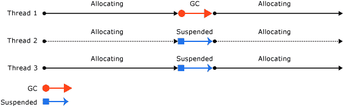

# 什么是垃圾收集器？

> 原文：<https://blog.devgenius.io/what-is-a-garbage-collector-ac4bb0892c1c?source=collection_archive---------1----------------------->

垃圾收集器(GC)是。NET framework，由公共语言运行时(CLR)初始化，用于管理应用程序中内存的分配和释放。

# 垃圾收集器的类型

垃圾收集器可以在各种各样的场景中工作。CLR 提供以下类型的垃圾回收:

*   **工作站垃圾收集(GC)** 在普通优先级线程上运行，可以是并发或非并发的，并且是为客户端应用设计的
*   **服务器垃圾收集**是为服务器应用设计的，为每个逻辑 CPU 创建一个单独的托管堆和相应的垃圾收集线程。线程以最高优先级运行，速度更快，但资源更密集。英寸网芯，。NET Framework 4.5 和更高版本的服务器垃圾回收可以是非并发的或后台的。英寸 NET Framework 4 和以前的版本，服务器垃圾回收是非并发的。

# 并发垃圾收集

并发垃圾收集允许用户线程运行第 2 代垃圾收集的大部分时间。只要托管堆中仍有空闲空间用于新分配，就允许用户线程运行和创建新对象。

# 非并发垃圾收集

非并发垃圾收集会在垃圾收集的整个持续时间内暂停所有非垃圾收集线程，从而在这段时间内有效地暂停应用程序。

# 后台垃圾收集

后台垃圾收集取代了并发垃圾收集。它类似于并发垃圾收集，但允许第 0 代和第 1 代垃圾收集中断正在进行的第 2 代垃圾收集，并暂时阻止程序执行。第 0 代和第 1 代垃圾收集完成后，程序执行和第 2 代垃圾收集都将继续。这甚至进一步缩短了程序执行因垃圾收集而暂停的时间。

# 内存和托管堆

一旦垃圾收集器被公共语言运行时(CLR)初始化，它就分配一个称为托管堆(与操作系统中的本机堆相对)的内存段来存储和管理对象。

对于每个托管进程，垃圾收集器使用 Windows VirtualAlloc 函数在托管堆中保留一段内存。(它使用 Windows VirtualFree 函数将段释放回操作系统)。进程中的所有线程都为同一堆上的对象分配内存。

需要考虑的一件重要事情是，每个分配段的大小是特定于实现的，并且随时都可能发生变化。

# 世代

存储在托管堆中的对象根据它们的年龄被组织成代。垃圾收集主要发生在回收短命对象时，这些对象通常只占据堆的一小部分。

1.  **第 0 代**:对象寿命短的最年轻一代(例如。临时变量或新分配的对象，除非它们是大型对象，在这种情况下，它们将放在第 2 代收集中的大型对象堆上)
2.  **第 1 代**:如果一些第 0 代对象占用的空间在垃圾收集运行中没有被释放，那么这些对象被转移到第 1 代并包含短命对象。

*   **第 2 代:**如果一些第 1 代对象占用的空间在下一次垃圾收集运行中没有被释放，那么这些对象将被转移到第 2 代。这一代包含长期存在的对象(即服务器应用程序中包含静态数据的对象，这些数据在流程持续期间是活动的)。

当垃圾收集器检测到某一代的存活率很高时，它会提高该代的分配阈值。

# 垃圾收集器阶段

以下情况之一会触发收集:

*   系统物理内存不足。这可以通过来自操作系统的内存不足通知或主机指示的内存不足来检测。
*   托管堆上分配的对象使用的内存超过了可接受的阈值。该阈值随着流程的运行而不断调整。
*   **GC。Collect** 方法被调用。几乎在所有情况下，您都不必调用此方法，因为垃圾收集器会连续运行。

此时，垃圾收集器传递抛出以下阶段:

1.  **标记阶段**:GC 通过使用以下信息来确定对象是否是活动的，从而创建所有活动对象的列表(所有不在列表上的对象都可能被删除):

*   堆栈根。由实时(JIT)编译器和堆栈审核程序提供的堆栈变量。JIT 优化可以延长或缩短向垃圾收集器报告堆栈变量的代码区域。
*   垃圾收集句柄。指向托管对象并且可以由用户代码或公共语言运行时分配的句柄。
*   静态数据。应用程序域中可能引用其他对象的静态对象。每个应用程序域跟踪它的静态对象。

1.  **重定位阶段**:在重定位阶段，更新所有活动对象列表上的所有对象的引用，使它们指向压缩阶段对象将被重定位到的新位置。
2.  **压缩阶段**:回收死去的物体所占据的空间，压缩幸存的物体。压缩阶段将在垃圾收集中幸存的对象移向段的旧端。堆在压缩阶段被压缩，因为死对象占用的空间被释放，剩余的活对象被移动。垃圾收集后剩余的所有活动对象都按其原始顺序移向堆内存中较旧的一端

# 资源

*   官方文档:[https://docs . Microsoft . com/en-us/dot net/standard/garbage-collection/fundamentals](https://docs.microsoft.com/en-us/dotnet/standard/garbage-collection/fundamentals)