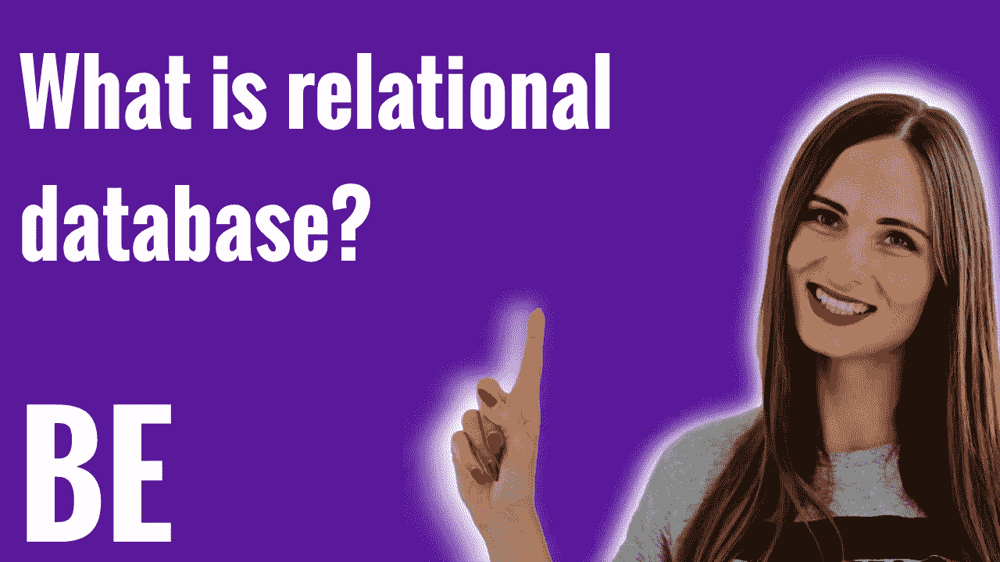
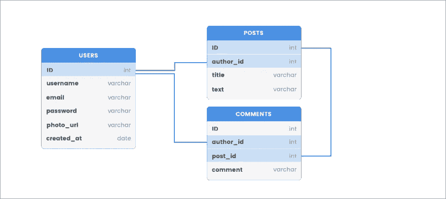

# 什么是关系数据库和关系数据库管理系统？

> 原文：<https://blog.devgenius.io/what-is-a-relational-database-and-relational-database-management-system-75075b31fa7?source=collection_archive---------10----------------------->

[Duomly —编程在线课程](https://www.blog.duoml.com)

本文最初发表于[https://www . blog . duomly . com/6-most-popular-back end-question-and-answers-for-初学者/# what-is-relational-database](https://www.blog.duomly.com/6-most-popular-backend-questions-and-answers-for-beginners/#what-is-relational-database)

# 什么是关系数据库？

[什么是关系数据库？](https://www.youtube.com/watch?v=KM_jKrqQ92s)

关系数据库是一个有组织的数据集合，我们可以在其中创建数据的某一点之间的关系。

关系数据库通常由表组成，表由具有数据属性的列组成。关系数据库表的每一行保存具有唯一标识符的数据记录；最常见的，是 id。每条记录都为属性赋值。

在关系数据库中，我们可以保存成千上万的数据记录。

关系数据库使用 SQL(结构化查询语言)来读取、存储、更新和删除数据库中的数据。SQL 语法与普通英语非常相似，所以使用起来并不复杂。

关系数据库中的关系是在不同的表之间设置的，是基于这些表之间的交互建立的。

让我们看一下表模型的可视化表示，通过与其他表模型的关系连接起来。

关系数据库

在上图中，您可以看到三个表的模型:用户、帖子和评论。用户通过 id 与帖子和评论相关联，其中帖子和评论中的 id 是 author_id。然后帖子和评论通过 post_id 关联起来。

它允许开发人员获得文章作者的数据，而不需要再次保存到 post 表中，只需从 users 表中通过用户 id 请求用户的数据。

# 什么是关系数据库管理系统(RDMS)？

关系数据库管理系统是一个允许通过创建、更新和管理关系数据库来管理数据库的软件。最受欢迎的有:

*   **MySQL** —多用于 PHP 网站，集成 WordPress
*   **OracleDB** —多用于大型应用中的海量数据，常用于银行业；
*   **PostgreSQL** —开源数据库，好用又不贵，可以处理大数据量，但性能会慢一点；

在开始一个新项目之前，你可能会问的最重要的问题是你应该使用哪种类型的数据库，关系型的还是非关系型的。以下是使用关系数据库的一些好处:

*   数据可以很容易地分类和排序，所以以后很容易查询过滤信息；
*   数据是准确的，这意味着它只存储一次，你可以避免重复的信息；
*   关系数据库是安全的，因为访问可以被限制到特定的用户；
*   获取数据的灵活性，即使是稍微复杂一点的查询；

基于上面列出的好处，我可以很容易地说，关系数据库对于具有大量结构化数据的大型事务性项目来说是一个很好的解决方案。

[Duomly —编程在线课程](https://www.duomly.com/?code=lifetime-80)

感谢您的阅读，
来自 Duomly 的安娜