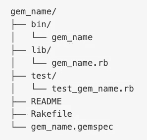
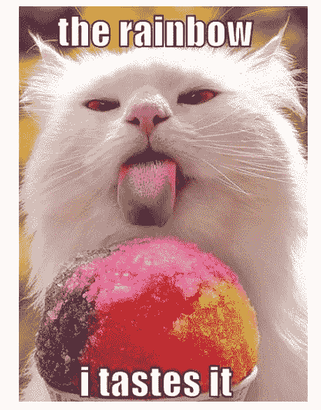
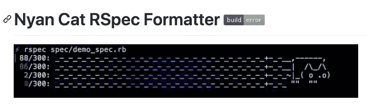

# 什么是红宝石？

> 原文：<https://blog.devgenius.io/what-is-a-ruby-gem-d63aeaa304e0?source=collection_archive---------30----------------------->

当我开始训练营的准备工作时，我会打开实验室，看到大量的文件夹。这是压倒性的，我只关心完成。一旦实验室通过，我就会继续前进。现在我对基本代码有了更好的理解，我开始研究我的实验室的文件结构。我一直注意到一个宝石档案，但从来没有完全知道它是做什么用的，或者宝石有什么样的可能性。

宝石非常有趣，截止到 2020 年 7 月 19 日星期五晚上，Rubygems 图书馆中有 **55，250，630，859** 颗宝石，截止到周日早上，还缺少 **32，000，000 颗新制造的宝石！**这是一个开放给公众使用的巨大资源。尽管我们需要了解它是什么。

## 那么什么是宝石呢？

Gems 就像一个代码库。它是在编码社区中共享的可重用的书面代码的包或集合。任何人都可以编写一个 gem，并且可以有不同的大小和复杂度。

## 宝石的标准惯例

Gems 是一个只有 ruby 语言的包。每个 gem 都必须有名称、版本、平台、代码、文档和 gem 规范。

Gem 文件结构

*   lib 文件夹/目录包含 gem 的所有代码
*   测试或规范文件夹/目录包含测试
*   大多数 gems 都有一个 Rakefile，Rake 允许自动化测试、生成代码和执行其他任务
*   自述文件包含 gem 的文档。它解释了它是什么和如何使用宝石。大多数 gem 都包含 RDoc 文档，但也有一些使用 YARD 文档。
*   Gem 规范(gemspec)包含作者和联系信息、测试信息、平台、版本号以及 gem 的创建时间。

## 你应该知道的宝石

1.  Faker 宝石

是一块宝石，您可以用它来使播种数据变得简单快捷。

2.角膜宝石

生成编写 Sinatra 应用程序所需的文件结构和 gemfile。超级快捷简单！

3.lolcat 宝石

谁不爱好彩虹！这个宝石把你终端的颜色变成彩虹渐变。

4.Nyan Cat 格式化程序 Gem

这个 gem 创建了一个测试结果的彩虹轨迹，并在它们执行时对示例进行计数，并突出显示失败的和未决的规范。

## 最后

Gems 的出现是为了让生活变得更简单，减少重复代码。这也增加了一点乐趣。看看 rubygems.org。你可以搜索一下，看看是否有一种宝石可以让你的生活更轻松，如果没有，你可以写一个！如果你发现了一个我应该知道的伟大的宝石，请让我知道！