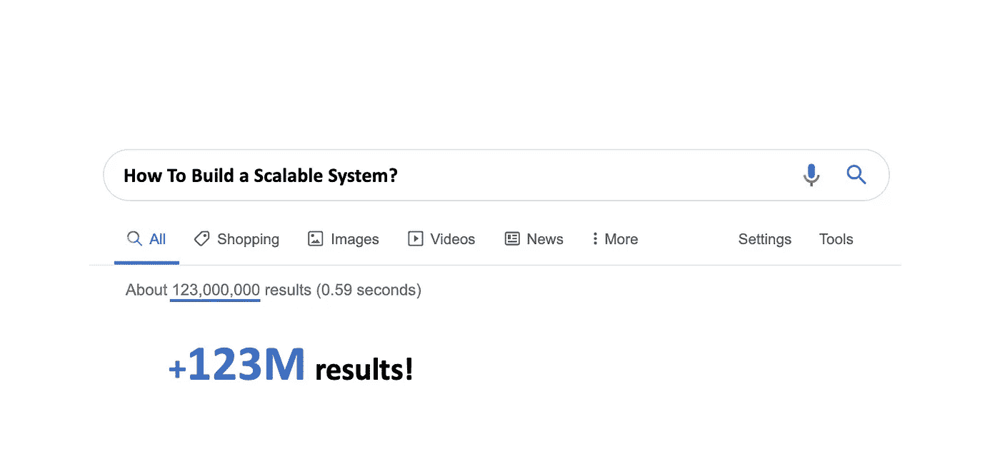
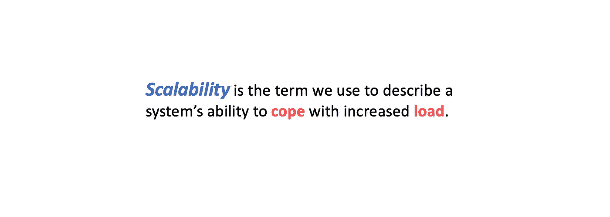
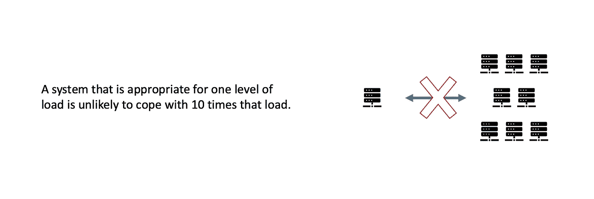
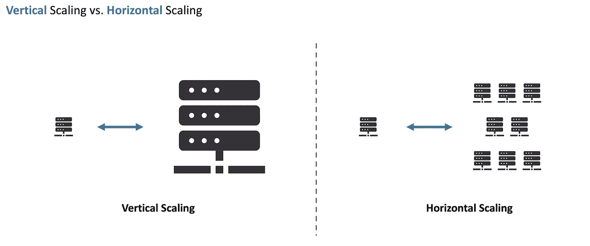

# 什么是“可扩展”的服务？

> 原文：<https://blog.devgenius.io/what-is-a-scalable-service-f57c8f2262f7?source=collection_archive---------6----------------------->

你最近谷歌过关于可伸缩系统或可伸缩性的东西吗？Google 上有超过 **123M** 的结果，+ **10k 的研究论文，+100k 的关于可扩展性的教程/博客**。

可伸缩性成为软件工程师的必备技能。如果你想在大公司工作(比如亚马逊、谷歌、优步)，你“必须”知道构建一个可扩展的系统是什么，以及如何构建。他们处理大量数据，因此他们构建的任何东西都必须是可扩展的。

# 什么是可伸缩性？

根据定义，**可伸缩性**是我们用来描述系统应对增加的负载的能力的术语。对于一个给定的系统，可能有许多不同类型的负载，所以贴上一个一维标签是没有意义的。更确切地说，我们应该增加一点上下文，比如说:这个系统可以扩展到每秒 1 亿个请求或 1 万个并发用户。

# 如何评估可扩展性？

在评估系统的可伸缩性方面之前，您需要描述两件事情:

*   首先，您需要描述您正在处理的负载类型。
*   其次，您需要描述我们需要针对负载监控系统的哪个性能。

## **1。如何描述负载？**

负载可以用几个#来描述，我们称之为负载参数，这些参数在很大程度上取决于您的系统架构。

如果您正在构建一个类似于 **Twitter** 的系统或应用程序，您会对您的系统每秒收到多少请求或查询感兴趣。或者，您可能对“阅读数”与“写数”操作感兴趣，这将告诉您发布推文的人数与查看家庭时间线的人数之间的比例。

另一个例子是视频流应用，如**网飞**。他们的主要服务是向用户提供视频流，因此他们对性能如何随着活动视频流连接数的增加而变化感兴趣。

如果你想构建一个像 messengers 或 WhatsApp 这样的应用程序，你可能会对聊天室中并发用户数的性能变化感兴趣。

一旦选择了负载参数，就需要选择要查看哪些性能指标，以便监视系统如何处理不断增加的负载。

## **2。如何描述性能？**

合适的指标很大程度上取决于您的系统架构。

如果你在处理像 Twitter 或 WhatsApp 这样的系统，你会对用户的响应时间感兴趣。

> **响应时间**是客户端所经历的:
> 处理请求的实际时间+潜在的网络和排队延迟。

另一个例子是视频流应用，如**网飞**。衡量此类应用性能的一种方法是查看比特率。

> **比特率**帮助您了解用户体验的视频质量。

因此，通过负载参数和性能指标，您可以判断系统是否能够应对增加的负载。换句话说，您可以通过查看性能指标来判断**一个系统对于所选择的负载参数是否是可伸缩的**。

# 如何应对负荷？

实际上，有两种不同的方法来应对增加的负载:

*   增加资源
*   重新设计或重新架构系统

> 需要注意的一点是，不存在通用的、一刀切的可扩展架构。没有神奇的去鳞酱。

此外，适用于一级负载的系统不可能应付 10 倍的负载。

## 1.增加资源

关于资源，您可以垂直或水平扩展您的系统

*   纵向扩展意味着用更高端的机器替代。这可能会变得非常昂贵。此外，在单台机器上可以进行的扩展是有限度的。
*   水平扩展意味着将负载分布在多个较小的机器上。如果您的系统不是围绕“无共享”架构构建的，这可能会增加系统的复杂性。'

## 2.重新设计系统

仅仅增加资源可能不足以应对增加的负载。在这种情况下，您可能需要重新设计您的系统。请注意，设计一个可伸缩的系统是特定于单个应用程序的。

> 一个适合特定应用的架构是基于这样的假设构建的，即哪些操作是常见的，哪些是罕见的。

我希望你现在明白一个可扩展的系统意味着什么。如有疑问，欢迎在下方评论。

干杯。