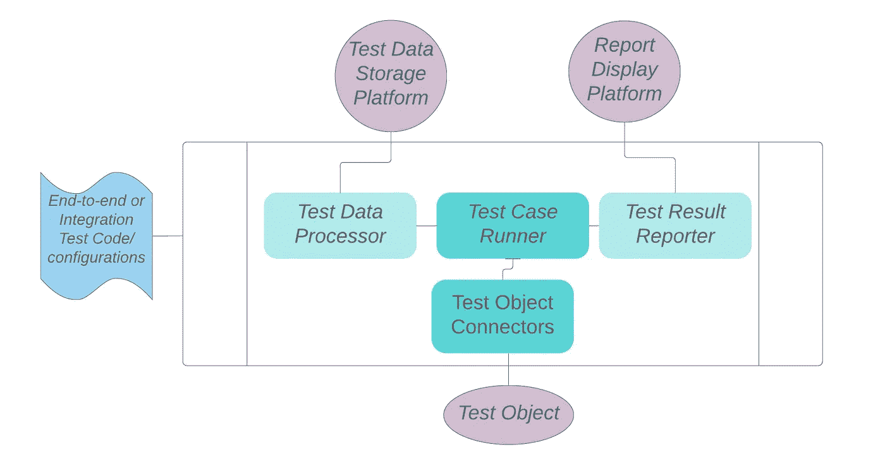

# 什么是测试自动化框架？

> 原文：<https://blog.devgenius.io/what-is-a-test-automation-framework-58404edf4ce8?source=collection_archive---------39----------------------->

软件测试自动化框架到底是什么？

市场上有各种各样的开源和商业测试自动化框架。他们经常突出他们的杀手锏或者用一堆形容词列出优势。

首先，这种方法非常混乱。如果我想开发自己的测试自动化框架，我应该从哪里开始呢？如果我想得到他们的一部分好的功能，并融入我的工作，我应该看哪一部分？如果我想在这些框架中进行比较和选择，它们的等价部分是什么？

下面是一个测试自动化框架的通用蓝图。有了这个通用模型，您就可以清晰而容易地在测试自动化框架中导航。

一个基本的测试自动化框架由四个关键组件组成——测试数据处理器、测试用例运行器、测试结果报告器、测试对象连接器。

**测试用例运行器**

这是一个测试自动化框架的核心，它提供了分组、组织和运行你的测试用例的方法。

有些还定义了接口和规则，以便轻松连接其他部分。它还可以包括一些库或助手来断言和确认测试结果。Java 中的一个经典例子是 JUnit。

**测试数据处理器**

这部分提供了处理测试数据并传递给测试用例的方法。它可以是 csv 阅读器、文本文件阅读器、自己用该语言编写的数据库连接器，或者是您集成到提供这种功能的框架中的现有工具集库。

它与测试数据存储平台对话，例如数据库、文件系统。例如，TestNG 构建在 JUnit 之上，但是做了许多增强，其中一个特性是围绕这个测试数据处理器@DataProvider，支持数据驱动测试。对于不同的场景，可以将一组测试数据放入一个测试用例中。

**测试结果记者**

一个为开发和管理团队提供测试结果的好而简单的解决方案是绝对必要的组件，它应该与各种报告显示平台集成。

最简单的方法是，每个测试套件运行都会生成一个测试结果，向团队发送一封通知电子邮件或 slack 消息。一个更有趣的例子是，许多商业 UI 测试自动化框架为您提供了一个仪表板来检查运行的统计数据，以及每次运行的细节，包括截图或视频。

**测试对象连接器**

这是定义测试框架和测试对象之间的通信的块。对于 API 自动化测试，它将是发送和接收 http 调用的组件。一个流行的 Java 库是放心的。对于 UI 自动化，selenium 扮演着与浏览器对话的角色。

定义了这些关键组件之后，当测试人员使用测试自动化框架来添加自动化测试或套件时，剩下要做的唯一事情就是为不同的环境定义配置，为测试用例编写实际的业务逻辑，并提供测试数据。

对于任何语言，开源自动化框架通常都有这些组件，或者它是一个专注于一个部分的库，那么作为一个测试自动化工程师，您可以基于它们和您的业务需求来挑选、定制和构建您自己的框架。一些商业框架建立在流行的开源项目之上，但是通常在免费版本上以更好的方式提供这些功能，并为更好的功能和更容易与其他第三方组件集成而收费。