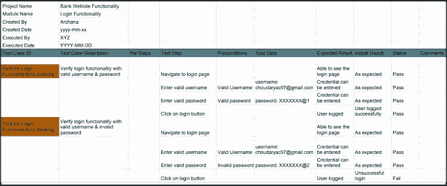

# 什么是测试用例？以及如何创建测试用例？

> 原文：<https://blog.devgenius.io/what-is-a-test-case-and-how-to-create-a-test-case-9e486ac3665f?source=collection_archive---------26----------------------->

[斯科特·格雷厄姆](https://unsplash.com/@sctgrhm?utm_source=medium&utm_medium=referral)在 [Unsplash](https://unsplash.com?utm_source=medium&utm_medium=referral) 上拍照

QA 分析师通常会编写一两个在不同项目中经常使用的模板，所以在开始编写或创建您的第一个模板时，尽量花时间使它尽可能地完美和完整，因为作为一名测试人员，您只是通过填充测试用例的空白来重用它。

**维基百科**定义:

“在软件工程中，测试用例是对输入、执行条件、测试程序和预期结果的说明，它定义了为实现特定的[软件测试](https://www.blogger.com/blog/post/edit/2162707874189440797/6607472301305748667#)目标而要执行的单个测试，例如练习特定的程序路径或验证是否符合特定的要求。”

**测试案例或标题主题中有哪些重要内容？**

*   测试案例参考号
*   测试步骤
*   测试数据
*   前提
*   后置条件
*   测试总结
*   测试标题
*   预期结果
*   实际效果
*   笔记
*   状态(通过/失败)

以下列表不应被视为按顺序排列，列表的顺序是根据测试者自己的观点。作为一名测试人员，你有权力选择你的测试用例看起来如何，因为它反映了测试人员对测试用例质量的看法。可以理解？清楚了吗？完整？

测试计划和测试用例通常是你的主管看到你的文档工作有多好的第一步。所以就像之前说的，总是准备好两个完全准备好的样品或模板。

陈述显而易见的事实很容易，测试人员只需使用 excel 创建一个表格，并使用上面的列表创建一组清晰的列，但这只是开始，因为您的模板确实只需要上面的列表，但填空才是真正最重要的。

**编写清晰测试用例的步骤？**

1.  该场景的一个简单测试用例
2.  为了执行测试用例，您需要测试数据
3.  为了执行测试用例，测试人员需要在 AUT 上执行一组特定的操作
4.  测试用例的目标是检查 AUT 的行为以获得预期的结果
5.  除了您的测试用例之外，可能还有一个字段，比如 Pre-Condition，它指定了在测试运行之前必须准备好的东西。

**起草测试用例时，包括以下信息**

*   正在测试的需求的描述
*   如何测试系统的说明
*   测试设置类似于被测应用程序的版本
*   软件
*   数据文件
*   操作系统
*   五金器具
*   安全访问
*   物理或逻辑日期
*   一天中的时间
*   先决条件，例如其他测试以及与被测试的需求相关的任何其他设置信息
*   输入和输出或行动和预期结果
*   有证据或附件吗
*   使用主动案例语言
*   测试用例不应超过 15 个步骤
*   一个自动化的测试脚本被注释了输入、目的和预期的结果
*   该设置提供了先决条件测试的替代方案
*   对于其他测试，这应该是一个不正确的业务场景顺序

**创建高质量测试用例的技术**

1.  测试用例需要简单透明
2.  以最终用户(客户)的心态创建一个测试用例
3.  避免测试用例重复
4.  应该避免测试用例假设
5.  确保 100%覆盖整个项目细节
6.  测试用例必须是可识别的
7.  实施测试技术
8.  自我清洁
9.  测试用例应该能够用不同的测试人员生成相同的结果
10.  同行审查

**测试用例管理工具**

测试管理工具是帮助管理和维护测试用例的自动化工具。测试用例管理工具的主要特征是

1.  用于记录测试用例
2.  执行测试用例并记录结果
3.  使用 bug 跟踪器自动跟踪缺陷
4.  可追踪性
5.  保护测试用例

**资源**

*   请注意，使用的模板将因项目而异。阅读本[教程](https://www.blogger.com/blog/post/edit/2162707874189440797/6607472301305748667#)来学习测试用例模板以及重要字段的解释。

如果您正在寻找我们的服务，请点击下面的网站:

[StackedQA 网站](https://www.stackedqa.com/)

查看我们的社交媒体:

[脸书](https://www.facebook.com/StackedQA)，[推特](https://twitter.com/stackedqa)， [Instagram](https://instagram.com/stackedqa) ，&Linkedin