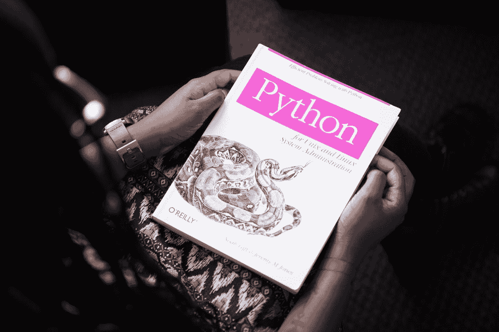

# Python 中什么是类型提示？

> 原文：<https://blog.devgenius.io/what-is-a-type-hint-in-python-37040029a87f?source=collection_archive---------7----------------------->



如果您在这里，您可能想了解 Python 中称为**类型提示**的概念。

在 Python 3.5 中，您可以在函数中使用类型提示。

让我们首先通过例子来学习，因为这是熟悉的最快方法。让我们来看一个函数，它以两个数字作为参数，然后逻辑是这样的，它将这两个数字相加，然后返回这两个数字的和。

```
def add(x, y):
   return x + y
```

很简单，对吧？让我们给函数添加类型提示。

```
def add(x: int, y: int) -> int:
   return x + y
```

让我们具体分析一下我们在那里做了什么。

对于两个参数中的每一个，分别为`x`和`y`，我们添加了`: int`。这基本上告诉我们这些参数的类型是什么。

我们还在函数声明的末尾添加了一个`-> int`。这告诉我们函数的*返回值*类型是什么。因为我们返回的`x + y`是两个整数参数的整数值和，所以我们知道返回值也是一个整数。

关于类型检查，需要知道的重要一点是，在运行时不会检查这些类型提示。事实上，正如 PEP 484 所述，它们从来都不是强制性的:

> 还应该强调的是, **Python 仍然是一种动态类型语言，作者们并不希望强制使用类型提示，即使是按照惯例。**

相反，它们的工作方式是，您可以在源代码上运行独立的类型检查器来 lint 代码。您可以研究的一个这样的工具是 [mypy](http://mypy-lang.org/) 。

类型检查的另一个好处是，它可以使代码对人类来说更具可读性。当你看这个函数的时候，可能不会马上清楚变量`x`和`y`是什么类型。在这种情况下，有足够的上下文信息来假设它们很可能是整数，但是当您进入更抽象和复杂的函数时，类型提示对于理解代码到底在做什么非常有用。

在某种程度上，类型提示用来记录你的代码，而不需要做单独的注释行，或者只是让代码含糊不清。

类型提示也有助于促进真正考虑函数所使用的类型，从而更好地设计程序。

话虽如此，在定义函数时，类型提示确实需要做更多的工作。如果你没有开始做的话，回过头来准确地添加它们可能会有点棘手。从长远来看，你可能会节省一些时间，所以这通常是一个很好的权衡。

初学者可能不必太担心类型提示，因为它可能会使事情复杂化，但这并不是说这是一个困难的概念。一旦开发人员对 Python 的基础有了足够的了解，类型提示实际上是一个很好的实践，可以帮助他们成为更好的开发人员，并帮助任何人阅读他们的代码。

总的来说，更深入地挖掘自己并在 Python 代码中添加类型提示是值得的——您可能会发现这样做是有好处的。

[](https://tremaineeto.medium.com/membership) [## 通过我的推荐链接加入 Medium—Tremaine Eto

### 作为一个媒体会员，你的会员费的一部分会给你阅读的作家，你可以完全接触到每一个故事…

tremaineeto.medium.com](https://tremaineeto.medium.com/membership)