# ASP.NET 核心 6 中的 AddEndpointsApiExplorer 是什么

> 原文：<https://blog.devgenius.io/what-is-addendpointsapiexplorer-in-asp-net-core-6-64ba52d15979?source=collection_archive---------4----------------------->

当我的同事问我为什么要添加这项服务，它有什么用途时，我正在检查我的[附带项目—待办事项](https://medium.com/@jiang.tingyu/side-project-todo-list-fc72892ba392?source=user_profile---------1----------------------------)？

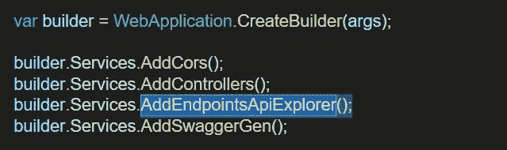

我当时没有答案。我所知道的是，当你创建一个 web API 项目时，它会附带一个默认模板。

可能因为这是 ASP.NET 核心 6 的一项新服务，还很新，网上没有太多关于它的信息。在追踪了一些源代码后，我发现了以下内容。

# 回答:

> `AddEndpointsApiExplorer` *是生成* **所需的霸气** *是生成* **所需的最小 API**

## 什么是最小 API？

**最小 API**是一种在没有控制器/动作的情况下映射`Program.cs`中端点的方式

```
app.MapGet(“/”, () => “Hello World!”);
```

创建新的 web API 项目时，您可以选择是否使用最小 API。

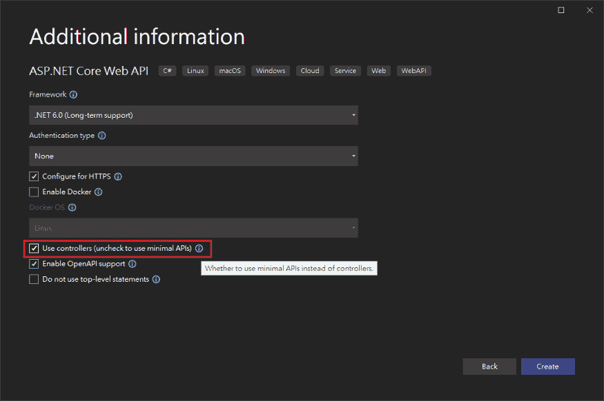

如果使用 dotnet CLI `dotnet new webapi`创建，也可以设置该选项。

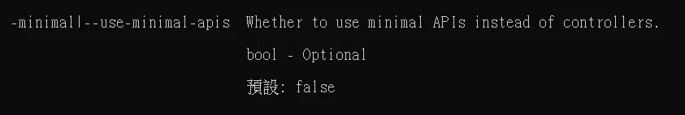

默认值:false

**使用最小 API** v.s. **使用控制器**

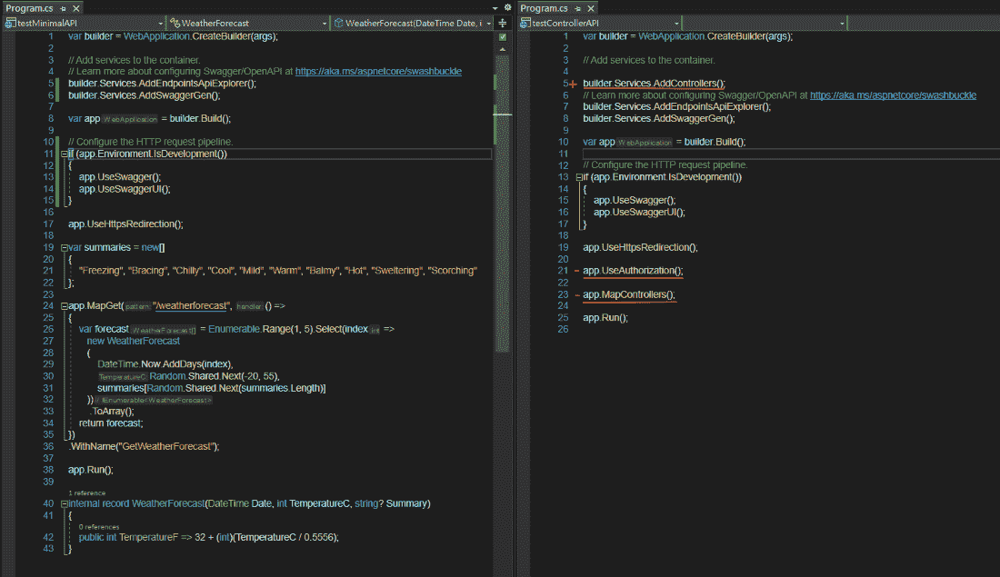

默认情况下，用`Use Controller`创建的项目会附带`AddControllers`服务。重要的是`AddControllers`调用添加了`IApiDescriptionGroupCollectionProvider`服务的`AddApiExplorer`。

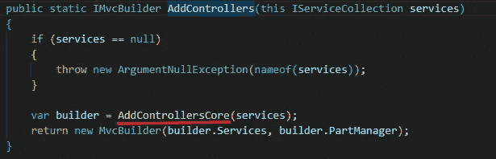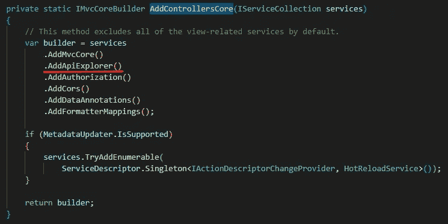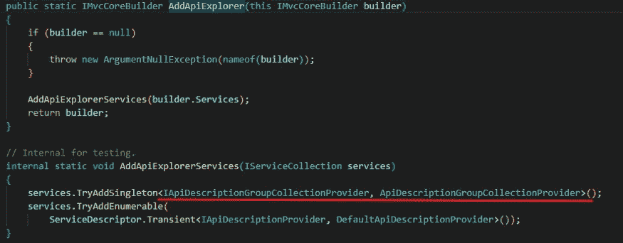

你可以从它的名字看出，`IApiDescriptionGroupCollectionProvider`是用来获取*API description group collection*的服务，你也可以从它的名字看出它是一个包含 API 信息的集合。

以下是**API 描述**中的一瞥:

```
public class ApiDescription
{
    /// <summary>
    /// Gets or sets <see cref="ActionDescriptor"/> for this api.
    /// </summary>
    public ActionDescriptor ActionDescriptor { get; set; } = default!;

    /// <summary>
    /// Gets or sets group name for this api.
    /// </summary>
    public string? GroupName { get; set; }

    /// <summary>
    /// Gets or sets the supported HTTP method for this api, or null if all HTTP methods are supported.
    /// </summary>
    public string? HttpMethod { get; set; }

    /// <summary>
    /// Gets a list of <see cref="ApiParameterDescription"/> for this api.
    /// </summary>
    public IList<ApiParameterDescription> ParameterDescriptions { get; } = new List<ApiParameterDescription>();

    /// <summary>
    /// Gets arbitrary metadata properties associated with the <see cref="ApiDescription"/>.
    /// </summary>
    public IDictionary<object, object> Properties { get; } = new Dictionary<object, object>();

    /// <summary>
    /// Gets or sets relative url path template (relative to application root) for this api.
    /// </summary>
    public string? RelativePath { get; set; }

    /// <summary>
    /// Gets the list of possible formats for a request.
    /// </summary>
    /// <remarks>
    /// Will be empty if the action does not accept a parameter decorated with the <c>[FromBody]</c> attribute.
    /// </remarks>
    public IList<ApiRequestFormat> SupportedRequestFormats { get; } = new List<ApiRequestFormat>();

    /// <summary>
    /// Gets the list of possible formats for a response.
    /// </summary>
    /// <remarks>
    /// Will be empty if the action returns no response, or if the response type is unclear. Use
    /// <c>ProducesAttribute</c> on an action method to specify a response type.
    /// </remarks>
    public IList<ApiResponseType> SupportedResponseTypes { get; } = new List<ApiResponseType>();
}
```

我们都知道 Swagger 是为你生成 API 文档的工具。这样做所需的信息来自服务`IApiDescriptionGroupCollectionProvider`。

最小 API 不使用控制器，也不添加`AddControllers`服务。因此他们没有足够的信息来源让 Swagger 施展它的魔法。

`**AddEndpointsApiExplorer**` **正在修复这个问题！！！**

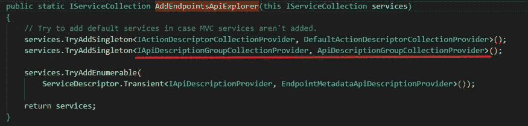

# 演示

当使用`AddEndpointsApiExplorer`创建最小 API 项目时，我们可以看到 Swagger 像预期的那样工作，API 也是如此。

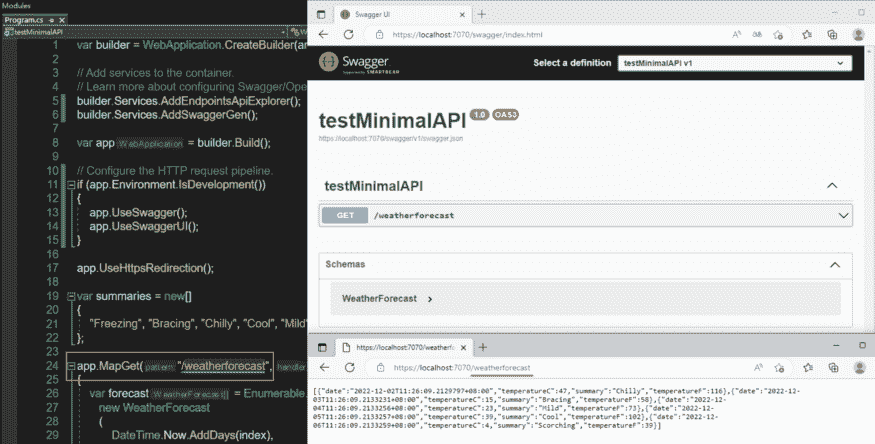

如果我们注释掉`AddEndpointsApiExplorer`，就会出现一个错误，说 SwaggerGenerator 因为缺少`IApiDescriptionGroupCollectionProvider`服务而失败。

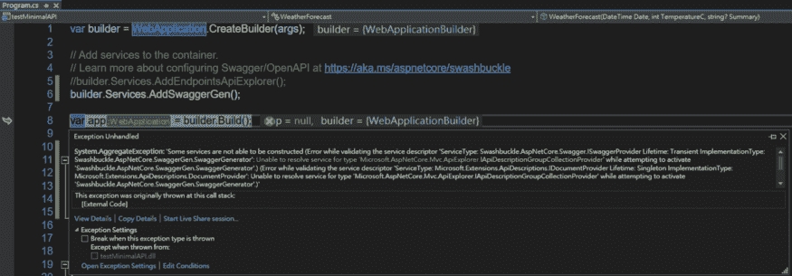

如果我们一起注释掉 Swagger，它运行成功。当然，没有 Swagger UI。但是 API 仍然有效。

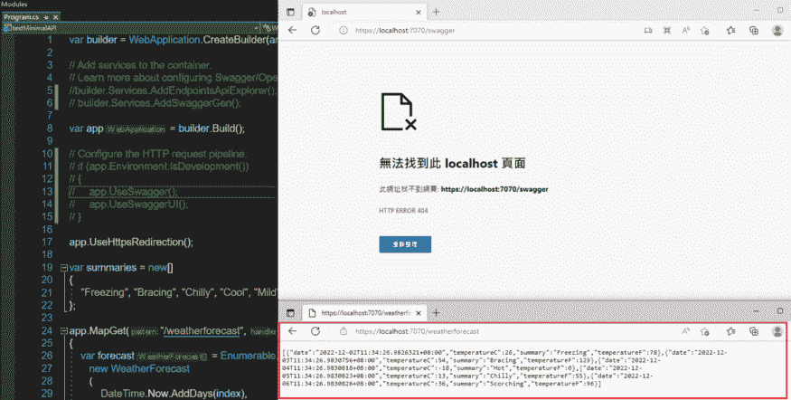

我们再来看看这个对比。有无控制器的例子都有`AddEndpointsApiExplorer`。这意味着在常规的控制器 API 项目中允许使用最少的 API。

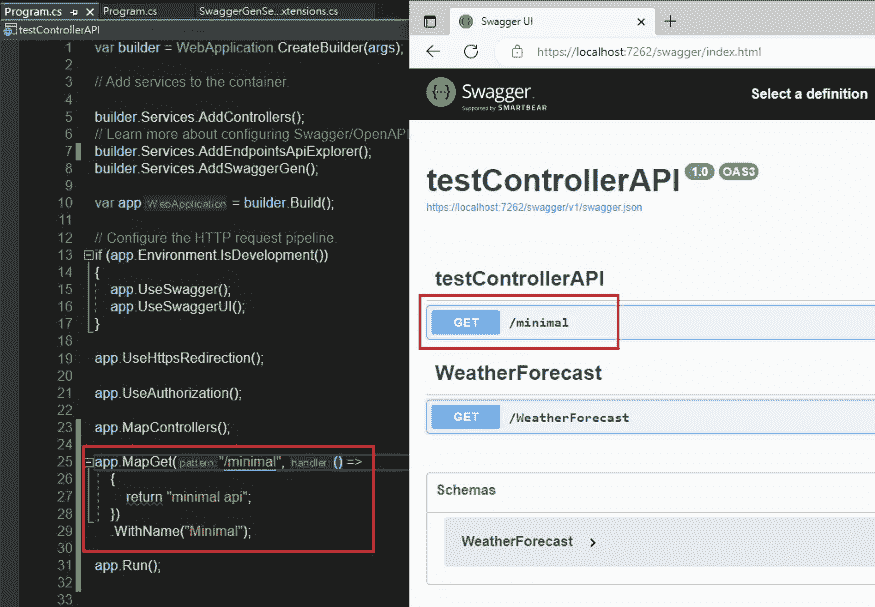

如果我们评论`AddEndpointsApiExplorer`，最小 API 会在 Swagger 上消失。

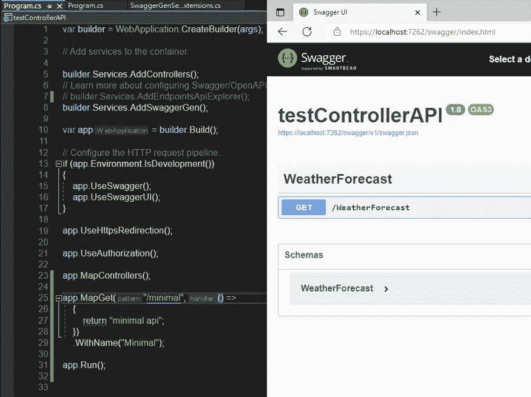

# 结论

如果您正在使用最小的 API，并且还想使用非常方便的 Swagger，请添加服务:

```
builder.Services.AddEndpointsApiExplorer();
```

另一方面，如果你只是用常规的控制器方式构建你的 Web API 项目，删除`AddEndpointsApiExplorer`是没问题的。

中文版:

[](https://medium.com/@jiang.tingyu/net-6-addendpointsapiexplorer-c4859dfddad6) [## 。NET 6 — AddEndpointsApiExplorer

### 上次請人幫我看我的 Side Project — Todo List 的時候被問到，Program.cs 裡為什麼要加 builder.Services.AddEndpointsApiExplorer(); 這行？這行是幹甚麼的？

medium.com](https://medium.com/@jiang.tingyu/net-6-addendpointsapiexplorer-c4859dfddad6) 

# dot net 6 # web API # minimal API # addendpointexplorer