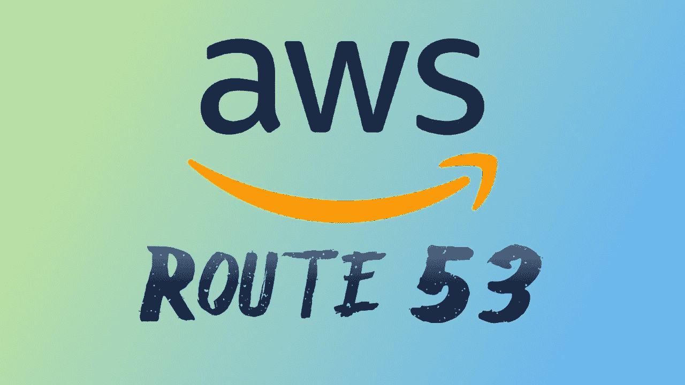

# 简而言之，什么是亚马逊网络服务(AWS)路线 53？

> 原文：<https://blog.devgenius.io/what-is-amazon-web-services-aws-route-53-in-short-and-simple-terms-97e4ee0f339c?source=collection_archive---------9----------------------->

以尽可能最短的方式，Route 53 是一个亚马逊网络服务(AWS)产品，它允许你将 example.com 这样的名字翻译成 192.0.2.1 这样的底层数字 IP 地址。这些 IP 地址是计算机用来相互连接的地址，终端用户知道这些地址并不重要。

像 example.com 这样的名字到 IP 地址的转换本质上就是所谓的 DNS，或域名系统。每当用户向域名发送请求时，与 DNS 相关联的服务器翻译像 example.com 这样的人可读的域名，并将其映射到 IP 地址。

Route 53 还允许健康检查服务，告诉您一个端点是否正常。如果不是，那么 Route 53 足够智能，可以向任何健康的端点发送消息，或者警告网站后面的人有任何不健康的端点。

Route 53 还允许你购买像 example.com 这样的名字，然后自动为它配置任何 DNS 设置。53 号公路的竞争对手包括 Cloudfare、谷歌云、Azure、GoDaddy 等。

Route 53 的很大一部分是内置的功能，可以将用户路由到 AWS 资源，如亚马逊 EC2 实例、亚马逊 S3 桶和弹性负载平衡负载平衡器。然而，Route 53 不仅限于 AWS 中的资源，还可以将用户路由到外部。

如果你有一个像 example.com 这样的域名，你也可以把它移植到 Route 53 来管理。

如果您有 DNS 记录，它们会列在 Route 53 中的“托管区域”下。根据 53 号公路的文档，我们在这里进入了一个不那么简单的领域，但基本上，托管区域可以支持以下 DNS 记录:

*   (地址记录)
*   AAAA (IPv6 地址记录)
*   CNAME(规范名称记录)
*   认证机构授权
*   邮件交换记录
*   名称授权指针记录
*   名称服务器记录
*   指针记录
*   授权记录的开始
*   发件人策略框架
*   服务定位器
*   文本记录

另外，Route 53 支持一种叫做*别名记录*的东西，这是 Route 53 和 AWS 特有的。正如我前面提到的，这些基本上是将流量路由到 AWS 资源的记录。

AWS 的 [Route 53 FAQ](https://aws.amazon.com/route53/faqs/) 提到，这包括“亚马逊弹性负载均衡负载平衡器、亚马逊 CloudFront 发行版、AWS 弹性 Beanstalk 环境、API 网关、VPC 接口端点和亚马逊 S3 桶”。它还说，“使用别名记录，您可以将您的记录名称(example.com)映射到 AWS 资源的 DNS 名称(elb1234.elb.amazonaws.com)。”

另一个需要注意的是，53 号公路背后有一个定价模型，这是 AWS 在总体上旋转的原因(所以这个事实不应该太令人惊讶)。

然而，有了 Route 53，你不需要支付任何前期费用或任何东西，你也不需要估计你的域名会被多少个查询访问。

取而代之的是，你要为你所使用的东西付费。这意味着每个月，你会为每个托管区域付费，你会为 Route 53 回答的每个查询付费，但 AWS 表示，“映射到弹性负载平衡实例、CloudFront 发行版、AWS 弹性 Beanstalk 环境、API 网关、VPC 端点或亚马逊 S3 网站桶的 Alias A 记录除外，这些都是免费提供的”。

最后，你将为每一个由 Route 53 注册或管理的域名(如 example.com)付费。这个模型和你想象中的 GoDaddy 没有什么不同。

为了说明这一点，下面是上述每种产品的定价:

# 托管区域

*   前 25 个托管区域每月每个托管区域 0.50 美元
*   额外托管区域每月每托管区域 0.10 美元

# 问题

## 标准查询

*   每百万次查询 0.40 美元—每月前 10 亿次查询
*   每百万次查询 0.20 美元—每月超过 10 亿次查询

## 基于延迟的路由查询

*   每百万次查询 0.60 美元—每月前 10 亿次查询
*   每百万次查询 0.30 美元—每月超过 10 亿次查询

## 地理 DNS 和地理邻近查询

*   每百万次查询 0.70 美元—每月前 10 亿次查询
*   每百万次查询 0.35 美元—每月超过 10 亿次查询

53 号公路还向你收取一些其他费用，所以我鼓励你在做出任何重大决定之前，仔细查看一下他们的[定价](https://aws.amazon.com/route53/pricing/)。

我希望这能让你对 53 号公路有个大致的了解。更多细节，你可以阅读[53 号公路常见问题](https://aws.amazon.com/route53/faqs/)，这是大部分信息的来源。

如果你觉得这篇文章很有帮助或者只是喜欢阅读它，考虑[注册成为一个媒体成员](https://tremaineeto.medium.com/membership)。每月 5 美元，你可以无限制地阅读媒体上关于软件、技术等主题的报道。如果你用我的链接注册，我会得到一小笔佣金。

 [## 通过我的推荐链接加入 Medium—Tremaine Eto

### 作为一个媒体会员，你的会员费的一部分会给你阅读的作家，你可以完全接触到每一个故事…

tremaineeto.medium.com](https://tremaineeto.medium.com/membership)