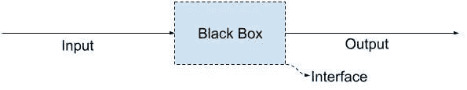
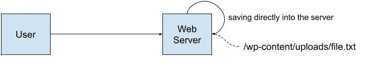
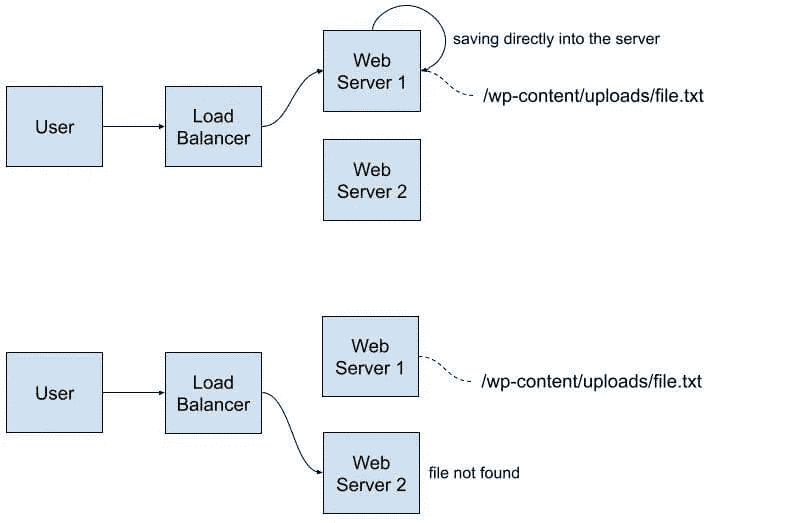
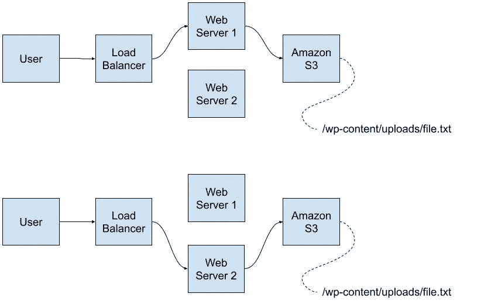
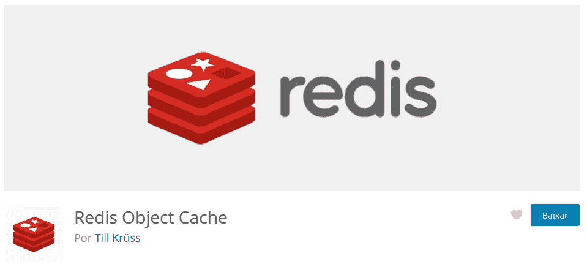

# 什么是 API？

> 原文：<https://blog.devgenius.io/what-is-an-api-ac88130c5ebb?source=collection_archive---------16----------------------->

你知道什么是 API 吗？为什么使用你喜欢的框架的 API 很重要？你听说过接口和黑盒吗？在本帖中，我们将用例子来谈论所有这些话题。

我本来打算写为什么你应该使用 WordPress 的 API，但是我不得不回到很多概念上，我们不得不开始讨论什么是 API。这篇文章面向初级和高级开发人员。是的，我们将讨论*的概念*，但不要离开，这些是一些重要的概念。

> *API 是* ***应用编程接口*** *的缩写。但是这到底意味着什么呢？！*


“应用”和“编程”是容易的部分。是我们需要更好理解的“接口”。

# 什么是接口？

一个接口无非是外层，**与外部**连接的部分，保持内部的安全。

我们每天都在处理这个概念，如果不可能，我们会抓狂。想象一下，如果你必须知道你周围一切的来龙去脉！一些界面示例:

*   **图形界面:**你点击，程序执行。你不需要知道它是如何工作的，如果你点击它，它就会做你想做的事情，这才是最重要的。
*   **在餐馆点餐:**你下订单，然后收到食物。他们有多少厨师，锅的颜色，或者炉子的品牌都无关紧要。
*   感觉系统:你不需要知道你的身体*是如何闻到*某种东西的，它只是为你做了这些。


整个想法基于*输入*和*输出*的概念。给定一个输入，期望一个输出，忽略实现。

这种输入-输出-内部无关的概念我们称之为**黑盒**。这里有一个重要的区别:

*   黑盒就是我们所说的接受输入并返回输出的东西，而不一定揭示它是如何创建输出的。
*   **一个接口就是你如何与系统**连接，确切的预期输入是什么(一个数字，两个数字，一个字符串)以及输出会是什么样子(另一个数字，另一个字符串)。这就像一份合同。



# OOP 中的接口

这里我必须开一个简短的括号。接口也是面向对象编程中非常重要的东西。想法是完全一样的:如果一个类声明它实现了某个接口，它就需要实现该接口的所有方法。我将把关于接口的官方 PHP 文档留在这里，但是如果这是你想在另一篇文章中看到的话题，请留下评论。

# 好吧…我们现在可以回到 API 了吗？

这里是真正的帖子开始的地方！让我们回到缩写:

> ***应用*** ***编程*** ***接口*** *是应用*的一部分，只能通过一组有输入和输出的方法组成的代码来访问，与它们的实现*无关。*

现在更有意义了吗？


(对于抱怨者来说，是的，我知道你可以用浏览器访问 REST API，但这不是它的预期用途。)

# WordPress 的 API

当我有写这篇文章的想法时，我打算谈谈使用 WordPress 内部 API 的重要性。WP 有很多这样的 API，我们已经在这里(用葡萄牙语)讨论过其中的一些了:[瞬态 API](https://felipeelia.com.br/cache-facil-no-wordpress-transients-api/) 和[设置 API](https://felipeelia.com.br/como-criar-uma-tela-de-configuracao-para-o-seu-plugin-wordpress-com-a-settings-api-parte-1/) 就是一些例子。WordPress API 的完整列表可以在 https://developer.wordpress.org/apis/获得。

> 但是我们为什么要使用这些 API 而不是简单地直接在数据库中写一些东西或者在服务器中保存一个文件呢？

原因有很多，我们来查一下其中的一些。

**注:**这些概念不是孤立的，而是互补的。此外，我没有试图涵盖所有可能的方面，所以请在评论部分随意探索任何其他方面。

# 关注点分离

这是一个旨在将应用程序分成模块的原则，每个模块只负责一件事。这些模块使用——你猜对了——接口相互通信。这样，**创建产品的代码与处理订单的代码**分开，只有*调用*负责存储数据的模块。

不幸的是，许多年前，经常可以看到 PHP 应用程序多次调用`mysqli_real_connect`和类似的东西。今天，这不再是现实。例如，在 WordPress 中，我们有`wpdb`类，其他框架使用 ORM，但是每次需要存储/保存一些数据时，都有一个我们可以依靠的抽象层。


# 可读性

我们不是为机器写代码，而是为其他人写代码。毕竟，我们说“代码是诗”是有原因的。也就是说，第一次看代码并理解它的作用是很重要的。

什么更容易理解？这

```
<?php
global $wpdb;
$wpdb->query(
	$wpdb->prepare(
		"INSERT INTO `$wpdb->options` (`option_name`, `option_value`, `autoload`)
			VALUES (%s, %s, %s)
			ON DUPLICATE KEY
			UPDATE
				`option_name` = VALUES(`option_name`),
				`option_value` = VALUES(`option_value`),
				`autoload` = VALUES(`autoload`)", 
		$option,
		$serialized_value,
		$autoload
	)
);
```

还是这个？

```
<?php
update_option( 'my_option', 'value' );
```

第二种选择，对吧？很容易理解，我们正在保存一个选项，如果我们想使用任何其他存储机制，如 Redis 或 Memcached(下面将详细介绍)，调用`update_option()`函数的软件部分不需要更改。


# 实际例子

> 使用 WordPress APIs 让生活变得更简单。有时，不使用它们会使项目不可行。

# 文件 API

这是一个经典案例。程序员使用`fopen`、`fclose`等功能保存文件。一切正常。项目增长了一点，**基础设施需要扩展，文件开始消失**。让我们看一些图表来更好地理解它。

# 直接保存到服务器(只有一个 web 服务器)



到目前为止，一切顺利。管理员用户将文件发送到单个服务器，当用户访问站点时，文件将会在那里。

# 直接保存到服务器(有多个 web 服务器)

现在让我们假设我们需要另一台服务器。在两个 web 服务器的前面，我们放置了一个*负载平衡器*，在它们之间分配流量。

如果我们将文件直接保存到服务器中，它将只存储在管理员用户上传文件的服务器中，而不是每次请求被发送到其他 web 服务器时都被发现。



# 把它保存在别的地方

通常，解决方案依赖于将文件保存在其他地方，比如亚马逊 S3 存储桶。它可以在任何地方，这里重要的是成为一个所有服务器都可以访问的地方。



# 我们如何解决这个问题？

这个例子的解决方案很简单，使用了一个[插件](https://github.com/humanmade/S3-Uploads)。

这里对我们来说最重要的是**插件将只为使用 WordPress 的文件 API** 的代码工作。它将不能改变对`fopen`的直接调用，而只能改变对`$wp_filesystem->put_contents()`或通过文件 API 传递的函数的调用。

# 瞬态 API

如果你阅读了[关于瞬态 API](https://felipeelia.com.br/cache-facil-no-wordpress-transients-api/) 的帖子和[官方文档](https://developer.wordpress.org/apis/handbook/transients/#function-reference)，你会发现它基本上由三个函数组成:`set_transient()`、`get_transient()`和`delete_transient()`。您可以快速实现三个函数来存储、获取和删除数据库中的值，但是您将失去一个最常用的提高性能的基础设施:**内存存储**。

放松，没什么大不了的。当我谈到[插件类型](https://felipeelia.com.br/tipos-de-plugin-do-wordpress/)时，我已经谈到了*插件*，其中之一就是`object-cache.php`。有了它，就可以用 Redis 或者 Memcached 之类的软件把东西存到内存里，而不是每次都去磁盘。内存访问比磁盘访问快，正因为如此，这些程序比数据库更快地返回数据。

如果您直接在数据库中存储东西，那么在基础设施中添加类似这些程序的东西不会有什么不同。另一方面，**如果你使用 WordPress 的 API，一个插件就足够了**，只需要配置和放置它的*插件*就可以了，一切都会自动运行。如果你想在 Redis 和 Memcached 之间转换，你也不需要担心，因为实现会改变，但是你使用的接口保持不变。



# WordPress REST API

几年前我已经谈过这个话题，但它仍然有用。如果你来到这里想了解更多关于 WordPress REST API 的信息，你可以查看另一篇文章。我很肯定你会喜欢的！

我知道这是一个大帖子。如果你能在你的社交网络上分享它，订阅时事通讯，并留下评论，你就帮了我大忙了。谢谢大家！