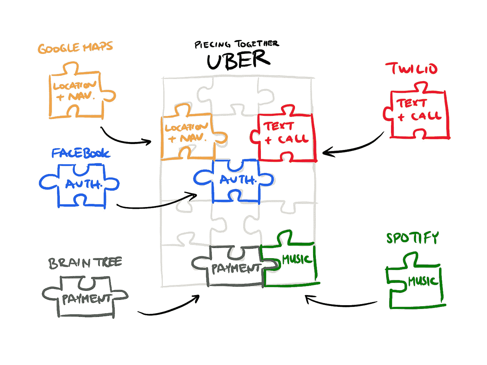
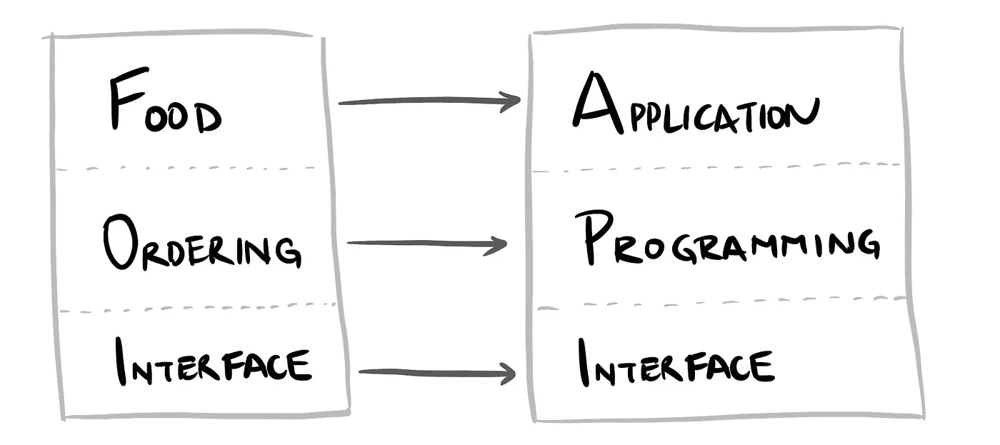

# APIs——“任何不这样做的人，都将被解雇”——Jeff B

> 原文：<https://blog.devgenius.io/what-is-an-api-cab00608993d?source=collection_archive---------35----------------------->

优步由 API 制成 Adi Pruthi & Ayan Dutta

TL；灾难恢复 APIs 正在成为业务增长的重要战略引擎。它们(例如 Twilio、Braintree、Stripe)使公司能够重新专注于提供价值差异化、拓展新市场和更快地构建软件。此外，创造数百万的新收入，提高灵活性，并降低技术成本。杰夫·贝索斯承诺如果人们不创造 API 就解雇他们。然而，API 并没有引起非技术高管的注意。我涵盖了如何向你的 CTO/CEO 解释 API，为什么他们应该关心，以及他们可以做些什么来采取行动。

自从醒来后，不知不觉中，你可能已经使用了 50 多个应用程序编程接口(API)。

在股票应用程序上查看市场？它从 Yahoo Finance API 中提取股票数据。

查看了你最喜欢的新闻应用程序？它从 ESPN、彭博、美联社的 API 中提取文章。

优步教育学院的家？优步使用

*   谷歌地图 API 为您的位置，找到司机，并绘制路线
*   Twilio API 让您实时了解“您的司机正在靠近”的信息
*   PayPal Braintree API 处理您的信用卡付款

优步的技术堆栈是如何由 API 构成的

API 公司正在悄悄地从根本上改变软件开发和推向市场的方式。科技前沿公司也注意到了这一点——Mulesoft 被 Salesforce 以 60 亿美元收购。谷歌地图 API 的货币化每年将产生 50 亿美元。VISA 以 53 亿美元收购了 Plaid 的支付处理 API。

> API 需要被视为一种资产

然而，他们并没有引起首席技术官/首席执行官的注意。正如装配线和劳动的专业化带来了实体经济中更快、更便宜、更好的商品一样，API 正在提高软件经济中的质量、速度和成本。

# 那么，你如何向你的 CEO 解释 API 呢？

简单和复杂的 API，最好通过一个类比来解释——一个餐馆菜单，或者我称之为“食物订购界面(FOI)”。

菜单就像一个界面(I ),我可以通过它点菜(O)。这是餐馆和顾客交换信息的约定方法(即订单)。FOI(即菜单)告诉我他们库存的所有东西，以及他们接受我的订单所需的信息。例如，' 3 ' '大份' '烤鸡' '汉堡'和'沙拉' '外带'。作为回报，我得到了一个产品(汉堡)和一项服务(烹饪)。

如果没有这个系统(FOI)，我走进去，不知道他们能提供什么，也不知道如何传达我的订单。所以，我不得不离开，回家自己做饭。常见的点餐界面(即菜单)是麦当劳和星巴克，无论在地球的哪个角落，它们(几乎)都是一样的——*可扩展和可重复*。

> “任何不这么做的人都会被解雇。谢谢大家；祝你愉快！”—杰夫·贝索斯，亚马逊的 API 指令

类似地，API 是数字菜单卡。它是接口(I ),开发者可以通过它编写应用程序(P)。API 告诉开发者什么数据或过程是可用的，以及如何提交“订单”来接收数据和/或过程。例如，优步应用程序可以使用 GoogleMaps API“订购”两个地点之间的旅行时间，或者从 Paypal“订购”支付处理服务。

API 就像食物菜单

# 为什么首席执行官要关心？

在 API 出现之前，公司在内部构建软件的每个组件——不管它们的核心竞争力如何。以吉恩·金小说《独角兽计划》中的汽车零部件公司 Parts Unlimited 为例。Parts Unlimited 发现自己是在捍卫而不是破坏。除了汽车零部件，他们还建立并管理自己的工资单和其他关键系统。就在 11 月的购物季之前，他们的工资系统大规模中断，导致 IT 部门转移，以确保员工能够正确获得工资。*技术债务*导致失去关注，导致产品推荐和交易捆绑 SKU 无法及时准备就绪。商店倒闭，销售额下降，这成了头条新闻。*没有一位首席执行官希望如此。*如今，大多数公司都通过 API 接入 ADP 的人力资源服务。

> 首席执行官们应该问首席技术官们，我们把宝贵的资源用在了什么地方，来重新创造在其他地方做得更好的东西？——丹尼尔·莱文，Accel

如今，新一代 API first 公司正允许他们的客户通过以下方式恢复干扰，而不是防御:

*   **专注于竞争差异化** —而不是重新创建已经在其他地方做得更好的数据和流程。公司可以重新分配工程资源，专注于创造差异化产品，并主导其市场。像优步和 AirBnB 这样的应用程序专注于微移动和策划体验。他们只需为全球交易处理(Paypal API)和电话服务(Twilio APIs)付费。这些服务明显更好，并受益于规模经济。
*   **快速扩展到新的市场和使用案例** —创造新的收入来源。谷歌地图最初是一款导航应用，现在已经渗透到几乎所有电子商务网站的“商店位置”中。房地产公司(Zillow，Compass)在谷歌地图上绘制他们的清单，像 Resy 和 Yelp 这样的餐厅搜索应用程序允许用户找到新的体验。PayPal 最初是为支付易贝拍卖而建立的，现在作为另一种支付方式出现在全球每个网站上。组织正在有效地创建一个店面，并允许其他人通过收取使用费的 API 插入他们的数据和流程。
*   **加速交付时间** —团队不需要从零开始。相反，他们通过以新的组合使用现有的 API 来创建新的应用程序。沃尔格林公开了他们的内部照片打印 API，允许大量流行的照片编辑应用程序提供沃尔格林的店内打印。这些应用程序比沃尔格林公司能够开发的任何东西都要好。新的店内群体也代表了客流量的增加，顾客参与度更高，每次访问的销售额也更高。重用 API 使汇丰将应用程序开发时间减少了 75%，每两周发布一次，而不是每季度一次。
*   **改善内部 IT 人员运营** —可以组织团队来构建和维护他们的 API，成为专家并拥有清晰的所有权线。开发人员使用彼此的资产，而不必等待许可。
*   **提高开发者生产力**，因为许多 API 都专注于让开发者更容易上手！在 AWS 和谷歌的推动下，这一领域取得了重大进展。这实质上是福特的装配线，它将生产 T 型车的时间从 12 小时减少到了 2.5 小时。

# 作为 CEO 应该怎么做？

问问你的工程团队:我们是否让内部/外部客户更容易使用我们的 API？我们在哪里投入宝贵的资源来重新发明轮子？

> 问问你自己，“我的工程团队每天是在防御还是在破坏？”

首席技术官和首席执行官现在有责任了解 API 如何在更快地构建新产品、进入新市场和提高运营效率方面发挥关键作用。或者冒着被软件吞噬世界的风险。

我与高增长软件公司合作，通过帮助高管解决人员、流程和技术障碍来避免“凤凰计划”。特别是与大规模动态数据和软件开发相关的问题。目前在 MongoDB。