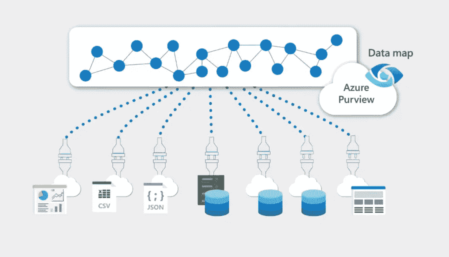
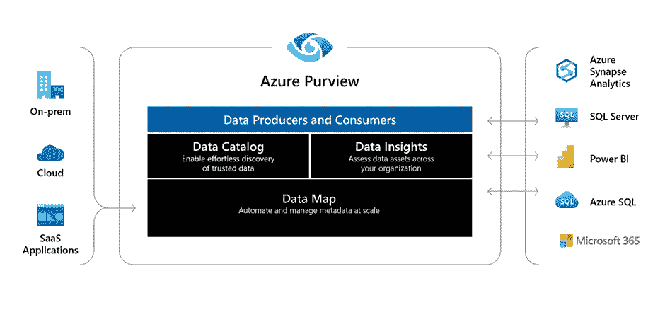
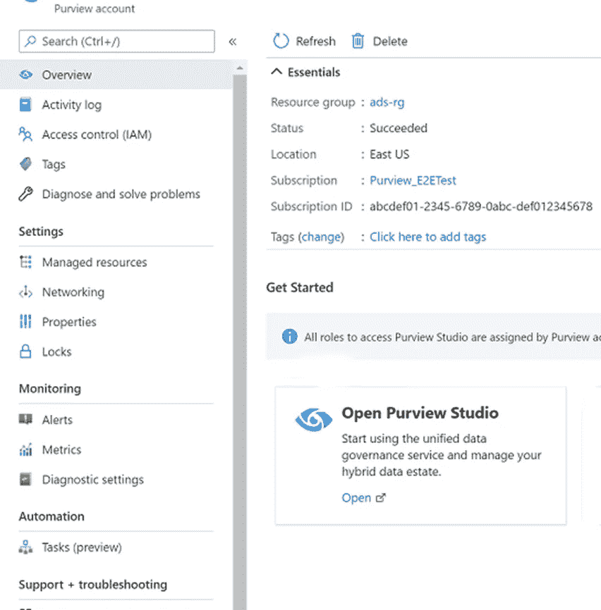

# Azure 权限是什么，如何连接 Azure SQL 数据库？

> 原文：<https://blog.devgenius.io/what-is-azure-purview-and-how-to-connect-it-with-azure-sql-database-aa5d046fd340?source=collection_archive---------4----------------------->

[https://working ondata . WordPress . com/2020/12/03/a-first-look-at-azure-view-data-governance-for-your-data-estate/](https://workingondata.wordpress.com/2020/12/03/a-first-look-at-azure-purview-data-governance-for-your-data-estate/)

数据管理一直是 IT 界面临的挑战。组织每天都在产生越来越多的数据。员工也很难处理和管理这些数据来获取有用的见解。如果有一种从收集到数据分析的完整数据管理服务会怎么样？Azure 权限是这个问题的答案。它是一种寻找、理解、管理和消费数据源的服务。在这篇文章中，我们将探索更多关于 Azure 的内容。

**Azure 的权限是什么，它能解决什么问题？**

大多数组织都在不断产生万亿字节的数据。为了消费和管理如此大量的数据，需要先进的工具。但是，如果您的资源部署在云上，那么您的资源和这些产品之间可能会有一些差距。从这些数据中提取最大值也很重要。数据源和数量将继续增长，您的组织处理这些数据将变得更加困难。在哪里寻找所需的数据？如何连接这些数据？数据来源如何分类？如何从这些数据中分析和提取信息？因此，图中的 Azure 权限是由微软 Azure 提供的基于云的 SaaS 服务，使组织可以轻松管理他们的数据源。

Azure 权限是一个完整的数据管理产品，适用于数据治理的各个方面，从数据发现和收集到扫描和分类。它还提供 Looker，Google BigQuery，AWS S3，Erwin，Salesforce，IBM db2 的数据扫描。

**权限资料图**

它是数据发现和有效数据管理的基础。这是一种 PaaS 服务，通过内置的分类系统和自动扫描保持最新。

**权限数据目录**

在通过权限数据图进行收集和分类后，将准备一个数据目录，帮助用户找到他们收集的特定数据。

**权限数据洞察**

它向团队提供了关于数据扫描的完整信息，例如哪些数据部分更敏感。

**如何连接 Azure SQL 数据库和 Azure 权限？**

因此，在这里我们将看到如何在 Azure 范围内连接 Azure SQL 数据源。

**创建权限账户**

1.  转到 Azure 门户并搜索权限帐户。
2.  在仪表板上，点击**创建权限账户。**
3.  现在填写详细信息，如订阅、资源组、权限帐户名和位置。权限帐户名称必须是唯一的。
4.  点击**审查+创建**，然后点击**创建。**这将在您的 Azure 门户中创建一个权限帐户。

**注册**

因此，下一步是在我们的权限帐户中注册数据库。

1.  打开 Azure 权限账户，然后选择 **Azure 权限工作室>** **数据地图。**

2.创建一个集合并分配所需的权限。Azure 权限中的集合基本上用于管理所有权和控制权。要了解更多关于集合层次结构和分配角色的信息，请访问此处的。

3.选择集合下的**来源**，然后点击**注册。**

4.搜索并选择 **Azure SQL 数据库。**提供数据源和服务器的名称。然后选择收藏并点击**应用。**

5.您将看到在所选集合下注册的数据源。

**扫描**

注册数据源后，您需要对其进行配置以进行扫描。数据扫描认证主要有四种方法:

● SQL 认证

●服务负责人

●用户分配的托管身份

●系统分配的托管身份

这里我们将使用 SQL 身份验证进行扫描。

1.  在 Azure 门户中，转到**密钥库。**在设置部分，选择**机密**，然后选择“+生成/导入”。
2.  在“创建密码”页面上，输入来自 Azure SQL 数据库的名称和密码(值)。要创建登录名和密码，您可以按照这里提到的步骤[到](https://docs.microsoft.com/en-us/sql/t-sql/statements/create-login-transact-sql?view=azuresqldb-current&preserve-view=true#examples-1)。

3.如果您的 Azure 权限帐户没有与密钥库连接，则执行步骤 4 和 5，否则继续执行步骤 6。

4.要将密钥库实例与 Azure 权限帐户相关联，请转到 Azure [权限工作室](https://web.purview.azure.com/resource/)，然后转到**管理中心>凭证。**

5.点击**管理密钥库连接**并选择 **+新建。**输入所需的详细信息并点击创建。

6.一旦密钥库与 Azure without 连接，我们需要创建新的凭证来设置扫描。为了创建新的 SQL 身份验证凭据，我们将帐户密钥作为一个秘密添加到密钥库中。

●在 Azure 权限的凭证页面上，点击+New。

●输入所需信息，选择认证方式为 **SQL 认证。**然后选择您需要从中选择密码的密钥库连接，并点击**创建。**

●您将在凭证页面上看到您新添加的凭证。

**更新防火墙设置**

如果您的数据库启用了防火墙，那么您可以允许 Azure 连接通过防火墙，或者安装一个自托管集成运行时并授予它访问权限。在这里，我们将简单地允许 Azure 资源(如 Azure 权限)通过防火墙访问数据库。

●转到您的数据库帐户，从概览页面选择服务器名称。

●然后在安全部分，选择**防火墙和虚拟网络**

●点击 **Yes，允许 azure 服务和资源访问服务器。**

**确定扫描范围并运行扫描**

您可以创建新的规则集，也可以选择现有的规则集。要创建一个新的规则集，您只需给出源类型 Azure SQL database、集名和描述。然后选择要在数据库上运行的分类规则。然后点击创建。此外，您可以通过扫描触发器安排扫描时间或运行一次。

要查看扫描的状态，请转到数据源并在集合下单击查看详细信息。这里您将看到与上次扫描相关的信息。

**结论**

Azure 权限是发现和管理数据源的强大工具，密切关注敏感数据和应用程序的安全性。如果您的组织正在努力进行数据管理并从中获取最大收益，那么它就是适合您的服务。