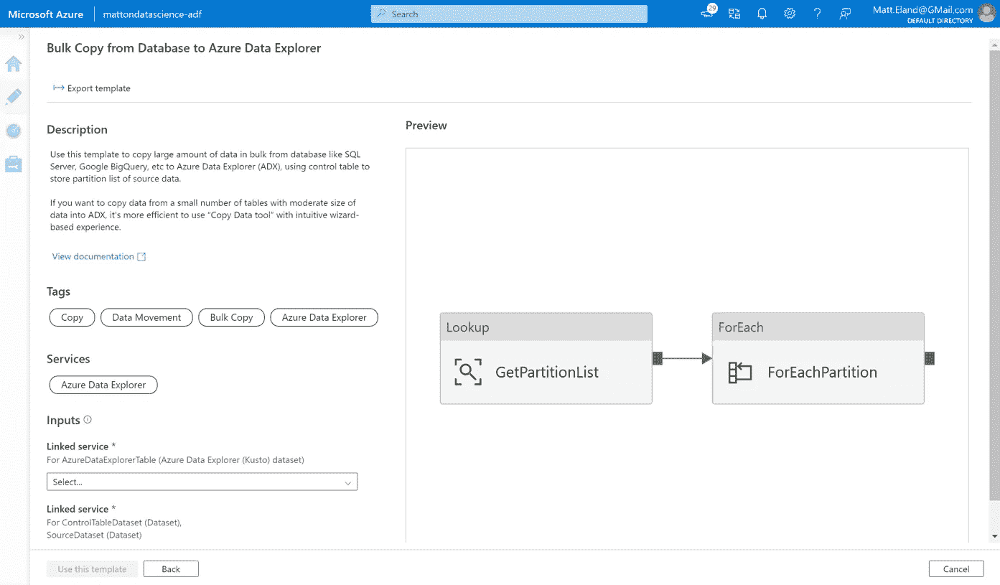

# 什么是 Azure Synapse Analytics？

> 原文：<https://blog.devgenius.io/what-is-azure-synapse-analytics-1fecc80c0e88?source=collection_archive---------10----------------------->

## *Azure 企业级数据工程解决方案的高级概述*

最近，我有机会花一些时间学习 Azure Synapse Analytics，我想分享我所学到的东西的高层次总结，以便您可以确定它是否适合您的数据处理需求。

*该内容在* [*YouTube*](https://www.youtube.com/watch?v=qR38Jkqr7ds) 上也有视频形式

# Synapse Analytics 简介

2019 年，微软将他们现有的 Azure SQL 数据仓库产品更名为 Azure Synapse Analytics，并开始全面检查其功能。第二年，微软发布了他们的“工作区”特性集，其中包括专用的 SQL 池和更多我将在本文中介绍的特性。

在其核心，Synapse Analytics 将 Azure 的许多现有部分包装在一个统一的旗帜下，并以一个强大的可扩展的数据处理引擎为其提供支持。Azure Synapse Analytics 为我们提供了一个统一的产品，可以重复地从数据湖、数据仓库、关系数据库和非关系数据库中获取数据。

作为 Synapse Analytics 生态系统一部分的非详尽服务列表。图片作者。

Synapse Analytics 随后可以使用 Azure Data Factory 的相同核心管道功能和代码来转换和存储这些数据，但它使用 Spark 池和 SQL 池的分布式处理技术来完成。

Synapse Analytics 允许我们通过存储在数据仓库中或通过提供与 Power BI 集成的简单方法来分析和 Azure Machine Learning 来生成机器学习模型，来消费这些数据。

这使得 Azure Synapse Analytics 可以作为大规模数据源的 ETL、ELT 和批处理管道，并支持实时分析需求。Synapse Analytics 以一种易于企业保护和监控的方式完成所有这些工作。

企业级管理和安全性。图片作者。

## Azure 数据工厂呢？

对于你们中的一些人来说，这可能对 Azure Data Factory 有点熟悉，所以让我们简单谈谈两者之间的区别。

Azure Data Factory 允许用户定义他们自己的提取/转换/加载和提取/加载/转换管道，这些管道由各种各样的活动组成。这有效地让团队为云中的数据工程构建定制的解决方案。

从 Azure Data Factory 中的数据库模板批量复制的屏幕截图。作者截图。

然而，现在 Azure Data Factory 确实有一些限制。首先，虽然您可以将许多东西集成到其中，但是这样做的过程并不是非常集中的。此外，组织很难准确了解其服务提供的所有方面，或者以统一的方式保护事物。

这有效地使 Azure Data Factory 变得强大，但在企业应用方面受到限制。

Azure Synapse Analytics 旨在解决这一差距，同时提供额外的特性和功能。

# 摄取数据

在 Synapse Analytics 中，您可以定义任意数量的数据源，以馈入您的 Synapse 工作区。

这些数据源可以是 SQL 数据库，如 Azure SQL 或 Postgres，也可以是 NoSQL 数据库，如 CosmosDB。Synapse Analytics 还支持 blob、文件和表格存储，以及数据湖和基于 Spark 的数据系统。

向 Synapse Analytics 添加新数据源。作者截图。

这里要强调的一点是，数据也可以从 Azure 的外部通过到其他云提供商的连接器或者甚至通过在本地安装集成运行时来获取*，以便在混合云环境中为 Synapse Analytics 提供自托管数据。*

一旦您配置了数据源，它们现在就可以被复制到您的 Azure Synapse Analytics 数据湖中。

# 复制数据工具

复制数据工具。作者截图。

微软给了我们一个非常强大的**复制数据工具**，允许你从你的数据源复制数据到你的数据湖。此拷贝操作可以手动运行，可以有一个宽松的计划，也可以在一个滚动窗口中以每周任务这样的重复间隔运行。

## 映射数据流

Synapse 还允许你定义一个叫做**的映射数据流**，它允许你聚合、过滤、排序和转换你正在加载的数据。您甚至可以通过连接操作将多个数据源合并在一起！

将两个数据源合并在一起的映射数据流。作者截图。

如果你以前在 Azure Data Factory 中遇到过映射数据流，Azure Synapse Analytics 实际上共享许多相同的底层代码，所以你应该熟悉许多功能。

# 管道

先说转换数据。

Azure Synapse 分析管道执行机器学习任务。作者截图。

Synapse 允许您定义能够触发映射数据流和数据复制任务的**管道**。

Pipelines 拥有超过 90 种不同的数据处理和转换活动，包括在 Spark 或 Databricks 笔记本中运行定制代码的能力。

# 可量测性

让我们谈谈 Synapse 的可扩展性因素，因为这是 Synapse Analytics 真正闪光的地方。

Synapse 如此可伸缩的原因之一是因为它依赖于两个独立但相关的池:一个用于查询的 SQL 池和一个用于数据处理的 Spark 池。

Synapse 使用 SQL 池以高度可伸缩的方式查询其数据。

在 SQL 池中，有一个控制节点接收查询并将其分发到各个计算节点。计算节点负责对数据存储执行查询，并将结果返回给控制节点。

有两种不同的 SQL 池模型可用:**专用 SQL 池**和**无服务器 SQL 池**。

## 专用 SQL 池

专用 SQL 池更接近于传统的数据库模式，在这种模式下，您需要根据所需的计算节点数量来购买专用资源。

专用 SQL 池，计算节点控制自己的数据。图片作者。

当有查询进来时，控制节点会计算出哪些计算节点拥有相关数据，并要求它们对自己的数据运行特定的查询。该数据然后被返回到控制节点。

计算节点可以在*循环模式*下运行，在这种模式下，数据均匀分布；在*哈希模式*下，不同的数据值进入不同的计算节点；或者在*复制模式*下，相同的数据存储在每个计算节点上。

每种模式都有不同的可伸缩性和性能特征:

*   **循环调度**是默认设置，具有平均整体性能特征。
*   **散列模式**对于较大的数据存储来说表现良好，但是会导致计算节点之间的负载不平衡。
*   **复制**模式最适合需要极高性能的小型数据存储，代价是在所有节点上复制数据。

## 无服务器 SQL 池

专用 SQL 池非常适合高性能和大容量数据处理，但是对于许多较小的工作流来说，它们可能有点太贵了。

无服务器 SQL 池通过以不同的模式运行来解决这一问题。Azure 没有预先声明你想要的计算节点的数量，而是将你的数据存储在它的计算节点之外。当你需要运行一个查询时，控制节点会分析查询的复杂性，并从 Azure 的可用计算节点中为整个区域发送到适当数量的计算节点。这些计算节点然后访问您存储的数据。

借用计算节点并使用独立存储区域的无服务器 SQL 池。图片作者。

无服务器 SQL 池没有专用池快，但是对于不经常查询数据存储的情况，它们通常更便宜。

## 火花池

如果 SQL 池是我们用来查询数据的，那么 Spark 池就是我们用来处理结果的。

Synapse Spark 是微软在 Apache Spark 上的变体，专为 Synapse Analytics 构建，可以运行专用的笔记本电脑来针对数据湖中的数据运行定制代码。

突触火花池中的层次关系。图片作者。

像 SQL 池一样，Spark 池遵循分布式模型，其中单个驱动程序节点将任务交给执行器，执行器然后在它们可用的各种内核的插槽中运行这些任务。这使得 Spark Pools 可以动态伸缩，以满足您的分析需求——甚至在不使用时完全关闭。

Spark 笔记本可以运行多种语言的代码:

值得注意的是，Spark 笔记本目前不能运行任何 R 代码。

# 通过集成消费数据

一旦数据被加载，它可以被发送到 Synapse Analytics 之外的许多服务。

对我来说最有趣的是，你可以使用 Synapse 来触发 **Azure 机器学习**管道，甚至从现有的数据集在笔记本中生成 Azure 自动化 ML 代码。

在数据分析方面， **Power BI** 可以连接到 Synapse Analytics，提供专用的可视化工具，允许用户报告数据湖中的数据或为关键利益相关者创建仪表板。

**Azure Data Explorer** 是一个有趣的数据探索和可视化服务，目前似乎正在快速增长，并且有早期迹象表明这两种服务之间有望集成。

# Synapse Analytics 是您的企业数据管道

显然，我们可以利用 Synapse Analytics 做很多事情，但它也有一些可靠的企业功能值得一提。

Synapse Analytics 为我们提供了一个专用的中央面板来**监控**和**管理**数据仓库和处理管道的所有方面，包括我们的 SQL 池和 spark 池。

Azure Synapse Analytics 中的管理窗格。作者截图。

此外，Azure 的标准**身份管理**功能可以在这里得到充分应用，包括*管理身份*、*服务原则*、*私有端点*和*防火墙规则*。

最后，Azure 通过*透明数据加密*、*列和行安全*来限制谁可以看到什么数据，以及*数据屏蔽*来为敏感数据提供静态加密，数据安全性依然存在。

# 摘要

Azure Synapse Analytics 希望成为基于云的整个数据基础设施的主干。它提供了满足企业需求所需的可扩展性和管理功能，并具有基于使用的定价模式和无服务器选项，使 Synapse Analytics 对个人和小型企业都可行。

Synapse Analytics 的高级概述。图片作者。

总的来说，Synapse Analytics 是一个非常强大的服务，可以满足您的数据处理需求，并可以很好地集成到其他产品中，包括 Azure 机器学习。

*原载于 2022 年 4 月 11 日*[*https://accessibleai . dev*](https://accessibleai.dev/post/synapseanalytics/)*。*