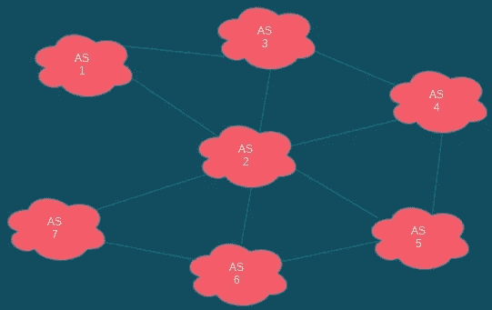

# 什么是 BGP？

> 原文：<https://blog.devgenius.io/what-is-bgp-1cf6bda5fb3c?source=collection_archive---------6----------------------->

BGP(边界网关协议)简介。

莱昂·塞伯特在 [Unsplash](https://unsplash.com?utm_source=medium&utm_medium=referral) 上拍摄的照片

您可能听说过 BGP 这个术语，最近它出现在与脸书及其最近中断相关的新闻中。虽然脸书中断的原因还没有完全确定，但我们现在知道它可能与所谓的 BGP 有关。听到这个消息后，这激起了我的好奇心，所以我决定研究一下 BGP 是什么以及它是如何工作的。

# 那么什么是 BGP 呢？

BGP 代表边界网关协议。这是一种路由协议，或者叫做 [EGP](https://en.m.wikipedia.org/wiki/Exterior_Gateway_Protocol) (外部网关协议)。它用于以最有效的方式将所有互联网流量路由到它需要去的地方。

# BGP 如何工作

要知道 BGP 是如何工作的，我们应该首先了解互联网是由什么组成的。互联网基本上是一个巨大的网络，它连接了全球大量的小型网络。这些更小的网络就是所谓的[即](https://en.wikipedia.org/wiki/Autonomous_system_(Internet)) ( [自治系统](https://en.wikipedia.org/wiki/Autonomous_system_(Internet)))，由一个或几个来源控制的网络集合，如特定组织或 [ISP](https://en.wikipedia.org/wiki/ISP) (互联网服务提供商)。

这些自治系统中的每一个都被分配了一个 ASN(自治系统号)。这允许 BGP 分别识别每个系统。

为了让 BGP 工作，这些网络必须通过所谓的[对等](https://en.wikipedia.org/wiki/Peering)相互建立连接，这是每个系统交互和交换数据的方式。

*下图是自治系统相互交互的简图，显示了 BGP 在高层次上的工作方式。*

BGP 图

你可以把 BGP 想象成互联网的 UPS。它的工作是考虑它必须发送一些数据的所有路由，并尽可能选择最短或最有效的路径。

描述 BGP 的另一种方式是你可以把它想象成谷歌地图。当使用谷歌地图全球定位系统到达你的目的地时，它应该带你沿着最佳路径，避开交通和路障到达你要去的地方，否则，你可能会走进死胡同！

照片由[亨利·佩克斯](https://unsplash.com/@hjkp?utm_source=medium&utm_medium=referral)在 [Unsplash](https://unsplash.com?utm_source=medium&utm_medium=referral) 上拍摄

# 摘要

这是对 BGP 的简要介绍，以及它是如何在高层次上工作的。总之，BGP 是连接互联网的标准路由协议。它根据路由互联网流量的最佳可用路径做出路由决策。

要了解更多关于 BGP 的信息，请查看下面我用来研究这篇文章的一些重要资源！

## 资源

*   [什么是 BGP(边界网关协议)？介绍](http://What is BGP (Border Gateway Protocol)? An Introduction)
*   [BGP:边界网关协议— Computerphile](https://www.youtube.com/watch?v=O6tCoD5c_U0)
*   [什么是 BGP，它在脸书大规模宕机中扮演了什么角色](https://www.theverge.com/2021/10/4/22709260/what-is-bgp-border-gateway-protocol-explainer-internet-facebook-outage)