# 什么是大 O 符号，为什么你应该关心它

> 原文：<https://blog.devgenius.io/what-is-big-o-notation-and-why-you-should-care-about-it-fe09223e6536?source=collection_archive---------6----------------------->


每个对编程有更深兴趣的人都可能遇到过“大 O 符号”的概念**。** Big O 符号与数据结构和算法密切相关，这些数据结构和算法对于**创建高效可靠的软件至关重要**。

# 什么是大 O 记数法？

假设你开发了一个新的算法。你如何衡量它是否熟透了？显然，首先你要检查算法是否达到了预先设定的目标。但是接下来呢？

为了衡量它是否真的好，你应该考虑这两个指标:

*   时间复杂度(执行算法需要多少时间)
*   空间复杂度(你的算法占用了多少空间)

假设我们有一个整数列表，如下所示:

```
nums = [1, 2, 3, 4, 5]
```

我们想在其中找到某个目标整数。

我们将迭代 **nums** 中的每个数字，并检查它是否等于 target。求解时间**取决于输入大小。**按照惯例，输入的大小表示为变量 **n.**

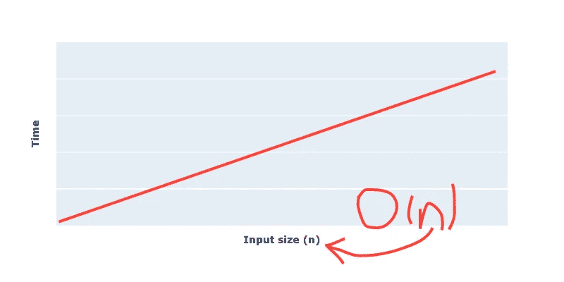

***大 O*** *是衡量***随着* ***输入大小*** *的增长，我们的 agorithm 运行需要多少时间。**

# *不同类型的 O*

## *O(1)*

*O(1)意味着我们的算法在常数时间内运行。这是最好的情况，因为这意味着对于任何给定的输入，算法总是会立即返回输出。换句话说，该算法的时间复杂度不随输入大小而变化。*

*O(1)的例子:*

*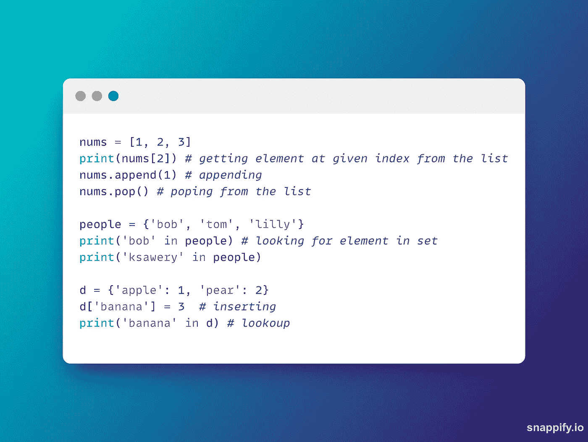*

*O(1)示例*

*O(1)图上的复杂度:*

*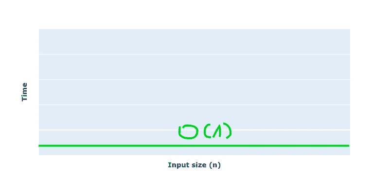*

*(1)在情节上*

## *O(n)*

*O(n)复杂度出现在本文的初始示例中(在列表 num 中查找目标整数)。这种复杂性的特征是执行算法的时间与输入大小成比例增长，如 **n.** 所示*

*有一些 O(n)复杂度的例子:*

*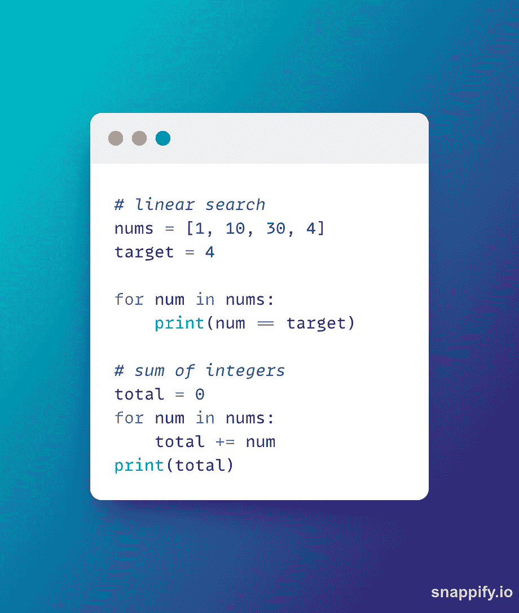*

*python 中的 O(n)示例*

*重要的部分是:O(n) not 总是意味着迭代给定输入中的所有元素。有时，我们甚至可以在第一次迭代中找到解决方案(例如，看看上面的 python 代码，想象一下，不是 target = 4，而是 target = 1)。当我们谈论大 O 符号时，我们总是需要考虑最坏的情况。*

*如果输入大小改变了怎么办？例如，我们的整数列表 nums 有 10 个以上的元素？大 O 等于 O(n + 10)吗？答案是否定的——增加或减去任何常数都不会改变它。还是 O(n)时间复杂度。*

*在图上看起来是这样的:*

*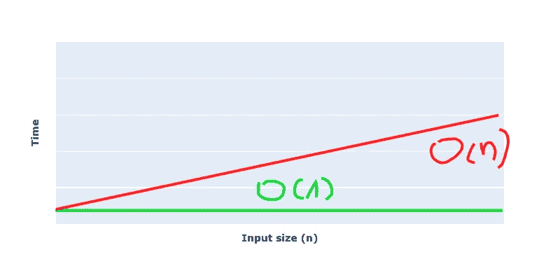*

*在地块上*

## *O(n)*

*这种复杂还不是最糟糕的，但开始变得相当低效。O(n)的意思是对于任何给定的输入，时间复杂度等于输入大小的平方。实际上这意味着通常(但不总是！)在我们的代码**中有**嵌套循环**。***

*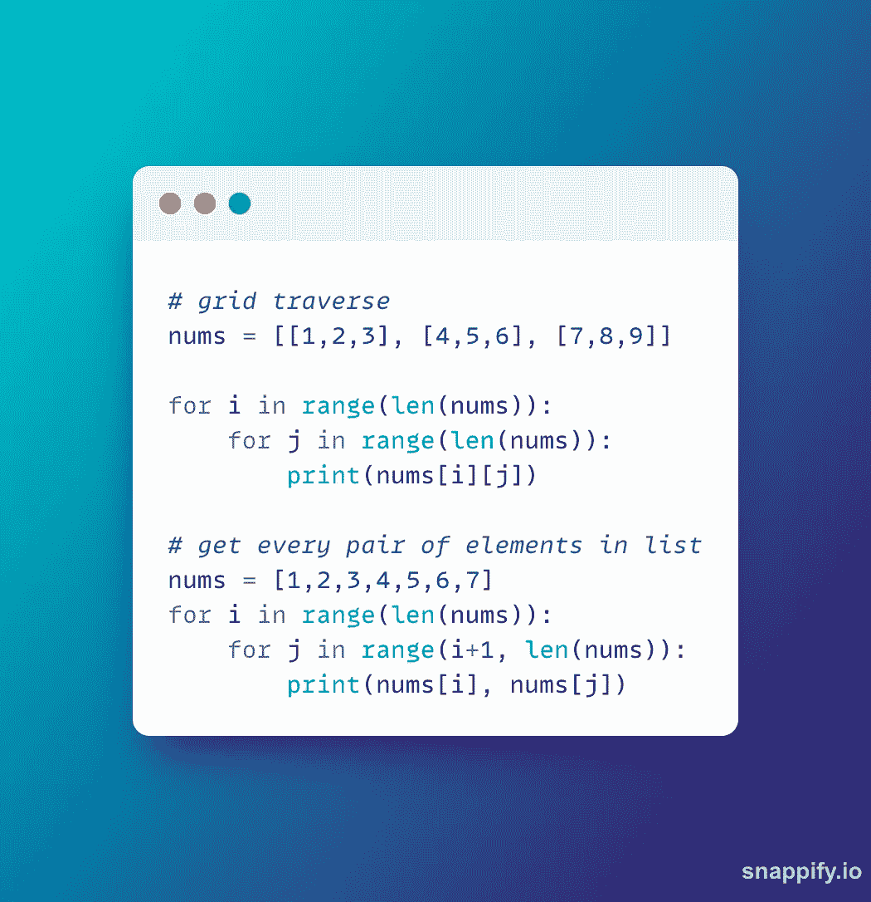*

*python 中的 O(n)示例*

*这是它在图上的样子:*

*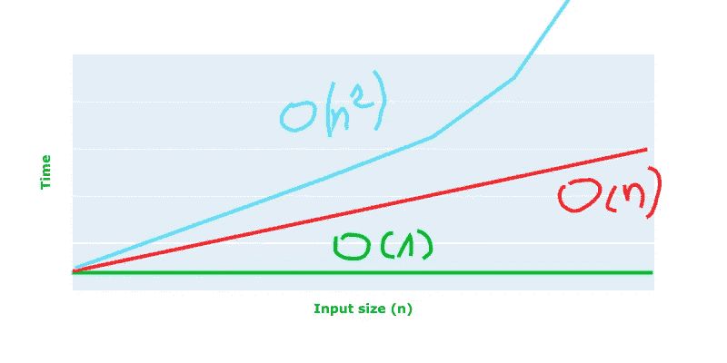*

*图中的 O(n)示例*

## *o(登录)*

*这种复杂度甚至比 O(n)还要好。这种特殊类型最常见的例子是二分搜索法:*

*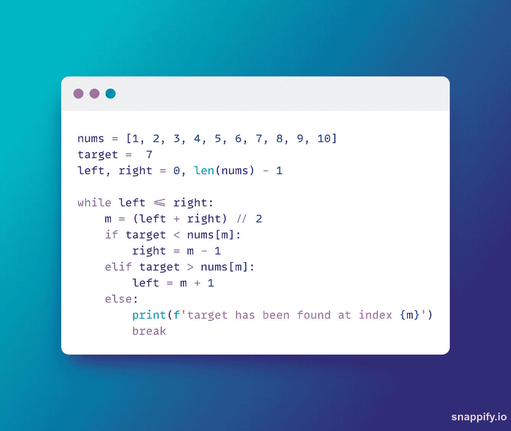*

*python 中的 O(logn)示例*

*二分搜索法以 O(logn)复杂度运行的原因是**在每一次迭代中，一半的可能元素被修剪。***

*这是它在图上的样子:*

*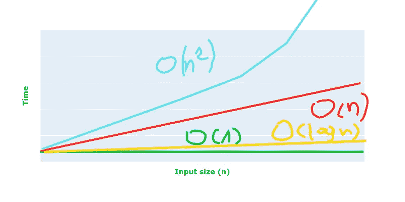*

*图中的 o(登录)*

## *O(nlogn)*

*大多数内置排序函数的复杂度都是 O(nlogn)。例如**。Python 中的 sort()方法或 sorted()函数**。O(nlogn)复杂度比 O(n)差，但比 O(n)好很多。下面是用 python 以优雅的递归方式编码的快速排序:*

*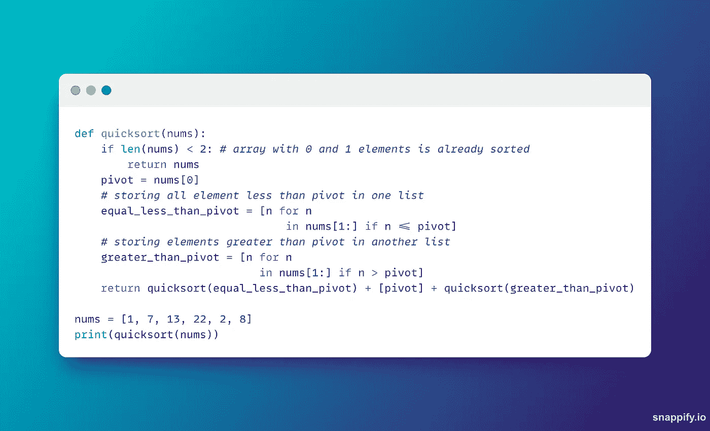*

*python 中的快速排序*

*这是它在图上的样子:*

*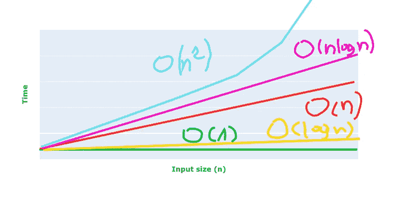*

*图中的 O(nlogn)*

## *O(n！)*

*这是最低效的复杂性类型。*

*n！—阶乘是一个数学等式，n = 5 时看起来是这样的:*

```
*5! = 5 * 4 * 3 * 2 * 1
5! = 120*
```

*但它仍然被用来寻找排列，并在所谓的旅行推销员问题中——我不打算详细解释这个特殊的问题，因为这是另一篇文章的全新主题。如果你感兴趣，最好从这里开始。*

*在图上看起来是这样的:*

*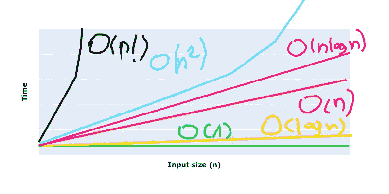*

*O(n！)在剧情上*

# *结论*

*知道什么是大 O，有哪些例子是绝对值得的。这是在现场工作面试中经常出现的问题之一。*

*如果你对变得更好感兴趣，这里有一些我推荐的资源:*

*[Aditya Y Bhargava](https://www.amazon.pl/Grokking-Algorithms-Illustrated-Programmers-Curious/dp/1617292230)的《grokking algorithms——一本适合想要理解数据结构和算法的初学者的优秀书籍(其中还有一章是关于大 O 的)*

*neet code——这是 youtube 频道，对 leetcode 问题进行了精彩的解释*